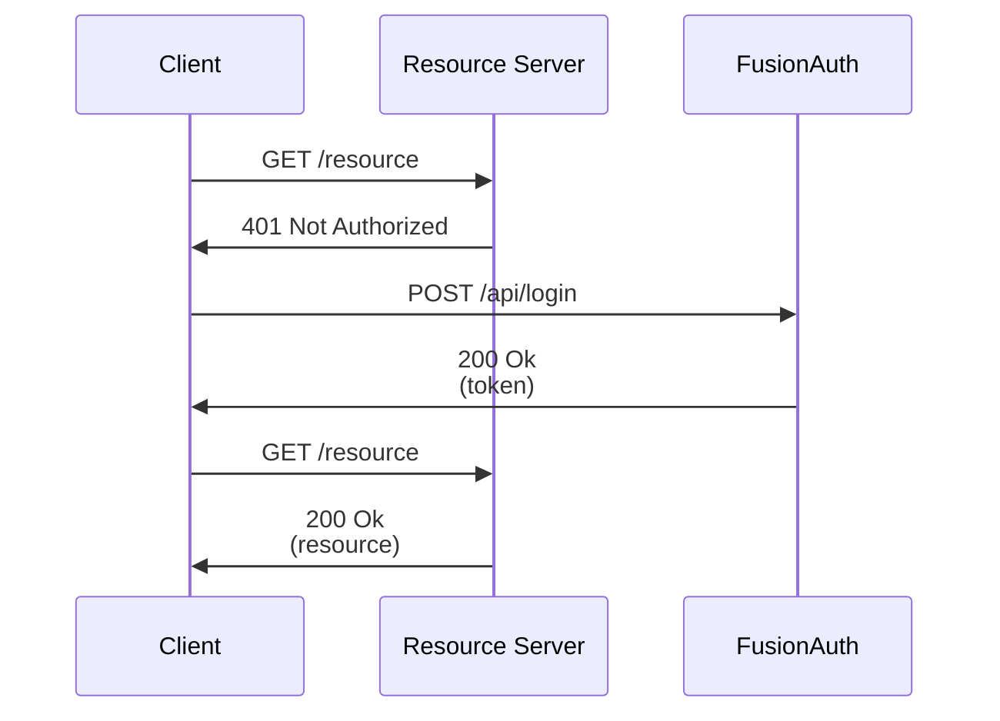

A client wants access to an API resource at `/resource`. However, it is denied this resource until it acquires an access token from FusionAuth.

While the access token is acquired via the Login API above, this is for simplicity of illustration.
The token can be, and typically is, acquired through one of the [OAuth grants](/docs/lifecycle/authenticate-users/oauth/).
