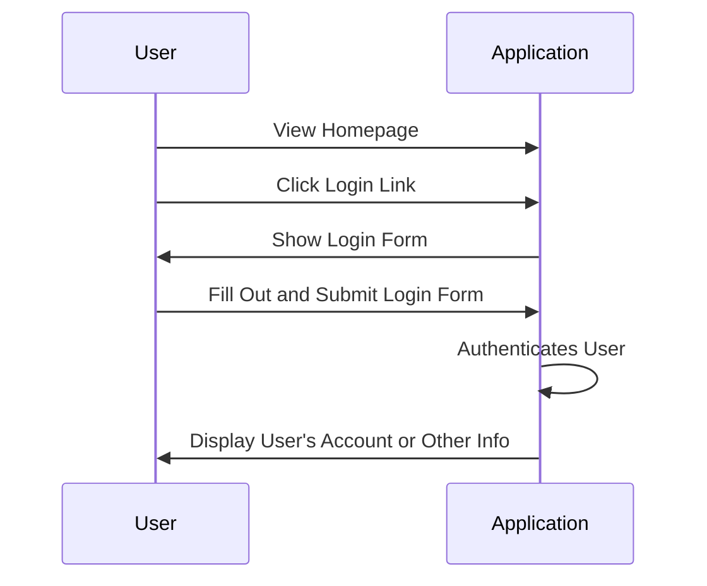
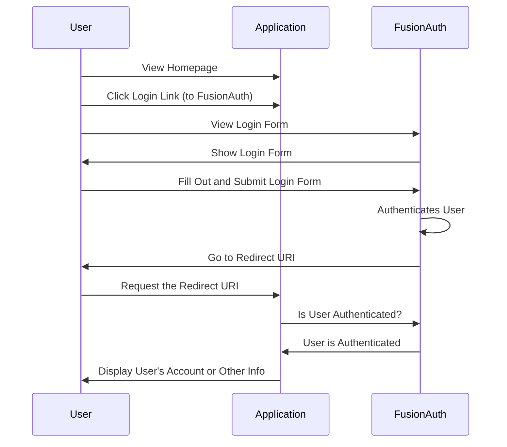

While this sample application doesn't have login functionality without FusionAuth, a more typical integration will replace an existing login system with FusionAuth.
In that case, the system might look like this before FusionAuth is introduced.

And here's the same application login flow after introducing FusionAuth.

In general, you are introducing FusionAuth in order to normalize and consolidate user data. This helps make sure it is consistent and up-to-date as well as offloading your login security and functionality to FusionAuth.
