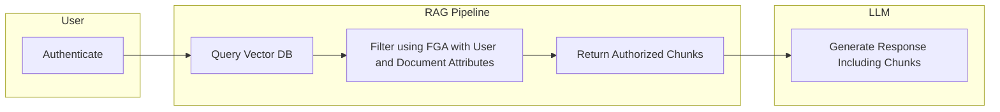
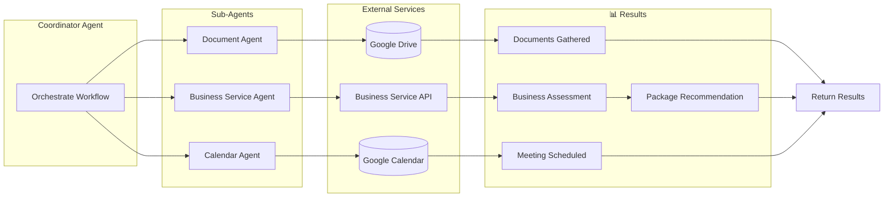

import Aside from 'src/components/Aside.astro';

_Human identity is the source of AI authority._

I know what you're thinking: another article about AI security? Stick with me. This one is different because it's grounded in a simple, almost obvious truth that the industry keeps forgetting in its rush to ship agents: **the same identity and authorization patterns that secured the API boom of the 2010s are exactly what you need to secure AI systems today.**

If you've built OAuth integrations, managed API keys, or set up role-based access control, you already have most of the knowledge you need. AI auth is not a new discipline. It's an extension of existing best practices.

> "Anyone who considers arithmetical methods of producing random digits is, of course, in a state of sin."
> — John von Neumann

> "Anyone who lets AI access resources without deterministic safeguards is, of course, in a state of folly."
> — The Author

The Von Neumann quote is a classic warning about assuming you can take something reliable and get non-deterministic outputs. The inverse principle applies here. AI systems are probabilistic: they reason, hallucinate, and improvise. But the identity layer that governs *who they act for* and *what they're allowed to do* must be deterministic. Identity is not something to "vibe."

This article walks through three AI use cases:

* retrieval-augmented generation (RAG)
* tool use (MCP and APIs)
* agentic systems

And examines them through the lens of authentication, authorization, and identity management. It uses FusionAuth examples, but also notes where there are standards-based solutions.

We'll use a single running example throughout: you are an engineering manager at a bank, looking to improve support desk operations for both employees and customers, with AI.

## A Quick Overview of the Use Cases

Before we dive in, let's define what we're working with.

Retrieval-augmented generation (RAG) augments the data available to an AI model by feeding it documents at query time. Your bank employees or customers ask a question, and the RAG system retrieves relevant internal documents and then provides it to an LLM to ground the LLM's answer. The key auth concern: not every user should see every document. A customer is going to see different documents from a teller, who will see different ones from a VP.

Tool use (MCP and APIs) allows AI systems to take actions like reading from a database, updating a customer record, or calling an external service. The Model Context Protocol (MCP) is an emerging standard for connecting AI tools to services, but plain APIs with rich documentation work too. The key auth concern: controlling what each tool can do, and on whose behalf.

Agentic systems are semi-autonomous, task-oriented workflows that can read data, take action across multiple systems, and ask for human input when needed. They are non-deterministic software components that chain together reasoning steps. The key auth concern: maintaining a chain of identity from the human who authorized the workflow all the way through to every action taken, as well as limiting agents' access.

Here's how these map to what an identity provider can help with:

| Scenario   | Authorization | Authentication           | Identity Management           |
|------------|---------------|--------------------------|-------------------------------|
| RAG        | Yes           | Yes (framework-specific) | Yes (framework-specific)      |
| Tool Use   | Yes           | Yes                      | Yes                           |
| AI Agents  | Yes           | Yes                      | Yes                           |

<Aside type="tip">
Learn from Kelsey Hightower about agentic authorization, deterministic vs non-deterministic systems, and how to implement fine-grained access control in agentic enviroinments. Watch our webinar [Beyond the Hype: Practical and Responsible Use Cases for Agentic AI](/webinar/beyond-the-hype-practical-and-responsible-use-cases-for-agentic-ai) for expert guidance and answers to questions from engineers.
</Aside>

Now let's dig into each of these use cases.

## RAG: Making Sure the Model Never Sees What It Shouldn't

Here's the scenario.

You have bank documents related to customer support tasks, such as loan agreements, customer agreements, compliance policies, wealth management playbooks, and fraud investigation procedures. You want to make them available for customers and employees to query through an AI interface. But not all documents should be available to every user. Customer support, fraud and security, disputes and chargebacks, and loan servicing teams each need access to different document sets. And don't forget customers themselves.

Companies like [LinkedIn](https://arxiv.org/pdf/2404.17723), [DoorDash](https://careersatdoordash.com/blog/large-language-modules-based-dasher-support-automation/), and [Vimeo](https://medium.com/vimeo-engineering-blog/unlocking-knowledge-sharing-for-videos-with-rag-810ab496ae59) already use RAG in production. The pattern is well-established.

### Why Identity Matters for RAG

When answering a query, the LLM should never even see documents the user shouldn't have access to. You don't have to craft some clever prompt. You're not relying on the model to keep secrets. With the right authorization framework, you're filtering documents before they reach the model.

This is primarily an authorization problem. You authenticate the user (prove they are who they claim to be), process their query, pull documents from the vector datastore, then filter the documents based on which documents the user is allowed to query. 

The model only receives documents that pass the authorization check.

### Implementation

The implementation follows a straightforward pipeline:

1. Chunk your documents into segments suitable for vector search.
2. Build an authorization schema that maps users and roles to document access.
3. Store metadata alongside your document chunks in the vector database, including which roles, departments, or users can access each chunk.
4. On retrieval, authenticate the user and get their identity claims.
5. Filter by user and document attributes that you stored in step 3 before passing results to the LLM.

For authentication, some frameworks use JWTs for authentication; others use API keys. The filtering mechanism depends on your RAG framework as well. For example, LangChain allows you to build a retriever wrapper which calls out to an authorization service before returning results. 

For the authorization checks, use a fine-grained authorization (FGA) system. [FusionAuth FGA by Permify](/docs/extend/fine-grained-authorization) is one option. It provides deterministic authorization that can be deployed on-site for data safety and scales with your needs. 

Your authorization logic should be centralized and a single source of truth, regardless of which RAG framework you're using. You want a filter to leverage this and be deterministic, not probabilistic.

Here's a simplified diagram of the request flow, when the proper metadata has been stored on the documents during the loading.




But what about capturing that metadata? Documents don't always cleanly map to a given access level, and some documents may have different access for different chunks. Chunking may lose metadata. 

For instance, a compliance PDF might contain sections accessible to all employees alongside sections restricted to the legal team. Make sure your chunking pipeline can handle this.

So, plan to capture the user and access metadata as part of your RAG process. If you want the LLM to never see documents the user shouldn't access, you have to make sure the user and access data is available. 

## Tool Use: MCP and APIs

Suppose you want to allow customer service team members to use AI tools to update bank customer information — contact details, account preferences, service requests. But different tools are available to different roles, and even with the same tools, different users have different limits. A tier-one support agent might be able to update a phone number but not adjust a credit limit.

### Two Paths: MCP and APIs

The Model Context Protocol (MCP) is an emerging standard that makes any API or service accessible to AI tooling in a structured way. Companies like Block, Bloomberg, and Amazon are already using MCP internally. But MCP isn't the only option — plain APIs work well too. AI models are capable of figuring out API semantics from good docs.

The most recent version of MCP at the time of publishing uses OAuth 2.1 and the authorization code grant for authentication of an AI system or tool. There are also extensions under development for use of the client credentials grant.

APIs re-use traditional authentication methods: API keys or access tokens. 

The same gateway patterns you've been using since the REST API era can help rate-limit or monitor access for either MCP or API servers.

### MCP Implementation

Here's how to set up MCP with identity:

Build an MCP server on top of your existing APIs and services. Configure your MCP server to point to an identity provider which supports OAuth 2.1. MCP clients should be either preregistered or created dynamically.

When an MCP client tries to access an MCP server, the MCP server should redirect to the configured identity provider, which will authenticate the user driving the MCP client and then issue a token. The token is then presented to the MCP server.

[Learn more about MCP and implementation](/articles/ai/mcp-connecting-software-ai).

You may need to add fine-grained authorization to the services the MCP server is accessing if you need granular control beyond what OAuth scopes provide.

### API Implementation

For API access, the pattern is even simpler:

1. Use your existing APIs and services; no MCP server required.
2. Authenticate users with your identity provider.
3. Get an access token.
4. If the AI has a web tool, it can access the API using REST calls, passing the token. 

Consider making an SDK using your API available as well. Again, you may need to add fine-grained authorization to your APIs and services if you need granular control beyond what OAuth scopes provide.

You probably have some infrastructure around authentication and your APIs that you might be able to re-use. For example, [multiple API gateways](/docs/extend/examples/api-gateways/) work with FusionAuth.

## Agentic Systems: Go Forth And Do Work

This is where things get interesting and where new thinking in AI auth needs to happen.

Agents are non-deterministic software components that can be prompted to complete a task with varying levels of autonomy. They scale to tens or hundreds of instances, interact with humans, APIs, and MCP tools, and chain together reasoning steps.

### The Scenario

Your bank wants to automate new business account setup. A new business needs checking accounts, savings accounts, merchant services, and payroll setup. An agent needs to:

- Assess the business type and recommend a package
- Gather business documents (EIN, articles of incorporation) from a document store
- Check creditworthiness via an API
- Schedule an onboarding session with a relationship manager via a calendar service

This is a multi-step, workflow dealing with messy data and external services. This is exactly what agents are good for. But it also means they will be reading sensitive documents, calling external APIs, and scheduling meetings on behalf of a human. The stakes are high.

### Chain of Identity

Here's the foundational concept for securing agents: you need to know who authorized what, when.

When a human kicks off an agent workflow, that human's identity needs to travel with the agent through every step. If the agent reads a file, you need to know which human authorized that read. If the agent schedules a meeting, you need to know on whose behalf. If something goes wrong, you need an audit trail back to the originator.

This audit trail is the chain of identity.

How deeply to carry the human identity depends on your needs. If you're doing authorization checks at each step, the identities needed depend on the rules. If you're primarily logging and debugging, you may only need the human identity and the current agent identity. For schedule-triggered agent workflows, the chain might start with a service account or the author of the cron job.

You implement this using signed JWTs, which ensure that the chain of identity is preserved through your system.

FusionAuth doesn't currently support OAuth Token Exchange (RFC 8693), but the Vend JWT API achieves the same chain of identity semantics. If your identity provider supports token exchange natively, that's a standards-based alternative. 

The FusionAuth Vend JWT API lets you create tokens that embed the originating user and propagate that identity as agents hand off work. The Vend JWT API can create an `act` claim, representing the actor in a delegation chain:

```javascript
import { FusionAuthClient } from '@fusionauth/typescript-client';

const client = new FusionAuthClient(
  'YOUR_API_KEY',
  'https://your-fusionauth-instance.com'
);

// Vend a JWT with chain of identity for an agent.
// The `act` claim follows the OAuth Token Exchange spec (RFC 8693)
// to represent the human who authorized this agent workflow.
const response = await client.vendJWT({
  keyId: 'your-signing-key-id',
  timeToLiveInSeconds: 300,
  claims: {
    sub: 'coordinator-agent-entity-id',
    act: {
      sub: 'original-human-user-id'
    },
    permissions: ['read:documents', 'check:credit', 'schedule:meetings']
  }
});

// response.response.token contains the signed JWT
const agentToken = response.response.token;

// This token is passed to sub-agents, preserving the chain of identity
```

### The Agent Architecture

A well-designed agent system splits work across sub-agents, each with limited scope. For our business banking account setup, we might have four agents:



Splitting agents this way has several benefits:

- Security blast radius reduction: if the Calendar Agent is compromised, it can't access documents or credit data.
- Context window management: each agent only needs context relevant to its task.
- Explicit trust boundaries: instead of one agent with access to everything, trust is granted at the boundaries between agents.
- Prevents cross-contamination: data from one service doesn't leak into another agent's context.

### Modeling Agents with Entities

Each agent needs an identity. In FusionAuth, you model agents as Entities, but in another system you might use service accounts or short lived OAuth clients. Entities are the same FusionAuth concept used for IoT devices, APIs, and machine-to-machine communication.

Entities can have types, permissions, and grants, making them perfect for representing agent identities. With this agentic system, you want to ensure that:

- Only the coordinator agent can invoke sub-agents
- Only authorized humans can kick off the coordinator
- Permissions are explicit and auditable

Here's how you'd set up the document and coordinator agent entities for the business banking workflow; the calendar and business service API agents are omitted for brevity but are configured in the same way:

```javascript
import { FusionAuthClient } from '@fusionauth/typescript-client';

const client = new FusionAuthClient(
  'YOUR_API_KEY',
  'https://your-fusionauth-instance.com'
);

// First, create an Entity Type for agents
// (done once during setup)
const entityTypeResponse = await client.createEntityType(null, {
  entityType: {
    name: 'BankingAgent',
    data: { description: 'AI agents for banking workflows' }
  }
});
const entityTypeId = entityTypeResponse.response.entityType.id;

// Create permissions on the entity type
await client.createEntityTypePermission(entityTypeId, null, {
  permission: {
    name: 'invoke',
    description: 'Permission to invoke this agent'
  }
});

await client.createEntityTypePermission(entityTypeId, null, {
  permission: {
    name: 'read_results',
    description: 'Permission to read agent results'
  }
});

// Create entities for each agent
const coordinatorResponse = await client.createEntity(null, {
  entity: {
    name: 'Coordinator Agent',
    type: { id: entityTypeId },
    data: {
      role: 'coordinator',
      workflow: 'business-account-setup'
    }
  }
});
const coordinatorId = coordinatorResponse.response.entity.id;

const documentAgentResponse = await client.createEntity(null, {
  entity: {
    name: 'Document Agent',
    type: { id: entityTypeId },
    data: { role: 'document-retrieval' }
  }
});
const documentAgentId = documentAgentResponse.response.entity.id;

// Grant the coordinator permission to invoke the document agent
await client.upsertEntityGrant(documentAgentId, {
  grant: {
    permissions: ['invoke'],
    recipientEntityId: coordinatorId
  }
});

// Grant the human user permission to invoke the coordinator
await client.upsertEntityGrant(coordinatorId, {
  grant: {
    permissions: ['invoke', 'read_results'],
    userId: 'human-user-id'
  }
});
```

After this configuration, requests use the client credentials grant to ensure the calling agent has permission to call the recipient agent. Then the JWT vend API mentioned above is used to preserve the chain of identity, using audit logs.

The audit logging captures the action in both the `reason` and `data` fields because `reason` is searchable, but `data` stores proper JSON. The actual shape of the stored data is application specific.

The agents should log key points in their workflow, as shown below:

```javascript
import { FusionAuthClient } from '@fusionauth/typescript-client';

// Use a write-only API key scoped to audit log creation
const documentAgentClient = new FusionAuthClient(
  'DOCUMENT_AGENT_WRITE_ONLY_API_KEY',
  'https://your-fusionauth-instance.com'
);

// Log when the document agent begins its work
await documentAgentClient.createAuditLog({
  auditLog: {
    insertUser: 'DocumentAgent (328ae70f-20cf-4f28-8e18-d1d43bdfa919)',
    message: 'Gathered 4 documents from folder',
    reason: "{\"agentType\":\"DocumentAgent\",\"action\":\"document.gather.completed\",\"actor\":\"328ae70f-20cf-4f28-8e18-d1d43bdfa919\",\"delegatedBy\":\"35d45ce6-1088-4f71-8523-f4245ecc72dc\",\"actingOnBehalfOf\":\"d384a5cb-2dfd-40dd-871e-8ae48d343250\",\"roles\":[\"business_owner\"],\"scope\":\"document:read\"}",
    data: {
      agentType: "DocumentAgent",
      action: "document.gather.completed",
      actor: "328ae70f-20cf-4f28-8e18-d1d43bdfa919",
      delegatedBy: "35d45ce6-1088-4f71-8523-f4245ecc72dc",
      actingOnBehalfOf: "d384a5cb-2dfd-40dd-871e-8ae48d343250",
      roles: ["business_owner"],
      scope: "document:read"
    } 
  }
});
```

Clean up agent entities when the workflow completes successfully.

For error states, implement a reaper process for orphaned entities from failed workflows. Doing this work ensures the agents' credentials are no longer usable.

## What We Believe

Let's return to where we started. We believe these things to be true:

* Human identity is the source of AI authority. Someone wrote that job. Someone authorized that agent. This should always be tracked.
* AI auth is best done as an extension of existing best practices. OAuth, tokens, gateways: the technologies that secured the API era work for the AI era. Don't reinvent what already works.
* Identity enforcement needs to be deterministic. AI systems are probabilistic. The identity layer that governs them must not be. When you check whether an agent has permission to read a document or schedule a meeting, the answer must be yes or no, not "yes" one time and "no" the next.

## What's Next

The landscape is evolving fast. MCP is maturing. Agent frameworks like Agentcore and Mastra are gaining traction. The concepts of AI data provenance and the chain of identity, which allow you to know which agent did what to what data, are coming into definition.

But the fundamentals won't change. Human identity at the root. Deterministic enforcement. Defense in depth. If you build on these principles, your AI systems have a secure foundation.

<Aside type="tip">
Learn from Kelsey Hightower about agentic authorization, deterministic vs non-deterministic systems, and how to implement fine-grained access control in agentic enviroinments. Watch our webinar [Beyond the Hype: Practical and Responsible Use Cases for Agentic AI](/webinar/beyond-the-hype-practical-and-responsible-use-cases-for-agentic-ai) for expert guidance and answers to questions from engineers.
</Aside>
