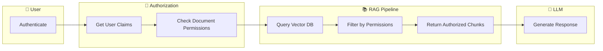
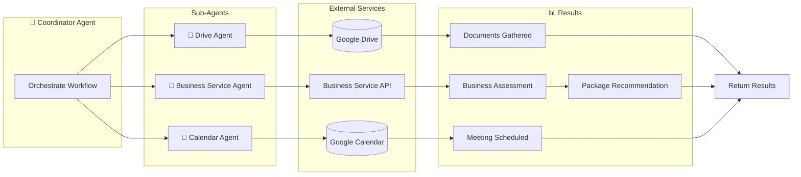
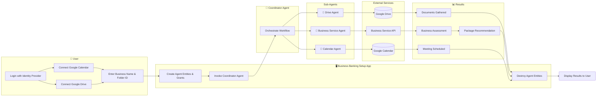

_Human identity is the source of AI authority._

I know what you're thinking: another article about AI security? Stick with me. This one is different because it's grounded in a simple, almost obvious truth that the industry keeps forgetting in its rush to ship agents: **the same identity and authorization patterns that secured the API boom of the 2010s are exactly what you need to secure AI systems today.**

If you've built OAuth integrations, managed API keys, or set up role-based access control, you already have most of the knowledge you need. AI auth is not a new discipline. It's an extension of existing best practices.

> "Any one who considers arithmetical methods of producing random digits is, of course, in a state of sin."
> — John von Neumann

> "Any one who lets AI access resources without deterministic safeguards is, of course, in a state of folly."
> — Dan Moore

The Von Neumann quote is a classic warning about assuming you can take something reliable and get non-deterministic outputs. The inverse principle applies here. AI systems are probabilistic: they reason, hallucinate, and improvise. But the identity layer that governs *who they act for* and *what they're allowed to do* must be deterministic. Identity is not something to "vibe."

This article walks through three AI use cases:

* retrieval-augmented generation (RAG)
* tool use (MCP and APIs)
* agentic systems

And examines them through the lens of authentication, authorization, and identity management. 

We'll use a single running example throughout: you are an engineering manager at a bank, looking to improve support desk operations for both employees and customers, with AI.

## A Quick Overview of the Use Cases

Before we dive in, let's define what we're working with.

**Retrieval-Augmented Generation (RAG)** augments the knowledge available to an AI model by feeding it documents at query time. Your bank employees ask a question, and the RAG system retrieves relevant internal documents and then provides it to an LLM to ground the LLM's answer. The key auth concern: not every user should see every document. A customer is going to see different documents from a teller, who will see different ones from a VP.

**Tool Use (MCP and APIs)** allows AI systems to take actions like reading from a database, updating a customer record, or calling an external service. The Model Context Protocol (MCP) is an emerging standard for connecting AI tools to services, but plain APIs with rich documentation work just as well. The key auth concern: controlling what each tool can do, and on whose behalf.

**Agentic Systems** are semi-autonomous, task-oriented workflows that can read data, take action across multiple systems, and ask for human input when needed. They are non-deterministic software components that chain together reasoning steps. The key auth concern: maintaining a chain of identity from the human who authorized the workflow all the way through to every action taken.

Here's how these map to what an identity provider can help with:

| Scenario   | Authorization | Authentication         | Identity Management         |
|------------|---------------|------------------------|-----------------------------|
| RAG        | ✅            | ✅ (framework-specific) | ✅ (framework-specific)      |
| Tool Use   | ✅            | ✅                      | ✅                           |
| AI Agents  | ✅            | ✅                      | ✅                           |

Now let's dig into each one.

## RAG: Making Sure the Model Never Sees What It Shouldn't

### The Scenario

You have bank documents related to customer support tasks — loan agreements, compliance policies, wealth management playbooks, fraud investigation procedures — and you want to make them available for employees to query through an AI interface. But not all documents should be available to every user. Customer support, fraud and security, disputes and chargebacks, and loan servicing teams each need access to different document sets.

Companies like LinkedIn, DoorDash, and Vimeo already use RAG in production. The pattern is well-established.

### Why Identity Matters for RAG

The critical insight with RAG is this: **the LLM should never even see documents the user shouldn't have access to.** You're not relying on the model to keep secrets — you're filtering documents *before* they reach the model.

This is primarily an authorization problem. You authenticate the user (prove they are who they claim to be), then authorize the retrieval (determine which documents they're allowed to query). The model only receives documents that pass the authorization check.

RAG documents contain two kinds of attributes:

- **Diffuse attributes**: broad, contextual information like contract text, policy language, and agreement terms. These are what RAG is designed for.
- **Acute attributes**: narrow, specific data points like phone numbers, account balances, or SSNs. These are better served by direct tool/API calls (which we'll cover next).

Focus your RAG pipeline on diffuse attributes. Pull acute attributes through MCP or API calls where you have fine-grained control.

### Implementation

The implementation follows a straightforward pipeline:

1. **Chunk your documents** into segments suitable for vector search.
2. **Build an authorization schema** that maps users and roles to document access.
3. **Store metadata** alongside your document chunks in the vector database — including which roles, departments, or users can access each chunk.
4. **On retrieval**, authenticate the user and get their identity claims.
5. **Filter** by user and document attributes before passing results to the LLM.

The actual filtering mechanism depends on your RAG framework. For example, LangChain allows you to build a custom Retriever that can call out to an authorization service before returning results. Some frameworks use JWTs for authentication; others use API keys.

For authorization, you'll want a fine-grained authorization (FGA) system. FusionAuth FGA by Permify (TODO: add link to docs) is one example — it provides deterministic authorization that can be deployed on-site for data safety and scales with your needs. The key point is that your authorization logic should be a single source of truth, regardless of which RAG framework you're using.

Here's a simplified diagram of the flow:



The result: the LLM never sees documents the user shouldn't access. The filter is deterministic, not probabilistic.

## Tool Use: MCP and APIs

### The Scenario

You want to allow customer service team members to use AI tools to update bank customer information — contact details, account preferences, service requests. But different tools are available to different roles, and even with the same tools, different users have different limits. A tier-one support agent might be able to update a phone number but not adjust a credit limit.

### Two Paths: MCP and Plain APIs

The Model Context Protocol (MCP) is an emerging standard that makes any API or service accessible to AI tooling in a structured way. Companies like Block, Bloomberg, and Amazon are already using MCP internally. But MCP isn't the only option — plain APIs with rich documentation work well too. AI models are capable of figuring out API semantics from good docs.

Both paths re-use traditional authentication methods: API keys, access tokens, and the same gateway patterns you've been using since the REST API era.

### MCP Implementation

Here's how to set up MCP with identity:

1. **Build an MCP server** on top of your existing APIs and services.
2. **Authenticate users** with your identity provider.
3. **Obtain an access token** via OAuth.
4. **Configure MCP clients** (like Cursor, Claude Desktop, or custom tooling) with the token.
5. **Add fine-grained authorization** if you need more granular control beyond what OAuth scopes provide.

MCP supports pre-registered clients as one of its client registration methods. If you need dynamic client registration, you can work around this by using the FusionAuth Application API to register clients programmatically:

```javascript
import { FusionAuthClient } from '@fusionauth/typescript-client';

const client = new FusionAuthClient(
  'YOUR_API_KEY',
  'https://your-fusionauth-instance.com'
);

// Register an MCP client as a FusionAuth application
const response = await client.createApplication(null, {
  application: {
    name: 'MCP Customer Service Tool',
    oauthConfiguration: {
      authorizedRedirectURLs: ['http://localhost:3000/callback'],
      clientSecret: 'generated-secret',
      enabledGrants: ['authorization_code'],
      requireClientAuthentication: true
    }
  }
});

const applicationId = response.response.application.id;
console.log(`Registered MCP client: ${applicationId}`);
```

### API Implementation

For plain API access, the pattern is even simpler:

1. **Use your existing APIs and services** — no MCP server required.
2. **Authenticate users** with your identity provider.
3. **Get an access token.**
4. **Direct AI access** to the API using SDKs or REST calls, passing the token.
5. **Add fine-grained authorization** at the API layer if needed.

FusionAuth works with multiple API gateways (TODO: add link to https://fusionauth.io/docs/extend/examples/api-gateways/), so you can enforce authorization at the gateway level before requests even reach your services.

### The Key Principle

Whether you use MCP or plain APIs, the principle is the same: **the AI tool acts with the authority of the authenticated user, constrained by the user's permissions.** The tool doesn't have its own identity — it inherits the human's.

## Agentic Systems: Where Identity Gets Serious

This is where things get interesting and where most of the new thinking in AI auth needs to happen. Agents are non-deterministic software components that can be prompted to complete a task with varying levels of autonomy. They scale to tens or hundreds of instances, interact with humans, APIs, and MCP tools, and chain together reasoning steps.

### The Scenario

Your bank wants to automate new business account setup. A new business needs checking accounts, savings accounts, merchant services, and payroll setup. An agent needs to:

- Assess the business type and recommend a package
- Gather business documents (EIN, articles of incorporation) from a document store
- Check creditworthiness via an API
- Schedule an onboarding session with a relationship manager via a calendar service

This is a multi-step, ill-defined workflow — exactly what agents are designed for. But it also means the agent will be reading sensitive documents, calling external APIs, and scheduling meetings on behalf of a human. The identity stakes are high.

### Chain of Identity

Here's the foundational concept for securing agents: **you need to know who authorized what, when.**

When a human kicks off an agent workflow, that human's identity needs to travel with the agent through every step. If the agent reads a file, you need to know which human authorized that read. If the agent schedules a meeting, you need to know on whose behalf. If something goes wrong, you need an audit trail back to the originator.

This is called the **chain of identity**, and it's the most important concept in AI agent security.

How deeply to carry the human identity depends on your needs. If you're doing authorization checks at each step, the full human identity needs to be present. If you're primarily logging, you may only need the identity at key decision points. For cron-triggered agent workflows, the chain might start with a service account or the author of the cron job, depending on your requirements.

You implement this using signed JWTs. FusionAuth's Vend JWT API lets you create tokens that embed the originating user and propagate that identity as agents hand off work. This is compatible with the OAuth token exchange `act` claim, which represents the actor in a delegation chain:

```javascript
// Using the FusionAuth Vend JWT API to create a token
// with chain-of-identity for an agent

const vendResponse = await fetch(
  'https://your-fusionauth-instance.com/api/jwt/vend',
  {
    method: 'POST',
    headers: {
      'Authorization': 'YOUR_API_KEY',
      'Content-Type': 'application/json'
    },
    body: JSON.stringify({
      timeToLiveInSeconds: 300,
      claims: {
        iss: 'your-bank.com',
        sub: 'coordinator-agent-entity-id',
        act: {
          sub: 'original-human-user-id'
        },
        permissions: ['read:documents', 'check:credit', 'schedule:meetings']
      }
    })
  }
);

const { token } = await vendResponse.json();
// This token is passed to sub-agents, preserving the chain of identity
```

### The Agent Architecture

A well-designed agent system splits work across sub-agents, each with limited scope. Think microservices versus monolith. For our business banking setup, we might have four agents:



Splitting agents this way has several benefits:

- **Security / blast radius reduction**: if the Calendar Agent is compromised, it can't access documents or credit data.
- **Context window management**: each agent only needs context relevant to its task.
- **Explicit trust boundaries**: instead of one agent with access to everything, trust is granted at the boundaries between agents.
- **Prevents cross-contamination**: data from one service doesn't leak into another agent's context.

### Modeling Agents with Entities

Each agent needs an identity. In FusionAuth, you model agents as **Entities** — the same primitive used for IoT devices, APIs, and machine-to-machine communication. Entities can have types, permissions, and grants, making them perfect for representing agent identities.

Here's how you'd set up the agent entities for the business banking workflow:

```javascript
import { FusionAuthClient } from '@fusionauth/typescript-client';

const client = new FusionAuthClient(
  'YOUR_API_KEY',
  'https://your-fusionauth-instance.com'
);

// First, create an Entity Type for agents
// (done once during setup)
const entityTypeResponse = await client.createEntityType(null, {
  entityType: {
    name: 'BankingAgent',
    data: { description: 'AI agents for banking workflows' }
  }
});
const entityTypeId = entityTypeResponse.response.entityType.id;

// Create permissions on the entity type
await client.createEntityTypePermission(entityTypeId, null, {
  permission: {
    name: 'invoke',
    description: 'Permission to invoke this agent'
  }
});

await client.createEntityTypePermission(entityTypeId, null, {
  permission: {
    name: 'read_results',
    description: 'Permission to read agent results'
  }
});

// Create entities for each agent
const coordinatorResponse = await client.createEntity(null, {
  entity: {
    name: 'Coordinator Agent',
    type: { id: entityTypeId },
    data: {
      role: 'coordinator',
      workflow: 'business-account-setup'
    }
  }
});
const coordinatorId = coordinatorResponse.response.entity.id;

const driveAgentResponse = await client.createEntity(null, {
  entity: {
    name: 'Drive Agent',
    type: { id: entityTypeId },
    data: { role: 'document-retrieval' }
  }
});
const driveAgentId = driveAgentResponse.response.entity.id;

// Grant the coordinator permission to invoke the drive agent
await client.upsertEntityGrant(driveAgentId, {
  grant: {
    permissions: ['invoke'],
    recipientEntityId: coordinatorId
  }
});

// Grant the human user permission to invoke the coordinator
await client.upsertEntityGrant(coordinatorId, {
  grant: {
    permissions: ['invoke', 'read_results'],
    userId: 'human-user-id'
  }
});
```

This ensures that:

- Only the coordinator agent can invoke sub-agents
- Only authorized humans can kick off the coordinator
- Permissions are explicit and auditable

When the workflow completes, clean up agent entities if they're ephemeral:

```javascript
// After workflow completes, remove ephemeral agent entities
await client.deleteEntity(driveAgentId);
await client.deleteEntity(coordinatorId);
```

### Securing Agents: A Defense-in-Depth Strategy

Agent security isn't one thing — it's a layered defense. At the foundation is **secure human identity**. Without verified identity, you can't confirm an agent is authorized to act for the person it claims to represent. Agents carry OAuth tokens and API keys tied to human identities; a compromised identity means stolen access across every integrated system.

Here's the full security stack, from foundational to application-level:

**Secure Human Identities** — The bedrock. Every agent action chain starts with a verified human identity. This is what your identity provider handles.

**Craft the Right Prompt** — Instruct agents to behave like responsible employees. Prompt engineering is a security control, not just a UX concern.

**Sub-agents** — As discussed above, split agents to reduce blast radius and make trust boundaries explicit.

**Third-Party Service Access** — When agents need to access services like Google Calendar, Office 365, or Salesforce, the user authenticates against the third-party service, and your identity provider securely stores the refresh tokens. When needed, an access token can be minted and injected into the agent's context.

Here's a pattern for managing third-party tokens:

```javascript
// After the user connects their Google Calendar via OAuth,
// FusionAuth stores the refresh token.
// When the Calendar Agent needs access:

const userResponse = await client.retrieveUser('human-user-id');
const googleIdpLink = userResponse.response.user
  .identityProviders?.find(link =>
    link.identityProviderId === 'google-idp-id'
  );

// The refresh token is available for minting fresh access tokens
// which get injected into the Calendar Agent's context
```

**Fine-Grained Authorization** — Use FGA to control access based on agent identity, user identity, resource attributes, and context. Build your authorization schema once and apply it consistently across APIs, services, MCP servers, and agent workflows.

**Logging and Tracing** — Preserve the chain of identity and capture key actions at decision points. Use the Vend JWT API to create signed tokens that encode the delegation chain (the `act` claim). Log agent actions using the audit log API with write-only API keys minted for each agent:

```javascript
// Create a write-only API key for the agent to log actions
// (This is configured in FusionAuth admin, shown here conceptually)

// Agent logs an action to the audit log
await fetch('https://your-fusionauth-instance.com/api/system/audit-log', {
  method: 'POST',
  headers: {
    'Authorization': 'AGENT_WRITE_ONLY_API_KEY',
    'Content-Type': 'application/json'
  },
  body: JSON.stringify({
    auditLog: {
      insertUser: 'Drive Agent (coordinator: xyz, human: abc)',
      message: 'Retrieved articles of incorporation for Business ID 12345'
    }
  })
});
```

Webhooks and Kafka can fan out these log entries to other systems for compliance and monitoring.

**Input/Output Filtering** — Control what goes into and comes out of your agentic system. Maintain stop word lists — both standard and custom — to prevent sensitive operations from being triggered in the wrong context. For example, "credit check" or "register new business" might be allowed in the business registration workflow but blocked in customer service.

CleanSpeak (TODO: add link to https://cleanspeak.com/docs/3.x/tech/apis/content#filter-content) provides a filter API with sub-50ms response times that can wrap your agent prompts. It supports standard, custom, and one-time block lists.

**Human Interaction** — Agents need to ask for human confirmation before taking consequential actions. Patterns include:

- Ask every time, with the ability for the human to dial it down (yes once, yes always, no)
- Ask only when there's real-world impact
- Never ask (YOLO mode — not recommended for banking)

Beware of alert fatigue. Balance confirmation frequency with actual impact.

For implementation, FusionAuth provides several mechanisms:

- **Step-up authentication**: require the user to re-authenticate before the agent proceeds with a high-impact action.
- **Device grant**: for scenarios where the agent needs to pull a human into the loop on a different device.
- **Passkey prompt**: for quick, low-friction confirmation of consequential actions.

The full lifecycle of a secured agent workflow looks like this:



### Validation

After an agent completes its work, validate the results. Did the agent do what it should have? Validation tools like Freeplay.ai and Braintrust can help verify agent outputs against expected outcomes. This is especially important in regulated industries like banking, where an agent that recommends the wrong product package or misidentifies a business type could have compliance implications.

### Sandboxing

Limit agent access by running them in secure, isolated environments. Container-based sandboxing solutions like Docker Sandboxes (TODO: add link to https://www.docker.com/products/docker-sandboxes/) or E2B (TODO: add link to https://e2b.dev/) provide runtime isolation so that even if an agent behaves unexpectedly, the damage is contained.

## AI Agent Governance

Beyond securing individual agent workflows, you need governance — the organizational layer that answers:

- Who gets access to what agent resources?
- How is access provisioned and deprovisioned?
- Are access reviews happening (periodic verification that access is still appropriate)?
- Is access aligned with regulations and policies?
- Can you produce audit trails and reporting on access decisions?

Your identity provider can supply the tooling — webhooks, audit logs, Kafka integration — that supports governance processes. But governance itself is an organizational discipline, not a software feature. Your identity provider helps you build governance; it's not a governance solution on its own.

Fine-grained authorization combined with a GitOps workflow is a powerful pattern for compliance enforcement. Define your authorization schema in version control, deploy changes through CI/CD, and every change to agent permissions is tracked and reviewable.

## What We Believe

Let's return to where we started. We believe these things to be true:

**Human identity is the source of AI authority.** Someone wrote that job. Someone authorized that agent. This should always be tracked.

**AI auth is best done as an extension of existing best practices.** OAuth, tokens, gateways — the technologies that secured the API era work for the AI era. Don't reinvent what already works.

**Identity enforcement needs to be deterministic.** AI systems are probabilistic. The identity layer that governs them must not be. When you check whether an agent has permission to read a document or schedule a meeting, the answer must be yes or no — never "probably."

**Re-use existing solutions wherever possible.** The similarities to the API boom of the 2010s are striking. The patterns are proven. Use them.

**Find value, don't follow the hype.** Not every problem needs a bleeding-edge solution. Pre-registering clients works. Plain APIs with good docs work. OAuth scopes work. Use the simplest thing that solves your problem.

## What's Next

The landscape is evolving fast. Standards like Rich Authorization Requests (RAR, RFC 9396) promise more expressive authorization for AI systems. MCP is maturing. Agent frameworks like Agentcore and Mastra are gaining traction. Data provenance — knowing which agent did what to what data — remains an open problem.

But the fundamentals won't change. Human identity at the root. Deterministic enforcement. Defense in depth. If you build on these principles, your AI systems will be secure regardless of which frameworks and protocols win out.

---

*Want to see these patterns in action? Check out the FusionAuth RAG example on GitHub (TODO: add link to https://github.com/FusionAuth/fusionauth-example-fga-rag) and explore the FusionAuth API gateway integrations (TODO: add link to https://fusionauth.io/docs/extend/examples/api-gateways/).*

## References

- [Emerging Agentic Identity Access](https://softwareanalyst.substack.com/p/emerging-agentic-identity-access)
- [Model Context Protocol Introduction](https://modelcontextprotocol.io/docs/getting-started/intro)
- [Permify LLM Authorization](https://docs.permify.co/use-cases/llm-authorization)
- [RFC 9396 — Rich Authorization Requests](https://datatracker.ietf.org/doc/html/rfc9396)
- [How to Design OAuth Scopes](https://fusionauth.io/blog/how-to-design-oauth-scopes)
