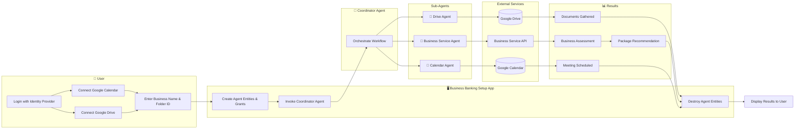

Agent security isn't one thing. It has to be a layered defense. At the foundation is **secure human identity**. Without verified identity, you can't confirm an agent is authorized to act for the person it claims to represent. Agents carry OAuth tokens and API keys tied to human identities; a compromised identity means stolen access across every integrated system.

Here's the full security stack, from foundational to application-level:

**Secure Human Identities** — The bedrock. Every agent action chain starts with a verified human identity. This is what your identity provider handles.

**Craft the Right Prompt** — Instruct agents to behave like responsible employees. Prompt engineering is a security control, not just a UX concern.

**Sub-agents** — As discussed above, split agents to reduce blast radius and make trust boundaries explicit.

**Third-Party Service Access** — When agents need to access services like Google Calendar, Office 365, or Salesforce, the user authenticates against the third-party service, and your identity provider securely stores the refresh tokens. When needed, an access token can be minted and injected into the agent's context.

Here's a pattern for managing third-party tokens:

```javascript
// After the user connects their Google Calendar via OAuth,
// FusionAuth stores the refresh token.
// When the Calendar Agent needs access:

const userResponse = await client.retrieveUser('human-user-id');
const googleIdpLink = userResponse.response.user
  .identityProviders?.find(link =>
    link.identityProviderId === 'google-idp-id'
  );

// The refresh token is available for minting fresh access tokens
// which get injected into the Calendar Agent's context
```

**Fine-Grained Authorization** — Use FGA to control access based on agent identity, user identity, resource attributes, and context. Build your authorization schema once and apply it consistently across APIs, services, MCP servers, and agent workflows.

**Logging and Tracing** — Preserve the chain of identity and capture key actions at decision points. Use the Vend JWT API to create signed tokens that encode the delegation chain (the `act` claim). Log agent actions using the audit log API with write-only API keys minted for each agent:

```javascript
// Create a write-only API key for the agent to log actions
// (This is configured in FusionAuth admin, shown here conceptually)

// Agent logs an action to the audit log
await fetch('https://your-fusionauth-instance.com/api/system/audit-log', {
  method: 'POST',
  headers: {
    'Authorization': 'AGENT_WRITE_ONLY_API_KEY',
    'Content-Type': 'application/json'
  },
  body: JSON.stringify({
    auditLog: {
      insertUser: 'Drive Agent (coordinator: xyz, human: abc)',
      message: 'Retrieved articles of incorporation for Business ID 12345'
    }
  })
});
```

Webhooks and Kafka can fan out these log entries to other systems for compliance and monitoring.

**Input/Output Filtering** — Control what goes into and comes out of your agentic system. Maintain stop word lists — both standard and custom — to prevent sensitive operations from being triggered in the wrong context. For example, "credit check" or "register new business" might be allowed in the business registration workflow but blocked in customer service.

CleanSpeak (TODO: add link to https://cleanspeak.com/docs/3.x/tech/apis/content#filter-content) provides a filter API with sub-50ms response times that can wrap your agent prompts. It supports standard, custom, and one-time block lists.

**Human Interaction** — Agents need to ask for human confirmation before taking consequential actions. Patterns include:

- Ask every time, with the ability for the human to dial it down (yes once, yes always, no)
- Ask only when there's real-world impact
- Never ask (YOLO mode — not recommended for banking)

Beware of alert fatigue. Balance confirmation frequency with actual impact.

For implementation, FusionAuth provides several mechanisms:

- **Step-up authentication**: require the user to re-authenticate before the agent proceeds with a high-impact action.
- **Device grant**: for scenarios where the agent needs to pull a human into the loop on a different device.
- **Passkey prompt**: for quick, low-friction confirmation of consequential actions.

The full lifecycle of a secured agent workflow looks like this:



### Validation

After an agent completes its work, validate the results. Did the agent do what it should have? Validation tools like Freeplay.ai and Braintrust can help verify agent outputs against expected outcomes. This is especially important in regulated industries like banking, where an agent that recommends the wrong product package or misidentifies a business type could have compliance implications.

### Sandboxing

Limit agent access by running them in secure, isolated environments. Container-based sandboxing solutions like Docker Sandboxes (TODO: add link to https://www.docker.com/products/docker-sandboxes/) or E2B (TODO: add link to https://e2b.dev/) provide runtime isolation so that even if an agent behaves unexpectedly, the damage is contained.

## AI Agent Governance

Beyond securing individual agent workflows, you need governance — the organizational layer that answers:

- Who gets access to what agent resources?
- How is access provisioned and deprovisioned?
- Are access reviews happening (periodic verification that access is still appropriate)?
- Is access aligned with regulations and policies?
- Can you produce audit trails and reporting on access decisions?

Your identity provider can supply the tooling — webhooks, audit logs, Kafka integration — that supports governance processes. But governance itself is an organizational discipline, not a software feature. Your identity provider helps you build governance; it's not a governance solution on its own.

Fine-grained authorization combined with a GitOps workflow is a powerful pattern for compliance enforcement. Define your authorization schema in version control, deploy changes through CI/CD, and every change to agent permissions is tracked and reviewable.

## What We Believe

Let's return to where we started. We believe these things to be true:

**Human identity is the source of AI authority.** Someone wrote that job. Someone authorized that agent. This should always be tracked.

**AI auth is best done as an extension of existing best practices.** OAuth, tokens, gateways — the technologies that secured the API era work for the AI era. Don't reinvent what already works.

**Identity enforcement needs to be deterministic.** AI systems are probabilistic. The identity layer that governs them must not be. When you check whether an agent has permission to read a document or schedule a meeting, the answer must be yes or no — never "probably."

**Re-use existing solutions wherever possible.** The similarities to the API boom of the 2010s are striking. The patterns are proven. Use them.

**Find value, don't follow the hype.** Not every problem needs a bleeding-edge solution. Pre-registering clients works. Plain APIs with good docs work. OAuth scopes work. Use the simplest thing that solves your problem.

## What's Next

The landscape is evolving fast. Standards like Rich Authorization Requests (RAR, RFC 9396) promise more expressive authorization for AI systems. MCP is maturing. Agent frameworks like Agentcore and Mastra are gaining traction. Data provenance — knowing which agent did what to what data — remains an open problem.

But the fundamentals won't change. Human identity at the root. Deterministic enforcement. Defense in depth. If you build on these principles, your AI systems will be secure regardless of which frameworks and protocols win out.

---

*Want to see these patterns in action? Check out the FusionAuth RAG example on GitHub (TODO: add link to https://github.com/FusionAuth/fusionauth-example-fga-rag) and explore the FusionAuth API gateway integrations (TODO: add link to https://fusionauth.io/docs/extend/examples/api-gateways/).*

## References

- [Emerging Agentic Identity Access](https://softwareanalyst.substack.com/p/emerging-agentic-identity-access)
- [Model Context Protocol Introduction](https://modelcontextprotocol.io/docs/getting-started/intro)
- [Permify LLM Authorization](https://docs.permify.co/use-cases/llm-authorization)
- [RFC 9396 — Rich Authorization Requests](https://datatracker.ietf.org/doc/html/rfc9396)
- [How to Design OAuth Scopes](https://fusionauth.io/blog/how-to-design-oauth-scopes)
