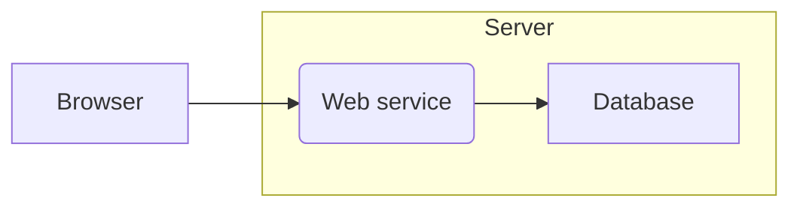
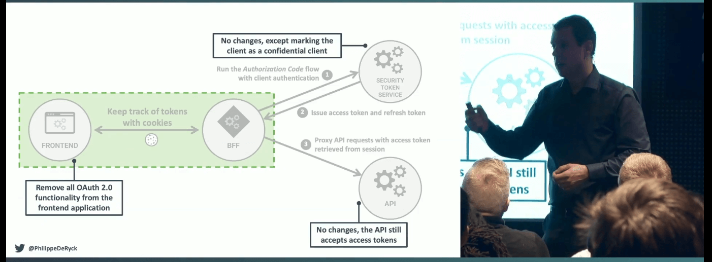

import Aside from 'src/components/Aside.astro';
import Breadcrumb from 'src/components/Breadcrumb.astro';
import InlineField from 'src/components/InlineField.astro';
import InlineUIElement from 'src/components/InlineUIElement.astro';

## What Is Backend For Frontend?

The backend for frontend (BFF) design pattern was popularized by [SoundCloud in 2015](https://philcalcado.com/2015/09/18/the_back_end_for_front_end_pattern_bff.html) as a way to make the development of multiple apps in large teams simpler, faster, and more modular.

Most large companies build a service with some web, Android, iOS, and desktop applications that naturally defaults to having a single API that serves all the apps. The SoundCloud diagram below shows this.

This design has a few problems:
- Each frontend (mobile, web, etc.) has to convert the data format from the one given by the API, to a format the app can use to display content. The frontend also has to make multiple API calls, and combine them, to get all the data it needs. This is extra work for the user's device and extra bandwidth.
- There is more collaboration and testing needed between all backend and frontend teams when anyone wants to change an API endpoint, or add a new feature.
- Since the API is public and may have free and paid features, authorization is tricky.

The BFF pattern, shown below, solves these problems by splitting the single API server into one API per app.

Each backend can now be considered part of the app. Features can be implemented freely by working on a backend and frontend pair, with affecting any other app.

## BFF For Authentication

As you can see above, BFFs were proposed for developer ease, not for security (authentication and authorization). After all, most web apps ten years ago had a server, whether it ran PHP, ASP, or Node.js, and most apps today still do. Even single page apps (SPAs) that used AJAX (fetch calls) to dynamically update web pages still updated them by calling a server.

So why are you seeing security practitioners and authentication gateway providers talking about BFFs in 2025? When it comes to security, isn't "BFF" just an unnecessary synonym for "server"? Mostly yes, but not always. If your app doesn't have a server, or stores OAuth access tokens in the browser, BFF has a special meaning and purpose, which you'll learn about in this article.

But first, you need a quick review of website security history to understand server designs, attacks, and countermeasures.

## Old-fashioned Web Apps

Let's start with the simplest client-server design that most small web apps use (without OAuth). This is shown in the diagram below.

Here, a user logs in to the server by entering a username and password, and the server marks the user as authenticated by storing a cookie in the browser. The browser sends the cookie to the server with subsequent requests, allowing the user to interact with the site securely.

It doesn't matter whether this app serves static HTML pages that submit forms to talk to the server, in the old style of PHP or the modern style of HTMX, or whether the app is a SPA written entirely in Vue or React that unfolds into an application in the browser. In both cases, assume the authentication token is a cookie.

## Why Are Cookies Secure?

The use of a cookie as the authentication credential in the browser is crucial, as opposed storing the credential in the browser's local or session storage. A cookie can be set as `HttpOnly` and `SameSite`, meaning that JavaScript cannot access the cookie, and the cookie won't be sent in a request to any server except that one that created it.

In contrast, any data in local and session storage can be accessed by JavaScript, and potentially sent to an attacker's server to be used to impersonate the user later. This theft is called token exfiltration.

## Common Web Attacks

The two most common attacks on web apps are cross-site scripting (XSS) and cross-site request forgery (CSRF).

In an XSS attack, the attacker has managed to get malicious JavaScript onto a page of the website that the user loads. For example:
- The user might click a link to search results from the site, with a hidden `<script>` tag in the search parameters.
- The user might view a forum post with a hidden script tag.
- An npm JavaScript package might have malicious code, or rely on another package that does.

The first two cases emphasize how important it is to sanitize data input by users, and HTML-encode data returned to the user for display.

Once an attacker has their own code running in the browser, they have full power to act on the user's behalf. Depending on the purpose of the site, the attacker could make requests to add, delete, edit, buy, sell, or send illegal or offensive messages. It doesn't matter what security measures you have taken at this point: cookies, server design, and OAuth are all useless when JS can act as the authenticated user.

One thing XSS code can't do however, is send the user's cookie to another web server, because cookies can't be touched by JS. This means the attack can run only as long as the user is running the site in their browser.

In a CSRF attack,

## OAuth Apps

## Backendless Apps And Public API Apps

How does authentication differ with BFF?

- All auth flows and interactions with the authorization server are handled securely in the backend
- Frontend uses backend endpoints to interact with auth-related capabilities

## BFF Authentication Is More Secure Than TODO
- No sensitive flows taking place in the frontend
- No secure artifacts stored in the frontend
- Reduced attack surface
- more todo

## BFF authentication design use case

Back in 2022, [FA didn't support BFF directly](https://fusionauth.io/blog/how-to-authenticate-your-react-app). which other gateways still don't?

hosted backend meant only browsers, not mobile - https://fusionauth.io/docs/apis/hosted-backend

What BFF architecture looks like in an auth scenario
FusionAuth’s Hosted Backend, which is provided out of the box

## Benefits of using FusionAuth Hosted Backend vs. building your own BFF endpoints

##Benefits of using Hosted Backend vs. implementing Auth Code w/ PKCE in your frontend

## Code tutorial/examples using a React frontend and Node backend

## Further Reading

- [BFF pattern at SoundCloud (2015)](https://philcalcado.com/2015/09/18/the_back_end_for_front_end_pattern_bff.html)
-

## TODO
- brief: https://docs.google.com/document/d/1M4OsCz77gStNObeejCtTRbv2Iib4DNqNyVDN3DPd0VI/edit?tab=t.0
- remove todo
- FA
- MJ malicious JavaScript
- JS
- References where "BFF" is discussed with a strong security focus:

    Auth0's documentation on the BFF pattern: They heavily emphasize the security advantages of using a BFF for token management and protection in SPAs. Their articles and documentation often present the BFF as a crucial security layer.
    Duende Software's BFF product and documentation: Duende Software provides a specific implementation of the BFF pattern focused on security for applications using OpenID Connect and OAuth 2.0. Their documentation clearly outlines the security benefits.
    Security-focused articles and talks on SPA authentication: Many security professionals recommend the BFF pattern as a way to mitigate the inherent security risks of client-side token handling in SPAs. While they might not explicitly say "BFF = server," the context implies that a server-side component (which aligns with the BFF concept) is necessary for security.