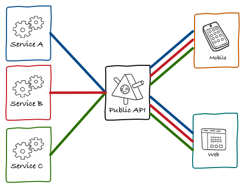
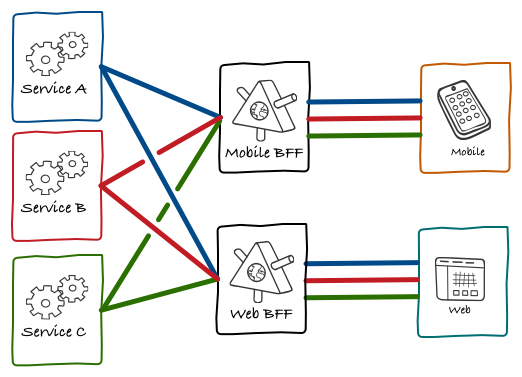
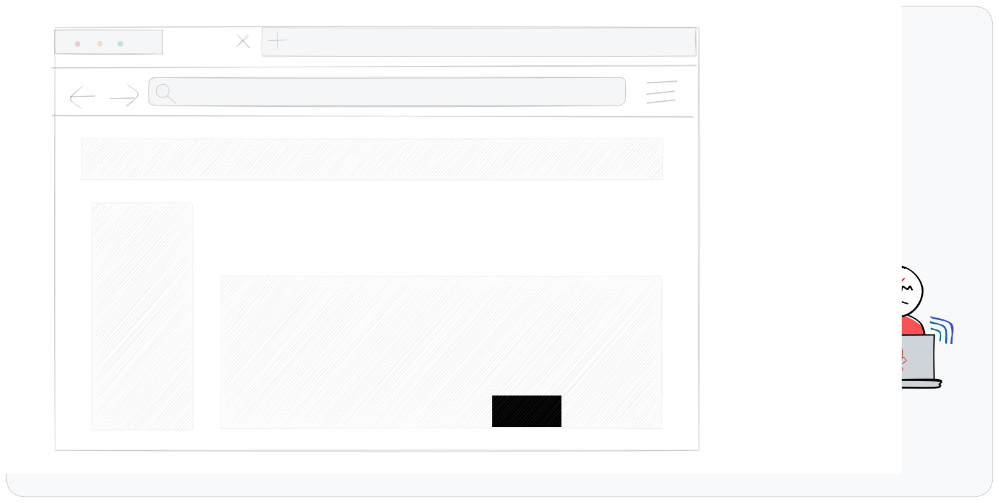
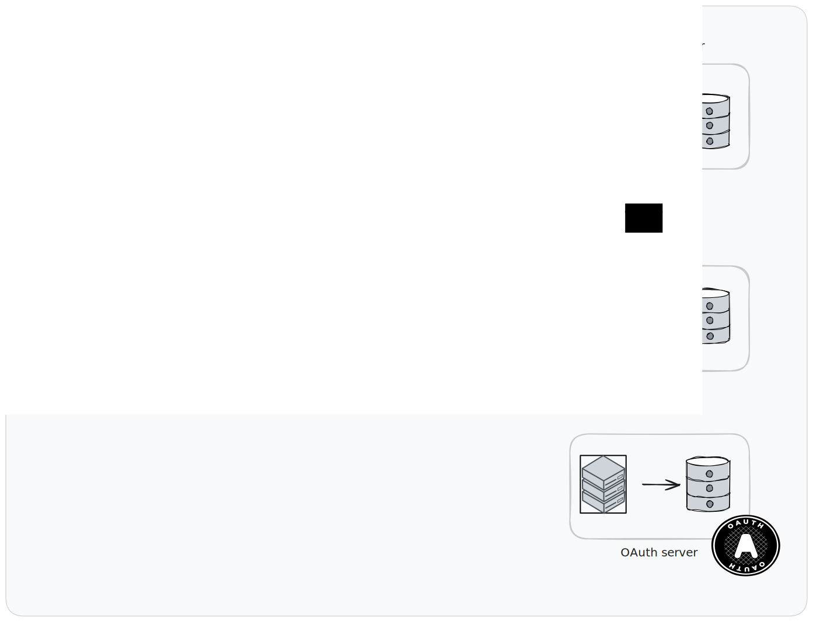
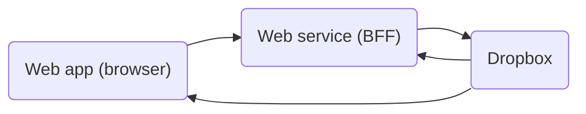
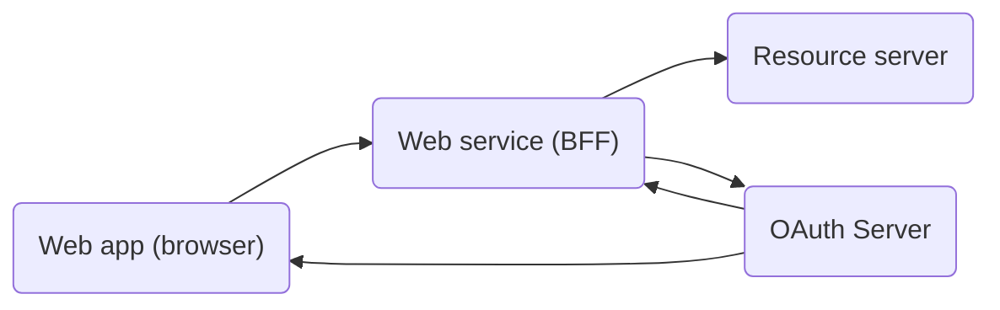
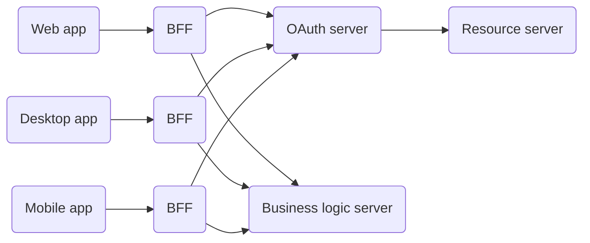
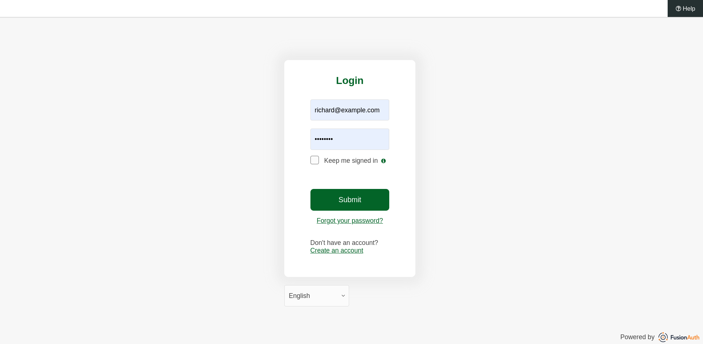
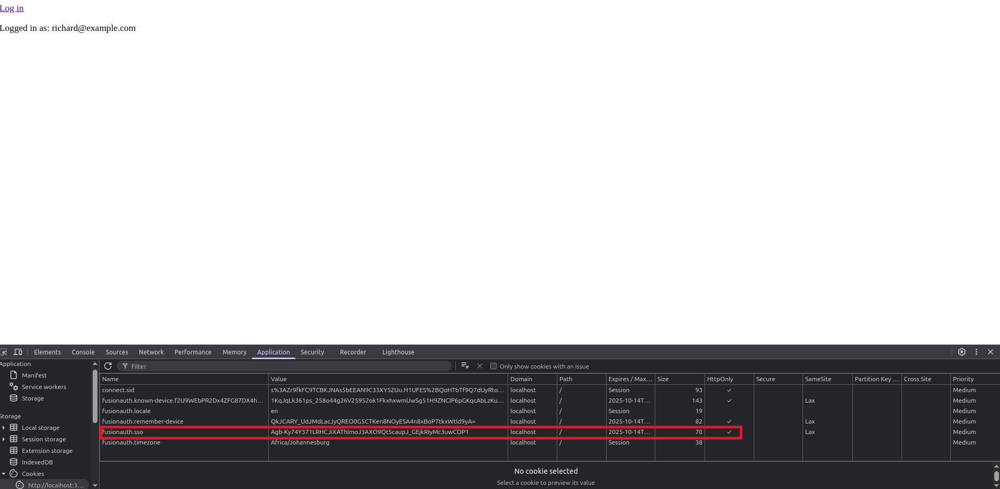

import Aside from 'src/components/Aside.astro';
import Breadcrumb from 'src/components/Breadcrumb.astro';
import InlineField from 'src/components/InlineField.astro';
import InlineUIElement from 'src/components/InlineUIElement.astro';
import {RemoteCode} from '@fusionauth/astro-components';

{/* Note this article won't work until FA updates https://github.com/fusionauth/fusionauth-example-docker-compose to Ritza's latest version

- brief: https://docs.google.com/document/d/1M4OsCz77gStNObeejCtTRbv2Iib4DNqNyVDN3DPd0VI/edit?tab=t.0
-
*/}

- [Introduction](#introduction)
- [What Is BFF?](#what-is-bff)
- [What Is BFF For Authentication?](#what-is-bff-for-authentication)
- [Simple Web App Design](#simple-web-app-design)
- [Why Are Cookies Secure?](#why-are-cookies-secure)
- [Common Web Attacks](#common-web-attacks)
- [OAuth App Design](#oauth-app-design)
- [Security Vulnerabilities In Serverless Apps](#security-vulnerabilities-in-serverless-apps)
- [BFF For Security Design](#bff-for-security-design)
- [How Much Riskier Is A Serverless App Really?](#how-much-riskier-is-a-serverless-app-really)
- [OAuth Allows Serverless Apps, But Don't Use Them](#oauth-allows-serverless-apps-but-dont-use-them)
- [How To Create A BFF For A Serverless App](#how-to-create-a-bff-for-a-serverless-app)
- [Use A Premade BFF](#use-a-premade-bff)
- [Other Hosted BFFs](#other-hosted-bffs)
- [Summary](#summary)
- [Further Reading](#further-reading)

## Introduction

This article discusses the dangers of storing OAuth tokens in the browser or client-side device, which is common for serverless apps like single page apps (SPAs) and mobile apps, and how to upgrade to using an OAuth proxy server. An OAuth proxy is also known as the token handler pattern, or an OAuth backend for frontend (BFF).

Many articles were written about the BFF pattern for authentication back in 2021, but the term BFF's origins are earlier, and for a different purpose. Let's start at the beginning.

## What Is BFF?

The backend for frontend (BFF) design pattern was popularized by [SoundCloud in 2015](https://philcalcado.com/2015/09/18/the_back_end_for_front_end_pattern_bff.html) as a way to make the development of multiple apps in large teams simpler, faster, and more modular.

SoundCloud had a single API that served web, Android, iOS, and desktop applications. Their diagram below shows this.



This design has a few problems:
- Each frontend (mobile, web, etc.) has to convert the data format from the one given by the API, to a format the app can use to display content. The frontend also has to make multiple API calls, and combine them, to get all the data it needs. This is extra work for the user's device and extra bandwidth.
- There is more collaboration and testing needed between all backend and frontend teams when anyone wants to change an API endpoint, or add a new feature.
- Since the API is public and may have free and paid features, authorization is tricky.

The BFF pattern, shown below, solves these problems by splitting the single API server into one API per app.



Each backend can now be considered part of the app. Features can be implemented freely by working on a backend and frontend pair, with affecting any other app.

## What Is BFF For Authentication?

As you can see above, BFFs were proposed for developer ease, not for security (authentication and authorization). After all, most web apps ten years ago had a server, whether it ran PHP, ASP, or Node.js, and most apps today still do. Even single page apps (SPAs) that used AJAX (fetch calls) to dynamically update web pages still updated them by calling a server.

So why are you seeing security practitioners and authentication gateway providers talking about BFFs in 2025? When it comes to security, isn't "BFF" just an unnecessary synonym for "server"? Mostly yes, but not always. If your app doesn't have a server, or stores OAuth access tokens in the browser, BFF has a special meaning and purpose, which you'll learn about in this article.

But first, you need a quick review of website security history to understand server designs, attacks, and countermeasures.

## Simple Web App Design

Let's start with the simplest client-server design that most small web apps use (without OAuth). This is shown in the diagram below.


Here, a user logs in to the server by entering a username and password, and the server marks the user as authenticated by storing a cookie in the browser. The browser sends the cookie to the server with subsequent requests, allowing the user to interact with the site securely.

It doesn't matter whether this app serves static HTML pages that submit forms to talk to the server, in the old style of PHP or the modern style of HTMX, or whether the app is a SPA written entirely in Vue or React that unfolds into an application in the browser. In both cases, the authentication token is a cookie.

The web service here is technically a BFF because the backend is used to serve the frontend. But in this case everyone just calls it a server.

## Why Are Cookies Secure?

The use of a cookie as the authentication credential in the browser is crucial, as opposed storing the credential in the browser's local or session storage. A cookie can be set as `HttpOnly` and `SameSite=Strict`, meaning that JavaScript cannot access the cookie, and the cookie won't be sent in a request to any server except that one that created it.

In contrast, any data in local and session storage can be accessed by JavaScript, and potentially sent to an attacker's server to be used to impersonate the user later. This theft is called token exfiltration ("exfiltration" is what happens after "infiltration").



## Common Web Attacks

The two most common attacks on web apps are cross-site scripting (XSS) and cross-site request forgery (CSRF).

In an XSS attack, the attacker has managed to get malicious JavaScript onto a page of the website that the user loads. For example:
- The user might click a link to search results from the site, with a hidden `<script>` tag in the search parameters.
- The user might view a forum post with a hidden script tag that the browser executes instead of displaying as HTML.
- An npm JavaScript package used by the site might have malicious code, or rely on another package that does.

The first two cases emphasize how important it is to sanitize data input by users, and HTML-encode data returned to the user for display.

Once an attacker has their own code running in the browser, they have full power to act on the user's behalf. Depending on the purpose of the site, the attacker could make requests to add, delete, edit, buy, sell, or send illegal or offensive messages. It doesn't matter what security measures you have taken at this point: cookies, server design, and OAuth are all useless when JavaScript can act as the authenticated user.

One thing XSS code can't do however, is send the user's cookie to another web server, because cookies can't be touched by JavaScript. This means the attack can run only as long as the user is running the site in their browser.

In a CSRF attack, while browsing an attacker's website, the site sends a request from JavaScript to the target site where the user is logged in, trying to act on their behalf. If the target site uses strict `SameSite` cookies CSRF attacks are practically impossible. If the site uses non-strict cookies (to allow for redirection back to the site after a credit card payment for example), CSRF attacks can be avoided by using anti-CSRF tokens.

## OAuth App Design

One step up in complexity from the simple web server, is the OAuth code flow protocol. This protocol is shown below.


In addition to the browser and server components from the first design, there is now also an OAuth server. In the code flow, login works as follows:
- The user clicks "Log in" in the web app.
- The web server receives the request and redirects the user to the website of the OAuth server, where the user enters their credentials.
- The OAuth server redirects the browser back the web service, with a code in the URL.
- The web service receives the code and sends it to the OAuth server to get a refresh token and access token. (This exchange happens without using the browser so it is more secure.) The web service stores the tokens, then returns a cookie to the user marking them as logged in. (Read this guide to understand [what each token is used for](https://fusionauth.io/blog/what-happens-after-oauth-authentication-event))

Since the OAuth tokens are never sent to the browser, they cannot be stolen by malicious JavaScript on the client side. The initial code redirected from the OAuth server is in the browser, and is thus vulnerable to client side attacks, but the code can't be used to get access tokens by any server other than web service because the OAuth will reject other URLs.

If you have a web app and have been using an authentication gateway, like FusionAuth or KeyCloak, this is probably the flow you currently use.

In this design above, OAuth is used to authenticate the user on the app's web service, not for an external service (the resource server) on the client's behalf. If the web service were to make requests to an external server, it would send that server the access token. Once again, that token would never be sent to the browser. This design would look like the below.



In all designs so far, the web service technically could be called a BFF, but it's still meaningless. For a BFF to have meaning in the context of security, you first need to understand what it means **not** to have a backend for an app, which is discussed in the next section.

## Security Vulnerabilities In Serverless Apps

For an example of a web app without a server, consider the typical todo or task list app. You might write a todo app to help people keep track of their chores, but not want to spend money and development time storing user data in your own server and database hosted somewhere online. So you use the Dropbox file storage API for your app to store user data in Dropbox. Now your server can be entirely static, merely a file host, like GitHub pages or Cloudflare, that serves HTML and JavaScript files. This design is called a serverless app, and is shown below.


While the Dropbox API supports OAuth, this design doesn't have a server, so you can't use the OAuth code flow. In this case, the OAuth specification recommends the client-only PKCE flow.

The PKCE (proof key for code exchange) flow is similar to the code flow but has two differences:
- When the initial request for an authorization code is sent, the browser includes a secret, which the OAuth server stores.
- The access and refresh tokens are obtained directly from the app in the browser, and are stored in the browser. The request for an access token includes not only the authorization code, but also the original secret. If the secret the OAuth server stored does not match the one from the browser, the server will not return an access token.

Let's consider possible attacks on this protocol:
- If an attacker is able to read the browser's address bar, they can see the authorization code returned from the server, but won't have access to the challenge secret, so will not be able to obtain access tokens.
- If the app has malicious JavaScript, the attacker will be able to exfiltrate the authorization code, refresh token, and access token. The attacker can then wait until the user goes offline, and use the latest refresh token to generate access tokens until the user login timeout expires (which could be days or weeks).

Exactly what an attacker can steal depends on how the app stores the tokens and secrets. If the app keeps them only as variables in RAM, malicious JavaScript probably won't be able to find them unless it knows specifically where to look. But if tokens are kept only in RAM, the user will have to log in every single time they open the app. If the secrets are persisted in the browser's session or local storage, the attacker will steal everything. Note that `HttpOnly` cookies can't be used in this situation, because the app's JavaScript has to be able to read and write the token values.

Serverless design isn't limited to web apps. Desktop apps and mobile apps are also usually serverless. Mobile apps that connect your bank account, file storage, or medical record provider on our behalf probably don't have their own servers. If an attacker gains access to your phone or computer, either through a malicious app or through physical theft, they might gain access to all tokens on your device.

## BFF For Security Design

"But I don't want to create an entire server for my app" you might say as a frontend developer. "That's why I use all these online services."

And that's the beauty of the BFF pattern — you don't have to create a complex server. You can create a tiny backend with no database that is merely a proxy server, or trusted intermediary, that does nothing except handle tokens. You can still use external services for OAuth, resource servers, and file hosting.

If we ignore the file host, since it is inconsequential, this design will look like the diagram below, which is identical to the earlier OAuth diagram, as Dropbox is both the OAuth server and resource server.



Of course, your OAuth server and your resource server might be separate servers (for example, you might use Google Accounts for OAuth to request authorization for Gemini as the AI resource). Then the design will look as below.



Again, this design is identical to the earlier app design that had a traditional web server. The reason that this pattern is now called a BFF server is that it is designed exclusively to provide authorization services to the front end. The real business service server is actually the resource server.

However, your business might have its own full-featured server for business logic, or a public API. In this case you still might want to use the BFF pattern, keeping separate servers purely for authentication, so that mobile, web, and desktop apps can all have dedicated BFFs of their own. This design would look like the diagram below, and leads us back to the Soundcloud design in the introduction of the article.



## How Much Riskier Is A Serverless App Really?

You might not see the value in all the work to create a BFF for your serverless app. After all, if an attacker already has enough access to a user's browser or device to steal a refresh token, surely it's too late to protect the user? The answer is, it depends:

- For a web app, there is a huge amount of value in creating a BFF. It allows the app to store nothing but a cookie, which an attacker can't steal.
- For a mobile or desktop app, there is less value because these apps might not store cookies like browsers do. However, the BFF can still return a short-lived authentication credential, so if the attacker steals the credential, they won't have long to act. If you didn't use a BFF, once the attacker steals the refresh token, they might be able to impersonate a user for days.

Additionally, a BFF might expose fewer endpoints to the frontend, limiting the actions an attacker can take.  The BFF might be able to check for unusual behavior that indicates an attack, and not forward the request to business server (similarly to how banks check for credit card fraud).

You can read more about [where to store tokens on different devices](https://fusionauth.io/articles/oauth/oauth-token-storage).

As mentioned earlier, in the event that there is malicious JavaScript in the frontend itself, even if you use a BFF, then while an attacker may not be able to steal refresh token, they can still perform any action they want from the user's device while impersonating the user.

## OAuth Allows Serverless Apps, But Don't Use Them

In his 2023 [talk on the non-security of serverless OAuth apps](https://www.youtube.com/watch?v=OpFN6gmct8c), Philippe de Ryck noted that the OAuth organization doesn't discourage programmers from using serverless apps strongly enough:

- OAuth recommends PKCE, which you've seen still allows theft of refresh tokens.
- OAuth recommends frequently changing refresh tokens, which doesn't prevent an attacker from waiting until a user closes the website and then using the latest refresh token to impersonate the user for hours or days.
- OAuth recommends hiding credentials in service workers in the browser, as service workers are less vulnerable to XSS attacks. But service workers are started by JavaScript and so can be stopped by malicious JavaScript.

Philippe's conclusion is that there is ultimately no way to adequately protect a serverless OAuth frontend.

## How To Create A BFF For A Serverless App

Let's look at some code to create a BFF for a currently serverless app. Clone or download the repository from https://github.com/ritza-co/fusionauth-example-hostedbackend. First you'll see how the app runs and login works, then you'll learn how the code works.

You will need Docker installed to run the examples.

In this example, you use an authentication gateway called FusionAuth as your OAuth provider. FusionAuth is free for basic usage for unlimited users and applications, and can act as an identity provider itself or as a way to connect to identity providers such as GitHub and Google.

Open a terminal in the project directory you downloaded. Run the command below to start FusionAuth.

```sh
docker compose up
```

Wait a minute for `Kickstarting 🤘` to finish, then browse to http://localhost:9011 and log in with `admin@example.com` and `password`. You can browse around FusionAuth to see the example application and users.

In a new terminal, run the commands below to start the Node web app.

```sh
cd nodeApp

docker run --init -it --rm --platform=linux/amd64 --name "app" -v ".:/app" -w "/app" -p 3000:3000 --network faNetwork node:23-alpine3.19 sh -c  "npm install && node app.js"
```

Browse to http://localhost:3000 to view the app. Click the login link to authenticate with FusionAuth. Use the credentials `richard@example.com` and `password`.



FusionAuth redirects you back to the app, which detects you're logged in and displays your username. Note that the only token stored in the browser is the `HttpOnly` cookie.



The frontend for this app is simple. Look at the file `index.html`.

<RemoteCode url={frontmatter.url + "/nodeApp/index.html"} lang="html"/>

The only text on the entire page is the login link. In reality, the HTML body could be filled with an entire Angular, React, or Vue app and it wouldn't make a difference. All you need to do to add BFF support to your real app is add a login link somewhere.

This page also has a `checkLoggedIn()` function, which gets the username of the current user from the server if they're logged in. This isn't necessary to make calls to a resource server  — as being logged in is determined by the presence or absence of the `fusionauth.sso` cookie for the site — but allows you to see that login worked on the page.

The BFF is the tiniest Express.js server possible. It is in `app.js`.

<RemoteCode url={frontmatter.url + "/nodeApp/app.js"} lang="js"/>

The code contains a lot of Node Express boilerplate, including imports of the session and the cookie parser packages. There are only four main routes, the first of which returns the HTML file, and the others use Passport.js to check the user's authentication status. Passport.js is a JavaScript wrapper to call OAuth servers.

More complicated is the `authentication.js` file.

<RemoteCode url={frontmatter.url + "/nodeApp/authentication.js"} lang="js"/>

The code in this file is copied almost exactly out of the [sample application from the Passport website](https://github.com/jaredhanson/passport-oauth2). Passport abstracts away all OAuth complexities. All you need to set are the correct configuration values to access FusionAuth.

In summary, the frontend does nothing but show a login link and store a cookie. The Node BFF is a thin wrapper around Passport, which handles authentication with FusionAuth.

## Use A Premade BFF

If creating and hosting a server like the one in the previous section is still something you want to avoid, there's an even simpler option. FusionAuth offers a built-in BFF for your frontend app (since version 1.45) called the "hosted backend". All you need is FusionAuth — it runs both as an authentication service and as the BFF.

There are two ways to use the [hosted backend API](https://fusionauth.io/docs/apis/hosted-backend):
- With the existing React SDK for FusionAuth. There is a tutorial, with example repository, showing [how to integrate your app with FusionAuth here](https://fusionauth.io/docs/quickstarts/quickstart-javascript-react-web).
- By coding your own integration in JavaScript, if you use another framework like Angular, Vue, or Svelte.

Since there is already documentation on how to use React, in this section you'll learn how to code custom calls to the hosted backend. The example uses vanilla JavaScript, so you can use the code in any framework you prefer.

If you ran the node server in the previous section, close it by pushing <kbd>Ctrl-C</kbd>, but leave the FusionAuth server running. In a new terminal, run the command below to start the serverless web app.

```sh
cd serverlessApp

docker run --init  -it --rm --name "app" -v ".:/app" -w "/app" -p 3000:3000 --network faNetwork node:23-alpine3.19 sh -c  "npm install http-server && npx http-server -d false -a 0.0.0.0 -p 3000 --proxy http://localhost:3000?"
```

Note that in this example there is no Node server in the backend. The HTML file is served from the [static file host, `http-server`](https://www.npmjs.com/package/http-server).

As before, browse to http://localhost:3000 to view the app. Click the login link to authenticate with FusionAuth. Use the credentials `richard@example.com` and `password`.

TODO screenshot with idt cookie and get username from cookie in code once bug is fixed - https://github.com/FusionAuth/fusionauth-issues/issues/3054

Though this app looks identical to the previous one, it has no server and uses only FusionAuth for all authentication. The entire application is contained in the `index.html` file in the `serverlessApp` directory.

<RemoteCode url={frontmatter.url + "/serverlessApp/index.html"} lang="html"/>

In a full single page app, you'll probably be using a client-side routing framework. But this example checks for only two cases: either it is handling a callback from the authentication server, or it displays the login link on the page for any other route.

All the logging link does is redirect the user to the FusionAuth hosted backend API endpoint. If the handleCallback function detects that the page is on the callback URL when the page loads, it extracts the username from the identity cookie and displays it.

As in the previous example, the display of the username is not essential. Since cookies are sent with every page request, the user's logged-in status is handled automatically.

In summary, you can add secure authentication to your serverless app by merely running FusionAuth and writing a snippet of JavaScript. This is less work than implementing the PKCE flow, while still being more secure. If you are writing a mobile or desktop app, you can also use this secure technology, as long as your HTTP library supports cookies.

## Other Hosted BFFs

The ability of FusionAuth to provide a hosted backend massively simplifies the work you have to do for SPAs and mobile apps. Almost no other authentication gateways offer this feature at the time of writing (early 2025).

When looking for such a feature, it might be called an OAuth proxy, BFF, or hosted auth proxy. Curity calls it the [token handler pattern](https://curity.io/blog/token-handler-the-single-page-applications-new-bff/).

If you don't want to use FusionAuth and don't want to write your own BFF, there are open-source projects which will handle cookies and tokens for you, like the [OAuth2 Proxy](https://oauth2-proxy.github.io/oauth2-proxy), written in Go. You still need a server somewhere to host it though.

Below is a list of which authentication gateways offer OAuth proxies:
- Amazon Cognito offers an [OAuth proxy called "managed login"](https://docs.aws.amazon.com/cognito/latest/developerguide/cognito-user-pools-managed-login.html).
- Auth0 agrees that [storing tokens in the browser is dangerous](https://auth0.com/docs/secure/security-guidance/data-security/token-storage), and recommends storing them in RAM, not local storage. They don't provide a hosted backend. Their [SPA SDK for Auth0](https://auth0.com/docs/quickstart/spa/vanillajs/interactive) sends the access token directly to the browser.
- Curity provides a downloadable [token handler that you host yourself](https://curity.io/resources/learn/token-handler-getting-started/#curity-token-handler) and connect to their API gateway.
- [Cloudentity recommend using an OAuth proxy](https://cloudentity.com/developers/blog/adding-oauth-proxy-bff-component-to-spa/), but don't seem to offer one as part of their service.
- Duende offers a [ASP.NET OAuth Proxy package](https://blog.duendesoftware.com/posts/20210326_bff/) you can host, as part of their IdentityServer.
- Okta, Ory, and Keycloak don't seem to offer built-in OAuth proxies in their documentation.

## Summary

Though this article was complex, the recommendations are simple:

- Use `HttpOnly` cookies in the browser. Never store secrets in local storage or session storage.
- Always use a server for your apps that use OAuth, even mobile and desktop apps if possible, so tokens are never sent to the browser. If your apps are currently serverless, add an OAuth proxy to make them safer.
- The easiest way to add an OAuth Proxy is with FusionAuth hosted backend, the Go Auth2 proxy, or building on the Passport.js Node sample in this article. (For other languages, there are OAuth wrappers too, so you won't have to write your own protocol code.)
- The greatest danger to your app is malicious dependencies. Be very careful which packages you build with.
- For dangerous actions, like buying, selling, or accessing private information, consider using [multifactor authentication](https://fusionauth.io/docs/lifecycle/authenticate-users/multi-factor-authentication) in addition to any other security practices you have.

## Further Reading

- [BFF pattern at SoundCloud (2015)](https://philcalcado.com/2015/09/18/the_back_end_for_front_end_pattern_bff.html)
- [Dropbox OAuth documentation](https://www.dropbox.com/developers/documentation/http/documentation)
- [What are OAuth tokens used for](https://fusionauth.io/blog/what-happens-after-oauth-authentication-event)
- [Token storage locations](https://fusionauth.io/articles/oauth/oauth-token-storage)
- [Passport.js](https://www.passportjs.org/) and the [OAuth extension](https://github.com/jaredhanson/passport-oauth2) for JavaScript servers
- [FusionAuth React tutorial for the hosted backend](https://fusionauth.io/docs/quickstarts/quickstart-javascript-react-web)
- [FusionAuth hosted backend API](https://fusionauth.io/docs/apis/hosted-backend)
- [Node http-server package](https://www.npmjs.com/package/http-server)
- [Go OAuth2 Proxy](https://oauth2-proxy.github.io/oauth2-proxy)
- [Multifactor authentication in FusionAuth](https://fusionauth.io/docs/lifecycle/authenticate-users/multi-factor-authentication)

