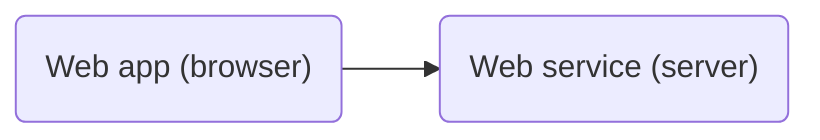
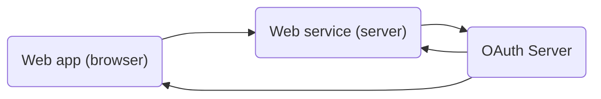
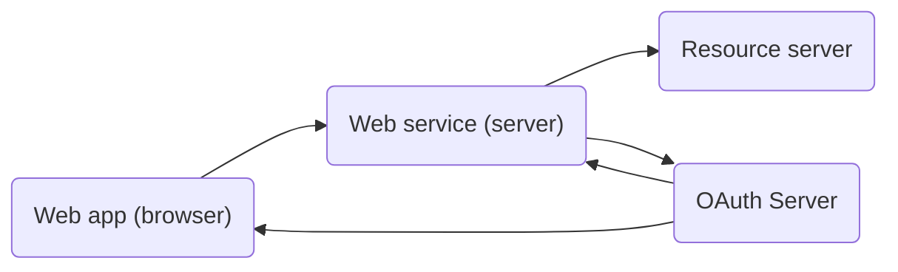
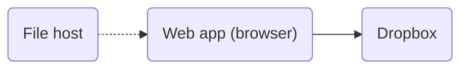
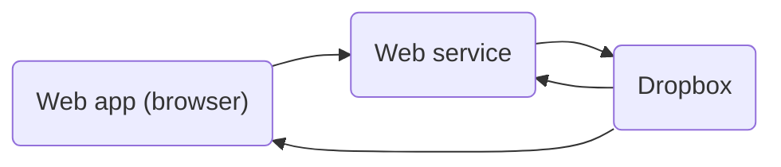
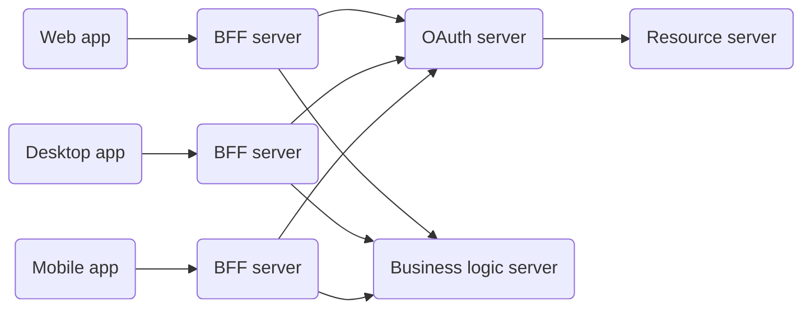

import Aside from 'src/components/Aside.astro';
import Breadcrumb from 'src/components/Breadcrumb.astro';
import InlineField from 'src/components/InlineField.astro';
import InlineUIElement from 'src/components/InlineUIElement.astro';

- [What Is Backend For Frontend?](#what-is-backend-for-frontend)
- [BFF For Authentication](#bff-for-authentication)
- [Simple Web Apps](#simple-web-apps)
- [Why Are Cookies Secure?](#why-are-cookies-secure)
- [Common Web Attacks](#common-web-attacks)
- [OAuth Apps](#oauth-apps)
- [Serverless Apps](#serverless-apps)
- [BFF For Security](#bff-for-security)
- [BFF Authentication Is More Secure Than TODO](#bff-authentication-is-more-secure-than-todo)
- [BFF authentication design use case](#bff-authentication-design-use-case)
- [Benefits of using FusionAuth Hosted Backend vs. building your own BFF endpoints](#benefits-of-using-fusionauth-hosted-backend-vs-building-your-own-bff-endpoints)
- [Code tutorial/examples using a React frontend and Node backend](#code-tutorialexamples-using-a-react-frontend-and-node-backend)
- [Further Reading](#further-reading)
- [TODO](#todo)

## What Is Backend For Frontend?

The backend for frontend (BFF) design pattern was popularized by [SoundCloud in 2015](https://philcalcado.com/2015/09/18/the_back_end_for_front_end_pattern_bff.html) as a way to make the development of multiple apps in large teams simpler, faster, and more modular.

Most large companies build a service with some web, Android, iOS, and desktop applications that naturally defaults to having a single API that serves all the apps. The SoundCloud diagram below shows this.

This design has a few problems:
- Each frontend (mobile, web, etc.) has to convert the data format from the one given by the API, to a format the app can use to display content. The frontend also has to make multiple API calls, and combine them, to get all the data it needs. This is extra work for the user's device and extra bandwidth.
- There is more collaboration and testing needed between all backend and frontend teams when anyone wants to change an API endpoint, or add a new feature.
- Since the API is public and may have free and paid features, authorization is tricky.

The BFF pattern, shown below, solves these problems by splitting the single API server into one API per app.

Each backend can now be considered part of the app. Features can be implemented freely by working on a backend and frontend pair, with affecting any other app.

## BFF For Authentication

As you can see above, BFFs were proposed for developer ease, not for security (authentication and authorization). After all, most web apps ten years ago had a server, whether it ran PHP, ASP, or Node.js, and most apps today still do. Even single page apps (SPAs) that used AJAX (fetch calls) to dynamically update web pages still updated them by calling a server.

So why are you seeing security practitioners and authentication gateway providers talking about BFFs in 2025? When it comes to security, isn't "BFF" just an unnecessary synonym for "server"? Mostly yes, but not always. If your app doesn't have a server, or stores OAuth access tokens in the browser, BFF has a special meaning and purpose, which you'll learn about in this article.

But first, you need a quick review of website security history to understand server designs, attacks, and countermeasures.

## Simple Web Apps

Let's start with the simplest client-server design that most small web apps use (without OAuth). This is shown in the diagram below.

Here, a user logs in to the server by entering a username and password, and the server marks the user as authenticated by storing a cookie in the browser. The browser sends the cookie to the server with subsequent requests, allowing the user to interact with the site securely.

It doesn't matter whether this app serves static HTML pages that submit forms to talk to the server, in the old style of PHP or the modern style of HTMX, or whether the app is a SPA written entirely in Vue or React that unfolds into an application in the browser. In both cases, the authentication token is a cookie.

The web service here is technically a BFF because the backend is used to serve the frontend. But it's meaningless to call the server a BFF as there is only one frontend and one backend.

## Why Are Cookies Secure?

The use of a cookie as the authentication credential in the browser is crucial, as opposed storing the credential in the browser's local or session storage. A cookie can be set as `HttpOnly` and `SameSite=Strict`, meaning that JavaScript cannot access the cookie, and the cookie won't be sent in a request to any server except that one that created it.

In contrast, any data in local and session storage can be accessed by JavaScript, and potentially sent to an attacker's server to be used to impersonate the user later. This theft is called token exfiltration.

## Common Web Attacks

The two most common attacks on web apps are cross-site scripting (XSS) and cross-site request forgery (CSRF).

In an XSS attack, the attacker has managed to get malicious JavaScript onto a page of the website that the user loads. For example:
- The user might click a link to search results from the site, with a hidden `<script>` tag in the search parameters.
- The user might view a forum post with a hidden script tag that the browser executes instead of displaying as HTML.
- An npm JavaScript package used by the site might have malicious code, or rely on another package that does.

The first two cases emphasize how important it is to sanitize data input by users, and HTML-encode data returned to the user for display.

Once an attacker has their own code running in the browser, they have full power to act on the user's behalf. Depending on the purpose of the site, the attacker could make requests to add, delete, edit, buy, sell, or send illegal or offensive messages. It doesn't matter what security measures you have taken at this point: cookies, server design, and OAuth are all useless when JS can act as the authenticated user.

One thing XSS code can't do however, is send the user's cookie to another web server, because cookies can't be touched by JS. This means the attack can run only as long as the user is running the site in their browser.

In a CSRF attack, while browsing an attacker's website, the site sends a request from JS to the target site where the user is logged in, trying to act on their behalf. If the target site uses strict `SameSite` cookies CSRF attacks are practically impossible. If the site uses non-strict cookies (to allow for redirection back to the site after a credit card payment for example), CSRF attacks can be avoided by using anti-CSRF tokens.

## OAuth Apps

Instead of a basic username/password login system, you can upgrade to the OAuth code flow. This protocol is shown below.

In addition to the browser and server components from the first design, there is now also an OAuth server. In the code flow, login works as follows:
- The user clicks "Log in" in the web app.
- The web server receives the request and redirects the user to the website of the OAuth server, where the user enters their credentials.
- The OAuth server redirects the browser back the web service, with a code in the URL.
- The web service receives the code and sends it to the OAuth server to get a refresh token and access token. (This exchange happens without using the browser so it is more secure.) The web service stores the tokens, then returns a cookie to the user marking them as logged in.

Since the OAuth tokens are never sent to the browser, they cannot be stolen by MJ on the client side. The initial code redirected from the OAuth server is in the browser, and is thus vulnerable to client side attacks, but the code can't be used to get access tokens by any server other than web service because the OAuth will reject other URLs.

If you have a web app and have been using an authentication gateway, like FusionAuth or KeyCloak, this is probably the flow you currently use.

In this design, OAuth is used to authenticate the user on the web service, and not for the web service to get authorization to perform actions on another site (the resource server) on the client's behalf. If the web service were to make requests to an external server, it would send that server the access token. Once again, that token would never be sent to the browser. This design would look like the below.

In all designs so far, the web service technically could be called a BFF, but it's still meaningless. For a BFF to have meaning in the context of security, you first need to understand what it means **not** to have a backend for an app, which is discussed in the next section.

## Serverless Apps

For an example of a web app without a server, consider the typical todo or task list app. You might write a todo app to help people keep track of their chores, but not want to spend money and develpment time storing user data in your own server and database hosted somewhere online. So you use the Dropbox file storage API for your app to store user data in their service. Now your server can be entirely static, merely a file host that serves HTML and JavaScript files, such as GitHub pages or Cloudflare. This design is called a serverless app, and is shown below.

While the Dropbox supports OAuth, this design doesn't have a server, so you can't use the OAuth code flow. In this case, the OAuth specification recommends the client-only PKCE flow.

The PKCE (proof key for code exchange) flow is similar to the code flow but has two differences:
- When the initial request for an authorization code is sent, the browser includes a secret, which the OAuth server stores.
- The access and refresh tokens are obtained directly from the app in the browser, and are stored in the browser. The request for an access tokens includes not only the authorization code, but also the original secret. If the secret the OAuth server stored does not match the one from the browser, the server will not return an access token.

Let's consider possible attacks on this protocol:
- If an attacker is able to read the browser's address bar, they can see the authorization code returned from the server, but won't have access to the challenge secret, so will not be able to obtain access tokens.
- If the app has MJ, the attacker will be able to exfiltrate the authorization code, refresh token, and access token. The attacker can then wait until the user goes offline, and use the latest refresh token to generate access tokens until the user login timeout expires (which could be days or weeks).

Exactly what an attacker can steal depends on how the app stores the tokens and secrets. If the app keeps them only as variables in RAM, MJ probably won't be able to find them unless it knows specifically where to look. But if tokens are kept only in RAM the user will have to log in every single time they open the app. If the secrets are persisted in the browser's session or local storage, the attacker will steal everything. Note that `HttpOnly` cookies can't be used in this situation, because the app's JavaScript has to be able to read and write the token values.

Serverless design isn't limited to web apps. Desktop apps and mobile apps are also usually serverless. Mobile apps that connect your bank account, file storage, or medical record provider probably don't have their own servers. If an attacker gains access to your phone or computer, either through a malicious app or through physical theft, they will have access to all tokens on your device.

## BFF For Security

"But I don't want to create an entire server for my app!" you say. "That's why I use all these online services."

And that's the beauty of the BFF pattern — you don't have to. You can create a tiny backend with no database that is merely a proxy server, or trusted intermediary, that does nothing else except handle tokens. You can still use external services for OAuth, resource servers, and file hosting.

If we ignore the file host as it is inconsequential, the design will look like the diagram below, which is almost identical to the earlier OAuth diagram.

Of course, your OAuth server and your resource server might be separate servers (for example, you might use Google Accounts for OAuth to request authorization for Gemini as the AI resource). Then the design will look as below.

Again, this design is identical to the earlier app design that had a traditional web server. The reason that this pattern is called a BFF server is that it is designed exclusively to provide authorization services to the front end. The real business service server is actually the resource server.

However, your business might have its own full-featured server for business logic, or a public API. In this case you still might want to use the BFF pattern, keeping separate servers purely for authentication, so that mobile, web, and desktop apps can all have dedicated BFF servers of their own. This design would look like the diagram below, and leads us back to design in the introduction of the article.

## BFF Authentication Is More Secure Than TODO

- All auth flows and interactions with the authorization server are handled securely in the backend
- Frontend uses backend endpoints to interact with auth-related capabilities

- No sensitive flows taking place in the frontend
- No secure artifacts stored in the frontend
- Reduced attack surface
- more todo

## BFF authentication design use case

Back in 2022, [FA didn't support BFF directly](https://fusionauth.io/blog/how-to-authenticate-your-react-app). which other gateways still don't?

hosted backend meant only browsers, not mobile - https://fusionauth.io/docs/apis/hosted-backend

What BFF architecture looks like in an auth scenario
FusionAuth’s Hosted Backend, which is provided out of the box

## Benefits of using FusionAuth Hosted Backend vs. building your own BFF endpoints

##Benefits of using Hosted Backend vs. implementing Auth Code w/ PKCE in your frontend

## Code tutorial/examples using a React frontend and Node backend

## Further Reading

- [BFF pattern at SoundCloud (2015)](https://philcalcado.com/2015/09/18/the_back_end_for_front_end_pattern_bff.html)
- [Dropbox OAuth documentation](https://www.dropbox.com/developers/documentation/http/documentation)
-

## TODO
- brief: https://docs.google.com/document/d/1M4OsCz77gStNObeejCtTRbv2Iib4DNqNyVDN3DPd0VI/edit?tab=t.0
- remove todo
- FA
- MJ malicious JavaScript
- JS
- References where "BFF" is discussed with a strong security focus:

    Auth0's documentation on the BFF pattern: They heavily emphasize the security advantages of using a BFF for token management and protection in SPAs. Their articles and documentation often present the BFF as a crucial security layer.
    Duende Software's BFF product and documentation: Duende Software provides a specific implementation of the BFF pattern focused on security for applications using OpenID Connect and OAuth 2.0. Their documentation clearly outlines the security benefits.
    Security-focused articles and talks on SPA authentication: Many security professionals recommend the BFF pattern as a way to mitigate the inherent security risks of client-side token handling in SPAs. While they might not explicitly say "BFF = server," the context implies that a server-side component (which aligns with the BFF concept) is necessary for security.

