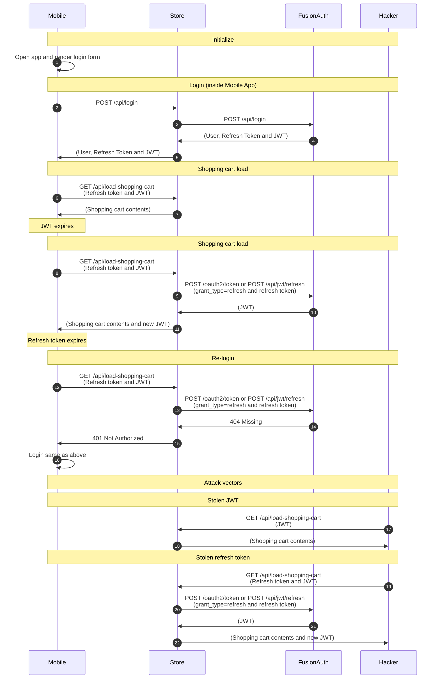

import Legend from "../../../../components/articles/login-authentication-workflows/legend.md";
import OrderedList from "../../../../components/OrderedList.astro";
import NativeIntro from "../../../../components/articles/login-authentication-workflows/mobile/native-intro.md";

<NativeIntro/>

## Diagram

<Legend/>

## Explanation

1. The user opens the application. The application initializes itself and then renders its login form.
1. The user inputs their credentials and clicks the submit button. The application <code>POST</code>s the form data to the application backend.
1. The application backend calls the Login API in FusionAuth by passing in the credentials it received.
1. FusionAuth returns a 200 status code stating that the credentials were okay. It also returns the User object, a JWT and a refresh token in JSON.
1. The User object, JWT and refresh token are sent back to the application.
1. The application requests the user's shopping cart from the application backend and includes the JWT and refresh token.
1. The application backend verifies the JWT and then uses the JWT to identify the user. Once the user is identified, the backend looks up the user's shopping cart from the database (or similar location). Finally, the application backend returns the user's shopping cart contents.
1. A while later, the user's JWT expires and the user clicks on their shopping cart again. The application requests the shopping cart from the application backend and sends the JWT and refresh token to the application backend.
1. The application backend verifies the JWT and realizes it is expired. Since the browser also sent across the refresh token, the application backend calls the JWT refresh API in FusionAuth with the refresh token.
1. FusionAuth looks up the refresh token and returns a new JWT.
1. The application backend responds with the user's shopping cart contents. It also includes the new JWT that replaces the old JWT.
1. A while later, the user's refresh token expires and the user clicks on their shopping cart again. The application requests the shopping cart from the application backend and sends the JWT and refresh token to the application backend.
1. The application backend verifies the JWT and realizes it is expired. Since the application also sent across the refresh token, the application backend calls the JWT refresh API in FusionAuth with the refresh token.
1. Since the refresh token has expired, FusionAuth returns a 404 status code.
1. Since FusionAuth returned a 404 status code, the application backend returns a 401 that indicates the user is no longer logged in.
1. At this point, the application can allow the user to log in the same way they did above.
1. This is an attack vector where the attacker has stolen the user's refresh token. Here, the attacker requests the user's shopping cart with the stolen refresh token and an invalid JWT.
1. The application backend verifies the JWT and realizes it is invalid. Since the attacker also sent across the refresh token, the application backend calls the JWT refresh API in FusionAuth with the refresh token.
1. FusionAuth looks up the refresh token and returns a new JWT.
1. The application backend uses the JWT to look up the user's shopping cart. It responds to the attacker with the user's shopping cart. It also includes the new JWT that attacker can now use.
1. This is an attack vector where the attacker has stolen the user's JWT. Here, the attacker requests the user's shopping cart with the stolen JWT.
1. The application backend verifies the JWT and then uses the JWT to identify the user. Once the user is identified, the backend looks up the user's shopping cart from the database (or similar location). Finally, the application backend returns the user's shopping cart to the attacker.

## Security considerations

This workflow is a secure methods of authenticating users. It uses a JWT and refresh token that are securely store on the mobile device. One downside is that the application backend receives passwords from the browser. While this isn't an issue if TLS is used and the passwords are not stored by the application backend, developers that do not want to be part of the password chain of responsibility should consider other workflows.

## APIs used

Here are the FusionAuth APIs used in this example:

* [/api/login](/docs/apis/login#authenticate-a-user)
* [/api/jwt/refresh](/docs/apis/jwt#refresh-a-jwt)
* [/oauth2/token](/docs/lifecycle/authenticate-users/oauth/endpoints#refresh-token-grant-request)
