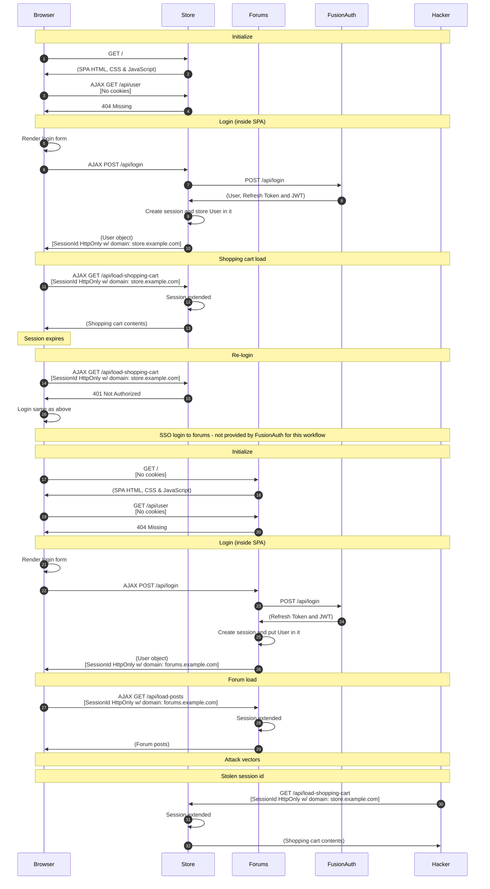

import Legend from "../../../../components/articles/login-authentication-workflows/legend.md";
import OrderedList from "../../../../components/OrderedList.astro";
import Intro from "../../../../components/articles/login-authentication-workflows/spa/native-intro.md";
import Step1 from "../../../../components/articles/login-authentication-workflows/spa/shopping-cart-initialize.astro"
import Step2 from "../../../../components/articles/login-authentication-workflows/spa/check-user.astro"
import Step3 from "../../../../components/articles/login-authentication-workflows/spa/render-login-form.astro"
import Step4 from "../../../../components/articles/login-authentication-workflows/spa/call-backend-login-api.astro"
import Step5 from "../../../../components/articles/login-authentication-workflows/spa/create-session.astro"
import Step6 from "../../../../components/articles/login-authentication-workflows/spa/shopping-cart-session-response.astro"
import Step7 from "../../../../components/articles/login-authentication-workflows/spa/shopping-cart-session-load.astro"
import Step8 from "../../../../components/articles/login-authentication-workflows/spa/shopping-cart-session-relogin.astro"
import Step9 from "../../../../components/articles/login-authentication-workflows/spa/forums-initialize-no-sso.astro"
import Step10 from "../../../../components/articles/login-authentication-workflows/spa/check-user.astro"
import Step11 from "../../../../components/articles/login-authentication-workflows/spa/render-login-form.astro"
import Step12 from "../../../../components/articles/login-authentication-workflows/spa/call-backend-login-api.astro"
import Step13 from "../../../../components/articles/login-authentication-workflows/spa/create-session.astro"
import Step14 from "../../../../components/articles/login-authentication-workflows/spa/forums-session-response.astro"
import Step15 from "../../../../components/articles/login-authentication-workflows/spa/forums-session-load.astro"
import Step16 from "../../../../components/articles/login-authentication-workflows/spa/stolen-session-id.astro"

<Intro/>

## Diagram

<Legend/>

## Explanation

<OrderedList>
  <Step1/>
  <Step2/>
  <Step3/>
  <Step4/>
  <Step5/>
  <Step6/>
  <Step7/>
  <Step8/>
  <Step9/>
  <Step10/>
  <Step11/>
  <Step12/>
  <Step13/>
  <Step14/>
  <Step15/>
  <Step16/>
</OrderedList>

## Security considerations

This workflow example is one of the more secure methods of authenticating users. One downside is that the application backend receives passwords from the browser. While this isn't an issue if TLS is used and the passwords are not stored by the application backend, developers that do not want to be part of the password chain of responsibility should consider other workflows.

Additionally, this workflow requires that the user login each time their session expires. If this is the preferred behavior, than this workflow might be a good fit.

## APIs used

Here are the FusionAuth APIs used in this example:

* [/api/login](/docs/apis/login#authenticate-a-user)
