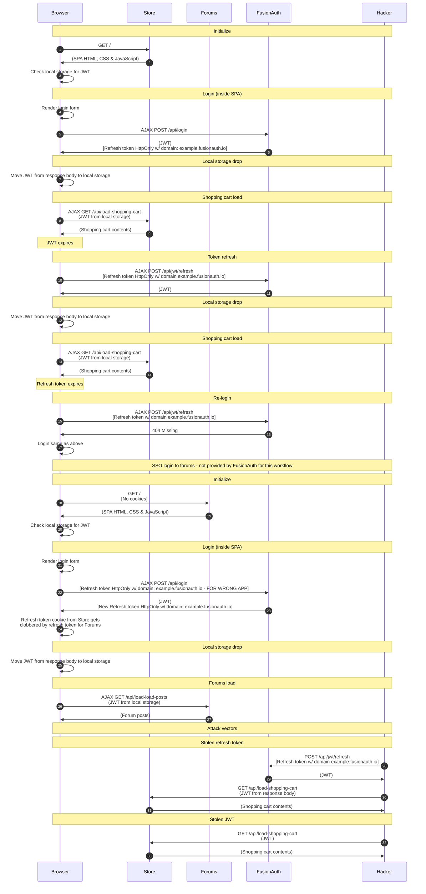

import Legend from "../../../../components/articles/login-authentication-workflows/legend.md";
import OrderedList from "../../../../components/OrderedList.astro";
import Intro from "../../../../components/articles/login-authentication-workflows/spa/native-intro.md";
import Step1 from "../../../../components/articles/login-authentication-workflows/spa/shopping-cart-initialize.astro";
import Step2 from "../../../../components/articles/login-authentication-workflows/spa/check-local-storage.astro";
import Step3 from "../../../../components/articles/login-authentication-workflows/spa/render-login-form.astro";
import Step4 from "../../../../components/articles/login-authentication-workflows/spa/call-fusionauth-login-api.astro";
import Step5 from "../../../../components/articles/login-authentication-workflows/spa/move-jwt-from-response-to-local-storage.astro";
import Step6 from "../../../../components/articles/login-authentication-workflows/spa/shopping-cart-jwt-local-storage-load.astro";
import Step7 from "../../../../components/articles/login-authentication-workflows/spa/move-jwt-from-response-to-local-storage.astro";
import Step8 from "../../../../components/articles/login-authentication-workflows/spa/shopping-cart-jwt-local-storage-load.astro";
import Step9 from "../../../../components/articles/login-authentication-workflows/spa/relogin.astro";
import Step10 from "../../../../components/articles/login-authentication-workflows/spa/forums-initialize-no-sso.astro";
import Step11 from "../../../../components/articles/login-authentication-workflows/spa/check-local-storage.astro";
import Step12 from "../../../../components/articles/login-authentication-workflows/spa/render-login-form.astro";
import Step13 from "../../../../components/articles/login-authentication-workflows/spa/call-fusionauth-login-api-overwrite-store-cookie.astro";
import Step14 from "../../../../components/articles/login-authentication-workflows/spa/move-jwt-from-response-to-local-storage.astro";
import Step15 from "../../../../components/articles/login-authentication-workflows/spa/forums-jwt-local-storage-load.astro";
import Step16 from "../../../../components/articles/login-authentication-workflows/spa/stolen-refresh-token-direct-to-fusionauth.astro";
import Step17 from "../../../../components/articles/login-authentication-workflows/spa/stolen-jwt-refresh-jwt.astro";

<Intro/>

## Diagram

<Legend/>

## Explanation

<OrderedList>
  <Step1/>
  <Step2/>
  <Step3/>
  <Step4/>
  <Step5/>
  <Step6/>

  
  <li>A while later, the user's JWT expires and the user clicks on their shopping cart again. The browser recognizes that the JWT has expired and makes a request directly to the JWT refresh API in FusionAuth. This request includes the refresh token cookie</li>
  <li>FusionAuth looks up the refresh token and returns a new JWT</li>

  <Step7/>
  <Step8/>

  <li>A while later, the user's refresh token expires and the user clicks on their shopping cart again. The browser recognizes that the JWT has expired and makes a request directly to the JWT refresh API in FusionAuth. This request includes the refresh token cookie</li>
  <li>Since the refresh token has expired, FusionAuth returns a 404 status code</li>

  <Step9/>
  <Step10/>
  <Step11/>
  <Step12/>
  <Step13/>
  <Step14/>
  <Step15/>
  <Step16/>
  <Step17/>
</OrderedList>

## Security considerations

This workflow is less secure than other workflows because it is storing the user's JWT in local storage. While local storage provides convenient storage for single-page applications, any JavaScript running on the page has access to it. If an attacker can inject JavaScript into the page, they can begin stealing user's tokens (JWTs and refresh tokens). The attacker might introduce JavaScript into an open source project through obfuscated code or through a backend exploit of some kind. Many platforms like Wordpress also allow plugins to add JavaScript includes to websites as well. Therefore, ensuring that your JavaScript is secure can be extremely difficult.

This workflow might still be a good solution for some applications. Developers should just weigh the risks associated with local storage of JWTs versus the other workflows we have documented.

## APIs used

Here are the FusionAuth APIs used in this example:

* [/api/login](/docs/apis/login#authenticate-a-user)
* [/api/jwt/refresh](/docs/apis/jwt#refresh-a-jwt)
* [/oauth2/token](/docs/lifecycle/authenticate-users/oauth/endpoints#refresh-token-grant-request)
