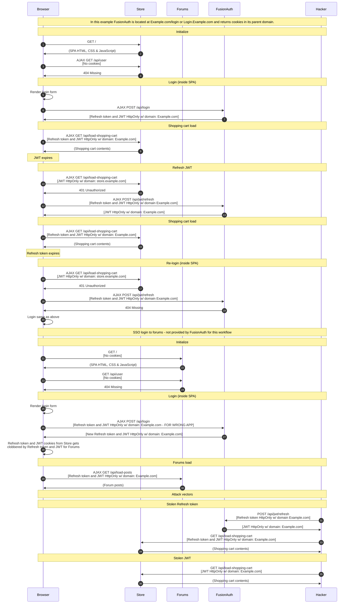

import Legend from "../../../../components/articles/login-authentication-workflows/legend.md";
import OrderedList from "../../../../components/OrderedList.astro";
import Intro from "../../../../components/articles/login-authentication-workflows/spa/native-intro.md";
import Step1 from "../../../../components/articles/login-authentication-workflows/spa/shopping-cart-initialize.astro";
import Step2 from "../../../../components/articles/login-authentication-workflows/spa/check-user.astro";
import Step3 from "../../../../components/articles/login-authentication-workflows/spa/render-login-form.astro";
import Step4 from "../../../../components/articles/login-authentication-workflows/spa/call-fusionauth-login-api-cookies.astro";
import Step5 from "../../../../components/articles/login-authentication-workflows/spa/shopping-cart-refresh-jwt-load.astro";
import Step6 from "../../../../components/articles/login-authentication-workflows/spa/shopping-cart-jwt-expired.astro";
import Step7 from "../../../../components/articles/login-authentication-workflows/spa/call-fusionauth-refresh-api.astro";
import Step8 from "../../../../components/articles/login-authentication-workflows/spa/shopping-cart-refresh-jwt-load.astro";
import Step9 from "../../../../components/articles/login-authentication-workflows/spa/shopping-cart-jwt-expired.astro";
import Step10 from "../../../../components/articles/login-authentication-workflows/spa/call-fusionauth-refresh-api-invalid.astro";
import Step11 from "../../../../components/articles/login-authentication-workflows/spa/relogin.astro";
import Step12 from "../../../../components/articles/login-authentication-workflows/spa/forums-initialize-no-sso.astro";
import Step13 from "../../../../components/articles/login-authentication-workflows/spa/check-user.astro";
import Step14 from "../../../../components/articles/login-authentication-workflows/spa/render-login-form.astro";
import Step15 from "../../../../components/articles/login-authentication-workflows/spa/call-fusionauth-login-api-cookies-overwrite-store-cookie.astro";
import Step16 from "../../../../components/articles/login-authentication-workflows/spa/forums-refresh-jwt-load.astro";
import Step17 from "../../../../components/articles/login-authentication-workflows/spa/stolen-refresh-token-direct-to-fusionauth.astro";
import Step18 from "../../../../components/articles/login-authentication-workflows/spa/stolen-jwt-refresh-jwt.astro";

<Intro/>

## Diagram

<Legend/>

## Explanation

<OrderedList>
  <Step1/>
  <Step2/>
  <Step3/>
  <Step4/>
  <Step5/>
  <Step6/>
  <Step7/>
  <Step8/>
  <Step9/>
  <Step10/>
  <Step11/>
  <Step12/>
  <Step13/>
  <Step14/>
  <Step15/>
  <Step16/>
  <Step17/>
  <Step18/>
</OrderedList>

## Security considerations

This workflow is more secure than the other workflows that call FusionAuth directly because the JWT and refresh token are both stored in HttpOnly cookies. The downside of this workflow is that there are no built in SSO capabilities provided by FusionAuth. It forces the developer to build out an SSO solution themselves.

Additionally, this workflow requires that FusionAuth be deployed at the top-level domain for the entire organization or that a proxy be used to rewrite the cookies that FusionAuth sends back as part of the Login API so that they are in the correct domain.  

## APIs used

Here are the FusionAuth APIs used in this example:

* [/api/login](/docs/apis/login#authenticate-a-user)
* [/api/jwt/refresh](/docs/apis/jwt#refresh-a-jwt)
* [/oauth2/token](/docs/lifecycle/authenticate-users/oauth/endpoints#refresh-token-grant-request)
