import Legend from "../../../../components/articles/login-authentication-workflows/legend.md";
import OrderedList from "../../../../components/OrderedList.astro";
import Intro from "../../../../components/articles/login-authentication-workflows/spa/oauth-intro.md";
import Step1 from "../../../../components/articles/login-authentication-workflows/spa/oauth-login-store.astro";
import Step2 from "../../../../components/articles/login-authentication-workflows/spa/create-session.astro";
import Step3 from "../../../../components/articles/login-authentication-workflows/spa/shopping-cart-session-refresh-response-oauth.astro";
import Step4 from "../../../../components/articles/login-authentication-workflows/spa/shopping-cart-session-refresh-load.astro";
import Step5 from "../../../../components/articles/login-authentication-workflows/spa/shopping-cart-session-refresh-refresh.astro";
import Step6 from "../../../../components/articles/login-authentication-workflows/spa/shopping-cart-session-refresh-relogin.astro";
import Step7 from "../../../../components/articles/login-authentication-workflows/spa/oauth-login-forums.astro";
import Step8 from "../../../../components/articles/login-authentication-workflows/spa/create-session.astro";
import Step9 from "../../../../components/articles/login-authentication-workflows/spa/forums-session-refresh-response-oauth.astro";
import Step10 from "../../../../components/articles/login-authentication-workflows/spa/forums-session-refresh-load.astro";
import Step11 from "../../../../components/articles/login-authentication-workflows/spa/stolen-session-refresh-token.astro";
import Step12 from "../../../../components/articles/login-authentication-workflows/spa/stolen-session-id.astro";

<Intro/>

## Diagram

```mermaid errorBoxes={[17, 19]} warningBoxes={[25]} infoBoxes={[21]}
sequenceDiagram
  autonumber
  participant Browser
  participant Store
  participant Forums
  participant FusionAuth
  participant Hacker
  Note over Browser,Hacker: Initialize
  autonumber
  Browser->>Store: GET /
  Store->>Browser: (SPA HTML, CSS & JavaScript)
  Browser->>Store: AJAX GET /api/user<br/>[No cookies]
  Store->>Browser: 404 Missing

  Note over Browser,Hacker: Login (browser navigates away from SPA)
  Browser->>FusionAuth: GET /oauth2/authorize {response_type=code}
  FusionAuth->>Browser: (Login form HTML)
  Browser->>FusionAuth: POST /oauth2/authorize<br/>(response_type=code)
  FusionAuth->>Browser: 302 Location: {redirect_uri w/ code}<br/>[SessionId HttpOnly w/ domain: example.fusionauth.io]
  Browser->>Store: GET {redirect_uri w/ code}
  Store->>FusionAuth: POST /oauth2/token<br/>(code, client_secret)
  FusionAuth->>Store: 200 Ok<br/>(Refresh token and JWT)
  Store->>Store: Create new session
  Store->>Browser: 302 Location: /<br/>[SessionId and Refresh token HttpOnly w/ domain: store.example.com]
  Browser->>Store: GET /
  Store->>Browser: (SPA HTML, CSS & JavaScript)
  Browser->>Store: AJAX GET /api/user<br/>[SessionId and Refresh token HttpOnly w/ domain: store.example.com]
  Store->>Browser: 200 Ok<br/>(User)

  Note over Browser,Hacker: Shopping cart load
  Browser->>Store: AJAX GET /api/load-shopping-cart<br/>[SessionId and Refresh token HttpOnly w/ domain: store.example.com]
  Store->>Store: Session extended
  Store->>Browser: (Shopping cart contents)

  Note over Browser: Session expires<br/>Refresh token still valid
  
  Note over Browser,Hacker: Shopping cart load
  Browser->>Store: AJAX GET /api/load-shopping-cart<br/>[SessionId and Refresh token HttpOnly w/ domain: store.example.com]
  Store->>FusionAuth: POST /oauth2/token or POST /api/jwt/refresh<br/>(grant_type=refresh and refresh token)
  FusionAuth->>Store: (JWT)
  Store->>Store: Create new session
  Store->>Browser: (Shopping cart contents)<br/>[New SessionId HttpOnly w/ domain: store.example.com]

  Note over Browser: Session expires<br/>Refresh token expires
  
  Note over Browser,Hacker: Re-login
  Browser->>Store: AJAX GET /api/load-shopping-cart<br/>[SessionId and Refresh token HttpOnly w/ domain: store.example.com]
  Store->>FusionAuth: POST /oauth2/token or POST /api/jwt/refresh<br/>(grant_type=refresh and refresh token)
  FusionAuth->>Store: 404 Missing
  Store->>Browser: 401 Not Authorized
  Browser->>Browser: Login same as above

  Note over Browser,Hacker: SSO login to forums

  Note over Browser,Hacker: Initialize
  Browser->>Forums: GET /<br/>[No cookies]
  Forums->>Browser: (SPA HTML, CSS & JavaScript)
  Browser->>Forums: GET /api/user<br/>[No cookies]
  Forums->>Browser: 404 Missing
  
  Note over Browser,Hacker: Login (browser navigates away from SPA but auto-logs-in since the session exists)
  Browser->>FusionAuth: GET /oauth2/authorize {response_type=code}<br/>[SessionId HttpOnly w/ domain: example.fusionauth.io]
  FusionAuth->>Browser: 302 Location: {redirect_uri w/ code}<br/>[SessionId HttpOnly w/ domain: example.fusionauth.io]
  Browser->>Forums: GET {redirect_uri w/ code}
  Forums->>FusionAuth: POST /oauth2/token<br/>(code, client_secret)
  FusionAuth->>Forums: 200 Ok<br/>(Refresh token and JWT)
  Forums->>Forums: Create session and store User in it
  Forums->>Browser: 302 Location: /<br/>[SessionId HttpOnly w/ domain: store.example.com]
  Browser->>Forums: GET /
  Forums->>Browser: (SPA HTML, CSS & JavaScript)
  Browser->>Forums: AJAX GET /api/user<br/>[SessionId HttpOnly w/ domain: store.example.com]
  Forums->>Browser: 200 Ok<br/>(User)

  Note over Browser,Hacker: Forum load
  Browser->>Forums: AJAX GET /api/load-posts<br/>[SessionId and Refresh token HttpOnly w/ domain: forums.example.com]
  Forums->>Forums: Session extended
  Forums->>Browser: (Forum posts)

  Note over Browser,Hacker: Attack vectors

  Note over Browser,Hacker: Stolen refresh token
  Hacker->>Store: GET /shopping-cart<br/>[Refresh token and bad session id HttpOnly w/ domain: store.example.com]
  Store->>FusionAuth: POST /oauth2/token or POST /api/jwt/refresh<br/>(grant_type=refresh and refresh token)
  FusionAuth->>Store: (JWT)
  Store->>Store: Create session and store User in
  Store->>Hacker: (Shopping cart contents)<br/>[New session id HttpOnly w/ domain: store.example.com]

  Note over Browser,Hacker: Stolen session id
  Hacker->>Store: GET /api/load-shopping-cart<br/>[SessionId HttpOnly w/ domain: store.example.com]
  Store->>Store: Session extended
  Store->>Hacker: (Shopping cart contents)
```

<Legend/>

## Explanation

<OrderedList>
  <Step1/>
  <Step2/>
  <Step3/>
  <Step4/>
  <Step5/>
  <Step6/>
  <Step7/>
  <Step8/>
  <Step9/>
  <Step10/>
  <Step11/>
  <Step12/>
</OrderedList>

## Security considerations

This is one the safest and most feature rich login workflow in FusionAuth. It has the benefit that passwords are only provided directly to FusionAuth. It also has the benefit of full SSO capabilities when the user is automatically logged into the forum application by FusionAuth. Also, the session and refresh tokens are HttpOnly cookies that are domain locked to the application backend that needs them. Plus, the User object (or JWT) is secured on the server inside a server-side session.

## APIs used

Here are the FusionAuth APIs used in this example:

* [/oauth2/authorize](/docs/lifecycle/authenticate-users/oauth/endpoints#authorize)
* [/api/jwt/refresh](/docs/apis/jwt#refresh-a-jwt)
* [/oauth2/token](/docs/lifecycle/authenticate-users/oauth/endpoints#refresh-token-grant-request)
