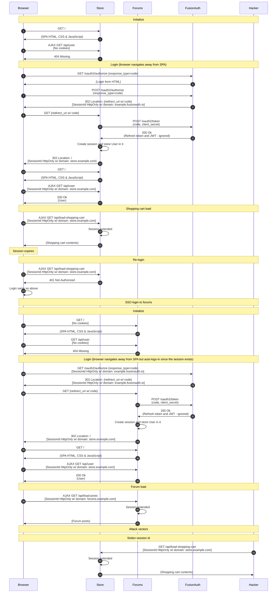

import Legend from "../../../../components/articles/login-authentication-workflows/legend.md";
import OrderedList from "../../../../components/OrderedList.astro";
import Intro from "../../../../components/articles/login-authentication-workflows/spa/oauth-intro.md";
import Step1 from "../../../../components/articles/login-authentication-workflows/spa/oauth-login-store.astro";
import Step2 from "../../../../components/articles/login-authentication-workflows/spa/create-session.astro";
import Step3 from "../../../../components/articles/login-authentication-workflows/spa/shopping-cart-session-response-oauth.astro";
import Step4 from "../../../../components/articles/login-authentication-workflows/spa/shopping-cart-session-load.astro";
import Step5 from "../../../../components/articles/login-authentication-workflows/spa/shopping-cart-session-relogin.astro";
import Step6 from "../../../../components/articles/login-authentication-workflows/spa/oauth-login-forums.astro";
import Step7 from "../../../../components/articles/login-authentication-workflows/spa/create-session.astro";
import Step8 from "../../../../components/articles/login-authentication-workflows/spa/forums-session-response-oauth.astro";
import Step9 from "../../../../components/articles/login-authentication-workflows/spa/forums-session-load.astro";
import Step10 from "../../../../components/articles/login-authentication-workflows/spa/stolen-session-id.astro";

<Intro/>

## Diagram

<Legend/>

## Explanation

<OrderedList>
  <Step1/>
  <Step2/>
  <Step3/>
  <Step4/>
  <Step5/>
  <Step6/>
  <Step7/>
  <Step8/>
  <Step9/>
  <Step10/>
</OrderedList>

## Security considerations

This a safe and feature rich login workflow in FusionAuth. It has the benefit that passwords are only provided directly to FusionAuth. It also has the benefit of full SSO capabilities when the user is automatically logged into the forum application by FusionAuth. The downside of this workflow is that the sessions might be shorter lived than refresh tokens, forcing the user to login more regularly. If this is the preferred behavior, than this workflow might be the best fit.  

## APIs used

Here are the FusionAuth APIs used in this example:

* [/oauth2/authorize](/docs/lifecycle/authenticate-users/oauth/endpoints#authorize)
