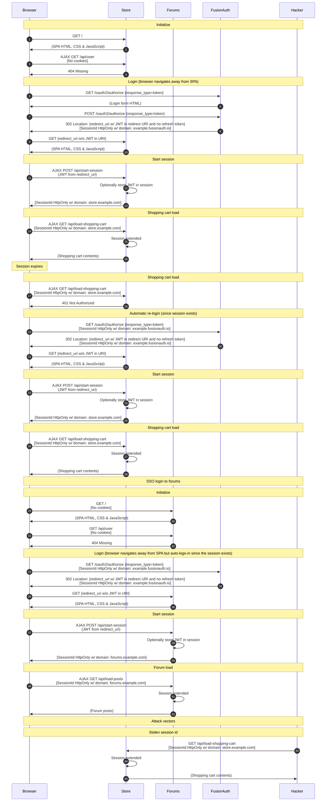

import Legend from "../../../../components/articles/login-authentication-workflows/legend.md";
import OrderedList from "../../../../components/OrderedList.astro";
import Intro from "../../../../components/articles/login-authentication-workflows/spa/oauth-intro.md";
import Step1 from "../../../../components/articles/login-authentication-workflows/spa/shopping-cart-initialize.astro";
import Step2 from "../../../../components/articles/login-authentication-workflows/spa/check-user.astro";
import Step3 from "../../../../components/articles/login-authentication-workflows/spa/oauth-implicit-login-store.astro";
import Step4 from "../../../../components/articles/login-authentication-workflows/spa/create-session-from-jwt.astro";
import Step5 from "../../../../components/articles/login-authentication-workflows/spa/shopping-cart-session-load.astro";
import Step6 from "../../../../components/articles/login-authentication-workflows/spa/shopping-cart-session-expired.astro";
import Step7 from "../../../../components/articles/login-authentication-workflows/spa/oauth-implicit-relogin.astro";
import Step8 from "../../../../components/articles/login-authentication-workflows/spa/create-session-from-jwt.astro";
import Step9 from "../../../../components/articles/login-authentication-workflows/spa/shopping-cart-session-load.astro";
import Step10 from "../../../../components/articles/login-authentication-workflows/spa/forums-initialize-sso.astro";
import Step11 from "../../../../components/articles/login-authentication-workflows/spa/check-user.astro";
import Step12 from "../../../../components/articles/login-authentication-workflows/spa/oauth-implicit-relogin.astro";
import Step13 from "../../../../components/articles/login-authentication-workflows/spa/create-session-from-jwt.astro";
import Step14 from "../../../../components/articles/login-authentication-workflows/spa/forums-session-load.astro";
import Step15 from "../../../../components/articles/login-authentication-workflows/spa/stolen-session-id.astro";

<Intro/>

## Diagram

<Legend/>

## Explanation

<OrderedList>
  <Step1/>
  <Step2/>
  <Step3/>
  <Step4/>
  <Step5/>
  <Step6/>
  <Step7/>
  <Step8/>
  <Step9/>
  <Step10/>
  <Step11/>
  <Step12/>
  <Step13/>
  <Step14/>
  <Step15/>
</OrderedList>

## Security considerations

This workflow is less secure than other workflows because the JWT is available to JavaScript during the start session process. While this is a small window of time, it is still possible that malicious JavaScript running in the application could gain access to the JWT. If an attacker can inject JavaScript into the page, they can begin stealing user's JWTs. The attacker might introduce JavaScript into an open source project through obfuscated code or through a backend exploit of some kind. Many platforms like Wordpress also allow plugins to add JavaScript includes to websites as well. Therefore, ensuring that your JavaScript is secure can be extremely difficult.

This workflow might still be a good solution for some applications. Developers should just weigh the risks associated with JWTs accessible to JavaScript versus the other workflows we have documented.

Additionally, since this workflow does not use refresh tokens (and cannot use refresh tokens according to the specification). Therefore, when the user's session expires, they will need to log into the application again. This could be an automatic login, but it still requires the browser to take the user to the FusionAuth OAuth interface.

## APIs used

Here are the FusionAuth APIs used in this example:

* [/oauth2/authorize](/docs/lifecycle/authenticate-users/oauth/endpoints#authorize)
