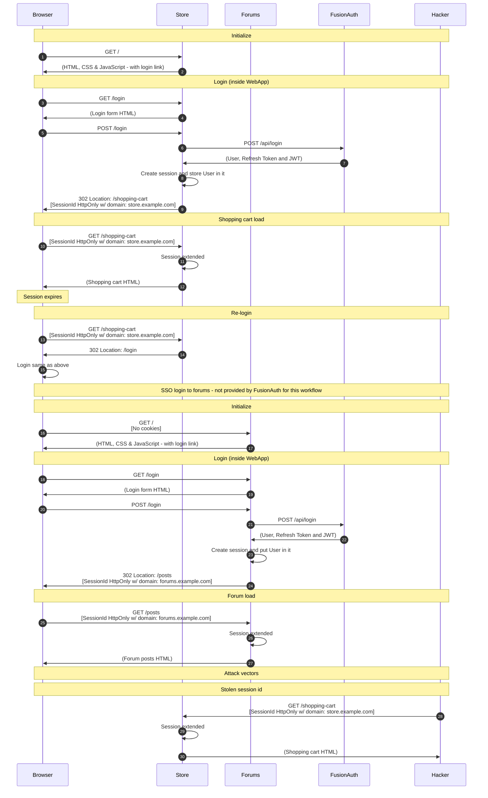

import Legend from 'src/content/articles/login-authentication-workflows/_shared/_legend.md';
import Intro from 'src/content/articles/login-authentication-workflows/_shared/webapp/_native-intro.md';
import Step1 from 'src/content/articles/login-authentication-workflows/_shared/webapp/_native-login-store.mdx';
import Step2 from 'src/content/articles/login-authentication-workflows/_shared/webapp/_create-session.mdx';
import Step3 from 'src/content/articles/login-authentication-workflows/_shared/webapp/_shopping-cart-session-redirect.mdx';
import Step4 from 'src/content/articles/login-authentication-workflows/_shared/webapp/_shopping-cart-session-load.mdx';
import Step5 from 'src/content/articles/login-authentication-workflows/_shared/webapp/_shopping-cart-session-relogin.mdx';
import Step6 from 'src/content/articles/login-authentication-workflows/_shared/webapp/_native-login-forums.mdx';
import Step7 from 'src/content/articles/login-authentication-workflows/_shared/webapp/_create-session.mdx';
import Step8 from 'src/content/articles/login-authentication-workflows/_shared/webapp/_forums-session-redirect.mdx';
import Step9 from 'src/content/articles/login-authentication-workflows/_shared/webapp/_forums-session-load.mdx';
import Step10 from 'src/content/articles/login-authentication-workflows/_shared/webapp/_stolen-session-id.mdx';

<Intro/>

## Diagram

<Legend/>

```mermaid errorBoxes={[17]} warningBoxes={[19, 23]}
sequenceDiagram
  autonumber
  participant Browser
  participant Store
  participant Forums
  participant FusionAuth
  participant Hacker
  Note over Browser,Hacker: Initialize
  Browser->>Store: GET /
  Store->>Browser: (HTML, CSS & JavaScript - with login link)

  Note over Browser,Hacker: Login (inside WebApp)
  Browser->>Store: GET /login
  Store->>Browser: (Login form HTML)
  Browser->>Store: POST /login
  Store->>FusionAuth: POST /api/login
  FusionAuth->>Store: (User, Refresh Token and JWT)
  Store->>Store: Create session and store User in it
  Store->>Browser: 302 Location: /shopping-cart<br/>[SessionId HttpOnly w/ domain: store.example.com]

  Note over Browser,Hacker: Shopping cart load
  Browser->>Store: GET /shopping-cart<br/>[SessionId HttpOnly w/ domain: store.example.com]
  Store->>Store: Session extended
  Store->>Browser: (Shopping cart HTML)

  Note over Browser: Session expires
  
  Note over Browser,Hacker: Re-login
  Browser->>Store: GET /shopping-cart<br/>[SessionId HttpOnly w/ domain: store.example.com]
  Store->>Browser: 302 Location: /login
  Browser->>Browser: Login same as above

  Note over Browser,Hacker: SSO login to forums - not provided by FusionAuth for this workflow

  Note over Browser,Hacker: Initialize
  Browser->>Forums: GET /<br/>[No cookies]
  Forums->>Browser: (HTML, CSS & JavaScript - with login link)

  Note over Browser,Hacker: Login (inside WebApp)
  Browser->>Forums: GET /login
  Forums->>Browser: (Login form HTML)
  Browser->>Forums: POST /login
  Forums->>FusionAuth: POST /api/login
  FusionAuth->>Forums: (User, Refresh Token and JWT)
  Forums->>Forums: Create session and put User in it
  Forums->>Browser: 302 Location: /posts<br/>[SessionId HttpOnly w/ domain: forums.example.com]

  Note over Browser,Hacker: Forum load
  Browser->>Forums: GET /posts<br/>[SessionId HttpOnly w/ domain: forums.example.com]
  Forums->>Forums: Session extended
  Forums->>Browser: (Forum posts HTML)

  Note over Browser,Hacker: Attack vectors

  Note over Browser,Hacker: Stolen session id
  Hacker->>Store: GET /shopping-cart<br/>[SessionId HttpOnly w/ domain: store.example.com]
  Store->>Store: Session extended
  Store->>Hacker: (Shopping cart HTML)
```

## Explanation

<Steps>
  <Step1/>
  <Step2/>
  <Step3/>
  <Step4/>
  <Step5/>
  <Step6/>
  <Step7/>
  <Step8/>
  <Step9/>
  <Step10/>
</Steps>

## Security considerations

This workflow is one of the more secure methods of authenticating users. One downside is that the application backend receives passwords from the browser. While this isn't an issue if TLS is used and the passwords are not stored by the application backend, developers that do not want to be part of the password chain of responsibility should consider other workflows.

## APIs used

Here are the FusionAuth APIs used in this example:

* [/api/login](/docs/apis/login/authenticate)
