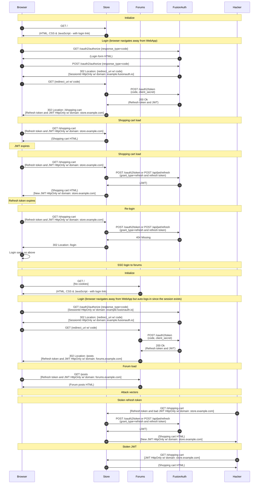

import Legend from "../../../../components/articles/login-authentication-workflows/legend.md";
import OrderedList from "../../../../components/OrderedList.astro";
import Intro from "../../../../components/articles/login-authentication-workflows/webapp/oauth-intro.md";
import Step1 from "../../../../components/articles/login-authentication-workflows/webapp/oauth-login-store.astro";
import Step2 from "../../../../components/articles/login-authentication-workflows/webapp/shopping-cart-refresh-jwt-redirect.astro";
import Step3 from "../../../../components/articles/login-authentication-workflows/webapp/shopping-cart-refresh-jwt-load.astro";
import Step4 from "../../../../components/articles/login-authentication-workflows/webapp/shopping-cart-refresh-jwt-refresh.astro";
import Step5 from "../../../../components/articles/login-authentication-workflows/webapp/shopping-cart-refresh-jwt-relogin.astro";
import Step6 from "../../../../components/articles/login-authentication-workflows/webapp/oauth-login-forums.astro";
import Step7 from "../../../../components/articles/login-authentication-workflows/webapp/forums-refresh-jwt-redirect.astro";
import Step8 from "../../../../components/articles/login-authentication-workflows/webapp/forums-refresh-jwt-load.astro";
import Step9 from "../../../../components/articles/login-authentication-workflows/webapp/stolen-refresh-token-refresh-jwt.astro";
import Step10 from "../../../../components/articles/login-authentication-workflows/webapp/stolen-jwt-refresh-jwt.astro";

<Intro/>

## Diagram

<Legend/>

## Explanation

<OrderedList>
  <Step1/>
  <Step2/>
  <Step3/>
  <Step4/>
  <Step5/>
  <Step6/>
  <Step7/>
  <Step8/>
  <Step9/>
  <Step10/>
</OrderedList>

## Security considerations

This is one of the safest and most feature rich login workflow in FusionAuth. It has the benefit that passwords are only ever provided directly to FusionAuth. It also has the benefit of full SSO capabilities when the user is automatically logged into the forum application by FusionAuth. Finally, the JWT and refresh tokens are HttpOnly cookies that are domain locked to the application backend that needs them.

## APIs used

Here are the FusionAuth APIs used in this example:

* [/oauth2/authorize](/docs/lifecycle/authenticate-users/oauth/endpoints#authorize)
* [/oauth2/token](/docs/lifecycle/authenticate-users/oauth/endpoints#refresh-token-grant-request)
* [/api/jwt/refresh](/docs/apis/jwt#refresh-a-jwt)
