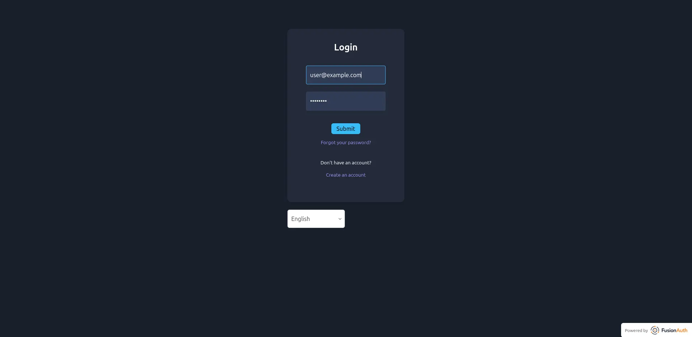
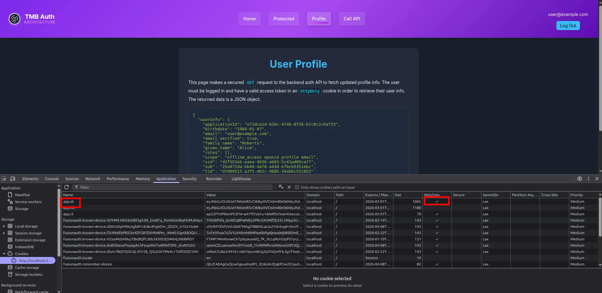

import {RemoteCode} from '@fusionauth/astro-components';
import Aside from 'src/components/Aside.astro';
import Breadcrumb from 'src/components/Breadcrumb.astro';
import InlineField from 'src/components/InlineField.astro';
import InlineUIElement from 'src/components/InlineUIElement.astro';
import PremiumPlanBlurb from 'src/content/docs/_shared/_premium-plan-blurb.astro';

{/* Search for TODO before publishing this, like links. */}

- [Introduction](#introduction)
- [What is a Token-Mediating Backend?](#what-is-a-token-mediating-backend)
- [How secure is a TMB?](#how-secure-is-a-tmb)
	- [Demonstrating Proof of Possession (DPoP)](#demonstrating-proof-of-possession-dpop)
- [When to use a TMB?](#when-to-use-a-tmb)
	- [Latency](#latency)
	- [Infrastructure](#infrastructure)
	- [Skill and time](#skill-and-time)
- [Getting technical: how the TMB flow works](#getting-technical-how-the-tmb-flow-works)
- [See TMB In Action: A Complete Demonstration](#see-tmb-in-action-a-complete-demonstration)
	- [Download And Start FusionAuth](#download-and-start-fusionauth)
	- [Start The Backend App Server](#start-the-backend-app-server)
	- [Start The Frontend](#start-the-frontend)
	- [How it works](#how-it-works)
- [Summary](#summary)
- [Coming Up Next...](#coming-up-next)
- [Links](#links)
- [todo](#todo)


## Introduction

This post discusses the token-mediating backend (TMB) authentication architecture for OAuth 2 apps: how secure it is, when to use it, and how to implement it.

<Aside type="tip">
This is part two of a three part series on OAuth architectures. Please read [part one](/TODO), if you haven't already, so you understand how the BFF architecture works, since TMB is a variation of BFF.
</Aside>

## What is a Token-Mediating Backend?

The TMB is identical to the BFF pattern, except for one big difference: access tokens are stored in the frontend (desktop app, mobile app, or web app) instead of in the backend. (Refresh tokens are still stored on the backend). Since the access token is now available in the browser, the browser can call a resource server directly, instead of having to call the backend and get the backend to call the resource server with the token.

TMB is described in the IETF document on [best practices for OAuth apps](https://datatracker.ietf.org/doc/html/draft-ietf-oauth-browser-based-apps#name-token-mediating-backend).

## How secure is a TMB?

TMB is massively less secure than BFF (since access tokens in the browser are vulnerable to malicious JavaScript packages and cross-site scripting (XSS)), but slightly more secure than serverless web apps (browser-based OAuth clients (BBOC)), which have no secure backend at all.

You can think of the security advantages as: BFF ≫ TMB > BBOC.

TMB has two of the security advantages of BFF:
- Same-site HTTP-only session cookies, as well as PKCE checks and OIDC nonces, prevent CSRF attacks.
- Refresh tokens stay on the server, hidden from attackers.

But TMB has a significant disadvantage. The access token in the browser can't be kept in an HTTP-only cookie, because JavaScript needs to access it to send it in calls to resource servers (which have different URL domains to the authorization server domain).

Since the access token has to be stored in the browser's local storage, it's vulnerable in all the ways discussed in part 1:
- Malicious npm JavaScript packages can access the token.
- Cross-site scripts (e.g. unsanitized HTML from forum posts on your site) can access the token.

A TMB is slightly more secure than a BBOC because of the server-side refresh token — if you follow best practices.

You can set the expiry period of your access tokens to be very short (ten minutes), so that if an attacker does gain access to the token, they can't use it for long. The frontend can silently ask the server for a new access token generated from the server-side refresh token every ten minutes, so the user does not need to log in again. Or, for security-critical apps like banking, you can require the user to log in again every time their access token expires. If you detect unauthorized use of an access token, you can revoke the refresh token and force a user to log in again.

Of course, if an attacker has managed to insert malicious JS into your frontend, they can steal the access tokens again and again, so access token timeouts won't protect you. Mobile and desktop apps are generally safer than web apps because they are less likely to use JavaScript.

For a list of best practices mitigating the danger of client-side token storage, read the recommendations by the the IETF in the [OAuth 2.1 draft](https://datatracker.ietf.org/doc/html/rfc9700/), or this [summary](https://maida.kim/oauth2-best-practices-for-developers) by a FusionAuth developer.

### Demonstrating Proof of Possession (DPoP)

There is one relatively new technology (2023) that makes client-side tokens a lot safer — DPoP, standing for Demonstrating Proof of Possession, and available as IETF [RFC 9449](https://datatracker.ietf.org/doc/rfc9449).

DPoP is complicated enough to warrant an entire article, and the [official site](https://dpop.info) has a great visual walkthrough of the protocol, but the concept is simple enough to understand.

If an OAuth access token is like a door key, which can be stolen, using DPoP is like a door that can be unlocked only with the key and having you sign your signature when trying to enter. An attacker with only the key can't open the door because they can't fake your signature.

How it actually works is the access token is cryptographically bound to the DPoP key at creation, and both must be sent in calls to a resource server. An access token request that isn't signed by the DPoP key will be rejected.

If the attacker can steal the access token in JavaScript, why can't they steal the DPoP key too? The DPoP key is stored using the browser's web cryptography API with [`extractable`](https://developer.mozilla.org/en-US/docs/Web/API/CryptoKey/extractable) set to `false`. This means a request to a resource server can be signed with the DPoP key in the browser, but the key can never leave the browser or be accessed by JS.

An attacker that manages to insert malicious JS into your browser could make calls using both the DPoP key and access code, but if the attacker exfiltrates the access code to their own machine, it's useless without the DPoP key. So DPoP still doesn't make storing tokens in the browser as secure as using a BFF, but completely eliminates one attack type. Once the user closes their browser, all fraudulent requests must pause.

DPoP is not yet supported by FusionAuth, but [requested](https://github.com/FusionAuth/fusionauth-issues/issues/1679).

## When to use a TMB?

Since TMB is much less secure than BFF, there are very few reasons to choose TMB. Below are three.

### Latency

Since TMB allows the browser to call the resource server directly, it avoids the extra time taken to route the call via the app backend. For a general web application, like a bank or forum, this time is irrelevant. But for apps where real-time performance is critical, like games, voice and video chat, or collaborative document editing, this time could create noticeable lag.

### Infrastructure

Hosting a web app with large JavaScript files and images can be costly. You might want to serve your frontend from a cheap static file host, and run only your API on a more expensive cloud server. This is not possible using BFF, because the BFF design requires that the backend lives on the same URL origin as the frontend. TMB doesn't have this constraint, as it is used only for the initial login, not proxying every call to other servers.

### Skill and time

If you are not a professional programmer and can't afford to hire one, you might be making an app by combining various low-code services. If the default architecture of your authentication provider is TMB and not BFF, that's what you're stuck with, and you don't have time to experiment with changing it.

If this is the case, please know that implementing your own BFF server can literally be a single page of JavaScript. FusionAuth has an [example repository demonstrating this](https://github.com/FusionAuth/fusionauth-example-hostedbackend/tree/main/nodeApp) (see the files `app.js` and `authentication.js`) with an [accompanying tutorial](https://fusionauth.io/blog/backend-for-frontend#how-to-create-a-bff-for-a-serverless-app).

Even simpler, if you use FusionAuth (which is free if you host it yourself), you can use the built-in FusionAuth [hosted backend](https://fusionauth.io/docs/apis/hosted-backend). The tutorial mentioned above also includes an example serverless HTML file with [two small JavaScript functions](https://github.com/FusionAuth/fusionauth-example-hostedbackend/blob/main/serverlessApp/index.html) that give you fully secure authentication by connecting to the hosted backed.

## Getting technical: how the TMB flow works

This section explains the TMB OAuth flow in more detail. You can skip it and proceed to the demonstration app in the next section if you don't need to implement or understand the details yourself.

This discussion assumes you're familiar with the BFF flow from part 1 of this series, as only the differences are shown here.


- Explanation the differences with an example login and resource call, include a diagram
- Potential attacks noted

## See TMB In Action: A Complete Demonstration

To help you get started using TMB, you can use a complete FusionAuth demonstration repository. The repository includes a React frontend and a Node.js/Express backend, demonstrating the full TMB pattern with FusionAuth as the authorization server. Of course, you can adapt the backend to any language or framework.

The section allows you to run a simple but functional TMB web app and server with FA to see how it works.

### Download And Start FusionAuth

To follow along, you'll need Git, Node.js, npm, and Docker installed. (For safety, instead of Node, you should also be able to use Deno, or Node in Docker.)

Open a terminal and clone the repository with Git using the commands below.

```sh
git clone https://github.com/kmaida/auth-architecture.git
cd auth-architecture
cp .env.sample .env
```

Next, start the FusionAuth server with Docker.

```sh
docker compose up -d
```

This should download docker images and start FusionAuth on `http://localhost:9011/admin`. You can log in with the default admin credentials provided in the README: `admin@example.com` and `password`.

### Start The Backend App Server

Run the commands below to prepare the backend settings file for editing.

```sh
cd tmb/backend
cp .env.sample .env
```

Open the `tmb/backend/.env` file in a text editor and change the first two lines to match the settings below.

```js
CLIENT_ID="e72dca1d-626c-4f4b-8f36-b7c8c2c0af33"
CLIENT_SECRET="TC3Kmq9yNgudIHl8BKLJXJFAhd8AmzfTwjJSqAFJJ-k"
```

Start the server with the command below.

```sh
npm install
npm run dev
```

{/*
Command if you're testing in Docker:

docker run --init -it --rm -v ".:/app" -w "/app" --network=host node:24.0.1-alpine3.21 sh -c "npm install; npm run dev";

*/}

The backend is now running at http://localhost:4001, but does not provide a website. It is only an API.

### Start The Frontend

In a new terminal in the repository directory, run the commands below to prepare the frontend settings file.

```sh
cd tmb/frontend
cp .env.sample .env
```

Start the server with the command below.

```sh
npm install
npm run dev
```

{/*
Command if you're testing in Docker:

docker run --init  -it --rm -v ".:/app" -w "/app" --network host  node:24.0.1-alpine3.21 sh -c  "npm install; npm run dev";
*/}

Browse to the frontend at http://localhost:5173.


Click the log in button at the top right and log in with the test user `user@example.com` with password `password`.



Once logged in, you can browse to private pages on the site. You can also see that all the FusionAuth authentication cookies are set as `HttpOnly`, so they can't be stolen. The access token is stored in application memory, where there is less chance of theft than being kept in browser storage, which malicious JavaScript might steal by default.



### How it works
- Briefly describe what's in each file

## Summary

The recommendation of this article, and the whole series, is to use BFF for authentication and authorization as it is far more secure than TMB and BBOC. The only time you can justify not using a secure backend is if your app needs near real-time speed or if you have an insurmountable infrastructure constraint.

If your authentication provider doesn't support BFF, you can implement one using FusionAuth for free, either as the identity provider itself or merely the gateway that securely proxies authentication. See the [tutorial](https://fusionauth.io/blog/backend-for-frontend#use-a-premade-bff) to learn how.

## Coming Up Next...

The final post in this series discusses the third and least secure OAuth architecture: BBOC. You'll learn how it works and the rare cases when you might choose it.

## Links

- niel bff article - https://github.com/FusionAuth/fusionauth-site/pull/3942
- my old article with diagrams to reuse - https://fusionauth.io/blog/backend-for-frontend
- my old repo - github.com/fusionauth/fusionauth-example-hostedbackend
- kim talk - https://drive.google.com/file/d/1B40E5zmVHaGfE9kEMAbOWRy3YS2D2EcC/view?pli=1
- kim's 3 part brief - https://docs.google.com/document/d/1FZzTzodOd9YQOCVKhi4V46LiUPbRvnsy2XQ5dTC0mg0/edit?tab=t.0
- kim repo - https://github.com/kmaida/auth-architecture
- kim article on oauth best practices - https://maida.kim/oauth2-best-practices-for-developers/
- kim's outline feedback - https://github.com/FusionAuth/fusionauth-site/pull/3949/files
- IETF document on [best practices for OAuth apps](https://datatracker.ietf.org/doc/html/draft-ietf-oauth-browser-based-apps#name-token-mediating-backend)
- [OAuth 2.1 draft](https://datatracker.ietf.org/doc/html/rfc9700/)
- [summary](https://maida.kim/oauth2-best-practices-for-developers)
- [OAuth 2.0 Demonstrating Proof of Possession (DPoP)](https://dpop.info/) ([RFC 9449](https://datatracker.ietf.org/doc/rfc9449))

is not yet supported by FusionAuth, but [requested](https://github.com/FusionAuth/fusionauth-issues/issues/1679).


## todo
- read IETF document on [best practices for OAuth apps](https://datatracker.ietf.org/doc/html/draft-ietf-oauth-browser-based-apps#name-token-mediating-backend)
- review my old article - https://fusionauth.io/blog/backend-for-frontend#use-a-premade-bff
- capitals headings
- fa - fusionauth
- remove temp niel 1 article
- rename article with -
- remove unused imports
- use fa widget instead of docker?
- suggestions for the repo: remove opensearch from the dockerfile as it's huge and unnecessary for the demo, give containers in dockerfile names so it's easy to write a clean up command at the end of the post to remove all the docker containers, networks, and images.

The spec only says this:

> When considering a token-mediating backend architecture, it is strongly recommended to evaluate if adopting a full BFF as discussed in Section 6.1 is a viable alternative. Only when the use cases or system requirements would prevent the use of a proxying BFF should the token-mediating backend be considered over a full BFF.
