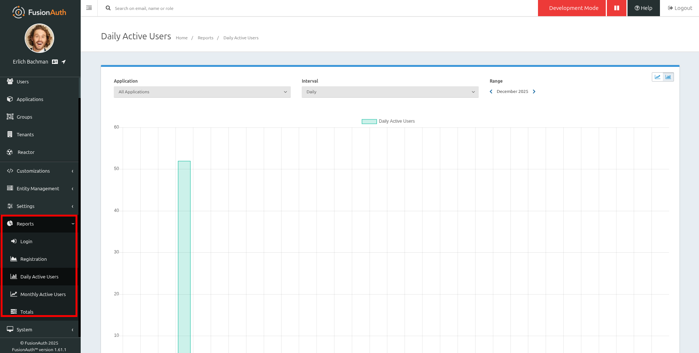
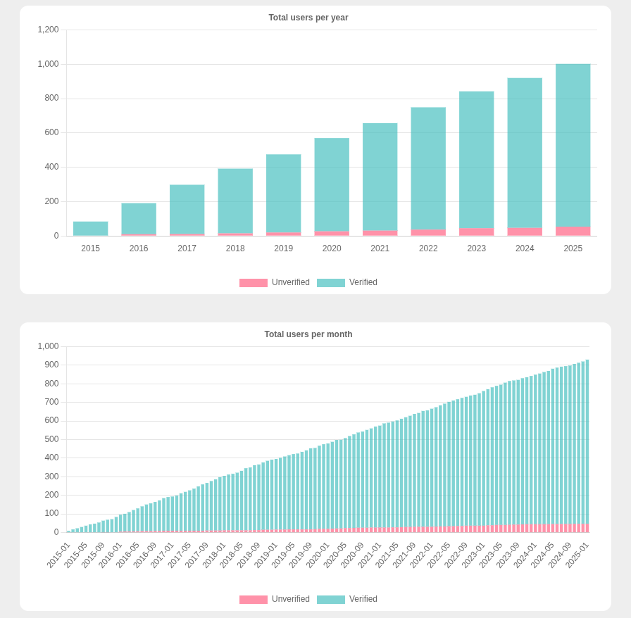
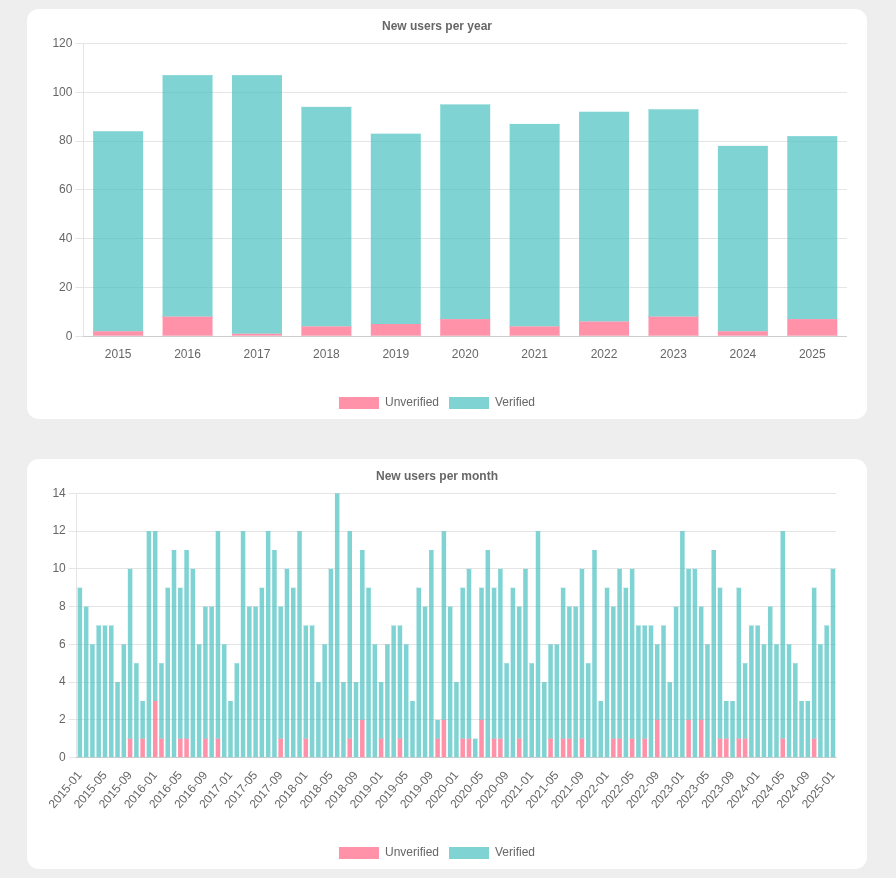
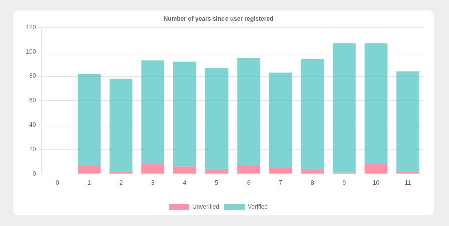
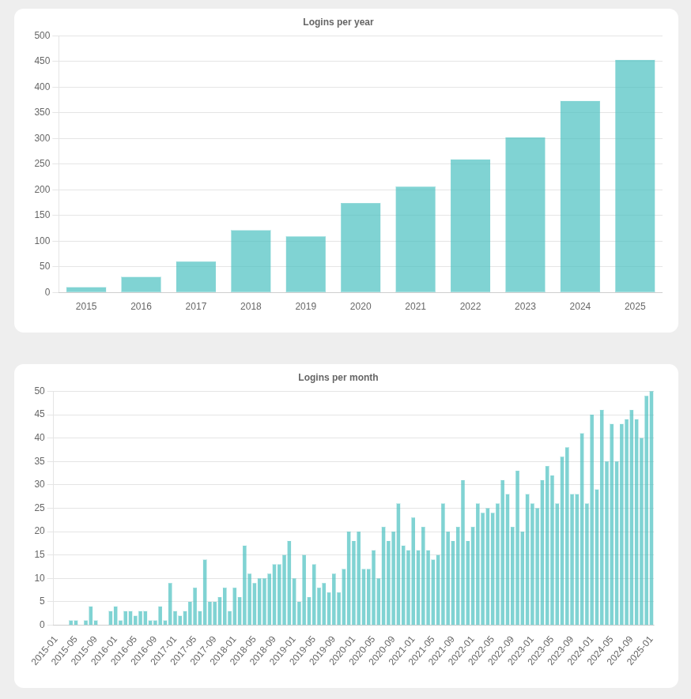
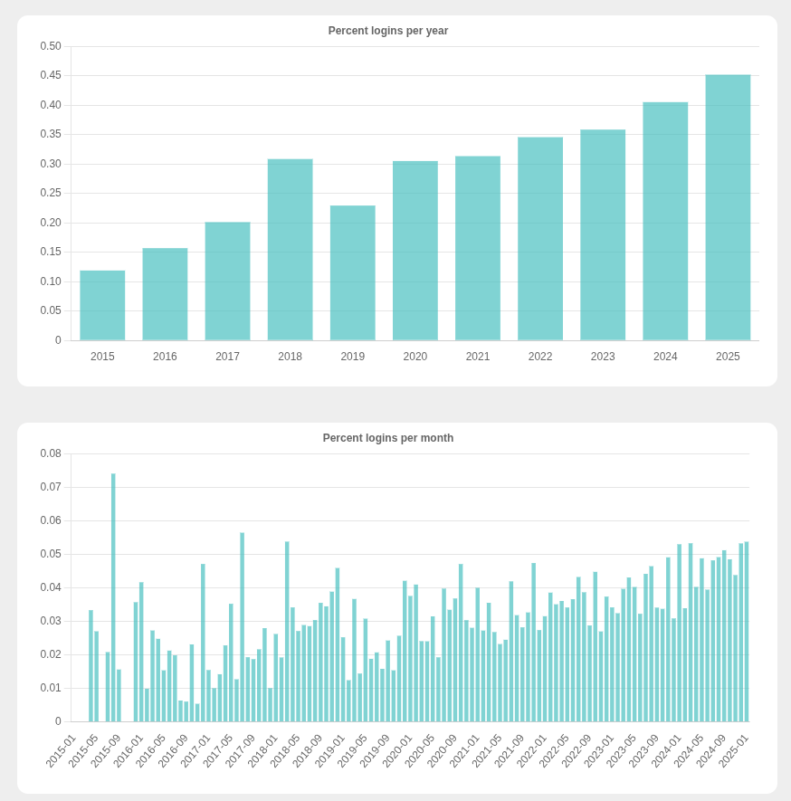
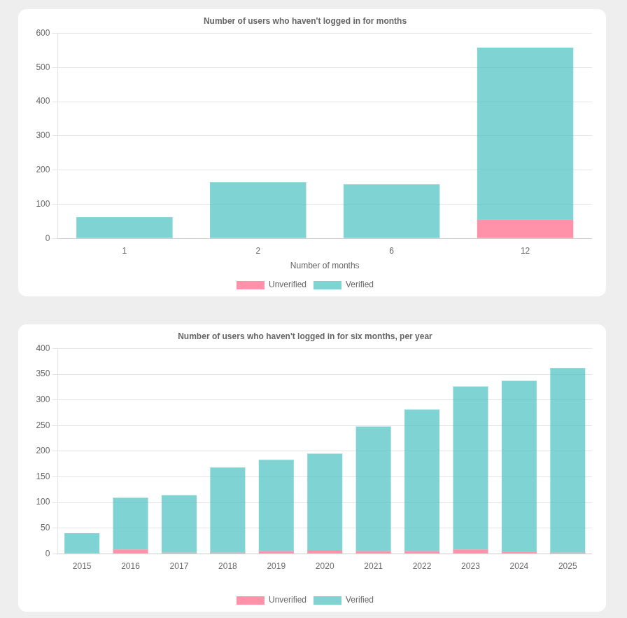
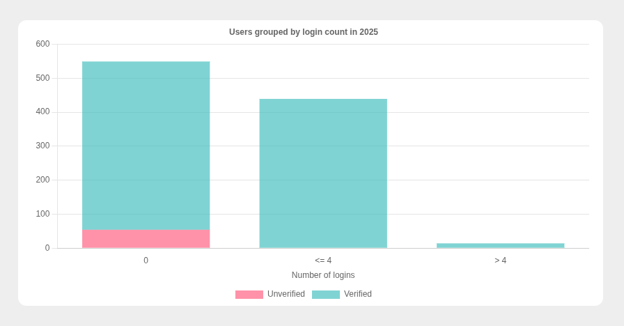
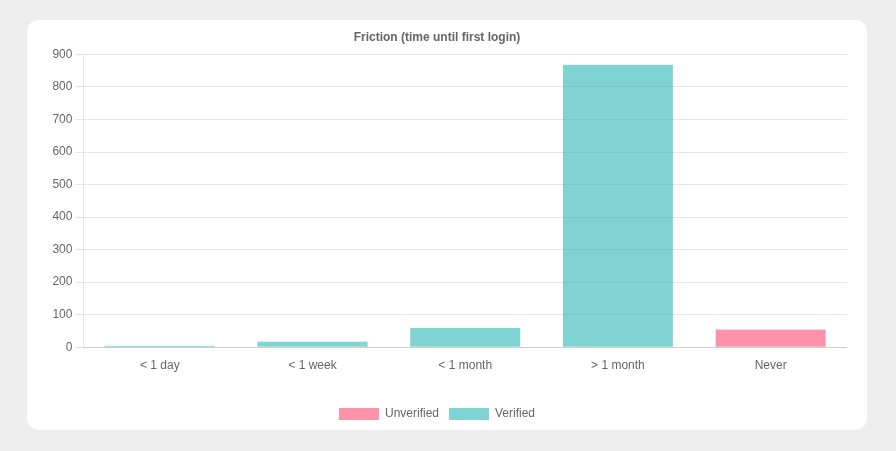

import Aside from 'src/components/Aside.astro';
import Breadcrumb from 'src/components/Breadcrumb.astro';
import InlineField from 'src/components/InlineField.astro';
import InlineUIElement from 'src/components/InlineUIElement.astro';

- [Introduction](#introduction)
- [FusionAuth Native Reports](#fusionauth-native-reports)
- [Understanding Addition User Charts](#understanding-addition-user-charts)
  - [Total Users Charts](#total-users-charts)
  - [User acquisition Charts](#user-acquisition-charts)
  - [User Age Chart](#user-age-chart)
  - [Logins Per Year Charts](#logins-per-year-charts)
  - [Percent Logins Per Year Charts](#percent-logins-per-year-charts)
  - [Abandonment Charts](#abandonment-charts)
- [Extract customer data](#extract-customer-data)
- [From Gemini](#from-gemini)
  - [Introduction to Cohort Analysis](#introduction-to-cohort-analysis)
    - [The Three Core Components](#the-three-core-components)
    - [Why It Matters](#why-it-matters)
    - [Types of Cohorts](#types-of-cohorts)
  - [Recommended Charts for Product Owners](#recommended-charts-for-product-owners)
    - [1. Retention Heat Map (The "N-Day" Retention)](#1-retention-heat-map-the-n-day-retention)
    - [3. Time-to-First-Login (Friction Analysis)](#3-time-to-first-login-friction-analysis)
    - [4. Churn Prediction (The "Slipped Away" Chart) - no , just mention, don't do](#4-churn-prediction-the-slipped-away-chart---no--just-mention-dont-do)
    - [5. Login Frequency Distribution (Power User Curve)](#5-login-frequency-distribution-power-user-curve)
- [Calculate user statistics and display in charts](#calculate-user-statistics-and-display-in-charts)
- [Summary](#summary)
- [Appendix — How to create fake customer data in FA](#appendix--how-to-create-fake-customer-data-in-fa)
- [todo](#todo)


## Introduction

Do you know how frequently your customers use your app? Do you know how many people sign up but quickly lose interest in your service? In this article, you'll learn how to use FA to track customer statistics: retention rates, customer age analysis, and customer cohorts (groups). While you need to investigate your own application database for reasons *why* customers stay or leave, having a base of FA login stats to work from lets you know who to analyze.

## FusionAuth Native Reports

FA has a few built-in charts with views of total logins and registrations in the <Breadcrumb>Reports</Breadcrumb> section.



FA provides several simple charts:

- Number of logins: Per application, time period, and user
- Number of registrations: Per application and time period
- Number of daily active users: Per application and time period
- Number of monthly active users: Per application and time period

Unfortunately more complex charts aren't possible directly in FA because they are overly time-consuming to calculate. If you want more informative charts, you need to export your data and calculate statistics manually. This guide will you show how to do that. If you want even deeper analysis on a regular basis, you then need to investigate the world of business intelligence (BI): data extraction, denormalization, and dashboards.

## Understanding Addition User Charts

This guide is accompanied by code that creates charts from your FA user registration and login data. This section explains how to use each chart. In the next section, you'll learn how to run the program.

The charts below were created from a thousand users with random registration and login dates, so you won't see realistic patterns, but they're enough to understand the concepts.

### Total Users Charts



The total user charts show the number of users that have joined your service. This allows you to see if your business is growing as well as you expect. Users who are registered but are no longer active are not shown here. You need to compare total users with user activity and abandonment metrics (shown later).

This chart, like many others, separates users into those that verified themselves (confirming their email address) and those that did not. Unverified users can act like an outlier in your data, distorting your statistics. But it's still useful to know how many there are, and to try ways of encouraging users to register.

### User acquisition Charts



This user acquisition chart is useful to see if any advertising campaigns, or new features, have attracted new users. Be aware that there might be a time delay between your marketing effort and the number of new registrations. You can also investigate any spikes or dips in the chart (such as in the middle of 2018) and see if there was any extra conversation about your business online, or complaints about competitors.

This chart doesn't show if the users actually use your service after registering — it's user acquisition not user retention.

### User Age Chart



The age chart groups users into the number of years they have used your service. It's an indication of how much experience the average user has with your business.

Notice that this chart is the reverse of the new users per year chart.

### Logins Per Year Charts



The logins per year and month show how active your users are. These charts, and some of the later charts, depend on the expiry duration of your login tokens. Longer expiry times mean that users login less frequently. You can adjust the sample code to analyze a period that makes sense for your configuration.

Sometimes it's more meaningful to work with deduplicated logins for a period. In other words, if a user logins more than once in a year or month, they are counted as logging in only once in that period. This prevents the service appearing more used than it actually is, by a small fraction of users who log in frequently.

### Percent Logins Per Year Charts



The percent login charts are a more useful version of the previous charts. Here the value shown is a ratio of logins to number of users. In 2025 you can see just less than half, 0.45, of users are actively using your service. The increasing trend of usage over time indicates this example business has shown increasing value to customers.

### Abandonment Charts



The first abandonment chart is the opposite of user activity. Here you see how many users haven't logged in for 1, 2, 6, or more than 12 months. The majority (over 500 out of 1000 users) haven't logged in for at least a year.

While the first chart is a static metric calculated today, the second abandonment chart shows the trend of users who haven't logged in for at least six months, per year. You can see this amount is steadily increasing over time. This contradicts the activity chart shown earlier, which said that users are logging in *more* each year. This apparent contradiction is because the activity chart was relative (percent of users) and the abandonment chart is absolute (number of users). Depending on which statistic is more useful to you, you can change any absolute chart in the code to a relative chart by dividing the annual value by the number of users in that year. The total number of users is found in `totalUsersPerYearChart.verifiedData` and `totalUsersPerYearChart.unverifiedData`.







data available: customer identifier, registration date, series of login dates

stats per customer: has verified, verification date, acquisition (date registered), login frequency, login regularity, abandonment (date of last login)

groups: for each stat you can create groups to get an idea of numbers of each type of customer

aggregate stats: customers per date, abandonment per date, acquisition by date

stats granularity can be day, month, year

look at how users used your app or support service before abandonment

List of charts:
- Total number of users (split bar chart showing verified/unverified) per year and month
- User acquisition per year and month (sales performance. also cohort by age)
- Number of users per age in years (mirror image of user acquisition per year, but shows customer analysis and retention)
- Number of logins per year and month
- Percent logins per year and month
- Number of users that haven't logged in for 1, 2, 6, 12 months
- Number users that haven't logged in for 6 months by year
- Number of users that log in 0,<=4,>4 times per year in 2025 (cohort)
- Returning users by month (users who haven't logged in in the last 6 months who returned in a specific month (new feature, competitor change, or advertising)

logins affected by how long token lasts, so you need to set your own values in the charts.

## Extract customer data

While application databases, like FA, store data in a denormalized structure to save space, data analysis needs data to be normalized for fast retrieval and computation.

The first step to analyze your user data in FA is to extract it and store it in a usable format. As this process puts the database under load, you should run it on a copy of your database using a separate FA instance.

Create a file called `extract.mjs` and insert the code below. Change the variables at the top to match your FA instance.

```js
import * as fs from 'fs/promises';

```

Run the file with the command below.

```sh
node extract.mjs
```

This command creates two files, `faUsers.json` containing the raw data from FA, and `users.json` containing the processed set of users with all login dates but all other fields removed.

The `users.json` file has structure below.

```js
  [{
    id: string
    email: string
    isVerified: bool
    registeredDate: string // timestamp since 1970
    loginDates: string[] // oldest dates first
  }]
```

## From Gemini

### Introduction to Cohort Analysis

Cohort analysis is a behavioral analytics technique that breaks down users into related groups based on shared characteristics or experiences within a defined time span. Instead of looking at users as one monolithic unit, you analyze them through a "lifecycle" lens to see how behavior changes over time.

#### The Three Core Components

* **The Cohort:** A group of users who performed a specific action (usually signing up) within a specific timeframe (a day, week, or month).
* **The Metric:** The behavior you are measuring, such as logins, purchases, or feature usage.
* **The Time Horizon:** The period over which you track that metric (Day 0, Day 1, Week 4, etc.).

#### Why It Matters
Cohort analysis is primarily used to distinguish between **growth** and **retention**. A product might have 10,000 active users, which looks healthy. However, cohort analysis might reveal that 9,000 of those users signed up this month, while only 5% of users from six months ago ever returned. This indicates a "leaky bucket" problem where you are successfully acquiring users but failing to keep them.

#### Types of Cohorts
1.  **Acquisition Cohorts:** Groups defined by *when* they joined. This is the most common type and helps identify if newer versions of your product are better at retaining users than older versions.
2.  **Behavioral Cohorts:** Groups defined by *what they did*. For example, you might compare a cohort of users who uploaded a profile picture in their first hour versus a cohort that didn't. This helps identify the "Aha! moment" where users find value.


---

### Recommended Charts for Product Owners

Since your dataset is restricted to **registration dates** and **login dates**, you are essentially looking at "Pulse" and "Retention" metrics. Here are several charts that would provide deeper insights for a Product Owner:

#### 1. Retention Heat Map (The "N-Day" Retention)
While your current charts show totals and percentages over time, a heat map shows the percentage of a specific registration cohort that returns in subsequent months.
* **X-Axis:** Months since registration (Month 0, Month 1, Month 2...).
* **Y-Axis:** The registration month (Jan 2025, Feb 2025...).
* **Value:** % of that cohort that logged in during that specific month.
* **PO Value:** Identifies exactly when users drop off. If Month 1 retention is dropping, the onboarding is the problem. If Month 6 retention is dropping, the long-term value proposition is the problem.


#### 3. Time-to-First-Login (Friction Analysis)
* **Calculation:** `firstLoginDate` - `registrationDate`.
* **Visual:** A histogram showing how many users log in immediately, within 24 hours, or after a week.
* **PO Value:** High friction in registration often leads to a "ghost" user base where people register but never actually enter the app.

#### 4. Churn Prediction (The "Slipped Away" Chart) - no , just mention, don't do
This is an evolution of your abandonment chart but focused on the *velocity* of loss.
* **Calculation:** Users who logged in during Month N-1 but did not log in during Month N.
* **PO Value:** This is a leading indicator. If the number of "Slipped Away" users is growing faster than new registrations, the product is in a state of contraction.

#### 5. Login Frequency Distribution (Power User Curve)
* **X-Axis:** Number of days in a month a user logged in (1 to 31).
* **Y-Axis:** Count of users.
* **PO Value:** Also known as the "L30" chart. A "U-shaped" curve (high counts at 1 day and 30 days) indicates a healthy product with a dedicated core of power users. A "left-heavy" curve indicates a product used only for "one-off" tasks.


## Calculate user statistics and display in charts

Create a file called `app.mjs` in the same directory as the `users.json` file you extracted earlier and insert the code below.

```js
// clear; docker run --init  -it --rm --name "app" -v ".:/app" -w "/app" -p 7777:7777 node:24.12.0-slim  sh -c  "node --watch 4app.mjs";

import express from 'express';
import * as fs from 'fs/promises';

```

page.html

```html
<!DOCTYPE html>
<html lang="en">
	<head>
		<meta charset="UTF-8">
		<meta name="viewport" content="width=device-width, initial-scale=1.0">
		<title>User statistics</title>
		<style>
			body{background-color:#eee}
			.chart{max-width:820px;padding-right:20px;margin:20px auto;margin-bottom:40px; background-color:#fff; border-radius:12px;}
		</style>
	</head>
	<body>
		<div class="chart"><canvas id="totalUsersPerYearChart"></canvas></div>
		<div class="chart"><canvas id="totalUsersPerMonthChart"></canvas></div>
		<div class="chart"><canvas id="newUsersPerYearChart"></canvas></div>

```

Run the code with the command below.

```sh
npm install express
node app.mjs
```

## Summary

## Appendix — How to create fake customer data in FA

To create an FA application with fake users and login data you need to run a JS and SQL script.

Create a file called `fake.mjs` containing the code below. It will register 10 000 new users when run.

```js
async function registerUsers(num) {
  for (let i = 1; i <= num; i++) {
    try {
      const response = await fetch('http://fa:9011/api/user/registration', {
        method: 'POST',
        headers: {
          Authorization: '33052c8a-c283-4e96-9d2a-eb1215c69f8f-not-for-prod',
          'Content-Type': 'application/json'
        },
        body: JSON.stringify({
          user: { email: `${i}@example.com`, password: 'password' },
          registration: { applicationId: 'e9fdb985-9173-4e01-9d73-ac2d60d1dc8e' }
        })
      });
      if (!response.ok) {
        const errorBody = await response.text();
        console.log(`httpError ${response.status} for user ${i}@example.com: ${errorBody}`);
        return;
      }
      const result = await response.json();
      console.log(JSON.stringify(result));
    } catch (error) {
      console.log(`networkError for user ${i}@example.com: ${(error).message}`);
    }
    console.log('');
  }
}

await registerUsers(10000);
```

Adjust the URL, authorization key, and application Id in the code above to match your FA instance. Then run the file with the command below.

```sh
node fake.mjs
```

If you don't have Node installed, or want to avoid running code directly on your computer, you can use Docker with the command below. (If you're running FA on your local machine, you need to put FA and the command on the same `--network`.)

```sh
docker run --init  -it --rm --name "app" -v ".:/app" -w "/app" --network faNetwork node:24.12.0-slim sh -c  "node fake.mjs";
```

Once the users are created, you need randomize their registration dates, set 5% of user email addresses to unverified, and create thousands of login dates. This can't be done with the FA API, so you need to run SQL directly on the PostgreSQL FA database.

Run the SQL below.

```sql
-- randomize registration dates. a day from 2015 to 2025
UPDATE user_registrations SET insert_instant =
    EXTRACT(EPOCH FROM (
        '2015-01-01'::DATE + (FLOOR(('2025-12-31'::DATE - '2015-01-01'::DATE) * random()))::INT
    )::TIMESTAMP WITHOUT TIME ZONE)::BIGINT;

-- check dates if you want
-- SELECT * FROM user_registrations

-- set 5% users to unverified
UPDATE identities
SET verified = CASE
    WHEN random() < 0.05 THEN false
    ELSE true
END
WHERE identities.is_primary = true;

UPDATE identities
SET verified_reason = 5
WHERE identities.is_primary = true;

-- add login dates
WITH user_min_instant AS (
    SELECT
        user_registrations.users_id,
        MIN(user_registrations.insert_instant) AS minInstant
    FROM
        user_registrations
    GROUP BY
        user_registrations.users_id
),
users_with_series AS (
    SELECT
        users.id AS usersId,
        user_min_instant.minInstant,
        generate_series(1, (1 + floor(random() * 4991))::INTEGER) AS seriesNum -- 10 to 5000 logins
    FROM
        users
    JOIN
        user_min_instant ON users.id = user_min_instant.users_id
)
INSERT INTO raw_logins (applications_id, instant, ip_address, identities_value, identities_type, users_id)
SELECT
    'e9fdb985-9173-4e01-9d73-ac2d60d1dc8e',
    (users_with_series.minInstant + FLOOR(
        (EXTRACT(EPOCH FROM '2026-01-01 00:00:00Z'::timestamp) - users_with_series.minInstant) * random()
    ))::BIGINT,
    '127.0.0.1',
    NULL,
    NULL,
    users_with_series.usersId
FROM
    users_with_series;

-- delete logins for unverified users
delete from raw_logins
where users_id in (select users_id from identities WHERE is_primary=true and verified=false)
```

## todo

unique user logins for all charts - not high frequency login users that clutter averages
use 10 000 users
copy in correct sql date creation code into article.
fa

https://github.com/FusionAuth/fusionauth-site/issues/2990 - cohort analysis
