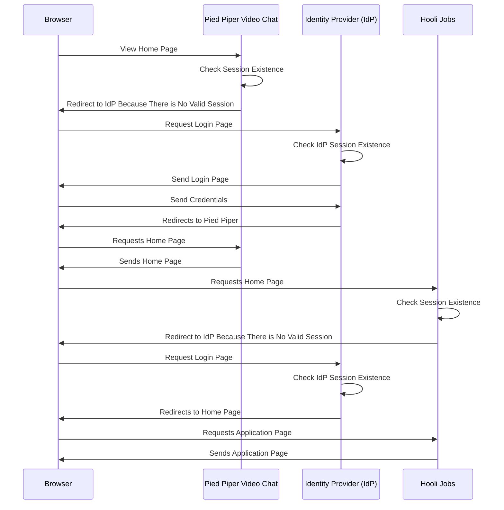
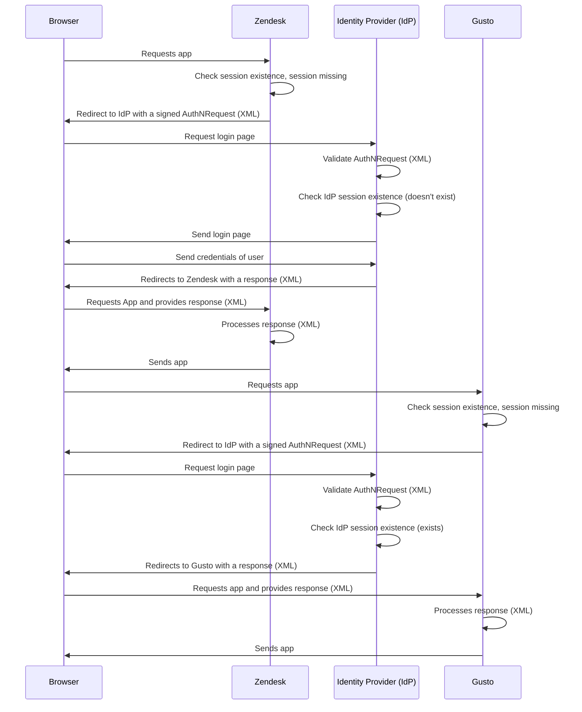

import SsoLoginDiagram from "../../diagrams/blog/sso/sso-login.astro";
import SamlSsoLoginDiagram from "../../diagrams/blog/sso/saml-sso-login.astro";

Single sign-on (SSO) is a key part of any customer identity and access management (CIAM) strategy.

Why? Because your organization will almost always have more than one application for your customers. Even if you begin with one custom application, SaaS tools such as support forums, ticketing systems, or chat systems require authentication. You won't want your users to have to log in to more systems than necessary, and SSO can help with that. 

{/* more */}

Integrating single sign-on into your applications means your users can access all their applications with one set of credentials, such as a username and password.

## An SSO scenario

Let's say you have two applications for which you want to enable single sign-on.

* The Pied Piper Video Chat application (PPVC)
* The Hooli Jobs application (they're always hiring)

You want to let users log in to the PPVC, and then, if they visit Hooli to apply for a job, have them automatically signed in to the Hooli Jobs application. 

This is single sign-on in a nutshell.

This pattern scales to any number of applications, and can include commercial off the shelf (COTS) apps that support OIDC (OpenID Connect) or SAML (Security Assertion Markup Language).

If you have a suite of applications, SSO can provide a seamless authentication experience for your users across the entire set of apps. 

But how does it actually work? This blog post will explain, but first, let's take a step back and talk about sessions.

## Sessions

Sessions are how servers "know" they've seen a client before. Sessions are usually implemented with cookies when the application is browser based.

In the SSO scenario, the following sessions exist:

* The PPVC application's session
* The Hooli Jobs application's session
* FusionAuth's session, also known as the single sign-on session

If a session doesn't exist for a given application, or it isn't valid, then the session must be created or updated. This happens after the user has presented valid credentials and been authenticated.

For FusionAuth, the credentials are often a username and password. However, they could also be a passwordless flow, a login federated by a social provider like Google, or a credential verification by a business solution like Azure AD.

For the other applications in this example, the credential, which proves authentication has occurred, is a valid FusionAuth token, which is a JSON web token (JWT). 

## Single sign-on request flow

Here's the flow of an OIDC single sign-on. The home page of each application is unavailable to anonymous users. When a browser requests it, they are directed to the identity provider, FusionAuth, to authenticate. However, the authentication at FusionAuth only happens the first time.

(If you are a stickler, you'll notice there is no request for a token from the apps to FusionAuth after the user authenticates. That is implied and required.)

With SSO there are different sessions managed by different applications, which can have varying lifetimes and storage mechanisms.

The PPVC and Hooli Jobs applications delegate authentication to the single sign-on provider, and build their sessions on the foundation of the identity provider's session. That session is, in turn, tied to a user authentication event.

That's it. All that is required for single sign-on to work is:

* a browser that respect redirects
* a single source of truth for user authentication data (often called an identity provider)
* a defined protocol for an application to bounce an unauthenticated user to the identity provider
* a defined protocol for the identity provider to bounce requests back to the application 
* a sessions for each application (typically managed with cookies)

Let's look at another possible implementation.

## SAML SSO

SAML is an alternative to OIDC which also allows single sign-on. It is older, more complex, but well supported across many applications, especially B2B applications.

(Again, if you're a stickler, this is talking about SAMLv2, the latest version of SAML which was codified in 2005.)

SAML, in contrast to the JWT based flow of OIDC, uses signed and/or encrypted XML documents to convey information about users. 

Let's look at a different scenario. Say you have two other applications: Zendesk and Gusto.

You want to use SAML to integrate these applications with your identity provider.

Here's a diagram for a SAML flow. This is a service provider (SP) initiated flow, where the user is trying to access an application, such as Zendesk (the SP), when they are not logged in.

SAML is more complicated because of the breadth of the specification and because of the flexibility of XML. If you are looking to implement it, using a battle tested library is a good idea.

FusionAuth provides an [open source library for Java](https://github.com/FusionAuth/fusionauth-samlv2/) that is regularly tested and updated.

## Why SAML

Why would you pick SAML over the OIDC flow mentioned above? Widespread support. SAML has been around since 2005 and many commercial off the shelf and open source applications support it.

When evaluating your identity provider solution, think about what kinds of applications you need to support.

Any business focused applications will typically support SAML, whereas support for OIDC is far easier to implement in your custom applications. Newer COTS applications may support OIDC.

For maximum flexibility, pick an identity provider which supports both standards. (FusionAuth does.)

## Beyond the browser

Both SAML and OIDC are browser based. They require functionality such as HTTP redirects, cookies and the ability to interact using URLs.

There are other single sign-on protocols useful for other kinds of applications, such as desktop applications. Kerberos is a common one for client server applications.

## Conclusion

Single sign-on is a key part of your application's authentication story.

It doesn't have to be difficult, as leveraging standards like OIDC and SAML can help integrate both custom and commercial off the shelf applications with an identity provider like FusionAuth. 

