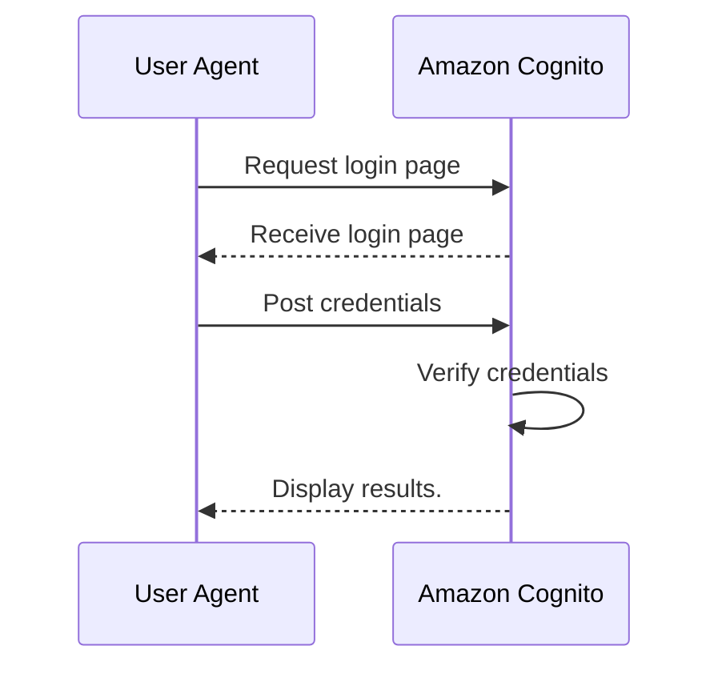
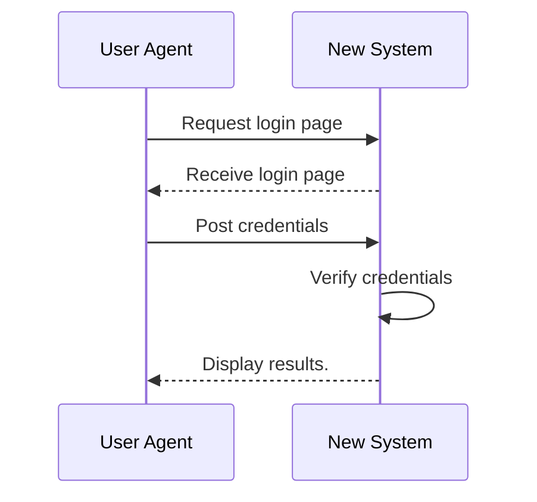
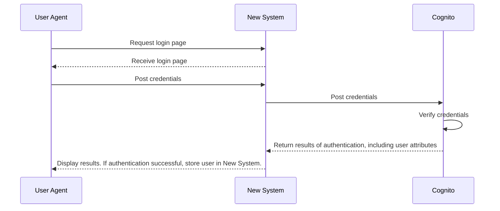

import Aside from "../../components/Aside.astro";

Amazon Cognito is a serverless CIAM service from Amazon Web Services with deep AWS integration. It offers authentication and authorization and supports a number of OAuth grants, including the Authorization Code grant, the Implicit grant and the Client Credentials grant.

At FusionAuth, we talk to potential customers who are interested in migrating away from Cognito because of limitations, typically of UX, functionality or data control.

{/* more */}

This blog post will explain why and how you might choose to migrate from Amazon Cognito to another solution. This is more complicated than it might seem because you cannot access the password hashes of users in Cognito, which has impacts the way you can migrate their authentication experience.

## Weaknesses of Amazon Cognito

While [Amazon Cognito](https://aws.amazon.com/cognito/) is a low cost auth service and a far better choice than rolling your own auth solution, it has some downsides. These include:

* There is only one deployment model, a SaaS offering on AWS.
* The user pool and identity pool concepts can be difficult to grasp.
* The user interface presented to your customers is inflexible and hard to customize.
* You can run Cognito only in the geographies supported by AWS.
* Cognito pools are not multi-region. If the AWS region that your pool is in is unavailable, you have few options.
* After setting up a user pool you can't change required attributes such as first and last name or anything else. Instead, you have to create a new user pool if you want different required attributes.
* When moving between pools, you can't migrate users to the new pool, you either have to export and import their usernames and then have them create new passwords, or you have to migrate them using a special lambda trigger the next time they log in. Therefore you're maintaining two user pools for an indefinite period of time and maintaining complicated lambda triggers.
* It doesn't support localization of messages or the user interface.
* You can't backup or export all user data, notably password hashes.
* SAML accounts are expensive after you grow beyond the free tier.
* Possibly most concerning, Amazon Cognito has been relatively static and has received few recent improvements.

These limitations may be acceptable initially, but eventually you may need a feature not provided by Amazon Cognito, such as a unique login provider or the OAuth device grant. Or perhaps you want more control over the user interface your customers will see.

For whatever reason, you may decide you need to move your customer and user data from Amazon Cognito. Let's take a look at how you might do so.

## When you shouldn't migrate

Amazon Cognito has strengths as well as weaknesses, and when your application depends on unique features or if the upsides outweigh the downsides, continue to run on Cognito.

For example, if your usage is free, under 50,000 MAUs, and the user interface and other limitations of Amazon Cognito are acceptable, migration doesn't make sense. The fact that Cognito is serverless makes it easy to "set and forget" and allows you to focus on other aspects of your application. You know, the features your users want.

If you need Cognito's unique deep integration with AWS, including the ability to grant authenticated users temporary AWS credentials to access an S3 bucket or specific rows in a DynamoDB table, migration won't make sense. No other auth provider can provide such access natively, though you may be able to generate temporary credentials and share them with your users via custom coding.

## How to migrate

After you have decided to migrate from Amazon Cognito, the first decision you'll need to make is "Am I okay with forcing all my users to reset their passwords?" This unfortunate choice is required since Cognito won't allow you to export password hash.

<Aside type="note" nodark="true">
This blog post gives general guidance on migration off of Amazon Cognito to any other auth provider. If you are looking for step by step instructions on how to migrate from Amazon Cognito to FusionAuth, please review our [Amazon Cognito migration guide](/docs/lifecycle/migrate-users/bulk/cognito).
</Aside>

If the answer is yes, then you have the option of a point-in-time bulk migration.

If the answer is no, then you will be instead looking at a phased or "slow" migration, where users are migrated one at a time as they log in.

In general, the more users you have and the less they need your application, the less you'll want to impact them by forcing a password reset. However, a slow migration is more complex operationally (some users will exist in the new system, some in Cognito).

If you aren't sure, you have the option of segmenting your user base and migrating one section. This will allow you to see what effect requiring a password change has on engagement and conversion.

You should also run a proof of concept or trial with any new auth providers you are considering. This is out of scope for this document, but please [read this article for more information on how to run a successful trial](/articles/identity-basics/try-before-you-buy).

Once you have decided how you want to migrate, you'll proceed with either a bulk migration of users or a slow migration. Let's look at the steps for a bulk migration first.

## Bulk migration from Amazon Cognito

The basic steps of a bulk migration are:

* Set up the new auth system. Make sure you map all functionality and data from Cognito to the new system.
* Retrieve all available user data from Cognito. You can do this with the AWS CLI or any other AWS API client such as boto.
* Massage the exported user data into a format acceptable to your new provider, using whatever data transformation tools you are comfortable with.
* Upload the user data to the new provider. If you must provide a password when importing users, set it to a random high entropy string.
* Create configuration in the new auth system corresponding to the client configuration previously set up in Amazon Cognito. You should also customize the user interface, messages, MFA methods and any other Cognito specific settings that are relevant.
* Update your custom, COTS or OSS applications to point to the new auth system.
* Mark all uploaded users as needing a new password and notify them. The details of this are specific to the new system.
* [Delete the Cognito user pools](https://awscli.amazonaws.com/v2/documentation/api/latest/reference/cognito-idp/delete-user-pool.html) to ensure that all of your users are authenticating against the new system. You could also use a lambda to disable logins.

You could notify the users in bulk via email or update your login screens with a message to users that they will need to reset their password to gain access.

Here's the login flow before the bulk migration:

Here's the login flow after the bulk migration, when Amazon Cognito no longer is involved in the login process:

The benefits of a bulk migration include:

* You can move all your users at one time. Having a single source of truth for customer data is typically beneficial.
* You no longer have a dependency on Cognito; the transition is quick.

The downsides of a bulk import are:

* You must require all users to reset their password.
* You'll have to build a script to retrieve the data from Cognito, modify it, and push it to the new system.
* There may be some downtime in the migration process.

## A slow migration from Amazon Cognito

With a slow, or phased, migration, users are not required to reset their password. Instead, they log in to the new system, provide their username and password, which is then forwarded to Amazon Cognito. (This must be a secure connection and should be augmented with IP restrictions, custom headers or client certificates; you don't want anyone to be able to pass credentials to Amazon Cognito.) If the credentials are correct, the user is logged in. The new system can rehash and store the password along with other user data.

Here's a diagram of an initial user login during a slow migration:

After the initial login, Cognito is no longer the system of record for that user. Any changes to this user, whether made by themselves, automated processes or customer service team members, will need to be made in the new system.

In subsequent logins, the original Cognito system is never consulted.

The basic steps of a slow migration are:

* Set up the new system. Make sure you map all functionality and data from Cognito to the new system.
* Determine what constitutes "done" for this migration, since it is unlikely that every single user will log in and be migrated, no matter how long you run these two systems in parallel. You can see [more details on how to calculate that](/docs/lifecycle/migrate-users#migration-timeline).
* Set up a way for the new system to present user credentials to Amazon Cognito for an authentication event. The exact method will depend on new system features. This can be done with an AWS Lambda; see [this document](/docs/lifecycle/migrate-users/bulk/cognito#set-up-aws) for an example which works with FusionAuth.
* Create configuration in the new auth system corresponding to the client configuration previously set up in Amazon Cognito. You should also customize the user interface, messages, MFA methods and any other Cognito specific settings that are relevant.
* Update your custom, COTS or OSS applications to point to the new auth system.
* Wait, running reports periodically to determine if you've migrated enough users to shut down the slow migration.
* Decide what to do with unmigrated users. Options include abandoning them, a bulk migration, or contacting them to encourage a sign-in.
* Eventually, [delete the Cognito user pools](https://awscli.amazonaws.com/v2/documentation/api/latest/reference/cognito-idp/delete-user-pool.html) to ensure that all of your users are authenticating against the new system. You could also use a lambda to disable logins.

Slow migrations have less impact on your users, but more impact on your systems and employees and take more time. For instance, if a customer service representative needs to reset a password, they will have to determine if the user has been migrated to the new system or not before they can process the request.

## Conclusion

This blog post offers an overview of an Amazon Cognito migration. No matter what the new target system is, you'll need to decide between the bulk or slow migration, as well take specific steps to move your data and settings.

If you are looking for step by step instructions on how to move to FusionAuth from Amazon Cognito, please check out our [Amazon Cognito migration guide](/docs/lifecycle/migrate-users/bulk/cognito).
