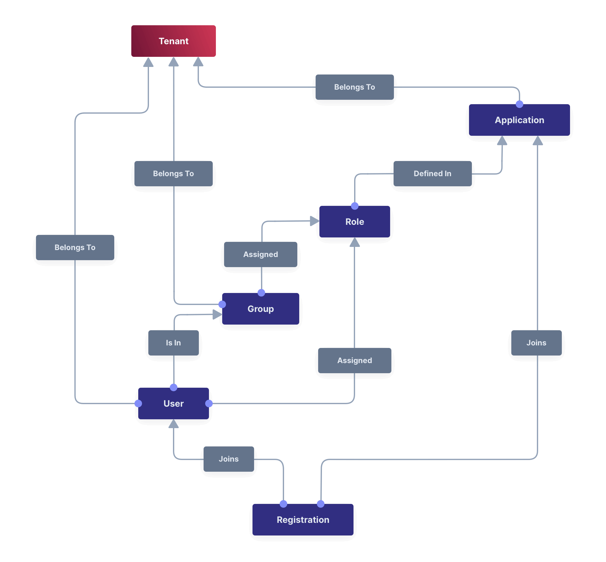
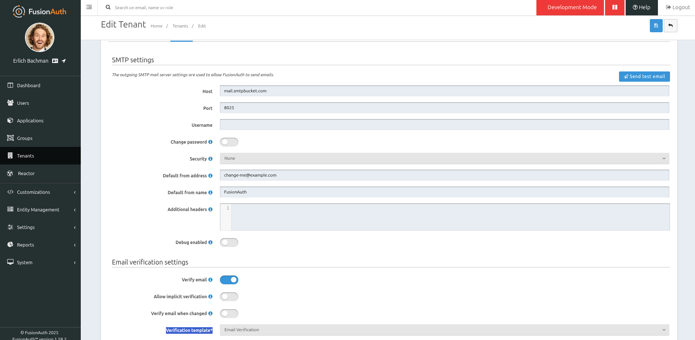
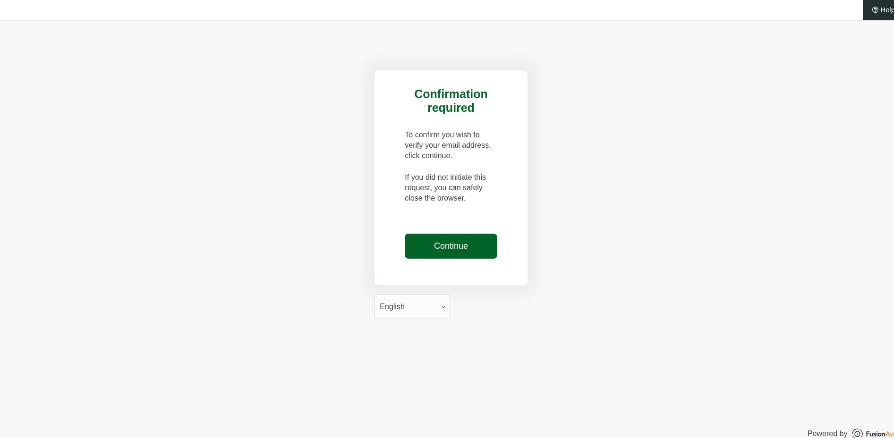
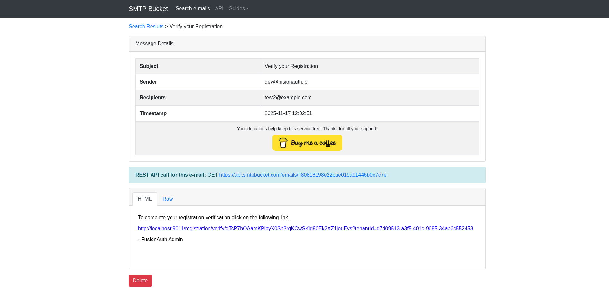
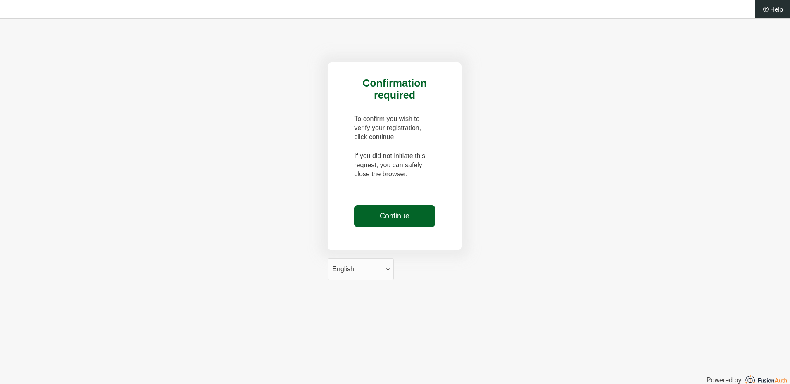
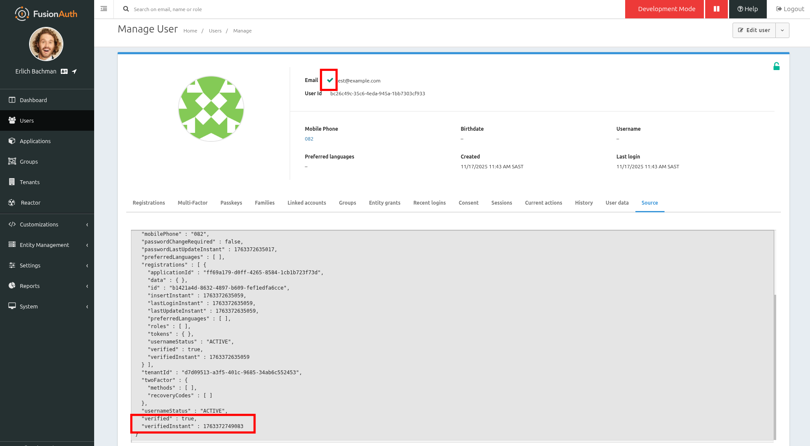
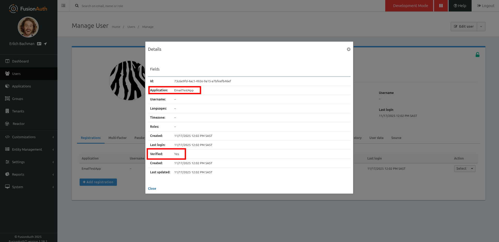
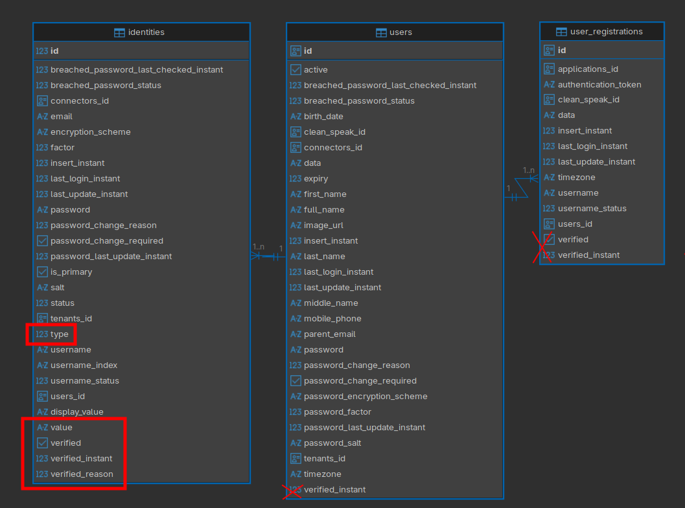
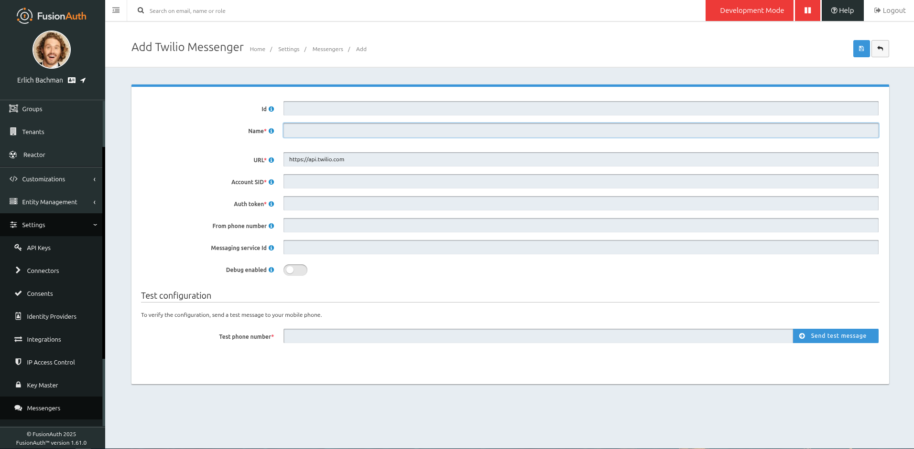

import Aside from 'src/components/Aside.astro';
import Breadcrumb from 'src/components/Breadcrumb.astro';
import InlineField from 'src/components/InlineField.astro';
import InlineUIElement from 'src/components/InlineUIElement.astro';

User verification (proof of email address or phone number ownership) is done by the user by entering a code or clicking a link sent to the address they registered with.

The FusionAuth field `user.verified` stores whether the user has completed email verification yet. But as of [FusionAuth version 1.59](https://fusionauth.io/docs/release-notes/#version-1-59-0) (August 2025), this field is deprecated. FusionAuth now handles verification for each type of identity separately (email and phone).

This article discusses exactly what's changed with verification and how the new features work.

## ⛔ The Old Way Of Verification

Let's summarize the obsolete email verification system from before version 1.59. Even if you're a new user working on the latest version of FusionAuth, read this section first, to understandthe verification process of sending and clicking links, which hasn't changed in the new version.

### The Object Model

If you're unfamiliar with FusionAuth types, like Tenants, Applications, Users, and Registrations, please review the [documentation](https://fusionauth.io/docs/get-started/core-concepts/types-and-relationships). The relationship diagram below summarizes the types.

Notice that users are members of applications through an object called a registration (because a user "registers", or signs up, to use an application).

If you open your FusionAuth database, you'll see the user object is split into two tables: `users` and `identities`. The user table holds biographical information like name, birth date, and timezone. The identities table holds multiple records for a user, which might include a username, email address, and phone number. To update users, you should use the FusionAuth web interface or the [users API](https://fusionauth.io/docs/apis/users) and mustn't access the database directly, but the user object in the API has the same structure as the database tables so the diagram below should help your understanding.

Verification in FusionAuth prior to 1.59 is only for email addresses (and not phone numbers or other identifiers).

Each user identity (email address) has the fields `verified` and `verified_instant`. `verified` is false until the user clicks the verification link, when it becomes true. `verified_instant` is the time at which the user verified.

A registration also has the fields `verified` and `verified_instant`. If the user identity already has a verified field, why does the registration need another verification field? The [application registration tutorial](https://fusionauth.io/docs/lifecycle/manage-users/verification/registration-gate-accounts-until-verified) explains this:
>  However, PiedPiper requires separate registration verification to allow access to both Not-Hotdog and PiperChat through the same email account. This registration verification is a concrete, separate step that the user must engage in by clicking a link or entering a code (sent via email). Without this verification step, **users may find it alarming their logins (jared@piedpiper.com) work for both Not-Hotdog and PiperChat (without their express consent, especially if they did not know about the parent company relationship)**.

This quote says that a user verifying that they signed up to use an application has a different purpose to a user verifying their email or phone when creating an account in FusionAuth, though both procedures are named verification and both send a link the user must click. Verifying your identity proves ownership, whereas verifying your registration avoids surprise.

### The Verification Process

In this section you'll see what email verification looks like. If you want to test it for yourself, you need an SMTP server. The simplest way to test is using a fake free SMTP service, like [SMTPBucket](https://www.smtpbucket.com).

Configure SMTP and email on the <InlineUIElement>Email</InlineUIElement> tab of the default tenant in the FusionAuth web interface. This is also the tab where you enable <InlineUIElement>Verify email</InlineUIElement> and choose the
<InlineUIElement>Verification template</InlineUIElement> `Email Verification`.

If you also want to test registration verification, go to the <InlineUIElement>Registration</InlineUIElement> tab of your application, enable <InlineUIElement>Verify registrations</InlineUIElement>, and for the
<InlineUIElement>Verification template</InlineUIElement> choose `Registration Verification`. Enable self-service registration on this page too so you can register on FusionAuth as a new user.

After registering on your application with any email address, like `test@example.com`, browse to https://www.smtpbucket.com and search for the email recipient. You can see below what the received email looks like.

Clicking the link redirects the user to FusionAuth to confirm their address:

The email for verifying your registration to the application looks almost identical:

Back in the FusionAuth web interface as the administrator, manage to the new user in the <Breadcrumb>Users</Breadcrumb> page. You can see below the green verified tick in the header, as well as the `verified` field in the user data.

If you exit the management page and instead view the user, you can their application registration is verified too.

## ✅ The New Way Of Verification

Recent versions of FusionAuth support phone number verification in addition to email. Supporting this new feature required moving verification fields from the single user object to multiple user identity objects.

To emphasize, in recent versions of FA, your users don't have to provide their email addresses. You can use phone numbers as the only identifier if you like.

### The Object Model

To understand the new FusionAuth verification model, look at the new Identities tab in a Tenant. In the image below you can see the old version of FusionAuth on the left and the new version on the right.

The SMTP settings remain in the new version of the Email tab, but the verification settings and email templates have moved to the new Identities tab.

The Identities tab isn't just for email. FusionAuth now supports phone numbers as a unique identifier for users in addition to email addresses. You can see the Identities tab has two columns, with email on the left and identical settings for phone on the right.

As well as identity verification changing, FusionAuth has also changed registration verification. **Registration verification has been removed**. FusionAuth no longer believes that users "find it alarming their logins" work for two different applications without explicit confirmation.

You can see in the new database diagram below that user identities now hold all verification information, and the fields related to verification in other tables have been deprecated.

Each identity has a `type`, which might be email, phone, or username. The `value` field contains the actual email address or phone number.

There's also a new field, `verified_reason`. The way a verification is used can be more nuanced than merely true or false. `verified_reason` provides more possibilities.

If the verified reason is one of the values below, then the identity does not require verification (the user is treated as verified), whether or nor `verified` is true or false:

- `Disabled` — Tenant policy did not require verification.
- `Import` — User was imported from an external provider, so verification was not performed by FusionAuth.
- `Skipped` — Tenant policy does not apply any verification gating requirements.
- `Trusted` — Identity was created via an external identity provider or a connector, so verification was not performed by FusionAuth.
- `Unverifiable` — FusionAuth doesn’t know how to verify this identity type. Usernames are an example.

If the verified reason is one of the values below and `verified` is false, then the user does require verification:

- `Completed` — Verification was performed by FusionAuth.
- `Implicit` — Verification was implicitly performed by sending a set password or passwordless message.
- `Pending` — Tenant policy requires verification but no verification has been performed yet.

Most of the field values above are handled automatically by FusionAuth, but the one you need to use manually is `Import`. If you're migrating users into FusionAuth from another authentication gateway, you need to set this field for each user.

`verified_instant` is set only if real verification was done, not when it was skipped.

### The Verification Process

The verification process for email remains the same in the latest versions as the old versions. Phone verification is very similar. In an identical way to email, the user will receive a link to click to confirm registration, or a code they can type into FusionAuth.

To send an SMS message from FusionAuth you need to configure an SMS provider. Whereas SMTP providers for email are configured per tenant, SMS is configured for the whole FusionAuth instance in the <Breadcrumb>Settings -> Messengers</Breadcrumb> tab. To separate SMS fees for different clients, you can create multiple Messengers and link each Tenant to their own Messenger.

You can use the SMS service Twilio, for which FusionAuth has an available messenger type (shown above). For another service, you need to use the generic messenger type, and write your own little web service to receive the message, format it for you SMS provider, and forward it on the provider.

SMS isn't required however. Since FusionAuth supports generic messengers, you can forward the text message through a smartphone app like Whatsapp or Threema.

<Aside type='note'>
If you wanted to, you could also forward the message to a notification website like Slack, ntfy.sh, or even email the message. Don't use these options of course, because they can be used without a phone number and so completely defeat the purpose of verification. This possibility might be useful in future however, if FusionAuth supports identifiers other than email and phone.
</Aside>

### Changes to the API

If you use the FusionAuth [users API](https://fusionauth.io/docs/apis/users) to programmatically create or manage users, you need to be aware of some changes in the latest version related to verification.

In `/api/user GET` (viewing a user), `user.verified` is a deprecated field that indicates only whether the user’s primary email identity has been verified. Don't use it. Use `user.identities[].verified` and `user.identities[].verifiedReason` instead.

In `/api/user POST` (creating a user), `sendSetPasswordEmail` is deprecated. Use `sendSetPasswordIdentityType` instead. You can use the value `email` or `phone`. (The same applies to the user registration API.) If you don't want to waste time verifying email (for example with administrator accounts), you can use the new field `skipVerification`.

In `/api/user/forgot-password POST`, `sendForgotPasswordEmail` is deprecated. Use `sendForgotPasswordMessage` instead.

In addition to the users API, there is a new API, the [identity verify API](https://fusionauth.io/docs/apis/identity-verify). This API allows you to start and complete verification programmatically. It is almost never needed if users register with your app manually. But if you want to create a custom verification scheme (for some identifier other than email or phone) this API is the tool to use. You also need to use this API if you are sending codes to your users instead of links. Once the user types the code into your app, you need to send it to FusionAuth programmatically.

## Summary

The table below summarizes the differences between the old and new versions of FusionAuth verification.

|   | Old version (<1.59) | New version
|---|---                   |---
| Users can confirm their registration for each application | Yes | No, that's deprecated
| User's email and phone numbers are kept in | the user object | multiple separate `user.identity` objects
| The possible user identity types are | email and username | email, username, and phone
| Email verification configuration is done in | the email tab of the tenant | the identities tab of the tenant
| User verification field is found in | `user.verified` | the combined values of `user.identities[].verified` and `user.identities[].verifiedReason`

From a user perspective, the experience of receiving a link or code to verify identities hasn't changed. To configure SMTP providers (email), use the Tenant page in FusionAuth. To configure SMS providers, use the Messengers page in Settings.

If you want to prevent a user from using your app (signing in) until they have verified their identity, follow the [gating tutorial](https://fusionauth.io/docs/lifecycle/manage-users/verification/gate-accounts-until-user-email-verified).

For more information on the user and identity objects consult the [users API](https://fusionauth.io/docs/apis/users).