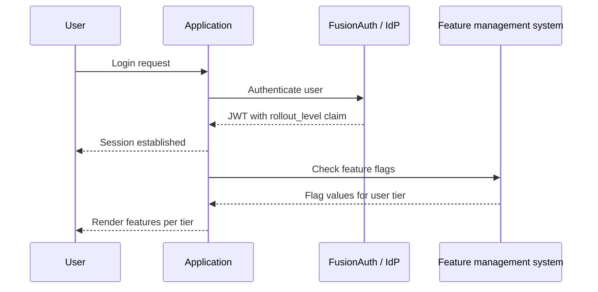

Progressive delivery is the idea that instead of dumping a release of software onto your users, you allow them to control when new features are rolled out. It separates the deployment of software from feature enablement. This minimizes jerk, a term for unexpected user impact.

{/* more */}

I recently hosted a webinar with Adam Zimman, one of the co-authors of ["Progressive Delivery"](https://progressivedelivery.com/). We covered a wide range of topics, from Voyager One still receiving software updates to how BMW used feature flagging to comply with regional laws. You can watch the [webinar here](/webinar/progressive-delivery-and-the-role-of-identity-ship-features-with-confidence).

Identity is a critical part of progressive delivery. Adam covers two aspects of this in the webinar:

* **group your users**: Dan might be a beta user who wants all new features rolled out immediately. Adam, on the other hand, wants a more stable and consistent user experience, with any changes introduced slowly (or after they are more thoroughly tested by early adopters in production). This categorization is tied to user identity and these preferences can be stored in one or more user attributes. Your application can then enable certain features for specific categories of users. The book calls this _"progressive rollout"_.

* **allow users to opt in to certain categories**: an individual user might want access to one set of new features (e.g. a new UI for a certain feature), or an organization admin could do the same for their entire team. This authority to determine when features are enabled is called _"radical delegation"_.

Let's talk about how this would work.

## High-Level Architecture

Here's a high-level diagram of how a user would interact with an application architected for progressive delivery:



When a user logs in, the application forwards the authentication request to FusionAuth or another auth server. FusionAuth validates the credentials and returns a signed JWT. That JWT contains a `rollout_level` claim, which is an attribute that indicates which tier of features they should receive (for example, alpha, beta, or GA). In FusionAuth, this is done using the [JWT populate lambda](/docs/extend/code/lambdas/jwt-populate), which takes attributes from the user and adds them to the JWT. This pattern could also be used for longer-lived groupings, such as geography or pricing tier.

With the session established, the application passes the `rollout_level` to the feature management system, which evaluates the claim and returns the appropriate flag values for that user's level. The application renders the features that match, ensuring that new functionality is progressively exposed based on user attributes rather than a blanket release to all users.

You have two options for feature management:

* a specialized feature server, external from your application
* a feature flagging framework, which embeds the flagging logic

A specialized feature server (like LaunchDarkly, Flagsmith, or Unleash) offers governance, auditability, environment management, and reporting, but adds a dependency and cost. A feature flagging framework embedded in your application is cheaper and simpler, but you'll build out reporting and governance yourself as you scale.


## FusionAuth Implementation

Let's dig in a bit more into how FusionAuth can help with this kind of rollout plan.

The first step is identifying users by desired feature rollout. To do this, you'll add attributes to the user in the `user.data` field. The example above uses `rollout_level`, with a value corresponding to a tier like `alpha`, `beta`, or `GA`, but you could use numbers for more granularity.

### Controlling The Attribute

There are several ways to control `rollout_level`:

* user self-service, where the user controls their level
* admin control, where an admin user can assign a level to a user
* groups, where the rollout level is assigned to it and inherited by members
* tenants, where an entire set of users in a tenant are assigned a rollout level

Let's look at each of these and how you'd implement them in FusionAuth.

For user self-service, expose it to end users via [account self-service](/docs/lifecycle/manage-users/account-management/). `rollout_level` is just one more form field the user can adjust. You ask them what level of feature rollout they prefer. You can use FusionAuth's self-service account pages, or build your own account pages that use the [SDKs](/docs/sdks) to set this value in FusionAuth.


Above you can see creation of the `rollout_level` field; you'd then [add it to the self-service form](/docs/lifecycle/manage-users/account-management/customizing-account-management).

Alternatively, admins can set the `rollout_level` using [custom admin forms](/docs/lifecycle/manage-users/admin-forms) in the FusionAuth admin UI. They can also use the SDK if the admin dashboard is in your application.


You can also manage this at the group level by associating a rollout tier with a specific group and placing users into it accordingly. You'll need to use the API or an SDK to set the group rollout tier. Here's an example of such code:

```bash
#!/bin/bash

FUSIONAUTH_URL="https://your-instance.fusionauth.io"
API_KEY="your-api-key"
GROUP_ID="$1"
ROLLOUT_LEVEL="$2"

if [[ -z "$GROUP_ID" || -z "$ROLLOUT_LEVEL" ]]; then
  echo "Usage: $0 <group-id> <alpha|beta|GA>"
  exit 1
fi

curl -s -X PATCH "$FUSIONAUTH_URL/api/group/$GROUP_ID" \
  -H "Authorization: $API_KEY" \
  -H "Content-Type: application/json" \
  -d "{
    \"group\": {
      \"data\": {
        \"rollout_level\": \"$ROLLOUT_LEVEL\"
      }
    }
  }"
```

which results in a group that looks like this (check out the `data` object):

```json
{
  "group": {
    "data": {
      "rollout_level": "beta"
    },
    "id": "2b51db04-ceed-46ec-8506-73548a32c163",
    "insertInstant": 1777507062503,
    "lastUpdateInstant": 1777507081106,
    "name": "beta_users",
    "roles": {},
    "tenantId": "bafb4319-b7ca-ed27-fa2f-bbdba9d8ec06"
  }
}
```

Finally, you can also set the `rollout_level` for an entire tenant. This value then controls whether that set of users wants the latest features or prefers a more conservative feature rollout. To set it, you'd use a similar script or SDK as for the group configuration shown previously.

## Delivering Attributes to Your Application

Okay, so you've stored the `rollout_level` attribute on the user, group or tenant. But how does that attribute actually reach your application and the feature management system? 

In FusionAuth, user attributes are delivered in a JWT after the user authenticates. You can customize your JWT format with a JWT populate lambda, as mentioned above. A lambda is also where you'd resolve precedence. If a user is assigned a `rollout_level` but is also in a group with a different setting, which one wins? The lambda code can determine this.

Here's example lambda code that pulls a value from a user data field.

```javascript
function populate(jwt, user, registration, context) {
   if (user.data.rollout_level) {
     jwt.rollout_level = user.data.rollout_level;
   }
}
```

The user object is available to the JWT populate lambda.

Getting the `rollout_level` from a group or tenant is a bit more complex, because you need to call a FusionAuth API within the lambda ([making fetch calls from a lambda is a paid feature](/docs/extend/code/lambdas/lambda-remote-api-calls)). Here's an example that pulls from the group defined above.

```javascript
function populate(jwt, user, registration, context) {
  var apiKey = context.services.secrets.get('FusionAuthAPIKey');
  
  var groupIds = user?.memberships?.map(m => m?.groupId) ?? [];
  
  var groupResponses = [];
  for (var groupId of groupIds) {
    var response = fetch(`http://localhost:9012/api/group/${groupId}`, {
      method: "GET",
      headers: {
        "Authorization": apiKey
      }
    });
    if (response.status === 200) {
      var group = JSON.parse(response.body);
      if (group.group?.data?.rollout_level) {
        jwt.rollout_level = group.group?.data?.rollout_level;
      }
    }
  }
}
```

In either case, you associate the lambda with your application, and then after the user logs in, you end up with a JWT that looks something like this:

```json
{
  "aud": "85a03867-dccf-4882-adde-1a79aeec50df",
  "exp": 1777521955,
  "iat": 1777518355,
  "iss": "acme.com",
  "sub": "00000000-0000-0000-0000-000000000005",
  "jti": "e8df33c8-1715-4b31-a017-dbd9f6017dd7",
  "authenticationType": "PASSWORD",
  "tty": "at",
  "applicationId": "85a03867-dccf-4882-adde-1a79aeec50df",
  "roles": [],
  "auth_time": 1777518355,
  "tid": "30663132-6464-6665-3032-326466613934",
  "rollout_level": "beta"
}
```

Note the `rollout_level` claim. After verifying the signature of the JWT, this `rollout_level` claim is now available for all your downstream services.

These tokens should expire after seconds to minutes, depending on your settings. If you modify a user attribute, you can expect it to reach the JWT after, at most, the lifetime of the token. Within FusionAuth, you can set token lifetimes on an application by application basis. Weigh the impact of regular token refresh vs delay in propagating a change in tier to your feature management system.

## Searching

You can also use [FusionAuth's search capabilities](/docs/lifecycle/manage-users/search/user-search-with-elasticsearch) to query users or gather aggregate stats. For example, you might want to know how many users in a given tenant have enabled the beta `rollout_level`.

You can do this with this search query:

```sh
{
  "match": {
    "data.rollout_level": {
      "query": "beta"
    }
  }
}
```

This will give you all the users with that `user.data` field, but you can also query for just the total number of users using the `accurateTotal` attribute on the request and reading the `total` attribute on the response. There are similar APIs for finding the number of users in a group or tenant.

Running such search can help with decision making. For instance, you might want to monitor usage patterns of the `beta` group to decide when to promote a feature to GA.

Please see [the search documentation](/docs/lifecycle/manage-users/search/user-search-with-elasticsearch) for more details.

## Connecting to Your Feature Flagging System

Once that JWT is delivered to your application, [verify the signature and other claims](/articles/tokens/building-a-secure-jwt#consuming-a-jwt), then pass it to your feature management system and use the results from that system to control feature delivery.

Now, I don't want to minimize the engineering effort required to build out feature management in your application. That work happens in your application and the integration with a feature management system takes time and effort.

But with this pattern, you can undertake the effort knowing you have a solid identity source where user attributes are centrally managed in a flexible, performant way.

## Summing Up

Progressive delivery is fundamentally about deciding _which users see which features when_. That decision starts with knowing who your users are. Identity isn't just the login step that happens before the interesting work; it's the foundation that makes targeted rollouts possible in the first place.

By combining FusionAuth's flexible user attributes, data fields, search capabilities, and the JWT populate lambda, you have a centralized, performant place to manage the categorization that everything else depends on.

If you want to learn more, [watch my full chat with Adam Zimman about progressive delivery and identity here](/webinar/progressive-delivery-and-the-role-of-identity-ship-features-with-confidence).
