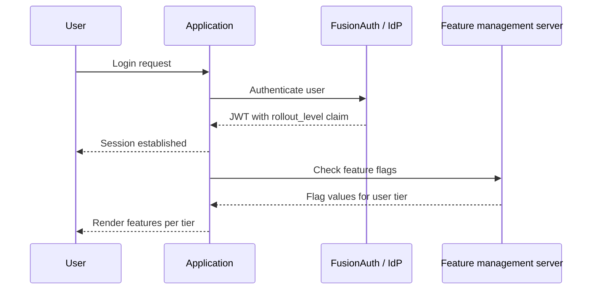

Progressive delivery is the idea that instead of dumping a release of software onto your users, you allow them to control when new features are rolled out. It separates the deployment of software from feature enablement. This minimizes user impact, which is termed "jerk".

{/* more */}

I recently hosted a webinar with Adam Zimmer, one of the co-authors of ["Progressive Delivery"](https://progressivedelivery.com/). 

We covered a wide range of topics, from Voyager One still receiving software updates to how BMW used feature flagging to comply with local laws. You can watch the [webinar here](/webinar/progressive-delivery-and-the-role-of-identity-ship-features-with-confidence).

Identity is a critical part of progressive delivery. Adam covers two aspects of this in the webinar, and I wanted to dig into it more.

The first is that you need to be able to group your users. For example, Dan might be a beta user who wants all new features rolled out immediately, while Adam is a laggard who prefers a stable feature set, with any changes introduced slowly. This categorization is tied to user identity. It can be stored in one or more user attributes. Then you can build your application to enable certain features for certain categories of users. The book calls this "progressive rollout".

The second aspect is allowing users to opt in to certain categories, either as an individual user choosing a certain level of new features, or as an organization admin doing the same on behalf of their team. This dispersion of authority to determine when features are enabled is called "radical delegation".

Let's talk about how this would work.

## High Level Architecture

Here's a high level diagram of how a user would interact with an application architected for progressive delivery.



When a user logs in, the application forwards the authentication request to FusionAuth or another auth server. FusionAuth validates the credentials and returns a signed JWT. That JWT contains a `rollout_level` claim, which is an attribute that indicates which tier of features they should receive (for example, alpha, beta, or GA). This pattern could also be used for longer-lived groupings, such as geography or pricing tier.

With the session established, the application passes the `rollout_level` to the feature management server, which evaluates the claim and returns the appropriate flag values for that user's level. The application renders the features that match, ensuring that new functionality is progressively exposed based on user attributes rather than a blanket release to all users.

## FusionAuth Implementation

Let's dig in a bit more into how FusionAuth can help with this kind of rollout plan.

The first step is identifying users by desired feature rollout. Add attributes to the user in the `user.data` field. In the example above, you can see that `rollout_level` is used. The value is a tier like alpha, beta, or GA, but you could use numbers if you need more granularity.

### Controlling The Attribute

There are several ways to control `rollout_level`. 

* user self-service, where the user controls their level
* admin control, where an admin user can assign a level to a user
* groups, where groups have the rollout level and you can add a user to a group to ahve them get that rollout level
* tenants, where an entire set of users in a tenant are assigned the same rollout level

Let's look at each of these and how you'd implement them in FusionAuth.

For user self-service, expose it to end users via [account self-service](/docs/lifecycle/manage-users/account-management/). `rollout_level` is just one more form field the user can adjust. You ask them what level of feature rollout they prefer. When using FusionAuth's self-service account pages, you can theme them just as you want. If you are building your own account pages, just use the [SDKs](/docs/sdks) to set this value in FusionAuth.


Above you can see creation of the `rollout_level` field; you'd then [add it to the self-service form](/docs/lifecycle/manage-users/account-management/customizing-account-management).

Alternatively, admins can set the `rollout_level` using [custom admin forms](/docs/lifecycle/manage-users/admin-forms) in the FusionAuth admin UI. They can also use the SDK if the admin dashboard is in your application.


You can also manage this at the group level by associating a rollout tier with a specific group and placing users into it accordingly. You'll need to use the API or an SDK to set the group rollout tier. Here's an example of such code:

```bash
#!/bin/bash

FUSIONAUTH_URL="https://your-instance.fusionauth.io"
API_KEY="your-api-key"
GROUP_ID="$1"
ROLLOUT_LEVEL="$2"

if [[ -z "$GROUP_ID" || -z "$ROLLOUT_LEVEL" ]]; then
  echo "Usage: $0 <group-id> <alpha|beta|GA>"
  exit 1
fi

curl -s -X PATCH "$FUSIONAUTH_URL/api/group/$GROUP_ID" \
  -H "Authorization: $API_KEY" \
  -H "Content-Type: application/json" \
  -d "{
    \"group\": {
      \"data\": {
        \"rollout_level\": \"$ROLLOUT_LEVEL\"
      }
    }
  }"
```

which results in a group that looks like this (check out the `data` object):

```json
{
  "group": {
    "data": {
      "rollout_level": "beta"
    },
    "id": "2b51db04-ceed-46ec-8506-73548a32c163",
    "insertInstant": 1777507062503,
    "lastUpdateInstant": 1777507081106,
    "name": "beta_users",
    "roles": {},
    "tenantId": "bafb4319-b7ca-ed27-fa2f-bbdba9d8ec06"
  }
}
```

Finally, you can also set this value for an entire tenant. If you're using a logical multi-tenant architecture, use the `tenant.data` field to store the `rollout_level`.

This value then controls whether an entire organization wants the latest features or prefers a more conservative feature rollout. To set it, you'd use a similar script or SDK as for the group configuration shown previously.

## Delivering Attributes to Your Application

Okay, so you've stored the `rollout_level` attribute on the user, group or tenant.

But how does that attribute actually reach your application and the feature flagging system? 

In FusionAuth, user attributes are delivered in a JWT after the user authenticates. You can customize your JWT format with a JWT populate lambda.  Here's example lambda code that pulls a value from a user data field.

```javascript
function populate(jwt, user, registration, context) {
   if (user.data.rollout_level) {
     jwt.rollout_level = user.data.rollout_level;
   }
}
```

The user object is available to the JWT populate lambda.

Getting the `rollout_level` from a group or tenant is a bit more complex, because you need to call a FusionAuth API within the lambda (this is a paid feature). Here's an example that pulls from the group defined above.

```javascript
function populate(jwt, user, registration, context) {
  var apiKey = context.services.secrets.get('FusionAuthAPIKey');
  
  var groupIds = user?.memberships?.map(m => m?.groupId) ?? [];
  
  var groupResponses = [];
  for (var groupId of groupIds) {
    var response = fetch(`http://localhost:9012/api/group/${groupId}`, {
      method: "GET",
      headers: {
        "Authorization": apiKey
      }
    });
    if (response.status === 200) {
      var group = JSON.parse(response.body);
      if (group.group?.data?.rollout_level) {
        jwt.rollout_level = group.group?.data?.rollout_level;
      }
    }
  }
}
```

In either case, you associate the lambda with your application, and then after the user logs in, you end up with a JWT that looks something like this:

```json
{
  "aud": "85a03867-dccf-4882-adde-1a79aeec50df",
  "exp": 1777521955,
  "iat": 1777518355,
  "iss": "acme.com",
  "sub": "00000000-0000-0000-0000-000000000005",
  "jti": "e8df33c8-1715-4b31-a017-dbd9f6017dd7",
  "authenticationType": "PASSWORD",
  "tty": "at",
  "applicationId": "85a03867-dccf-4882-adde-1a79aeec50df",
  "roles": [],
  "auth_time": 1777518355,
  "tid": "30663132-6464-6665-3032-326466613934",
  "rollout_level": "beta"
}
```

Note the `rollout_level` claim. After verifying the signature of the JWT, this `rollout_level` claim is now available for all your downstream services.

These tokens should expire after seconds to minutes, depending on your settings. If you modify a user attribute, you can expect it to reach the JWT after, at most, the lifetime of the token.

## Searching

You can also use [FusionAuth's search capabilities](/docs/lifecycle/manage-users/search/user-search-with-elasticsearch) to query users or gather aggregate stats. For example, you might want to know how many users in a given tenant have enabled the beta `rollout_level`.

You can do this with this search query:

```sh
{
  "match": {
    "data.rollout_level": {
      "query": "beta"
    }
  }
}
```

This will give you all the users with that `user.data` field, but you can also query for just the total number of users using the `accurateTotal` attribute on the request and reading the `total` attribute on the response. There are similar APIs for finding the number of users in a group or tenant.

Please see [the search documentation](/docs/lifecycle/manage-users/search/user-search-with-elasticsearch) for more details.

## Connecting to Your Feature Flagging System

Once that JWT is delivered to your application, [verify the signature and other claims](/articles/tokens/building-a-secure-jwt#consuming-a-jwt), then pass it to your feature flagging system and use the results from that system to control feature delivery.

Now, I don't want to minimize the engineering effort required to build out feature flagging in your application. That work happens in your application and the integration with a feature flagging system takes time and effort.

But with this pattern, you can undertake the effort knowing you have a solid identity source where user attributes are centrally managed in a flexible, performant way.

## Summing Up

By combining FusionAuth's flexible user attributes, data fields, search capabilities, and the JWT populate lambda, you can deliver data to help power progressive delivery for end users.

FusionAuth is a strong building block to categorize users and deliver attributes for the feature flagging framework and your application to depend on.

[Watch my full chat with Adam Zimman about progressive delivery and identity here](/webinar/progressive-delivery-and-the-role-of-identity-ship-features-with-confidence).
