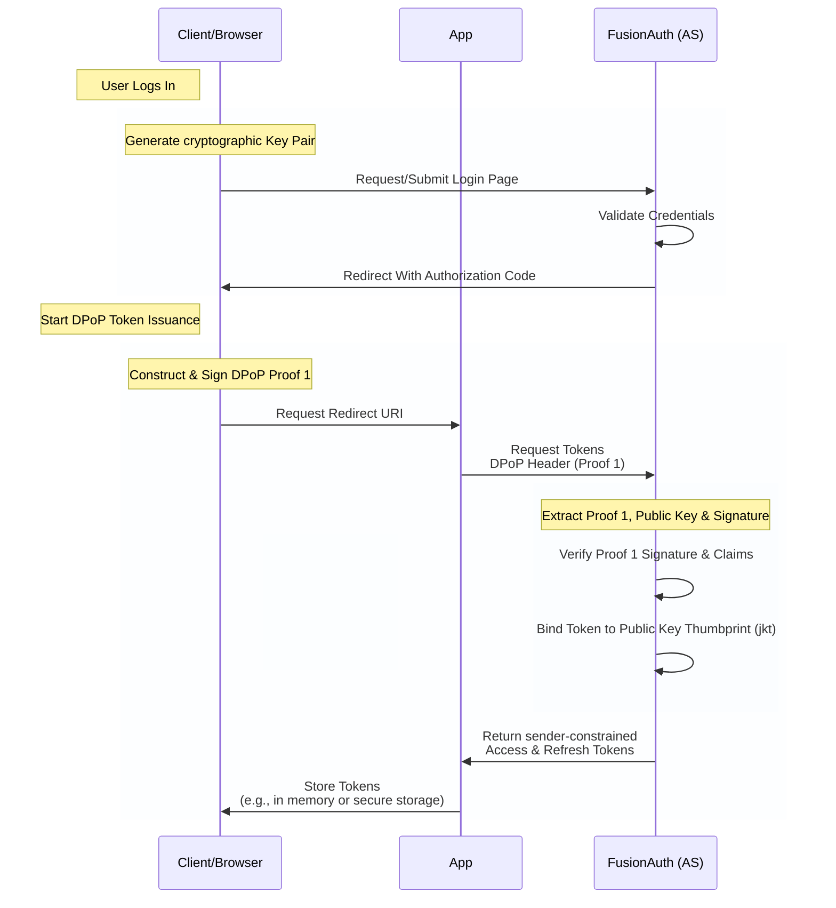

import EnterprisePlanBlurb from 'src/content/docs/_shared/_enterprise-plan-blurb.mdx';
import Aside from 'src/components/Aside.astro'
import Breadcrumb from 'src/components/Breadcrumb.astro'

If you're forced to authenticate your users in a frontend-only situation, you're opening your application up to a variety of attack vectors. 

Many single-page applications (SPAs) exchange a token between the authentication server and the client. Even when transferred securely, a malicious actor has many ways to access the token. Once stolen, any other client can use the token to gain access to a user's account. FusionAuth already helps mitigate this by storing this information in `httponly` cookies to keep third-party extensions from being able to access the information. But the frontend is a dangerous place for a token.

<EnterprisePlanBlurb />

<Aside title="What is an httponly cookie?">

We store our tokens in `httponly` cookies to prevent third-party JavaScript from accessing information stored in the cookie. The `httponly` flag on a cookie forbids JavaScript from accessing the cookie. It can still be sent with a JavaScript-initiated request, but it can't be read. This cuts off one avenue for attackers to gain access to a token. 

</Aside>

An even stronger approach "sender-constrains" tokens to a specific client. A sender-constrained token cannot be replayed from another client unless the attacker also possesses the corresponding private key. This limits the harm from potential data breaches.

[RFC 9449](https://www.rfc-editor.org/rfc/rfc9449.html) provides a way to set up sender constraining OAuth2.0 tokens: Distributed Proof of Possession (DPoP).

FusionAuth added support for [DPoP](/docs/lifecycle/authenticate-users/oauth/dpop) in `1.63.0` for enterprise customers. Any application capable of working with JavaScript Object Signing and Encryption (JOSE) cryptography has been able to enable DPoP in the hosted backend by passing the proper header and sending the public key. 

## What does DPoP do?

The DPoP flow can get pretty overwhelming, so bear with me as I condense it down and simplify it a bit. If you want more in-depth discussion on the process, we have [a docs page on FusionAuth's DPoP OAuth flow](/docs/lifecycle/authenticate-users/oauth/dpop).

At its core, DPoP stems from a key pair generated by the client on the initial token request. This key pair signs the proofs for all future requests.

The DPoP flow involves the following actions from the client's perspective:

1. Generate a key pair
1. Auth server returns an authorization code
1. Generate a DPoP proof constructed from elements of the current state like URI, time, and HTTP method
1. Send DPoP proof and public key to the auth server
1. Auth server validates the proof and returns a sender-constrained token
1. To access an app, send a new DPoP proof, this time containing the access token
1. App verifies the proof and grants access if the proof and the token match



Since every request requires the construction, signing, and validation of a DPoP proof, that ends up being a lot of overhead for your SPA. While everything you need for generating those proofs exists in the browser, it requires more code and knowledge than exist in a typical frontend application.

To make it faster and easier to take advantage of DPoP in your applications, we added a built-in DPoP implementation to our [React](/docs/sdks/react-sdk), [Vue](/docs/sdks/vue-sdk), and [Angular](/docs/sdks/angular-sdk) SDKs.

Let's walk through setting up secure, sender-constrained authentication for a React application with the FusionAuth JavaScript SDK.

## Requirements

To run through this tutorial, you'll need:

* [Docker](https://docs.docker.com/get-started/get-docker/) 23 or later
* On macOS and Windows, one of the following container management tools:
  * [OrbStack](https://docs.orbstack.dev/quick-start) (to use Orbstack for `docker compose` commands after install, run `docker context use orbstack`)
  * [Podman](https://podman.io/docs/installation) (in the commands below, replace `docker` with `podman`)
  * [Docker desktop](https://www.docker.com/products/docker-desktop/)

Begin by downloading [the GitHub starting point](https://github.com/FusionAuth/react-sdk-dpop-example):

```shell-session
git clone https://github.com/FusionAuth/react-sdk-dpop-example.git
```

```shell-session
cd react-sdk-dpop-example/fusionauth-backend
```

```shell-session
docker compose up -d
```

This will setup a FusionAuth server locally for you. If you want to log into the Admin UI panel, go to [`http://localhost:9011/admin`](http://localhost:9011/admin). Use the following admin account credentials to log in:

* Username: `admin@example.com`
* Password: `password`

From the panel, you can add new users to test the application or just use the main admin account to test.

If you don't use the FusionAuth backend in the project, you'll need to configure your backend with an application, API key, and more. We'll note those throughout the tutorial, but for learning purposes, it's probably best to use the configured backend.

Next, you need to set up the React frontend. Run the following commands from the root of the project:

```shell-session
cd react-frontend-steps/site-start
```

```shell-session
npm ci
```

``` shell-session
npm run dev
```

This sets up the React app and begins running the Vite server. Once the application is running, you can navigate to `http://localhost:3000` to view the frontend application.

You'll note that we show all the games listed for our game studio, but when we navigate to "My Games" in the main navigation, the page isn't protected. This will be the page that we protect with FusionAuth.

## Configuring the FusionAuth JavaScript SDK

While you could roll your own interface with FusionAuth, you lose out on a lot of built-in functionality. We highly recommend you use one of our SDKs to make it as easy and secure as possible to integrate with FusionAuth.

To start, run the following command to install the SDK in your project:

npm install @fusionauth/react-sdk
```

Once it's in the project, we'll configure it for the application in `main.tsx`.

Import `FusionAuthProvider` and the type for the configuration object at the top of the file:

```javascript
import { FusionAuthProvider } from '@fusionauth/react-sdk';
import type { FusionAuthProviderConfig } from '@fusionauth/react-sdk';
```

Then configure your provider:

```javascript
const fusionAuthProviderConfig: FusionAuthProviderConfig = { 
  redirectUri: 'http://localhost:3000', 
  postLogoutRedirectUri: 'http://localhost:3000',
  shouldAutoRefresh: true,
  scope: 'openid email profile offline_access',
  clientId: 'e9fdb985-9173-4e01-9d73-ac2d60d1dc8e',
  serverUrl: 'http://localhost:9011',

  onRedirect: () => { console.log('Login successful'); }
};

```
The config object provides the FusionAuth provider with all the information it needs to contact FusionAuth when a user tries to log in or we want to check roles or user data in the application.

Once we have the configuration values set, we need to wrap our `<App />` component with the `FusionAuthProvider` component.

```jsx
ReactDOM.createRoot(document.getElementById('root')!).render(
  <StrictMode>
    <BrowserRouter>
      <FusionAuthProvider {...fusionAuthProviderConfig}>
        <App />
      </FusionAuthProvider>
    </BrowserRouter>
  </StrictMode>
);
```

This is enough for the React app to check with FusionAuth for information on every route, but we need to protect the `/account` route now.

## Protecting a route

On the specific routes we want to protect, we need to check if the user is logged in. If the user is logged in, we display the route, but if the user isn't, we need to redirect them from the page. 

To do that, we'll use the `useFusionAuth()` hook and check to see if the user is logged in.

```javascript
const navigate = useNavigate();
const { isLoggedIn, isFetchingUserInfo } = useFusionAuth();

useEffect(() => { if (!isLoggedIn) navigate("/"); }, [isLoggedIn, navigate]);

if (!isLoggedIn || isFetchingUserInfo) return null;
```

In this code, we use React's `useEffect` to monitor the `isLoggedIn` variable and the `navigate` variable. If they change, we check if the user is logged in, and if they aren't, we navigate to the homepage. By monitoring `isLoggedIn` we get notified of any authentication changes and automatically redirect away from the page if the status changes unexpectedly. By monitoring `navigate`, we check to see if the user tries to navigate and if they do, we check logged in status to add an extra layer of security to any other protected routes.

We want to make sure never to show the content of the page if the user isn't logged in, so while we wait for `useEffect` to fire, we also return `null` if the user isn't logged in or we're still fetching information. This keeps the page blank until we know for sure the user is logged in.

This is one potential flow for authentication check. You could also display different contents if the user isn't logged in -- encouraging them to log in or redirect directly to a login page.

The last step to get authentication set up is to add login and logout functionality.

## Logging in and out

We'll modify the NavBar component to allow for logging in and logging out.


```jsx
import { useFusionAuth } from '@fusionauth/react-sdk';

export function NavBar() {

  const { isLoggedIn, startLogin, startLogout, userInfo } = useFusionAuth();

  return (
    <header className="w-full z-50 bg-black/80 backdrop-blur-sm">
      <div className="container mx-auto px-4">
        <div className="container relative flex h-16 items-center justify-between">
          <a className="flex items-center space-x-2" href="/">
            <span className="text-white font-bold">IRON PIXEL STUDIOS</span>
          </a>

          <div className="flex items-center space-x-4">
            <a className="text-gray-300 hover:text-white" href="/account">My Games</a>

            {isLoggedIn ? (
              <>
                <span className='text-white'>{userInfo?.email} (<a href="#" onClick={() => startLogout()}>Logout</a>)</span>
              </>
            ) : (
              <button
                className='button'
                onClick={() => {
                  sessionStorage.setItem('justLoggedIn', 'true');
                  startLogin();
                }}
              >
                Login
              </button>
            )}
          </div>
        </div></div>
    </header>

  )
}
```
The FusionAuth SDK provides us everything we need in the same `useFusionAuth()` hook

In the component, we check to see if the user is logged in with the `isLoggedIn` property. If the user is logged in, we display the user's email and a logout button. The user's email comes from the `userInfo` object. For the logout link, we provide an `onClick` method to call the `startLogout()` method from the SDK. This will automatically handle all the logout functionality for you.

If the user is not logged in, we display a login button. The button is provided the `startLogin()` method in the `onClick` prop just like the logout link.

From here, a user is able to log in and out.

But we're not doing everything we can to protect the token that the SDK is receiving. While the access and refresh tokens are stored in an `httponly` cookie, if someone were to gain access to them, they could use those tokens away from the original browser.

To fix this, we need to sender-constrain the tokens; meaning allow the tokens to only be used from the browser in which they originated. This is where DPoP comes in.

## Enable DPoP for the application

While there is no need to explicitly enable DPoP as a setting, there are a few configurations we need to update to make DPoP work in both the SDK and the FusionAuth backend.

The one change we need in our codebase is to head to the `main.tsx` template and update the FusionAuthProvider to use DPoP. This one change is all we need for the SDK to run all the DPoP cryptography and proofs on each request. Way better than writing it ourselves.

```javascript {8}
const fusionAuthProviderConfig: FusionAuthProviderConfig = { 
  redirectUri: 'http://localhost:3000', 
  postLogoutRedirectUri: 'http://localhost:3000',
  shouldAutoRefresh: true,
  scope: 'openid email profile offline_access',
  clientId: 'e9fdb985-9173-4e01-9d73-ac2d60d1dc8e',
  serverUrl: 'http://localhost:9011',
  useDpop: true, // Opt-in to DPoP mode. See "DPoP Mode" below. Defaults to false.

  onRedirect: () => { console.log('Login successful'); }
};
```

Once we implement this change, however, the login process breaks down. You should start receiving errors around accepted headers. This is because DPoP uses JavaScript to send new types of requests to FusionAuth; we need to configure FusionAuth's CORS filter to accept from our application.

In the [Admin UI](http://localhost:9011/admin), navigate to the <Breadcrumb>Settings -> System</Breadcrumb>. Enable CORS if it isn't already and add the following settings:

* **Allowed headers**: Add `dpop`, `Authorization`, and `Accept`, hitting **Enter** after each header to add each one separately
* **Allowed origins**: `http://localhost:3000`


<Aside title="Update via the API">

Since we're already running the Admin UI, I recommend using that for this tutorial. As you explore FusionAuth deeper, you may want to work more with the API instead of the GUI. If that's the case, check out [the System API docs](https://fusionauth.io/docs/apis/system/update-the-system-configuration) to see how to edit these settings via code instead of the application.

</Aside>

When those settings are updated, restart your application. Your login should once again work. Congratulations! You now have an app that uses DPoP to authenticate using sender-constrained tokens. Now, even if an attacker steals your token, they can't use it without also having your private key.

## What did DPoP change?

So how did DPoP change the app's authentication?

On the initial request for the login page, the SDK now generates a public/private key pair in the browser. Our client then creates a signed token for the DPoP request:

```json
// JWT Head
{
  "alg": "ES256",
  "typ": "dpop+jwt",
  "jwk": {
    "kty": "EC",
    "crv": "P-256",
    "x": "AHTcLNyra6ThKWfhRkn-79L9hzt71LJD9x3hZEHjW5E",
    "y": "Zfy3_hVtvO0V8ZjQVRuZZIfEZ-31fMfwYFueYQLdI2Q"
  }
}

// JWT Body
{
  "iat": 1788182460,
  "jti": "eb228a3e-e95f-4920-a07a-09a791716075",
  "htm": "POST",
  "htu": "http://localhost:9011/oauth2/token"
}
```
This token provides the data necessary to complete a DPoP proof, including:

* the algorithm used (`alg`)
* a representation of the public key (`jwk`)
* the time the JWT was issued (`iat`)
* a unique identifier (`jti`)
* the HTTP method (`htm`)
* the requested URI (`htu`)

The SDK signs the DPoP proof JWT with the private key and sends the signed JWT to FusionAuth via the `/oauth2/token` route.

FusionAuth then validates that request and issues a sender-constrained token using DPoP. The access token now contains a JKT claim that links to the public key.

The token is stored in local storage in the browser. As long as the token exists and has not expired, the application will recognize the user as logged in. When the token expires, the application will make a new DPoP proof and send to FusionAuth (since there's no application server in SPA architecture) and return back a refreshed token or a new authorization flow if the refresh token has expired.

While running the example, you can view most of this working from your network panel in your developer tools:


## Conclusion

While DPoP adds a new layer of complexity to apps, it also adds a new layer of protection. Implementing DPoP from scratch might be a lot of work and maintenance, but with FusionAuth's React, Vue, and Angular SDKs, you can now implement DPoP in just a few lines of configuration.

If you use FusionAuth for an SPA with an enterprise plan, we strongly suggest implementing DPoP.
