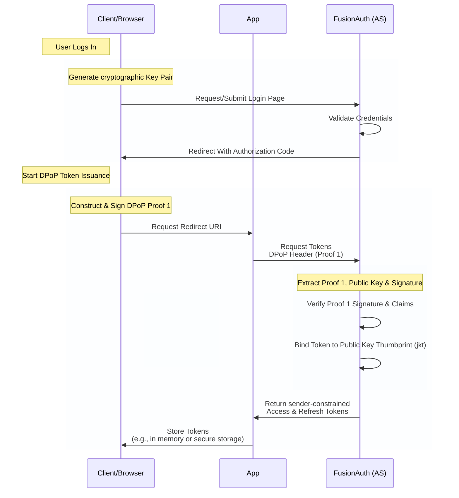

import EnterprisePlanBlurb from 'src/content/docs/_shared/_enterprise-plan-blurb.mdx';
import Aside from 'src/components/Aside.astro'


If you're forced to authenticate your users in a frontend-only situation, you're opening your application up to a variety of attack vectors. 

For many single-page applications (SPAs), a token is exchanged between the authentication or application server and the client. While it's transferred securely, there are many ways for a malicious actor to get ahold of that token. If that token is stolen, it can be used from any other client to gain access. FusionAuth already helps mitigate this by storing this information in `httponly` cookies to keep third-party extensions from being able to access the information. But once it's out, it's out.

<EnterprisePlanBlurb />

<Aside title="What is an httponly cookie?">

The reason we store our tokens in `httponly` cookies is to prevent third-party JavaScript from having access to the information stored in the cookie. The `httponly` flag on a cookie forbids JavaScript from accessing the cookie. It can still be sent with a JavaScript-initiated request, but it can't be read. This cuts off one avenue for attackers to gain access to a token. 

</Aside>

An even stronger approach is to "sender-constrain" the tokens your application receives. Each token can only be used by the specific client it was issued by. A sender-constrained token cannot be replayed from another client unless the attacker also possesses the corresponding private key. This keeps the harm from potential data breaches limited.

RFC 9449 provides a way to set up sender constraining OAuth2.0 tokens named Distributed Proof of Possession (DPoP).

As of version 1.63, FusionAuth has offered [Distributed Proof of Possession (DPoP)](https://fusionauth.io/docs/lifecycle/authenticate-users/oauth/dpop) for our enterprise customers. Any application capable of working with JavaScript Object Signing and Encryption (JOSE) cryptography has been able to enable DPoP in the hosted backend by passing the proper header and sending the cryptographic key pair. 

## What does DPoP do?

The DPoP flow can get pretty overwhelming, so bear with me as I condense it down and simplify it a bit. If you want more in-depth discussion on the process, we have [a docs page on FusionAuth's DPoP OAuth flow](https://fusionauth.io/docs/lifecycle/authenticate-users/oauth/dpop).

At its core, DPoP stems from a key pair generated by the client on the initial token request and is used to sign all the proofs for future requests.

To do this the general flow is:

* First request: Generate a key pair and send to the auth server
* Auth server sends back an authorization code
* The client then generates and sends back a DPoP proof constructed from elements of the current state like URI, time, HTTP method
* The auth server then validates the proof and sends back a sender-constrained token using the information from the proof
* When the client accesses a protected route, it sends a new DPoP proof, this time containing the access token to the resource server (our app)
* The Resource server verifies the proof and grants access if the proof and the token match




Since every request requires the construction, signing, and validation of a DPoP proof, that ends up being a lot of overhead for your SPA. While everything you need for generating those proofs exists in the browser, it requires more code and knowledge than exist in a typical frontend application.

Knowing that, and knowing that you're probably already using one of our SDKs if you're building a SPA, we baked all the DPoP goodness into the JavaScript SDKs with minimal code.

Let's walk through setting up secure, sender-constrained authentication for a React application with the FusionAuth JavaScript SDK.

## Requirements

To run through this tutorial, you'll need [the GitHub starting point](https://github.com/FusionAuth/react-sdk-dpop-example), and Docker and the `docker` command in your shell.

After cloning the starting point from GitHub, open the project and run the following commands:

```bash
git clone git@github.com:FusionAuth/react-sdk-dpop-example.git
cd react-sdk-dpop-example/fusionauth-backend
docker compose up -d
```

This will setup a FusionAuth server locally for you. If you want to log into the FusionAuth admin panel, you can navigate to `http://localhost:9011/admin` and use the username and password listed in the kickstart/kickstart.json file. From the panel, you can add new users to test the application or just use the main admin account to test.

If you don't use the FusionAuth backend in the project, you'll need to configure your backend with an application, API key, and more. We'll note those throughout the tutorial, but for learning purposes, it's probably best to use the configured backend.

Next, you need to set up the React frontend. Run the following commands from the root of the project:

```bash
cd react-frontend-steps/site-start
npm install
npm run dev
```
This sets up the React app and begins running the Vite server. Once the application is running, you can navigate to `http://localhost:3000` to view the frontend application.

You'll note that we show all the games listed for our game studio, but when we navigate to "My Games" in the main navigation, the page isn't protected. This will be the page that we protect with FusionAuth authentication.

## Configuring the FusionAuth JavaScript SDK

While you could roll your own interface with FusionAuth, you lose out on a lot of built-in functionality. We highly recommend you use our JavaScript SDK to deal with authentication of your application if you're using React, Vue, or Angular.

To start, run the following command to install the SDK in your project:

```bash
npm install @fusionauth/react-sdk
```

Once it's in the project, we'll configure it for the application in the `main.tsx` file.

Import the FusionAuthProvider and the type for the configuration object at the top of main.tsx.

```javascript
import { FusionAuthProvider } from '@fusionauth/react-sdk';
import type { FusionAuthProviderConfig } from '@fusionauth/react-sdk';
```

Then create the fusionAuthProviderConfig object.

```javascript
const fusionAuthProviderConfig: FusionAuthProviderConfig = { 
  redirectUri: 'http://localhost:3000', 
  postLogoutRedirectUri: 'http://localhost:3000',
  shouldAutoRefresh: true,
  scope: 'openid email profile offline_access',
  clientId: 'e9fdb985-9173-4e01-9d73-ac2d60d1dc8e',
  serverUrl: 'http://localhost:9011',

  onRedirect: () => { console.log('Login successful'); }
};

```
The config object provides the FusionAuth provider with all the information it needs to contact FusionAuth when a user tries to log in or we want to check roles or user data in the application.

Once we have the configuration values set, we need to wrap our `<App />` component with the `FusionAuthProvider` component.

```jsx
ReactDOM.createRoot(document.getElementById('root')!).render(
  <StrictMode>
    <BrowserRouter>
      <FusionAuthProvider {...fusionAuthProviderConfig}>
        <App />
      </FusionAuthProvider>
    </BrowserRouter>
  </StrictMode>
);
```

This is enough for the React app to check with FusionAuth for information on every route, but we need to protect the `/account` route now.

## Protecting a route

On the specific routes we want to protect, we need to check if the user is logged in. If the user is logged in, we display the route, but if the user isn't, we need to redirect them from the page. 

To do that, we'll use the `useFusionAuth()` hook and check to see if the user is logged in.

```javascript
const navigate = useNavigate();
const { isLoggedIn, isFetchingUserInfo } = useFusionAuth();

useEffect(() => { if (!isLoggedIn) navigate("/"); }, [isLoggedIn, navigate]);

if (!isLoggedIn || isFetchingUserInfo) return null;
```

In this code, we use React's `useEffect` to monitor the `isLoggedIn` variable and the `navigate` variable. If they change, we check if the user is logged in, and if they aren't, we navigate to the homepage. By monitoring `isLoggedIn` we get notified of any authentication changes and automatically redirect away from the page if the status changes unexpectedly. By monitoring `navigate`, we check to see if the user tries to navigate and if they do, we check logged in status to add an extra layer of security to any other protected routes.

We want to make sure never to show the content of the page if the user is logged in, so while we wait for `useEffect` to fire, we also return `null` if the user isn't logged in or we're still fetching information. This keeps the page blank until we know for sure the user is logged in.

This is one potential flow for authentication check. You could also display different contents if the user isn't logged in encouraging them to log in or redirect directly to a login page.

The last step to get authentication set up is to add login and logout functionality.

## Logging in and out

We'll modify the NavBar component to allow for logging in and logging out.


```jsx
import { useFusionAuth } from '@fusionauth/react-sdk';

export function NavBar() {

  const { isLoggedIn, startLogin, startLogout, userInfo } = useFusionAuth();

  return (
    <header className="w-full z-50 bg-black/80 backdrop-blur-sm">
      <div className="container mx-auto px-4">
        <div className="container relative flex h-16 items-center justify-between">
          <a className="flex items-center space-x-2" href="/">
            <span className="text-white font-bold">IRON PIXEL STUDIOS</span>
          </a>

          <div className="flex items-center space-x-4">
            <a className="text-gray-300 hover:text-white" href="/account">My Games</a>

            {isLoggedIn ? (
              <>
                <span className='text-white'>{userInfo?.email} (<a href="#" onClick={() => startLogout()}>Logout</a>)</span>
              </>
            ) : (
              <button
                className='button'
                onClick={() => {
                  sessionStorage.setItem('justLoggedIn', 'true');
                  startLogin();
                }}
              >
                Login
              </button>
            )}
          </div>
        </div></div>
    </header>

  )
}
```
The FusionAuth SDK provides us everything we need in the same `useFusionAuth()` hook

In the component, we check to see if the user is logged in with the `isLoggedIn` property. If the user is logged in, we display the user's email and a logout button. The user's email comes from the `userInfo` object. For the logout link, we provide an `onClick` method to call the `startLogout()` method from the SDK. This will automatically handle all the logout functionality for you.

If the user is not logged in, we display a login button. The button is provided the `startLogin()` method in the `onClick` prop just like the logout link.

From here, a user is able to log in and out.

But we're not doing everything we can to protect the token that the SDK is receiving. While the access and refresh tokens are stored in an httponly cookie, if someone were to gain access to them, they could use those tokens away from the original browser.

To fix this, we need to sender-constrain the tokens; meaning allow the tokens to only be used from the browser in which they originated. This is where DPoP comes in.

## Enabling DPoP for the application

While there is no need to explicitly enable DPoP as a setting, there are a few configurations we need to update to make DPoP work in both the SDK and the FusionAuth backend.

The one change we need in our codebase is to head to the `main.tsx` template and update the FusionAuthProvider to use DPoP. This one change is all we need for the SDK to run all the DPoP cryptography and proofs on each request. Way better than writing it ourselves.

```javascript
const fusionAuthProviderConfig: FusionAuthProviderConfig = { 
  redirectUri: 'http://localhost:3000', 
  postLogoutRedirectUri: 'http://localhost:3000',
  shouldAutoRefresh: true,
  scope: 'openid email profile offline_access',
  clientId: 'e9fdb985-9173-4e01-9d73-ac2d60d1dc8e',
  serverUrl: 'http://localhost:9011',
  useDpop: true, // Opt-in to DPoP mode. See "DPoP Mode" below. Defaults to false.

  onRedirect: () => { console.log('Login successful'); }
};
```

Once we implement this change, however, the login process breaks down. You should start receiving errors around accepted headers. This is because DPoP is using JavaScript to send new types of requests to FusionAuth and we need to configure FusionAuth's CORS filter to accept from our application.

In your FusionAuth admin, navigate to the Settings > System screen. Enable CORS if it isn't already and add the following settings:

* Allowed headers: `dpop`, `Authorization` and `Accept`
* Allowed origins: `http://localhost:3000` (or whatever URI your application has)

When those settings are updated, restart your application and your login should now work again. This time, with sender-constrained tokens that prevent a stolen access token from being replayed by an attacker who doesn't possess the client's private key.

## What did DPoP change?

OK, that was super easy, but what did it change about the way our application works?

Now, on the initial request for the login page, the SDK is generating a public/private key pair in the browser. Our client then creates a signed JWT for the DPoP request. 

```json
// JWT Head
{
  "alg": "ES256",
  "typ": "dpop+jwt",
  "jwk": {
    "kty": "EC",
    "crv": "P-256",
    "x": "AHTcLNyra6ThKWfhRkn-79L9hzt71LJD9x3hZEHjW5E",
    "y": "Zfy3_hVtvO0V8ZjQVRuZZIfEZ-31fMfwYFueYQLdI2Q"
  }
}

// JWT Body
{
  "iat": 1788182460,
  "jti": "eb228a3e-e95f-4920-a07a-09a791716075",
  "htm": "POST",
  "htu": "http://localhost:9011/oauth2/token"
}
```
This JWT provides the data necessary to complete a DPoP-bound token including the algorithm used (`alg`), a representation of the public key (`jwk`), the time the JWT was issued (`iat`), a unique identifier (`jti`), the HTTP method (`htm`), and the requested URI (`htu`).

The SDK then signs the JWT with the private key that was generated and sends it to FusionAuth.

FusionAuth then validates that request and issues a sender-constrained token using DPoP. The access token now contains a JKT claim that links to the public key.

When making API requests, a new DPoP proof will be generated. This proof is used verify that the token is properly formed and from the original sender. If it's not, the SDK knows to refuse access to the resource.

<Aside title="Dig Deeper in the Docs">
Want to see more about how DPoP works across all of FusionAuth? Read up on all the minutiae in [our DPoP documentation](https://fusionauth.io/docs/lifecycle/authenticate-users/oauth/dpop).
</Aside>

## Conclusion

While DPoP adds a new layer of complexity to what's happening in your SPA, it also adds a new layer of protection. If you were running the cryptography on your own, the overhead may not make sense in a lot of situations, but with our JavaScript SDKs, it's just three configuration changes, and you're good to go.

If you're on an enterprise plan and using any form of SPA in your stack, I highly recommend looking into enabling DPoP to protect your users at a deeper level.
