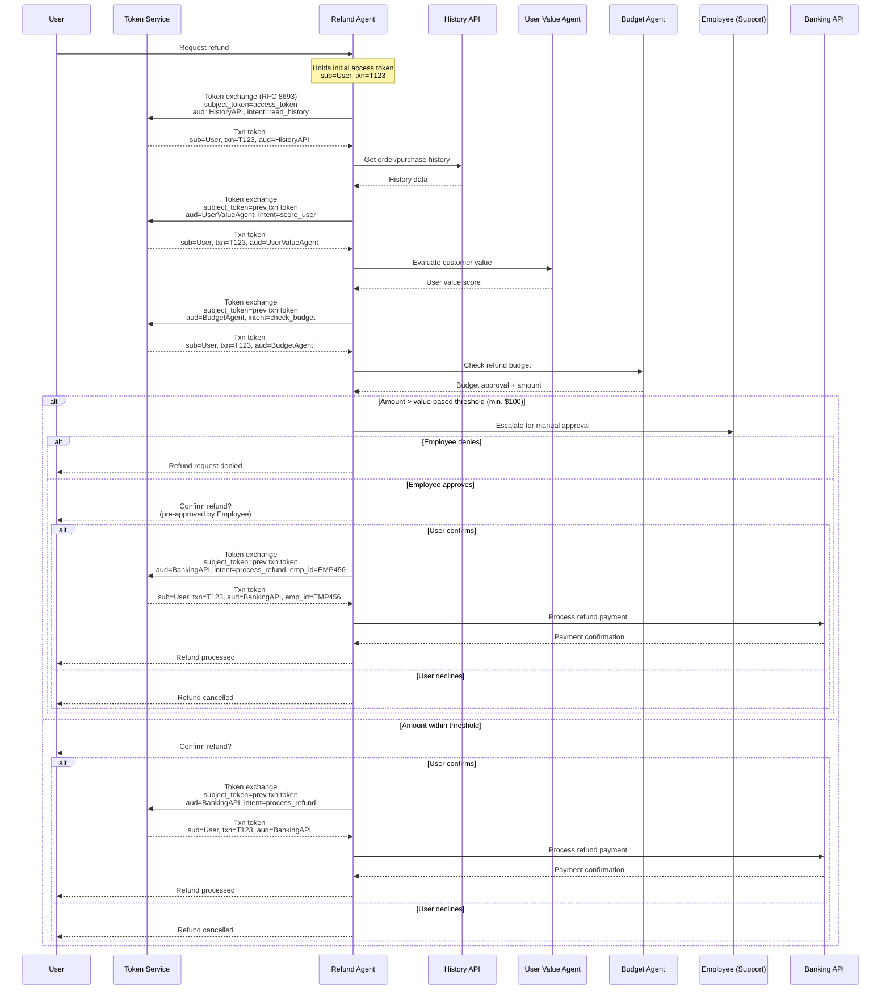

The world of agentic applications promises more flexible, powerful user experiences, whether a user interacts with a chatbox or an agent to access them. If you're building an agentic system on the receiving end of these requests, how do you secure your system?

Helpful techniques include least-privilege scoping, step-up approval for high-impact actions, and audit logging. These all predate agents by years. A refund workflow at a bank in 2015 had a manager approval above a dollar threshold, a scoped service account instead of a shared admin credential, and a log of who approved what.

A refund workflow in the agentic world looks no different. But today, defense in depth is no longer optional.

## The Problems Agentic Systems Surface

That question gets sharper when the system is customer facing, as compared to an employee-facing agentic application. An employee is provisioned, trained, and accountable to HR if something goes wrong: the company holds leverage. A customer has leverage instead, backed by a lawyer or a regulator if your system gets it wrong. You don't get to train customers out of pasting a weird request into a chat box. 

Employees use a managed device on a managed network. Customers show up on whatever phone they own, sometimes through a new third-party agent they started using last week. And employees have a lifecycle someone else owns; when they leave, HR tells you. Customers just stop showing up, and nothing about that tells you whether they're gone for good or back next Tuesday with a different agent doing the asking.

 None of that is new to customer facing applications. What's new is that an agentic system inherits all of it on top of three assumptions about applications that held for human written deterministic systems, but which don't for agentic applications.

Deterministic systems can get away with skipping some aspects of defense-in-depth. The code path calling the sensitive API expresses human intent, since a human developer conceived of and then wrote the ways the code could execute. The number of branches through the system was small enough to enumerate and model permissions for at design time. And the logic deciding whether to approve or deny an action was your code with known, validated inputs, not something a customer could talk into a bad decision.

Agentic systems don't break these assumptions because they're agentic.

They break them because almost nobody builds the instrumentation that would keep the assumptions true. You can log the full reasoning chain behind a tool call. You can scope an agent's credentials down to exactly what a given task needs. You can keep a human in the loop above a dollar threshold.

None of that got harder when the workflow became an agent instead of a form. They just became more necessary because the deterministic system left the gap these techniques fill invisible and the agentic version doesn't.

Agentic systems are structurally capable of preserving these assumptions. But shipping one without preserving them is the default, and a naive deployment and a well-instrumented one are identical right up until something goes wrong. 

* A refund call that's fine and a refund call that's a jailbroken reasoning chain look the same at the API boundary unless you built logging that traces back through the decision, not just the request. 
* A thousand possible call sequences stop being a problem the moment you scope credentials so narrowly that most of those sequences can't reach anything worth protecting. 
* A system that can be argued with using English is only a liability if there's nothing underneath the language layer that enforces a hard boundary regardless of what it's told.

The mechanisms to set these boundaries aren't new ideas only applicable to agentic applications, but they are much more important in them. If you skip them the product won't break on day one, but you'll have a much less pleasant day two. They're mandatory in the sense that the bank a decade ago had human bottlenecks slowing down how much damage sloppy software could inflict. An agentic system removes that bottleneck. 

The same sloppiness that used to cost you a slow afternoon now costs you whatever an agent can execute in the time it takes someone to notice.

## What's In a Refund

Here's the scenario we'll dig into: a customer asks a refund agent for their money back on a prior purchase from an agentic system. One sentence in. A lot happens before money moves.

Four things happen before the refund money moves: the agent reads order history, scores the customer's account value, checks the request against a budget, and, depending on the amount, pulls in humans. Each of those is a separate call to a separate service, and the credentials presented by the agent change at every hop rather than staying constant. That pattern, plus the human gate near the end, plus the transaction ID riding along on every token, protect the user and the system.

### Tightly Scoping Access

The agent never holds more authority than the current request it is making needs.

At every hop in the refund flow, the agent exchanges its current token for a narrow one using OAuth token exchange (RFC 8693), scoped to exactly the audience and intent of that call: read the history, score the user, check the budget, process the refund. It never accumulates a credential broad enough to do all four at once. If the agent falls victim to a prompt injection attack and tries to make a call against the banking API without completing the first steps, the request is denied.

In addition, the token service can gather additional metrics, agent intent, and information and use that to control access. If the agentic application is making too many requests associated with the same customer, the token service can apply rules to deny needed tokens, to slow down possible abusive behavior.

A decade ago you could permission a workflow as a unit, because the workflow had bounded branches and your team had written all of them. An agent can chain tool calls in combinations nobody can predict in advance, so there's no longer a finite set of workflows to secure. The only thing you can bound is what each individual hop is allowed to touch, which is why scoping at every hop matters more now than it used to.

Fine-grained consent belongs in the same bucket. Rich Authorization Requests (RFC 9396) let you scope consent per action instead of one coarse grant covering everything the customer might ever ask for.

And sender-constraining the resulting tokens with something like DPoP (RFC 9449) closes the gap where a scoped token could be replayed if an attacker intercepted it.

### Human-in-the-loop

When things get real, gate hops that can't be undone. Every hop in the refund flow before the banking call is reversible in the sense that no money has left the building. The last one isn't.

In the example above, there's a threshold set by the customer's value score, but never below $100. Above that, an employee has to approve the refund. The customer has to confirm the request out-of-band on top of that. Only once both checks clear does the agent get a token scoped to the banking API to actually send the refund.

The mechanism for that out-of-band confirmation, in standards terms, is something like CIBA (Client-Initiated Backchannel Authentication): a step-up challenge that happens outside the main request-response flow, so a human somewhere has to actively confirm before the irreversible thing fires. Without it, you get outcomes like the [car dealership chatbot that got talked into accepting a dollar for a 2024 Chevy Tahoe](https://venturebeat.com/ai/a-chevy-for-1-car-dealer-chatbots-show-perils-of-ai-for-customer-service). No code exploit, no injection: a customer just kept negotiating in plain English until the bot agreed to a price it should never have been structurally capable of committing to. A smarter model doesn't fix that. A hard ceiling that sits outside the conversation, enforced by something other than the model's own judgment, does.

Such a hardcoded approval threshold can't be argued with. An agent's reasoning can, which is what makes the Tahoe chatbot a genuinely new failure mode rather than an old one with new branding. The human gate isn't just catching high-value transactions. It's handling the possibility that the agent deciding whether to escalate was itself talked into the wrong answer.

Where you put that gate matters as much as whether you have one. Shopify's storefronts stayed up through their Cyber Monday admin outage while merchants couldn't log in, and that was fine, because purchases have a reversal path: chargebacks exist. Refunds don't have that same reversal path. Once the money's out, getting it back is collections or litigation, not an API call. That's why the human gate in the refund flow sits on the outbound side, right before the banking API request, rather than anywhere earlier in the chain.

The current human-in-the-loop options are familiar but limited
- yes once
- no
- yes always

These can lead to fatigue and degrade the value of the human gates. But there are other options available, including:

- approve as long as the request looks like every other request (ip address, etc)
- approve as long as the last yes happened within 1 hour
- approve as long as the customer hasn't requested a refund in the last 4 weeks
- approve as long as an LLM that doesn't receive inputs from the customer says yes

Just like MFA, human-in-the-loop approve can be made more intelligent.

### Intent logging

Capture what the agent said it was doing, next to what it did.

Every token exchange in the refund flow carries the agent's stated intent (read_history, score_user, check_budget, process_refund) alongside the transaction ID. That pairing is what makes the audit log useful after the fact. You're not just recording that a call to the banking API happened; you're recording that it happened because the agent claimed it was processing a refund for transaction T123, under a specific customer's authority, with a specific employee's approval attached if required.

This is the mechanism that would have mattered in the prompt injection attack Palo Alto Networks documented against an ad-review agent, where the goal was tricking an agent designed to moderate ads into approving content it should have rejected. The target there wasn't a customer-facing surface; it was the agent's own decision logic. An intent log doesn't stop that kind of manipulation on its own, but it does make the mismatch visible after the fact: an approval action whose stated intent doesn't line up with the content it approved is exactly the kind of anomaly a review process can catch, if the intent was captured in the first place.

This can also help you identify areas where deterministic scopes are too tight. If you see an agent repeatedly trying to access a tool or API, you can examine not just the details of the request, but also what it was trying to accomplish. With that data, you may decide to relax restrictions.

In hand-coded systems, the code path that executes embodies intent; if that function executes, you already know why, because you wrote the only reasons it could execute. An agent's call to the same API can happen because a customer asked for a legitimate refund or because a chain of reasoning went sideways upstream, and the API call looks identical either way. That's the real shift: you used to be able to infer intent from what ran. Now you have to ask, and log the answer.

The accountability angle isn't optional, either. [Italy's data protection authority fined an AI company for privacy violations](https://www.bipc.com/european-authority-fined-emotional-ai-company-for-privacy-violations), and the fine landed on the company that built the system, not on the model underneath it. Regulators don't care which layer of the stack made the decision. They care whether you can show what happened and why, and an agent's own claimed intent, captured at the moment of the action, is a big part of what makes that possible.

Regulation varies across locations too, with the Chinese legal system treating AI decisions differently than the European Union. Here's a [2025 study looking at 6 different regulatory regimes](https://dl.acm.org/doi/10.1145/3715275.3732059). Watch the space regularly to make sure you are treating interactions with customers in conformance with legal restrictions.

### Checking access regularly

The refund flow scores the customer's account value fresh at the point of the request rather than reading it from a cached value. That matters because a customer whose account scored high in March may not score the same way in June. The threshold for requiring a human gate changes with that score. If you compute it once and cache it, the threshold you're enforcing today is really last quarter's threshold wearing a new date stamp.

You can use short lived sessions and refresh tokens to perform checks regularly. Also, CAEP (OpenID Continuous Access Evaluation Profile) is an emerging standard for re-checking risk signals and consent state at the moment of the consequential action instead of once at login. I'd put this in the same bucket as DPoP and CIBA: worth watching, not yet as settled as RFC 8693, but directionally right.

A credential that was valid an hour ago isn't automatically valid now, and for an agentic system making autonomous decisions between requests, an hour is a long time.

### Why Open Standards Matter Here

None of the mechanisms above require a proprietary approach. Token exchange (RFC 8693), rich authorization requests (RFC 9396), sender-constrained tokens (RFC 9449), CIBA, and CAEP are all open, vendor-neutral specifications, and that's not incidental. Agentic systems increasingly span multiple agents, multiple vendors, and multiple organizations in a single transaction, and a security boundary defined by an open standard travels with the request no matter which agent framework or identity provider is on the other end. A proprietary scoping mechanism only protects the parts of the chain your own stack controls; an open standard protects the handoff itself. As the agentic ecosystem matures, the interoperability these specifications provide is what makes defense-in-depth practical across agent-to-agent and agent-to-service boundaries that no single vendor owns.

### Not New, Not Optional

This isn't new advice, but it's advice that stopped being optional. Is any of this actually different from what a security-conscious team would have built a decade ago, or is it just OAuth best practices wearing an AI label?

Mostly the latter, on the level of individual controls. RFC 8693 is 2020-era. Step-up authentication and audit logging are older than that. What's different is the cost of skipping these best practices.

A decade ago, a team could ship a refund workflow with a shared service credential, a hardcoded approval branch, and light logging, and get away with it, because the code enumerated its own behavior and nothing on the other end could talk the code into something it wasn't written to do. That system was not following security best practices, but the gap was survivable.

The same shortcuts in an agentic system lead to disaster, because the request shape no longer completely encodes the intent, the call sequences aren't enumerable in advance, and the thing making the call can be influenced by the customer on the other end of the conversation.

Start with the token scoping, since the other three mechanisms are built on that foundation. Add the human gate on anything irreversible next, followed by intent logging so you can tell afterward what the agent thought it was doing. Continuous re-evaluation comes last, catching the case where a scope that was correct an hour ago isn't correct anymore.

None of these are exotic. All are now critical.

