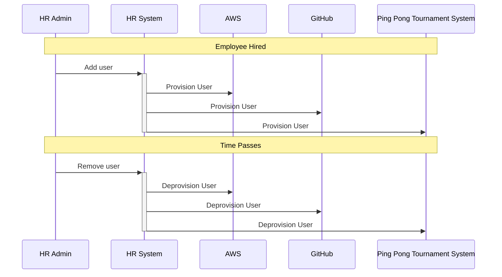

SCIM is a specification to add and remove users and groups using a standard protocol. 

{/* more */}

Now, as of version 1.36, FusionAuth can consume SCIM requests and act as the provisioning server in a SCIM client/server environment. If you are interested, you can [learn more here](/docs/lifecycle/migrate-users/scim/scim).

But this post isn't about FusionAuth's support; rather it is about what SCIM is and why you might want to use it.

## What does SCIM mean?
SCIM stands for System for Cross-domain Identity Management. It was created in 2011 as SCIM 1.0 by the Open Web Foundation. The current standard, SCIM 2.0 was released in 2015 as an [Internet Engineering Task Force (IETF) RFC](https://datatracker.ietf.org/doc/html/rfc7643). 

## How does SCIM provisioning work?

At a high level, supporting SCIM allows you to automate the provisioning and deprovisioning (adding and removing) of users and groups from your identity systems. When a new user is added to one system, that user’s details can fan out to other systems with their own datastores.

An example would be when a new developer is added to an HR system, they can be added to other systems required to do their job, such as a cloud computing provider, a source control system and a ping-pong tournament management system.

If a new customer is added to a SaaS application, SCIM can add them to the support ticketing system and the accounting system as well.

As you can imagine, you’d have to have a number of systems and users to make implementing SCIM worth your while. If you only have ten customers and bring on one a month, automating this may not be your highest priority. But there are many companies out there with large numbers of employees and users, for which SCIM makes sense.

## Why would you use SCIM?

By implementing SCIM, you can integrate with a [number of existing applications](http://www.simplecloud.info/#Implementations2). Just like with any other standard, interoperability is a major win with SCIM.

As mentioned above, SCIM is useful for large organizations, so complying with SCIM may open up opportunities to sell to said large organizations.

With SCIM, you are replicating data all over the place. This is an approach that contrasts with single sign-on and federation, where identity data is consolidated and users and applications rely on a source of truth to determine identity information, access levels and more.

But when you have applications which want to manage their own user storage or which don't support standards like OIDC (OpenID Connect) and SAML (Security Assertion Markup Language), then you may need to replicate user data. Rather than set up the application to rely on a single user data store, you can send the needed identity information to the application. If those applications support SCIM, then you can add, update and remove users as needed.

You can also use SCIM to move portions of your identity from a source of truth to another system, possibly outside of your organization. For example, if you sign up for a SaaS application and you have your data stored in an identity server, the identity server can use SCIM to push some of your information, such as your email address, over to the SaaS application, while withholding other information, such as your birth date.

Another common use case is where you are not necessarily provisioning the same resources in multiple systems, but rather just provisioning them on to a single SCIM server. If you have multiple SCIM clients that want to provision them and query the resource data, this can make sense, especially if the clients are third party products that already know how to "speak" SCIM.

When getting started with an identity system, you often need to provision users, and SCIM can help you do so. For CIAM (Customer Identity and Access Management) systems, self-registration can work in certain scenarios, but there may be applications for which user self-provisioning is not acceptable.

There are additional [use cases outlined in the RFC](https://datatracker.ietf.org/doc/html/rfc7642#section-3).

Let's dive into some of the major pieces of SCIM.

## Client and Server

There are two players in the SCIM game: the client and the server. Unlike a traditional identity provider architecture, the terms client and server have different meanings in SCIM. The client provides the user data to the server. 

In the example above, when a new developer is added to an HR system, SCIM adds them to other systems too. In this case, the HR system is the *client* and the other systems are *servers*.

When you are evaluating SCIM solutions, make sure you understand if they implement SCIM as a client, a server, or both. For example, at this time, FusionAuth only implements SCIM as a server, capable of receiving user and group data.

## Users and Groups

Everything managed by SCIM is a resource. 

There are three core resources: `Users`, `Groups` and `EnterpriseUsers`. SCIM can be extended to support other types of resources. These can be refinements of the core resources to model particular kinds of users. If you are using SCIM to provision users at a university you might have `Professors` and `Students` as resources. They can also model other kinds of identity management concepts, such as `Permissions`.

`Users` and `EnterpriseUsers` are similar, with the `EnterpriseUsers` schema extending `Users`. Therefore, for the rest of this post, I'm going to focus on `Users`.

`Users` have a defined set of attributes, many of which you might expect. These include `userName`, `name`, `userType` and more. Exactly what you'd expect a user to have. You can also put a user in a group.

`Users` can also have emails, phone numbers, addresses and more. They can even have a list of x.509 certificates. Each user also has a password, which is write only.

The required fields are few: the `userName` field is required. In addition, an `id` field must be created and assigned by the server.

I'll let you review the [relevant section of the RFC](https://datatracker.ietf.org/doc/html/rfc7643#section-4.1) for the full list of attributes for this resource. 

`Groups`, on the other hand, are much simpler. They have a required `displayName` and a list of members, as well as an `id`.

### Schemas

Schemas are a critical part of SCIM, and control what attributes each resource type has.

The `Users`, `EnterpriseUsers` and `Groups` resources discussed above have their own standardized schema, but you can create your own or, as mentioned above, extend them.

Schemas support single value attributes like `name` and `userType` with a variety of data types, as well as multi-valued attributes like phone numbers or emails.

### Identifiers

There are up to two identifiers for every resource in SCIM.

The first is the `id`, which is a required attribute and is a globally unique identifier managed by the SCIM server. It must be stable and always refer to the same resource.

The `externalId`, on the other hand, is provided by the client. It is optional and allows for identifiers from the provisioning process to be stored in the server.

For example, the HR system discussed above might have an identifier for the developer. It could be stored in the cloud computing provider's SCIM datastore. That way, you could query directly in the cloud computing system for a given record based on the HR id.

In addition, `$ref` attribute is commonly used. This string is an HTTP addressable resource which points to additional information about this item, and is often used to convey relationships between resources in SCIM. For example, a user object may contain group membership information. That group information may contain a `$ref` attribute pointing to the SCIM identifier of that group.

## SCIM API

In the standards-based SCIM API, there are a number of supported operations. As you'd expect, CRUDL is supported for each resource, and the API is broadly RESTful:

* `Create`, which uses the HTTP `POST` method
* `Read`, which uses the HTTP `GET` method
* `Update`, which uses the HTTP `PUT` or `PATCH` method
* `Delete`, which uses the HTTP `DELETE` method
* `List`, which uses the HTTP `GET` or `POST` method (in certain circumstances)

The `List` operation optionally supports filtering, so you could look up all the users with a userName containing `dan`, and sorting, so you can sort resources returned by their type. You can also specify certain attributes to return or exclude.

The `Update` operation must support the `PUT` method, but can optionally support `PATCH`. In the former case, the resource is overwritten entirely by the request. In the latter, the attributes contained in the request are merged into the resource.

There are also bulk operations, designed to apply any of the mutation operations (`Create`, `Update`, `Delete`) on many resources at one time.

The specification has more `MAY`s than `MUST`s, so look at the documentation and/or machine readable configuration endpoints (described below) before counting on any of these operations.

## Configuration endpoints

A SCIM server defines a number of configuration endpoints, which can be used to inform and automatically configure clients. These include:

* `ServiceProviderConfig`, which specifies which optional features are implemented, including authentication schemes, bulk endpoints, filtering of queries and patch support.
* `ResourceTypes` outlines the types of resources available from the SCIM server, such as `Users`, as well as their schema id.
* `Schemas` describes the fields for each available resource type, including the data type and whether the field is mutable.

These configuration endpoints are JSON. This means any SCIM client, or other program, can read these endpoints and determine if required features are present. This configuration can also be useful for determining what resources or attributes for said resources are available.

## Actual usage

So, how do you actually use SCIM? First, determine if you are going to be receiving data or sending it. That is, are you a SCIM server or a client? Then determine if you can use the core schemas, if you can use a standardized extension, or if you need to extend one.

Then, if you are a client, begin the integration by determining how to authenticate against the server. If you are a server, determine what authentication methods you are going to support.

If a client, map your user and group attributes into the schemas supported by the server. If a server, map the schemas you will support into your internal identity data storage.

You can see an [example SCIM client implementation using an open source library here](https://github.com/FusionAuth/fusionauth-example-scim-integration).

Other things to consider:

* Will you be syncing data on a batch basis, a user-by-user basis or on a schedule?
* Is there an expected timeframe for creation or deletion of users?
* What are the performance characteristics of the client and the server?
* How will you secure the connection between the client and the server? Authentication is built-in, but do you need other measures, such as a VPN, IP restrictions or client certificates?

## Additional resources

Here are some additional resources:

* [An overview of the specification and links to all relevant RFCs](http://www.simplecloud.info/)
* [The RFC defining the overall concepts and requirements](https://datatracker.ietf.org/doc/html/rfc7642)
* [The RFC defining the protocol](https://datatracker.ietf.org/doc/html/rfc7644)
* [The RFC defining the core schema definitions](https://datatracker.ietf.org/doc/html/rfc7643)
* [FusionAuth SCIM documentation](/docs/lifecycle/migrate-users/scim/scim)
