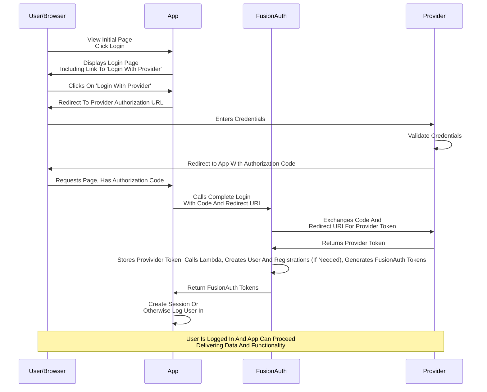

Here's a diagram of the login flow between:

* the user
* your application
* FusionAuth and
* a remote identity provider

Although this looks complex, the user only sees a few screens, such as the FusionAuth login screen, the provider login screen, and your application.
