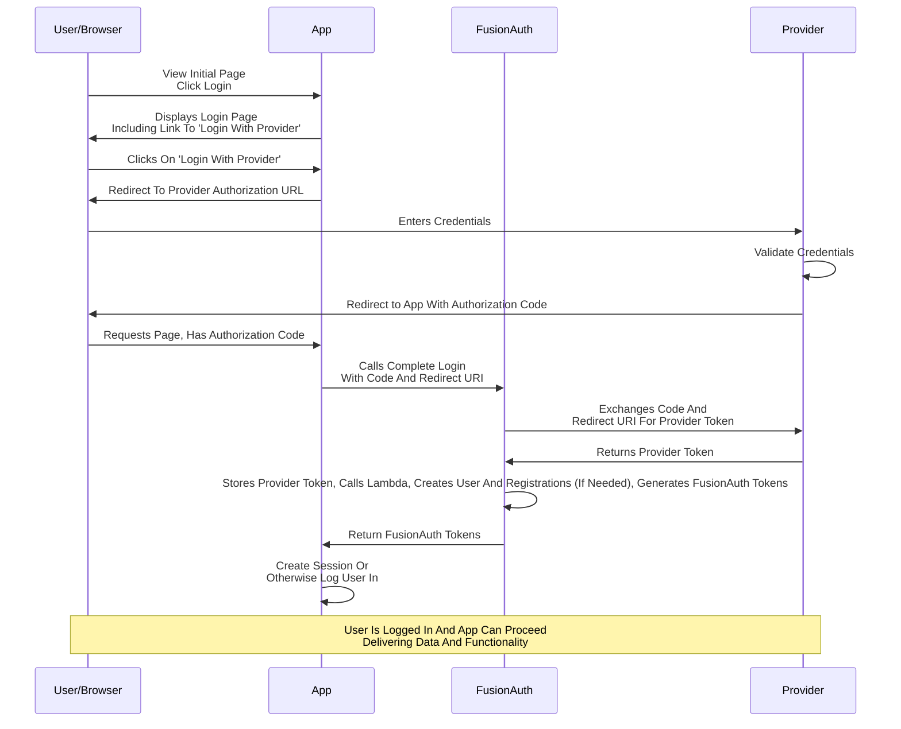

import InlineField from "src/components/InlineField.astro";
import Breadcrumb from 'src/components/Breadcrumb.astro';

If you are building your own login experience, you'll want to start the identity provider flow yourself and then complete the login. 

You might do this if you are using the [Login API](/docs/apis/login) rather than using the hosted FusionAuth login pages. Here's a diagram illustrating this login flow:

If you require a refresh token after completing the login, ensure <InlineField>Enable JWT Refresh</InlineField> is ``true`` in the application configuration. This is found in the administrative user interface by navigating to <Breadcrumb>Applications -> Your Application -> Security -> Login API settings</Breadcrumb>.

