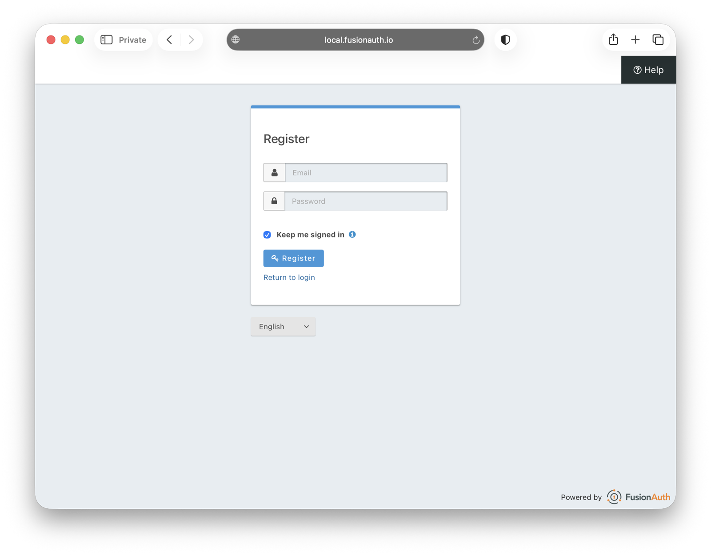
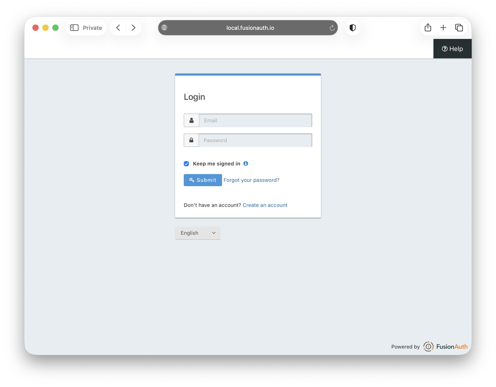
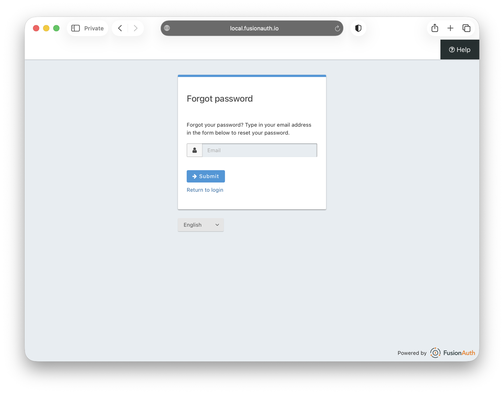

import PremiumPlanBlurbApi from 'src/content/docs/_shared/_premium-plan-blurb-api.astro';
import {RemoteCode} from '@fusionauth/astro-components';
import Aside from 'src/components/Aside.astro';
import Breadcrumb from 'src/components/Breadcrumb.astro';
import InlineField from 'src/components/InlineField.astro';
import InlineUIElement from 'src/components/InlineUIElement.astro';
import PremiumPlanBlurb from 'src/content/docs/_shared/_premium-plan-blurb.astro';

- [Overview](#overview)
- [List Of Best Practices For Registration And Login](#list-of-best-practices-for-registration-and-login)
  - [⮆ Separate](#-separate)
  - [🧹 Minimal](#-minimal)
  - [🦯 Accessible](#-accessible)
  - [🌐 Standards Compliant](#-standards-compliant)
  - [🔐 Secure](#-secure)
  - [⚖️ Legal And Ethical](#️-legal-and-ethical)
  - [👁️ Able To Collect Metrics](#️-able-to-collect-metrics)
  - [🌼 Good Looking](#-good-looking)
- [Summary Table Of Best Practices](#summary-table-of-best-practices)
- [FA Theming Options](#fa-theming-options)
- [Create A Custom Advanced Theme](#create-a-custom-advanced-theme)
- [Free VS. Paid Features](#free-vs-paid-features)
- [TODO](#todo)


## Overview

While having a decent registration and login page happens by default with FA, it takes a bit more work to create a page that has excellent usability and accessibility and delights new customers. In this guide you'll learn what you need to check when designing a custom login page for your business, with code examples of how to do it.

## List Of Best Practices For Registration And Login

Let's start by reviewing everything authentication pages should have. Then in the next section you'll learn how to implement in FusionAuth all the best practices given here.

Registration and login pages should be all the following.

### ⮆ Separate

Both pages could be combined into a single page, after all they both contain just username and password fields. If the user is not yet registered when trying to sign in, why not automatically register them on the same page? The main reason is that separate pages avoid users creating duplicate accounts. People frequently forget which email addresses they used to register for a service (especially in recent years with an increased focus on privacy and email aliases), or mistype their address. Telling someone that their username does not exist is clearer than silently creating a new account. You also might want to include extra fields on a registration page, such as checkboxes for consent, which do not belong on a login page. Finally, if you want to protect users' privacy, having separate pages prevents attackers from entering email addresses into a page to see which users are registered for the service already.

### 🧹 Minimal

Registration pages give the user work to do, which discourages them from using your service. Make that work as easy as possible by having pages with no clutter and as few fields to complete as possible. Autofocus the identifier textbox to save the user a click.

Make labels clickable and make the label focus its related textbox on click. This looks like `<label for="email">Email address</label><input id="email" >`.

Provide a toggleable eye icon so that users can view their password in plaintext, rather than having to retype the password in a confirmation textbox. Show the password requirements next to the password box so that the users don't have to invent a new password after the first one is rejected. Show validation for all fields on blur (when field loses focus) and not on form submission, for immediate feedback. If the page is refreshed (such as when form submission fails), the page should remember all entered values in every textbox, so the user doesn't have to retype anything.

Skip the login screen automatically and the user to their account if they're already signed in.

Provide links between the registration and login pages so the user can quickly swap to the correct page if they started down the wrong path.

The reset password page should automatically fill the user's email address from the login page or browser cookie, to save the user from typing.

### 🦯 Accessible

This includes large readable fonts for those with poor eyesight, color-blindness, or dyslexia. Screen readers for the blind. Proper tab order and keyboard support for those who can't use a mouse. Ensure your site works correctly on desktop and mobile. Accessibility also means that users can actually load the page, so be careful with images that are too large, don't exclude those using a VPN, and have a backup host if Cloudflare or AWS crashes due to network configuration. Show translated pages in the language of your users if appropriate.

Give clear and complete instructions for inexperienced users: "I don't know what the password is! Oh, I'm supposed to *invent* my own password? Why didn't you say so".

Show an indicator if the capslock key is on. Don't disable the paste ability on fields. Some users physically need it, and it's useful for those keep their passwords in a separate database.

Show a spinner for feedback for any requests to the server, such as password validation and form submission. Users can quickly lose interest and assume a page is broken if there's no visual feedback.

Make timeouts long. Even a short registration page could take a user a while to complete, especially if life interrupts them. It's annoying if when they finally click submit, the page rejects them due to an anti-forgery cookie timeout and they need to resubmit.

Label your email textbox with `type=email` in HTML to get the appropriate mobile keyboard layout for fast entry. Do the same for telephone numbers (`type=tel`), URLs (`type=url`), and numbers (`type=num`).

Use the `autocomplete="username"` and `autocomplete="current-password"` attributes on fields so the browser can autopopulate them and save the user from typing.

If your pages uses icons (like a little envelope picture in the email field), ensure they have `aria-hidden="true"` if they are purely decorative. If the icons are meaningful, provide an `alt` text description for screen readers.

Use an ARIA live region, like `<div role="alert">Incorrect password</div>`, so that screen readers will be aware when the div content changes dynamically through JavaScript (as opposed to reading the page only the first time on load).

### 🌐 Standards Compliant

This includes HTML5, OAuth 2, email, and cross-browser compatibility with functions like autocomplete and password managers.

Allow all legal email addresses. For example, `+` and `/` are legal characters in addresses, as are two-letter domain names, but are frequently banned by persnickety registration pages.

### 🔐 Secure

When using FusionAuth, this is the easiest part. The hosted login pages are the result of a company dedicated to a security product and are secure by default. The tricky part is deciding whether to support login with email addresses, usernames, or mobile phones. And whether to use passkeys, single sign-on (SSO) or social login, and two-factor authentication. Each of these choices has security and ease-of-use implications. You need to decide what is best for the majority of your users. Passwords should follow modern best practices, like [zxcvbn](https://github.com/zxcvbn-ts/zxcvbn), and not superstition about uppercase and special characters.

Use CAPTCHA to ensure only humans, and not spam bots, attempt to register and log in. Prevent brute-force password attacks by rate limiting login attempts. After too many incorrect passwords lock a user's account for a minute.

Upgrade your FA instance frequently to get all security patches. Use HTTPS and not HTTP for connections.

Provide a "Stay logged-in on this device" checkbox to allow the user to explicitly say whether they want the convenience of avoiding future logins on their home computer, or the safety of staying logged out on a shared public computer. Provide a clear log out button once logged in.

Ensure that your client-side and server-side validation are identical. If client is stricter, an attacker could bypass the HTML page to send a form directly to the server, where the server would accept unsafe fields. If the server is stricter, a user could enter a valid password on the registration page, only for it to be rejected on the server at submission.

### ⚖️ Legal And Ethical

You need to be compliant with GDPR and the Cookie law if your service is available to any European citizen. Put links to privacy and data use policies on your registration page. Include opt-in checkboxes for any personal data collection. Obtain consent for any non-essential cookies. For more information on this complex topic, see the blog articles on [EU laws](todo get link when FA publishes this) and [configuring FusionAuth to comply with GDPR](todo get link when FA publishes this).

### 👁️ Able To Collect Metrics

Your registration page should track, in a way that doesn't collect personal data, how many people attempt, complete, and abandon registration. If possible, track where users abandon registration to learn what might be discouraging them and what you can improve.

You also might want to use A/B testing with multiple versions of a registration page to see which is the most convenient.

### 🌼 Good Looking

A page that is visually well-designed persuades users that your business is successful, professional, and trustworthy. Elegant animations often delight users. But this isn't about only layout and styling. Typography matters, as does your text itself. The language on the page must be clear, grammatically correct, and the tone should match your business. Ensure translations to foreign languages are correct too.

Follow the user's choice for dark mode or light mode in their browser or operating system settings. Showing a dazzling white registration page to users who prefer dark mode will make them immediately dislike your app.

## Summary Table Of Best Practices

Below is a condensed checklist of all the tips in the previous section. The themes later in this guide refer back to the rows below, so you can see exactly what is implemented.

Name | Description | Exists in default theme | Possible in Simple Theme | Possible in Advanced Theme
---|---|---|---|---
<span id='p1'>Separate pages</span> | Separate registration and sign in pages | ✅ | ✅ | ✅
<span id='p2'>Hide registration</span> | Don't say whether users have accounts already | | |
<span id='p3'>Minimal</span> | No visual clutter or excess fields|✅ |✅ |
<span id='p4'>Autofocus first textbox</span> | |✅ |✅ |
<span id='p5'>Clickable labels</span> | | ✖️ Fields are not labelled. Clicking their icons does not focus the field. | |
<span id='p6'>Viewable password</span> | | ✖️ Password is not viewable. Confirmation textbox is optional. | |
<span id='p7'>Show password requirements</span> | | ✖️ Requirements are shown only after inadequate password submitted | |
<span id='p8'>Validate on blur</span> | |✖️ | |
<span id='p9'>Remember entries</span> | |✅ | |
<span id='p10'>Skip login</span> | If signed-in already |✅| | |
<span id='p11'>Links between pages</span> | |✅ | |
<span id='p12'>Autofilled reset password username</span> | |✖️ | |
<span id='p13'>Large fonts</span> | |✖️ | |
<span id='p14'>Clear contrast</span> | |✅ | |
<span id='p15'>Dyslexic font</span> | |✖️ | |
<span id='p16'>Colorblind safe</span> | | | |
<span id='p17'>Blind safe</span> | Screenreader compatible | | |
<span id='p18'>Tab order</span> | | | |
<span id='p19'>Keyboard only</span> | | | |
<span id='p20'>Mobile & desktop</span> | | | |
<span id='p21'>Few KB</span> | | | |
<span id='p22'>VPN safe</span> | No country or IP restrictions | | |
<span id='p221'>Country restrictions</span> | IP ranges can be restricted (For example, the EU) | | |
<span id='p23'>Backup host</span> | If the primary goes offline | | |
<span id='p24'>Language translations</span> | | | |
<span id='p25'>Clear instructions</span> | | | |
<span id='p26'>Capslock indicator</span> | | | |
<span id='p27'>Paste allowed</span> | | | |
<span id='p28'>Feedback spinner</span> | | | |
<span id='p29'>Long timeouts</span> | | | |
<span id='p30'>`type=email`</span> | And `tel`, `url`, `num` | | |
<span id='p31'>`autocomplete`</span> | `username` and `current-password` | | |
<span id='p32'>`aria-hidden`</span> | For decorations | | |
<span id='p33'>`alt`</span> | Descriptions for informative images | | |
<span id='p34'>ARIA live</span> | For updating text | | |
<span id='p35'>HTML5 compliant</span> | | | |
<span id='p36'>OAuth 2 compliant</span> | | | |
<span id='p37'>Email compliant</span> | | | |
<span id='p38'>Cross-browser compliant</span> | | | |
<span id='p39'>Username registration</span> | | | |
<span id='p40'>Email registration</span> | | | |
<span id='p41'>Phone number registration</span> | | | |
<span id='p42'>Social media registration</span> | | | |
<span id='p43'>Passkeys</span> | | | |
<span id='p44'>Two-factor authentication</span> | | | |
<span id='p45'>Custom password rules</span> | |✔️ Not completely custom, but tenant settings allow basic rule changes. | |
<span id='p46'>CAPTCHA</span> | | | |
<span id='p47'>Rate-limit incorrect passwords</span> | | | |
<span id='p48'>HTTPS</span> | | | |
<span id='p49'>Upgradeable FusionAuth</span> | | | |
<span id='p50'>Stay logged-in</span> | | | |
<span id='p51'>Log out</span> | Clearly shown once logged in | | |
<span id='p52'>Matching server/client validation</span> | | | |
<span id='p111'>Consent checkboxes</span> | | |✖️ You can request personal data like birthdate and name on the registration form, but not consent |
<span id='p53'>Cookie consent banner</span> | |✖️ FA does not ask for permission to store cookies in the user's browser and does not inform the user | |
<span id='p54'>Disable cookies if no consent</span> | |✖️ FA provides no way to remove cookies if the user could decline them | |
<span id='p55'>Registration metrics</span> | | | |
<span id='p56'>A/B testing</span> | | | |
<span id='p57'>Typography</span> | | | |
<span id='p58'>Imagery</span> | | | |
<span id='p59'>Layout</span> | | | |
<span id='p60'>Animations</span> | | | |
<span id='p61'>Custom text</span> | | | |
<span id='p62'>Dark or light mode</span> | | | |

## FA Theming Options

If you read the FA [theming overview](http://localhost:3000/docs/customize/look-and-feel), you'll know there are three ways to customize your authentication pages:
- use the [Simple Theme Editor](http://localhost:3000/docs/customize/look-and-feel/simple-theme-editor) to make small changes to one of the default FA themes.
- use the [Advanced Theme Editor](http://localhost:3000/docs/customize/look-and-feel/advanced-theme-editor) to overhaul everything with custom CSS, JS, and the [Java FreeMarker template language](https://freemarker.apache.org/).
- write custom pages in your own app that call the [FA API for authentication](http://localhost:3000/docs/apis/authentication), and don't use the hosted login pages. (This is dangerous as it's easy to make security mistakes.)

The FusionAuth default theme is minimal and secure, but fails to follow many of the best practices in the previous table. Examples include: not automatically displaying dark or light mode, not having a viewable password, not validating on blur, and not providing clear instructions and password requirements. You can see what the theme looks in the screenshots below.








If you think the default theme has adequate usability for your app, and want to make only a few visual branding adjustments, you can use the simple theme editor. But to follow as many best practices as possible, you'll need the advanced theme editor, which allows for custom JavaScript. In the next section, you'll see what it can achieve.

## Create A Custom Advanced Theme

 To create a custom theme (simple or advanced), first duplicate the FA advanced theme template in <Breadcrumb>Customizations -> Themes</Breadcrumb> and give it an Id of `dc243231-0808-497a-9938-2d2a35860e01`. Choose that theme in the dropdown of the <InlineUIElement>General</InlineUIElement> tab when editing the <Breadcrumb>Tenant</Breadcrumb>.

```sh
git clone https://github.com/FusionAuth/fusionauth-theme-helper
cd fusionauth-theme-helper
cp .env.sample .env
vi .env # set your FusionAuth key from Settings -> API Keys

# Example:
#API_KEY=33052c8a-c283-4e96-9d2a-eb1215c69f8f-not-for-prod
#THEME_ID=dc243231-0808-497a-9938-2d2a35860e01
#FUSIONAUTH_URL=http://fa:9011
#TMP_DIR=tmp

docker run --init -it --rm --network faNetwork --name "theme" -v ".:/app" -w "/app" node:24.12.0-slim sh

# in the container
npm install
./download.sh

# sudo chown rje tmp

# copy the contents of https://github.com/FusionAuth/fusionauth-themes/tree/main/packages/fusionauth/iron-pixel (input.css and the tpl folder (template folder) to the tmp folder that the download script created.
# move the contents of the tpl folder up one level

./upload.sh

# browse to your app and visit the login page


```


## Free VS. Paid Features

[paid feature](https://fusionauth.io/pricing)

Feature | Free | Paid
---|---|---
Captcha | | ✅
App vs tenant themes? | |

## TODO

- captcha - Google reCAPTCHA v2/v3 or hCaptcha
- rate limiting - Create a time-based User Action with “Prevent login”. can also configure rate limiting for failed login attempts at the tenant level


fa -> FusionAuth
table which features are paid vs free
conversation close https://github.com/FusionAuth/fusionauth-site/issues/3053
conversation links
beth to check hypens in sign and log in/out


```sh from dan
Including a sample theme to handle them.

The ideal login and registration page would be

  accessible
  high conversion
  secure
  html5 compatible
  with conversion tracking
  mobile friendly
  looks sharp
  autocomplete where appropriate: https://developer.mozilla.org/en-US/docs/Web/HTML/Attributes/autocomplete
```

```sh from gareth
The ideal login and registration page would be
  - accessible - we could highlight some of the most important parts like screenreaders, tab behaviour, font size, colour contrasts? With a demonstration showing that the example fusionauth login page meets them.
  - high conversion - not sure about this one, maybe something about if a user tries to register with the login form then it should automatically move them to the registration flow? And not harrass them like disabling the password paste field or some other examples of crap that enterprises often do
  - secure - probably just a few obvious things like serving over HTTPS and not logging the password
  - html5 compatible - also probably just like 1-2 basic points like using the right labels?
  - with conversion tracking - maybe add posthog free tier to track new sign ups?
  - mobile friendly - looks like the example themes are, so probably just show an example of how it changes when you resize your window
  - looks sharp - probably kinda subjective, I think can skip this one?
  - autocomplete where appropriate: https://developer.mozilla.org/en-US/docs/Web/HTML/Attributes/autocomplete - probably some interesting stuff to add here about how to integrate with password managers too.

Hopefully one of those four themes is already quite close or already meets all of these? I think this doesn’t have to be a full on step-by-step replication guide, but it can be used to both

  - Explain to readers that getting a ‘perfect’ registration/login page is more complicated than just two text fields and a button
  - Show how to add the best practices you care about with Fusionauth by showing example snippets from the theme, and screenshots that demonstrate a specific point.
```