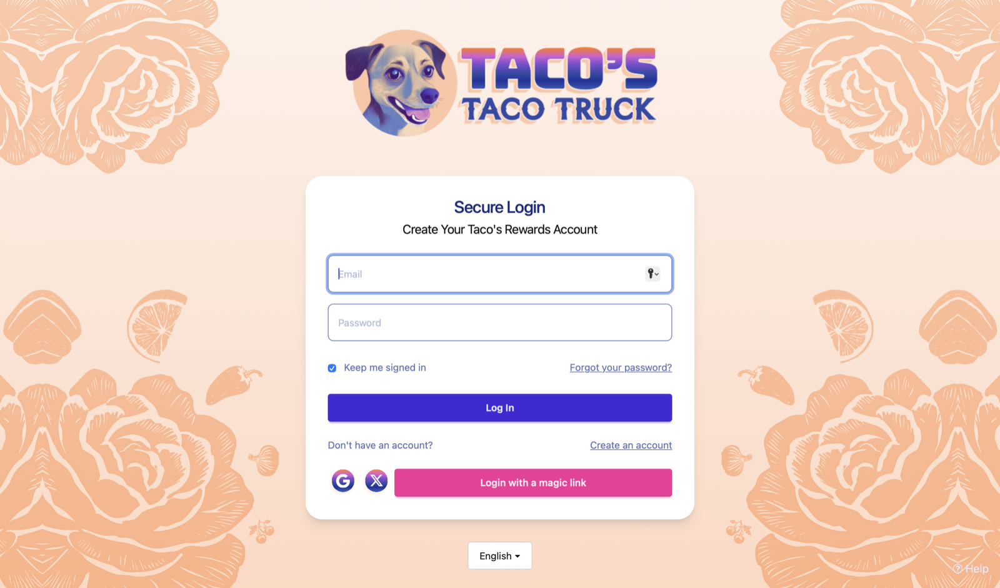
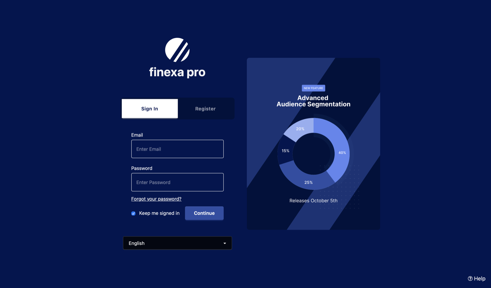
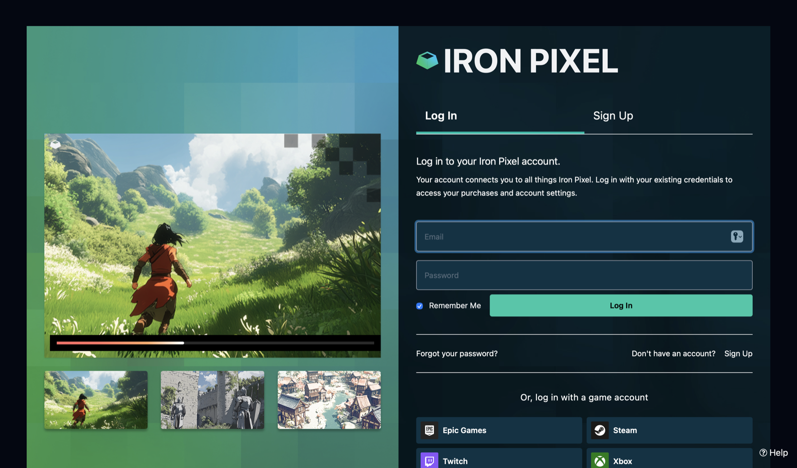
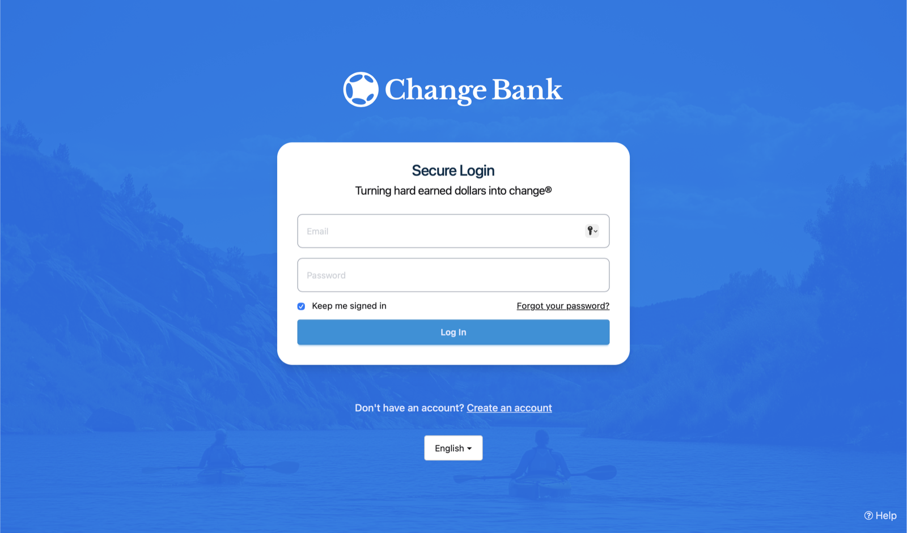

import InlineField from 'src/components/InlineField.astro';

## Sign-In Theme Examples

Below are some examples of what you can achieve with theming in FusionAuth. See how these examples were built at the dedicated theme site: [FusionAuth Themes](https://www.fusionauththemes.com).

	

	

	

	

## Examples From Users

Below are even more examples from some real-world FusionAuth customers.

Do you want to show off your FusionAuth theming skills too? Feel free to send us a few screenshots and you may show up on this page!

### Celery Payroll
https://www.celerypayroll.com

The left image is the login page rendered in English, the right example is the same page in Dutch using FusionAuth localization.

### Gmork Tech

https://dagger.gmork.tech/

### Oryx Software

