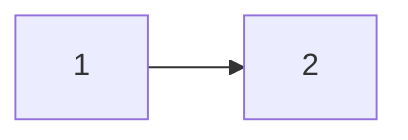

import PremiumPlanBlurb from 'src/content/docs/_shared/_premium-plan-blurb.astro';
import Breadcrumb from 'src/components/Breadcrumb.astro';
import InlineField from 'src/components/InlineField.astro';
import InlineUIElement from 'src/components/InlineUIElement.astro';
import Aside from 'src/components/Aside.astro';
import IconButton from 'src/components/icon/Icon.astro';

<PremiumPlanBlurb />

This guide discusses ways of modeling hierarchical organizations and entities, with users and permissions, and provides a sample application to provide some starting code you can use in your own app.

## Understand FusionAuth Types And Their Relationships

Let's start by reviewing all the FA types and how they relate. You need to understand these types well to adjust the hierarchical system design in this guide to suit your situation. If you want to read about FA types in more detail, see the [Core Concepts](https://fusionauth.io/docs/get-started/core-concepts) documentation.

To avoid confusion with FA applications in this guide, the service you provide your users will be called your "website", as opposed to an application, app, or service.

The first set of FA types are: Tenants, Applications, Groups, Roles, and Users. These types manage users logging in to an application. (Applications are sometimes called clients in other systems).

The second set of types are: Entity Types, Entities, Permissions, and Entity Grants. These types were added to FusionAuth in 2021, after the original set of types in the previous paragraph. They are used for machine-to-machine authentication, and as a case-specific way to model things (entities), as opposed to organizations.

### Applications And Users

Think of a tenant as an entirely separate instance of FusionAuth, without actually running a separate instance. A tenant completely separates all users and applications from those in any other tenant, even when they have the same names and email addresses.

An application represents an organization, website, or service that a person (a user) logs in to. A user has personal data, an email address, and any amount of custom data stored in JSON. A user is a member of an application through a registration. Users can have registrations to many applications, or none.

Applications have roles. A role is just a string. A registration can add many roles to a user for an application. Your website can use a user's role however it wants: authorize a user to perform special actions or ignore the role entirely.

A group is a collection of users. A user can belong to multiple groups, so you can think of a group as a tag that can be applied to a user. A group can have many roles in many applications. If a user has a group, and the user is also registered with an application, that user will automatically be granted any roles in the application that the group has.

For example, consider an example of a bank website with clients and employees. The bank website is an application in FA. The application has two roles: client and employee. Your clients and employees are users, that each have a single registration in the bank application. Each registration may give the user either the client or employee role, or both.

If you want, you could make groups called client and employee, with the client and employees roles in the application respectively. Then you would add users to either or both groups, and register the users with the application, but would not need to give the users roles manually. This would be useful if you had a lot of roles.

todo diagram of exmple and types

<Aside type="warning">
Digital security usually involves three types: users, roles, and permissions. A user can have many roles, and roles can have many permissions. The advantage of not granting users permissions directly are:
- You can add (or remove) permissions to a role and they automatically apply to every user in that role. You don't have to add a permission to a million users individually.
- A user can have multiple roles with multiple permissions, and the user automatically gets the superset of permissions from all their roles. You don't have to consider each user as an individual and specify the exact combination of permissions that their job requires.
- Your website can work only with permissions when checking if a user has rights to do something, and doesn't have to worry about mapping users through roles to permissions itself.

However, FA does not have permissions. There is a GitHub feature request to add them. Vote [here](https://github.com/FusionAuth/fusionauth-issues/issues/15) if you want that feature.

There are two workarounds:
- Treat roles as permissions. In other words, instead of the employee role, make roles called "can edit clients", "can adjust salaries", and so on. When a user logs in with FA, your website will receive a list of exactly what "permissions" (roles) the user has. But now you have lost all the advantages of working with roles described above.
- Manage permissions in your website code. Keep the user and role associations in FA, but link roles to permissions in your website database, not in FA. When a user logs in with FA, your website will go the database and retrieve all permissions you have associated with those roles and add them to the user. This is the originally intended design of FA, as it is an authentication system more than an authorization system.
</Aside>

### Entities And Permissions

An entity in FA is just a name, and can represent anything — a company, document, or refrigerator. The only functional aspect to an entity is that it can be used for machine-to-machine authentication with the client credentials OAuth flow. In this case, an entity usually represents a service.

An entity has an entity type. The type of an entity cannot be changed once it has been created. An entity type can have many permissions, which are also just strings.

Both users and entities can be linked to entities by entity grants. An entity grant lists which permissions of an entity the linked user or entity has access to.

For example, you could make an entity type called Company with an entity called ChangeBank with permissions ReadAccess and WriteAccess. You could make another Company entity called ChangeInsurance with an entity grant to ChangeBank that has the ReadAccess permission. Like with roles, permissions have no functional meaning in FA. They are just strings passed to your website when a user logs in, and your website can use them however you like.

### A Diagram Of All FusionAuth Types

Below is a diagram explaining the FA types, combining the type name with an example object of that type.

## Representing Hierarchy In FA

None of the FA types are hierarchical. In other words, no types can be nested in any other types. Groups can't be members of groups, applications can't contain other applications, and entities don't have sub-entities.

## TODO

- FA -> FusionAuth
- remove tod

