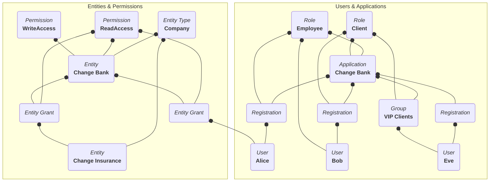
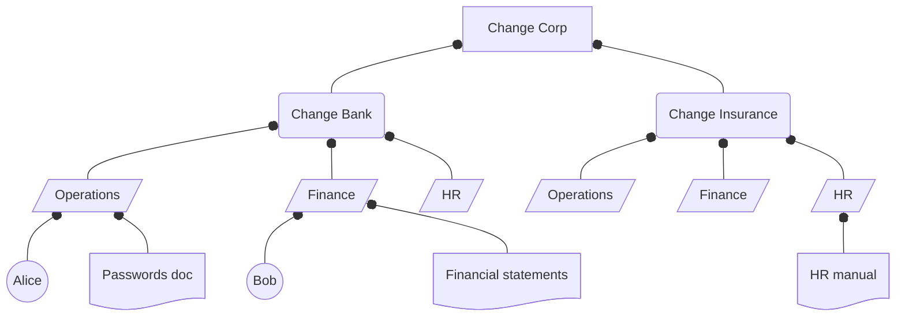

import PremiumPlanBlurb from 'src/content/docs/_shared/_premium-plan-blurb.astro';
import Breadcrumb from 'src/components/Breadcrumb.astro';
import InlineField from 'src/components/InlineField.astro';
import InlineUIElement from 'src/components/InlineUIElement.astro';
import Aside from 'src/components/Aside.astro';
import IconButton from 'src/components/icon/Icon.astro';


- [Understand FusionAuth Types And Their Relationships](#understand-fusionauth-types-and-their-relationships)
  - [Applications And Users](#applications-and-users)
  - [Entities And Permissions](#entities-and-permissions)
  - [A Diagram Of All FusionAuth Types](#a-diagram-of-all-fusionauth-types)
- [An Example Company Hierarchy With Permissions](#an-example-company-hierarchy-with-permissions)
- [Options To Model Hierarchy In FA](#options-to-model-hierarchy-in-fa)
- [Evaluating The Options](#evaluating-the-options)
- [Example Node Application](#example-node-application)
- [Clean Up](#clean-up)
- [TODO](#todo)
- [Brief](#brief)


<PremiumPlanBlurb />

This guide discusses ways of modeling hierarchical organizations and entities, with users and permissions, and provides a sample application with some starting code you can use in your own app.

## Understand FusionAuth Types And Their Relationships

Let's start by reviewing all the FA types and how they relate. You need to understand these types well to adjust the hierarchical system design in this guide to suit your situation. If you want to read about FA types in more detail, see the [Core Concepts](https://fusionauth.io/docs/get-started/core-concepts) documentation.

To avoid confusion with FA applications in this guide, the service you provide your users will be called your "website", as opposed to an application, app, or service.

The first set of FA types are: Tenants, Applications, Groups, Roles, and Users. These types manage users logging in to an application. (Applications are sometimes called clients in other systems).

The second set of types are: Entity Types, Entities, Permissions, and Entity Grants. These types were added to FusionAuth in 2021, after the original set of types in the previous paragraph. They are used for machine-to-machine authentication, and as a case-specific way to model things (entities), as opposed to organizations.

### Applications And Users

Think of a tenant as an entirely separate instance of FusionAuth, without actually running a separate instance. A tenant completely separates all users and applications from those in any other tenant, even when they have the same names and email addresses.

An application represents an organization, website, or service that a person (a user) logs in to. A user has personal data, an email address, and any amount of custom data stored in JSON. A user is a member of an application through a registration. Users can have registrations to many applications, or none.

Applications have roles. A role is just a string. A registration can add many roles to a user for an application. Your website can use a user's role however it wants: authorize a user to perform special actions or ignore the role entirely.

A group is a collection of users. A user can belong to multiple groups, so you can think of a group as a tag that can be applied to a user. A group can have many roles in many applications. If a user has a group, and the user is also registered with an application, that user will automatically be granted any roles in the application that the group has.

For example, consider an example of a bank website with clients and employees. The bank website is an application in FA. The application has two roles: client and employee. Your clients and employees are users, that each have a single registration in the bank application. Each registration may give the user either the client or employee role, or both.

If you want, you could make groups called client and employee, with the client and employees roles in the application respectively. Then you would add users to either or both groups, and register the users with the application, but would not need to give the users roles manually. This would be useful if you had a lot of roles. Another use of groups is to tag users with certain attributes, such as VIP users.

<Aside type="warning">
Digital security usually involves three types: users, roles, and permissions. A user can have many roles, and roles can have many permissions. The advantage of not granting users permissions directly are:
- You can add (or remove) permissions to a role and they automatically apply to every user in that role. You don't have to add a permission to a million users individually.
- A user can have multiple roles with multiple permissions, and the user automatically gets the superset of permissions from all their roles. You don't have to consider each user as an individual and specify the exact combination of permissions that their job requires.
- Your website can work only with permissions when checking if a user has rights to do something, and doesn't have to worry about mapping users through roles to permissions itself.

However, FA does not have permissions. There is a GitHub feature request to add them. Vote [here](https://github.com/FusionAuth/fusionauth-issues/issues/15) if you want that feature.

There are two workarounds:
- Treat roles as permissions. In other words, instead of the employee role, make roles called "can edit clients", "can adjust salaries", and so on. When a user logs in with FA, your website will receive a list of exactly what "permissions" (roles) the user has. But now you have lost all the advantages of working with roles described above.
- Manage permissions in your website code. Keep the user and role associations in FA, but link roles to permissions in your website database, not in FA. When a user logs in with FA, your website will go the database and retrieve all permissions you have associated with those roles and add them to the user. This treats FA more as an authentication system than an authorization system.
</Aside>

### Entities And Permissions

An entity in FA is just a name, and can represent anything — a company, document, or refrigerator. The only functional aspect to an entity is that it can be used for machine-to-machine authentication with the client credentials OAuth flow. In this case, an entity usually represents a service.

An entity has an entity type. The type of an entity cannot be changed once it has been created. An entity type can have many permissions, which are also just strings.

Both users and entities can be linked to entities by entity grants. An entity grant lists which permissions of an entity the linked user or entity has access to.

For example, you could make an entity type called Company with an entity called ChangeBank with permissions ReadAccess and WriteAccess. You could make another Company entity called ChangeInsurance with an entity grant to ChangeBank that has the ReadAccess permission. An employee who is a user, described in the previous section, could also have an entity grant with ReadAccess to the ChangeBank entity.

Like with roles, permissions have no functional meaning in FA. They are just strings passed to your website when a user logs in, and your website can use them however you like.

### A Diagram Of All FusionAuth Types

Below is a diagram illustrating the relationships in the examples from the previous sections, combining the type name with the example object of that type. Read the diagram from bottom to top to see who is a member of what, or who has what attributes.

Note that entities and applications cannot be related, even if they represent the same physical company. Only users can have entity grants to entities.



## An Example Company Hierarchy With Permissions

None of the FA types are hierarchical. In other words, no types can be nested in any other types. Groups can't be members of groups, applications can't contain other applications, and entities don't have sub-entities.

This is a problem when trying to model organizations that are hierarchical, especially when trying to decide when a user who has permissions to one level of the hierarchy should have permissions to an entity somewhere in the hierarchy.

Let's take an example. Assume that you want to use FA to authorize users in your corporation, Change Corp, to have access to certain documents. Your corporation has two sub-companies: Change Bank and Change Insurance. Each company has many departments, like marketing, sales, finance, operations, and management. Documents belong to a single department in an organization. Companies, departments, and documents have read and write permissions, and an administrative permission (that allows users to change other users' permissions to the department or document). Permissions propagate downwards. So an employee with write permissions to the marketing department in Change Insurance, will have write permissions to all its documents. And an employee with read permissions to Change Corp has read permissions to every document in every department of both sub-companies. But you might have an auditor who you add as a user in FA that has only read access to a specific document in a specific department. This will not give her permissions to any other documents anywhere higher in the organizational hierarchy.

Below is a diagram of the company structure to model.



<Aside type="note">
You can probably see some challenges already:
- How do you handle documents that everyone in the corporation needs to read, such as the HR manual, which is managed by the HR department of the top-level corporation? Because permissions don't propagate upwards, you have to individually give read permissions to everyone, instead of relying on the hierarchy to do it automatically.
- What happens when permissions conflict? The operations department might have a passwords document that should have read access only by members of that department, but anyone with read access to the sub-company will have access to the passwords.

There are solutions to these problems, such as including "Deny access" permissions and a "Common" department which has shared documents, and you need to pick what works for your organization. These challenges won't be discussed in this guide, as you can use the techniques shown here to implement your own solution.
</Aside>

## Options To Model Hierarchy In FA

There are a few ways to model this structure in FA. Documents have to be entities and employees have to be users. There are no other types in FA that will work for this. But after that, here are your options:
- **1) Applications and roles**: Add a finance employee, like Alice, to an application representing her company and department, like Change Bank Operations application. Each application will have two roles, read and write, which are effectively permissions not roles. Each department application has to have the company name in its title, instead of being called only Operation, because there is no way to show one application in FusionAuth is linked to another. You will have a combinatorial number of applications, given the number of companies and departments you add. However, you still need to create an application with no department, called Change Bank application, to show that Alice is a member of the company, or you will need to infer it from the department names of which she is a member. You can't use groups instead of applications to model this example because groups do not have permissions. You could use groups to make it easier to link users with applications and roles, but you still need the applications and roles.
- **2) Entities and grants**: Create entity types Company and Department with permissions Read, Write, and IsMember. Read and write are used to show permissions, but IsMember is used to show hierarchy. Create an entity called Change Bank of type Company and entity of Department called Operations. Create an entity grant for Operations to Change Bank with IsMember set to true to show that this Operations entity belongs to the Change Bank entity. Note that it will not be possible to tell departments called Operations in different companies apart by their name alone. You will need to examine each department's entity grant to see which company it belongs to. Create an entity grant for user Alice to entity Change Bank with no permissions, and an entity grant for Alice to Operations with permissions Read and Write. Below is a diagram of this example, which is similar to the earlier types diagram, but includes a department hierarchy now.
  ```mermaid
  graph BT

  subgraph Change Bank
    direction BT
    n0(("`*User*
  **Alice**`"))
    n1@{ shape: doc, label: "*Entity of type Document*
  **Passwords doc**" }
    nBank("`*Entity of type Company*
  **Change Bank**`")
    nOperationsToBanks("*Entity grant*")
    nAliceCompany("*Entity grant*")
    nAliceDepartment("*Entity grant*")
    n16("`*Permission*
    **ReadAccess**`")
    n17("`*Permission*
    **WriteAccess**`")
    n18("`*Permission*
    **IsMember**`")
    nBankOperations[/"`*Entity of type Department*
  **Operations**`"/]
    n19("`*Permission*
    **ReadAccess**`")
    n20("`*Permission*
    **WriteAccess**`")
    n21("`*Permission*
    **IsMember**`")
    n22("*Entity grant*")
    n23("`*Permission*
    **ReadAccess**`")
    n24("`*Permission*
    **WriteAccess**`")
  end

  subgraph Change Insurance
    direction BT
    n5[/"`*Entity of type Department*
  **Operations**`"/]
    n6("*Entity grant*")
    n3("`*Entity of type Company*
  **Change Insurance**`")
    n10("`*Permission*
    **ReadAccess**`")
    n11("`*Permission*
    **WriteAccess**`")
    n12("`*Permission*
    **IsMember**`")
    n13("`*Permission*
    **ReadAccess**`")
    n14("`*Permission*
    **WriteAccess**`")
    n15("`*Permission*
    **IsMember**`")
  end

    n0 --o nAliceCompany & nAliceDepartment
    n1 --o n22 & n23 & n24
    nBank --o n16 & n17 & n18
    n3 --o n10 & n11 & n12
    nBankOperations --o nOperationsToBanks & n19 & n20 & n21
    n5 --o n6 & n13 & n14 & n15
    n6 --o n3 & n12
    nOperationsToBanks --o nBank & n18
    nAliceCompany --o nBank
    nAliceDepartment --o nBankOperations  & n19 & n20
    n22 --o nBankOperations & n21
  ```
  For simplicity's sake this diagram does not include Change Corp entity of entity type Corporation. There are two blocks: one for Change Insurance and one for Change Bank. Ignore the Change Insurance block and concentrate on Change Bank to see how Alice is connected to her department, which is connected to the company. This diagram also shows a document attached to the Operations department. The document itself has needs read and write permissions, for when you want to enable individual access, and is linked to the Operations department via an entity grant with the IsMember permission, in the same way departments are linked to companies.
- **3) User JSON data**: Store every user's company and department as properties in their JSON `user.data` field. This has to be done through the FA API, and cannot be maintained in the FA web interface. You will need to write your own UI app for HR staff to work with FA. With this approach you don't need to use applications, roles, or groups. Below is example JSON data for Alice:
  ```js
  "permissions": {
    "Change Bank": [],
    "Change Bank Operations": ["read", "write"],
    "Change Bank Human Resources manual": ["read"],
  }
  ```
  The last line, regarding permissions to a document, could either be stored manually, as is shown above, or could be an entity grant from Alice to the document. If you remove the last line, you would keep only company permissions in JSON and store document permissions using entities (as shown in the previous option).

## Evaluating The Options

Option 1, using applications, is inferior to the other options and can be discarded. Applications in FA are used to manage user logins, and it will get cluttered and confusing if you have dozens of new applications that are used not for login, but only to track which permissions a user has. This option provides no benefit over using entities instead.

Options 2 and 3, entities versus JSON, are completely opposite approaches. Option 2 explicitly stores the relationship between all organizational departments and all documents and their related permissions in FA. Your website can use the FA API to get a list of all a user's entity grants to the user's documents and departments, and a list of all documents and the department to which they belong, and use both lists to see what a user has access to. Option 3 doesn't use any FA features to store a user's departments and permissions. Instead, you can choose any naming scheme you want to represent your hierarchy. With option 3, it's very important that you are able to map the text in the JSON with the names of your departments stored elsewhere. For instance, your permissions manager code would have to consistently use "Change Bank" and not "ChangeBank" for thousands of lines of JSON across hundreds of users. And how exactly do you know that a document authorization, stored as an entity in FA, called "Change Insurance Financial Statements draft 2042", can be read by a user with the JSON permission `Change Bank: ["read"]`? Do you parse the document title (entity name) to see if it has "Change Bank" in it? This seems extremely error-prone.

Both options 2 and 3 also have a synchronization problem. If you manage document permissions with FA, and name the document entity according to the name the author gives the document in your website, what do you when the document name changes? Or if two documents have the same name?  You can quickly see that relying on a document name won't work. You will have to generate a UUID for a document on your website, and be sure to give the document authorization in FA the same UUID.

Given these problems, option 3 would have to use UUIDs in the user JSON data, and you would have to recreate something very similar to FA's entity management interface in your own website to map UUIDs to hierarchical permissions. Storing some of the user permissions in FA in JSON, and some permissions in the organizational hierarchy in your website database violates the principle of encapsulation. It will result in confusion for your programmers to manage permissions across two different systems. As a result, it would be best to choose between:
- Using FA only for user authentication and keeping all authorization and company structure information in a separate dedicated document management system that uses FA as its authentication gateway. Example document managements systems that can use an external OAuth provider like FA are [Nuxeo](https://doc.nuxeo.com/nxdoc/using-openid-oauth2-in-login-screen) and [M-Files](https://www.m-files.com/products/platform-security). There may be other document managements systems that allow the use of FA, but their documentation does not state it.
- Using option 2 and fully embracing FA to store all permissions and your company structure. Ensure that you use matching UUIDs for the digital document itself, and the authorization to that document stored in FA as an entity.

The next section will provide an example Node application that follows option 2. It uses the FA API to get a list of all documents, and all the logged-in user's direct and hierarchical permissions, and display them.

## Example Node Application

- duplicate js express quickstart used in last guide. change bank and change insurance
- create entity types, entities, user
- give richard user grant to department
- after user login show all user permissions in account page for various docs and department. use api to pull them and js to summarize them.

Use `git clone` to clone the repository at https://github.com/fusionauth/fusionauth-example-multiapp-dashboard, or download and unzip it.

Open a terminal in the directory containing the repository files.

Run the command below to start FusionAuth.

  ```sh
  docker compose up
  ```

<Aside type="note">
  If you have completed any FusionAuth tutorials before, you might need to first delete any existing FusionAuth containers with the same name and the database volumes. Run the command below to do that.

  ```sh
  docker ps rm fa faDb; docker compose down -v
  ```
</Aside>

Leave FusionAuth running.

In a new terminal, run the commands below to start a web server for the Changebank app, which uses FusionAuth for authentication.

  ```sh
  cd bankApp
  docker run --platform=linux/amd64 --rm -v ".:/app" -w "/app" node:23-alpine3.19 sh -c  "npm install"
  docker run --platform=linux/amd64 --rm --network faNetwork -p 3000:3000 -v ".:/app" -w "/app" -e "PORT=3000" node:23-alpine3.19 sh -c  "npm run start"
  ```

The Changebank app is available at http://localhost:3000.

To learn how to make a simple Node.js app that uses FusionAuth, read the [quickstart](/docs/quickstarts/quickstart-javascript-express-web).


Before making the dashboard, check that you can log in to all three applications. Either use an incognito browser window or don't enable [Keep me signed in](/docs/lifecycle/authenticate-users/logout-session-management#fusionauth-sso) when logging in, otherwise, you won't see the login form in the rest of this guide:
- Browse to FusionAuth at http://localhost:9011/admin and log in with `admin@example.com` and `password`.
  
- Browse to Changebank at http://localhost:3000 and log in with the same username and password.
  


  Log in to your [FusionAuth web interface](http://localhost:9011/admin) and browse to <Breadcrumb>Customizations -> Themes</Breadcrumb>.

  ## Clean Up

To remove all the Docker images used in this guide, stop the running containers and run the commands below.

```sh
docker compose down -v
docker rmi postgres:16.0-bookworm fusionauth/fusionauth-app:1.51.2 node:23-alpine3.19
```


## TODO

- FA -> FusionAuth
- diagram to file
- remove todo
- remove admin
- add hlink to this doc from the core concepts doc
- put code in a ritza repo

## Brief

Fusionauth wants an example showing how to use permissions in a ‘complex’ way:

```
Mapping permissions in a hierarchical manner

company -> department -> document
User can be granted permissions (read, write, admin) to any of these.
```
How do you roll it up to know which users have access to document A? Which documents does user B have access to?

You’d need to store data in the entity.data field to store the tree, then run queries against the document A or user B to find out the answer.

Include a sample app.

Sounds like a bit of a hack, but probably we could do something like a basic Express application that has some concept of `Company -> Group/Department -> Document`, and then show how that information could be stored in Fusionauth instead of within the application itself.

Maybe also some discussion of when it would make sense to do this – reading the example dan provides below, I’d think that logic should be at the application level rather than in the auth service, so if this is just an example to show off how entity.data can be hacked to add permissions then that’s fine, but we shoudl add some warning and advise people how to decide what to store in Fusionauth and what should be done in their application database.

