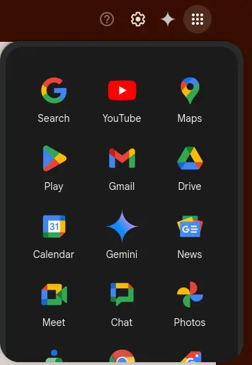
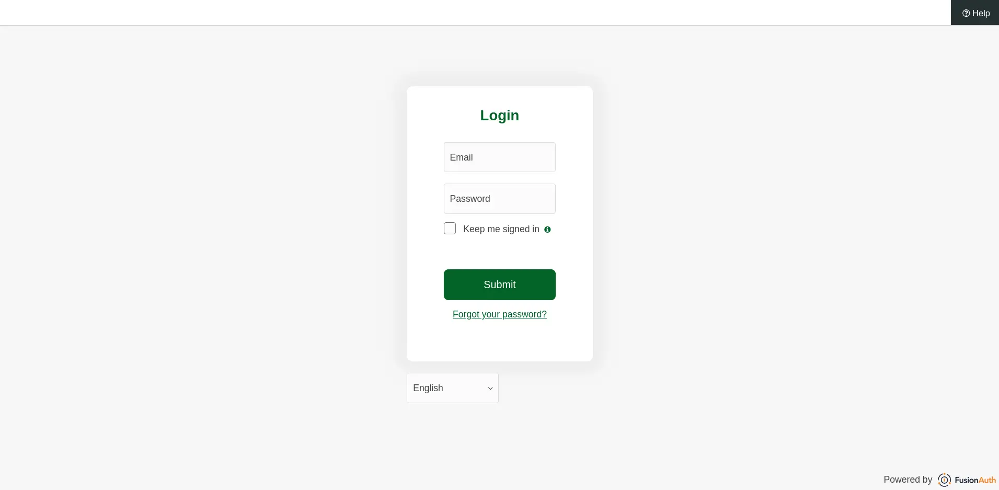
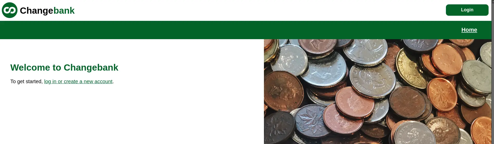
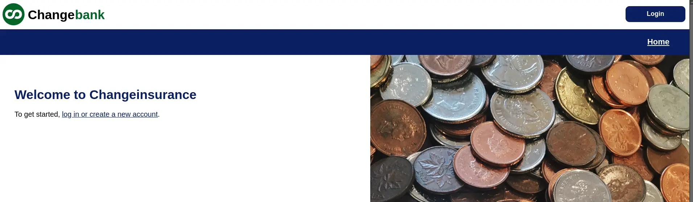

import PremiumPlanBlurb from 'src/content/docs/_shared/_premium-plan-blurb.astro';
import Breadcrumb from 'src/components/Breadcrumb.astro';
import InlineField from 'src/components/InlineField.astro';
import InlineUIElement from 'src/components/InlineUIElement.astro';
import Aside from 'src/components/Aside.astro';
import {RemoteCode} from '@fusionauth/astro-components';

## Introduction

If you're using FA to manage many applications, you might want to provide your users with a central list of the applications, so they know what's available. For example, Google does this for its apps.



In this guide you'll learn to make a similar page — a dashboard linking to all the applications in a FA tenant.

In the language of authentication, FusionAuth is an identity provider (IdP) and your applications and websites are the service providers (SP). One way to authenticate a user from a central dashboard is to use identity provider initiated login. In other words, the dashboard will log the user in, and then redirect them to the selected app. In short, a service provider application will receive a login that it didn't initiate itself. This has security complexities and dangers.

A simpler and safer way, that you'll use in this guide, is to make each application link in the dashboard do nothing but point to the application's login page. From that point onwards, authentication follows the standard OAuth authorization code flow.

The next sections of this guide will show you how to make a dashboard for two existing FA applications in the same tenant. All this requires is customizing the theme page for the index landing page of the FA site. To show this, the guide will first show you how to install FA and make two simple web application web servers. If you already have a FA installation with existing applications, you can skip ahead to the section that creates the dashboard.

If you want to follow along with the full guide, you will need Docker installed.

## Download the example repository and run FusionAuth

Use `git clone` to clone the repository at https://github.com/ritza-co/dashboardExample, or download it and unzip. Open a terminal in the directory containing the repository files.

- Run the command below to start FusionAuth.
  ```sh
  docker compose up
  ```
  - If you have completed any FA tutorials before, you might first have to delete any existing FA containers with the same name, as well as the database volume. Run the command below to do that.
    ```sh
    docker ps rm fa faDb; docker compose down -v
    ```
- In a new terminal, run the commands below to start a web server for an app that uses FA for authentication. The app is called Changebank, and is available at http://localhost:3000.
  ```sh
  cd bankApp
  docker run --rm -v ".:/app" -w "/app" node:23-alpine3.19 sh -c  "npm install"
  docker run --rm --network host  -v ".:/app" -w "/app" -e "PORT=3000" node:23-alpine3.19 sh -c  "npm run start"
  ```
- In a third terminal, run the commands below to start a web server for a the second app that uses FA for authentication. The app is called Changeinsurance, and is available at http://localhost:3001.
  ```sh
  cd insuranceApp
  docker run --rm -v ".:/app" -w "/app" node:23-alpine3.19 sh -c  "npm install"
  docker run --rm --network host  -v ".:/app" -w "/app" -e "PORT=3001" node:23-alpine3.19 sh -c  "npm run start"
  ```

Before making the dashboard, check that you can log in to all three applications. Either use an incognito browser window or don't enable [Keep me signed in](https://fusionauth.io/docs/lifecycle/authenticate-users/logout-session-management#fusionauth-sso) when logging in, otherwise you won't see the login form in the rest of this guide:
- Browse to FusionAuth at http://localhost:9011/admin and log in with `admin@example.com` and `password`.
  
- Browse to Changebank at http://localhost:3000 and log in with the same username and password.
  
- Browse to Changeinsuance at http://localhost:3001 and log in with the same username and password.
  

## Make a dashboard

Look at the current FA landing page at http://localhost:9011. In this section you are going to change it to display links to the two banking app web servers that you started in the previous section.

- Log in to your FA web interface
- Browse to <Breadcrumb>Customizations -> Themes</Breadcrumb>. Notice there are three themes in the list. The first two are the default FA themes. The last one, <InlineUIElement>Bank theme<InlineUIElement>, was added by `kickstart.json` when running Docker compose.
- Click the edit button in the Bank theme row.
- Select the <InlineUIElement>Index</InlineUIElement> page (fourth item in the list on the left).
- Paste the code below into the text box and click <InlineUIElement>Save</InlineUIElement> at the top right.
  ```html
  [#ftl/]
  [#-- @ftlvariable name="tenant" type="io.fusionauth.domain.Tenant" --]
  [#-- @ftlvariable name="tenantId" type="java.util.UUID" --]
  [#-- @ftlvariable name="theme" type="io.fusionauth.domain.Theme" --]
  [#import "_helpers.ftl" as helpers/]

  [@helpers.html]
    [@helpers.head title="FusionAuth"/]
    [@helpers.body]
      [@helpers.header]
        [#-- Custom header code goes here --]
      [/@helpers.header]

       [#if theme.type != "simple"]
          [@helpers.main title="" rowClass="row center-xs" colClass="col-xs-12 col-sm-12 col-md-10 col-lg-10 col-xl-9"]
              <div class="p-3 pb-5">
                <div style="width: 180px;">
                  
                </div>
                <br />
                <a href="http://localhost:3000/account" style="background: linear-gradient(to bottom right, palegreen, forestgreen);
                  color: white;
                  padding: 10px;
                  margin: 20px;
                  border-radius: 5px;
                  text-align: center;
                  width: 160px;
                  display: inline-block;
                  text-decoration: none;">
                  Changebank
                </a>
                <a href="http://localhost:3001/account" style="background: linear-gradient(to bottom right, skyblue, navy);
                  color: white;
                  padding: 10px;
                  margin: 20px;
                  border-radius: 5px;
                  text-align: center;
                  width: 160px;
                  display: inline-block;
                  text-decoration: none;">
                  Changeinsurance
                </a>
              </div>
          [/@helpers.main]
        [/#if]

      [@helpers.footer]
        [#-- Custom footer code goes here --]
      [/@helpers.footer]
    [/@helpers.body]
  [/@helpers.html]
  ```

Beside a little CSS for styling, the code above has only two changes, adding a `<a href="http://localhost:3000/account">Changebank</a>` element for the two applications. Note that the link doesn't point to the login page of the target application — it points to the logged-in main page. If the user isn't logged in to FA, then they will be automatically redirected to the app's login page. But if they are already logged in, they will be taken straight to the app and can get to work. This saves the user time. If you want to see how this works, look at `bankApp/routes/index.js`.

To see the new landing page, browse to http://localhost:9011.


## Next steps

To make a dashboard for your FusionAuth instance, all you have to do is make links in a custom theme for the FA landing page similar to the ones shown above. [FA themes](https://fusionauth.io/docs/customize/look-and-feel/) use a template language called FTL. Read more about it [here](https://freemarker.apache.org/index.html).

## TODO

- FA fusionauth
- remove unused imports