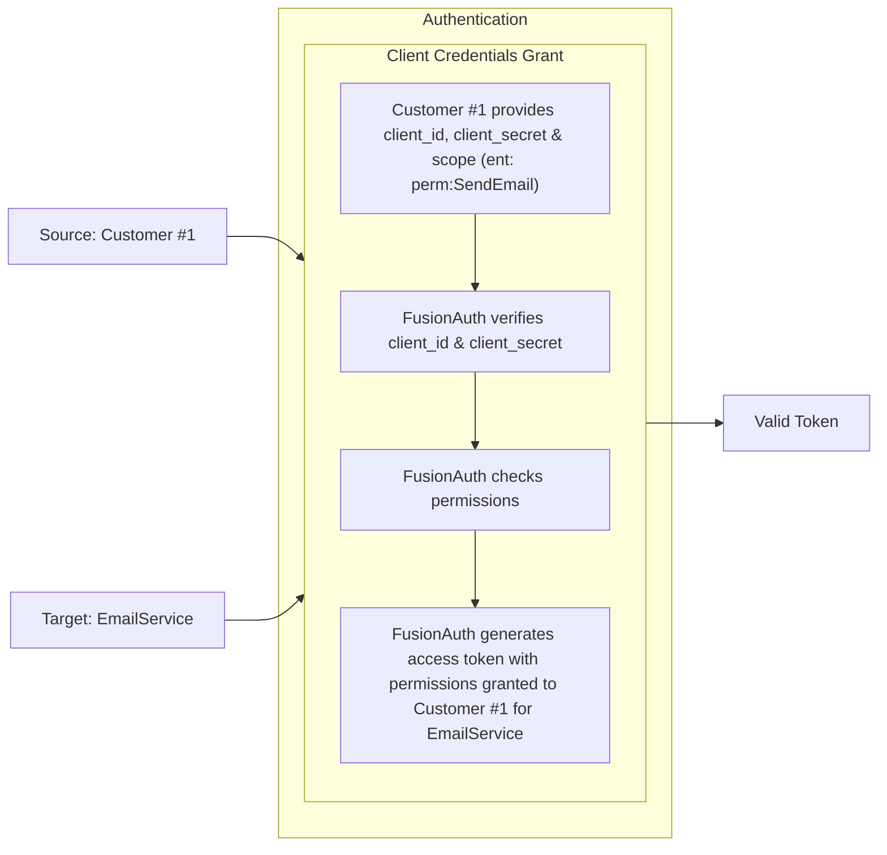
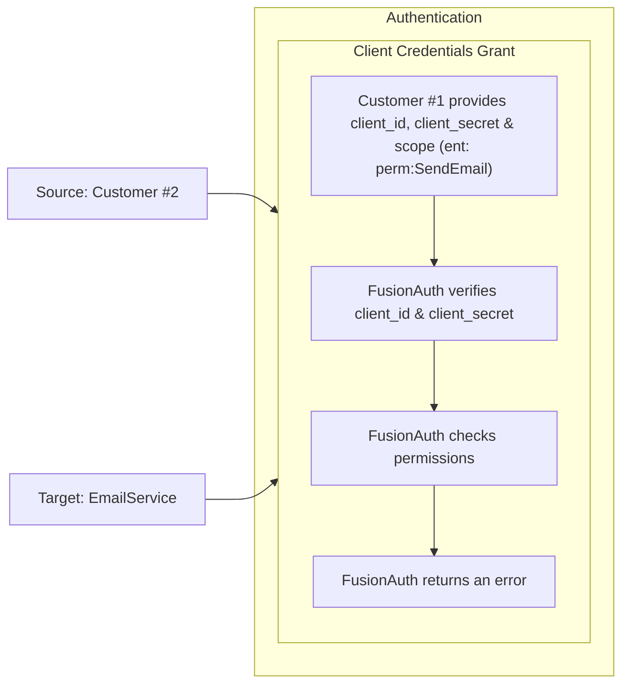
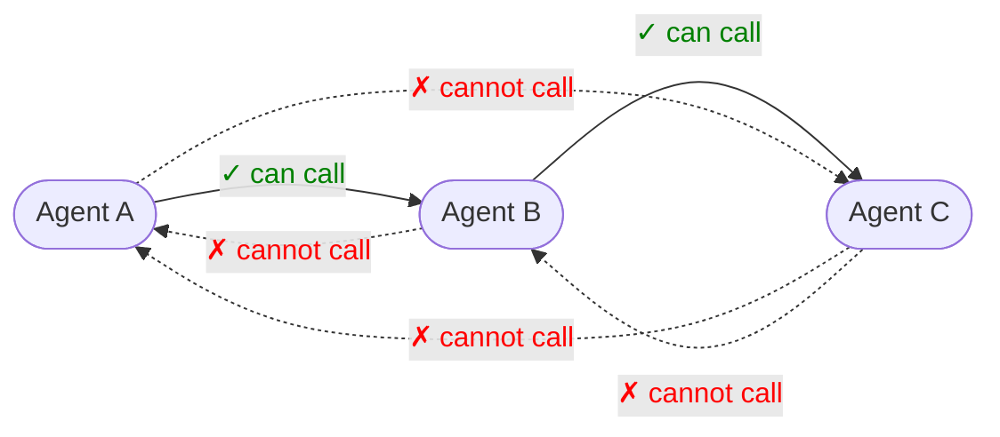

import PremiumPlanBlurb from 'src/content/docs/_shared/_premium-plan-blurb.mdx';
import APIBlock from 'src/components/api/APIBlock.astro';
import APIField from 'src/components/api/APIField.astro';
import Aside from 'src/components/Aside.astro';
import Breadcrumb from 'src/components/Breadcrumb.astro';
import Icon from 'src/components/icon/Icon.astro'
import ScimServerPermissions from 'src/content/docs/_shared/_scim-server-permissions.md'

<PremiumPlanBlurb />

There are many use cases where it is helpful to model entities in addition to users. Examples might include devices, cars, computers, customers, or companies.

_Enter Entities._ Entities allow you to model everything right from FusionAuth! Entities allow you to model relationships and enable machine-to-machine authentication using the Client Credentials grant.

## Features

### Scalability

- FusionAuth Entity Management supports large volumes of Entities right out of the box.
- This is especially helpful for Internet of Things (IoT) devices; FusionAuth scales right alongside them.

### Typecasting

- Entities can have a type.
- For example, an Entity could be a type of  `lock`, `car`, `company`, `corporate division`, `computer`, `AI agent`, or `API`
- Entity Types can define permissions.
- You are limited only by your business need and imagination!

### Permissions Aware

- Permissions can be assigned to each Entity Type.
- Entities can be granted permissions on other entities (In OAuth terms, entities can initiate a Client Credentials Grant to obtain access to other entities).
- Users can have permissions to access Entities.

## Common Applications

- Corporate relationship modeling
- Per use device permissions
- Internet IoT
- Controlling agent to agent communication

Below is an diagram using the client credentials grant, where a customer is getting a token from FusionAuth with permissions for the EmailService to send an email.

Consider instead the case where the customer does not have permissions for the EmailService.

### Can't I Just Use a Group?

In some cases, Groups work as a model for such ideas like `customers`. However, the flexibility of Groups is limited by their lack of typing (very much needed as use cases evolve). Additionally, Groups do not have permissions functionality built in.

## Entity Types

This is the Entity Types homepage. Here you can:

|                          |                                               |
|--------------------------|-----------------------------------------------|
| <Icon name="plus"/>      | **Create** a new Entity Type                  |
| <Icon name="edit"/>      | **Edit** a previously created Entity Type     |
| <Icon name="key" />      | **Manage Permissions** on Entity Type         |
| <Icon name="fa-search"/> | **View** the previously created Entity Type   |
| <Icon name="trash"/>     | **Remove** the previously created Entity Type |

## Entity Type Form Fields

<APIBlock>
  <APIField name="Id" optional>
    An optional UUID. When this value is omitted, a unique Id will be generated automatically.
  </APIField>
  <APIField name="Name" required>
    The name of the Entity Type. This value is for display purposes only and can be changed at any time.
  </APIField>
</APIBlock>

### Permissions

Add and manage custom permissions. 

<APIBlock>
  <APIField name="Name" required>
    The name of the permission
  </APIField>
  <APIField name="Default" optional>
    If this permission should be assigned once the Entity Type is created (by default). More than one default can be set.
  </APIField>
  <APIField name="Description" optional>
    Please write a helpful description of the permissions' purpose.
  </APIField>
</APIBlock>

### JWT

Controls the JWT settings used for this entity type.

<APIBlock>
  <APIField name="Enable entity-level JWT override" optional>
    When enabled, you can specify JWT settings for this entity type. If disabled, settings for the entity's tenant will be used.
  </APIField>
  <APIField name="JWT Duration" required>
    The length of time specified in seconds that the issued token is valid. This value must be greater than 0.

    When JWT customization is enabled, this is required. 
  </APIField>
  <APIField name="Access token signing key" optional>
    The key used to sign the JWT.
  </APIField>
</APIBlock>

## Entity

This is the Entity homepage. Here you can:

|                          |                                          |
|--------------------------|------------------------------------------|
| <Icon name="plus" />     | **Create** a new Entity                  |
| <Icon name="edit" />     | **Edit** a previously created Entity     |
| <Icon name="fa-search"/> | **View** the previously created Entity   |
| <Icon name="trash"/>     | **Remove** the previously created Entity |

## Entity Form Fields

Creating a new Entity is straightforward

Just complete the following fields:

<APIBlock>
  <APIField name="Id" optional>
    An optional UUID.
    When this value is omitted, a unique Id will be generated automatically.
  </APIField>
  <APIField name="Name" required>
    The name of the Entity.
    This value is for display purposes only and can be changed at any time.
  </APIField>
  <APIField name="Tenant" required>
    Assign the new Entity to a Tenant
  </APIField>
  <APIField name="Client Id" optional>
    When this value is omitted a unique Client Id will be generated automatically.
  </APIField>
  <APIField name="Client secret" optional>
    When this value is omitted a unique Client secret will be generated automatically.
  </APIField>
  <APIField name="Entity Type" required>
    When creating this Entity, you can assign it to a previously created Entity Type
  </APIField>
</APIBlock>

## SCIM Configuration

<Aside type="version">
This functionality has been available since 1.36.0
</Aside>

When configuring FusionAuth to accept SCIM requests, you must create a SCIM server Entity and a SCIM client Entity. These entities will be used by the Client Credentials grant which will provide the access token which is used to authenticate calls to the SCIM endpoints. These entities must be of the Entity Type configured in the Tenant SCIM configuration. They also must have the SCIM permissions granted to successfully call [SCIM API endpoints](/docs/apis/scim/) requiring authentication.

The necessary Entity Types can be created by navigating to Entity <Breadcrumb>Management > Entity Types</Breadcrumb> and selecting the clicking the drop down <Breadcrumb>Add</Breadcrumb> button in the top right of the page. In most cases you will find these two entity types have been created for you by FusionAuth.

The default entity types are named **\[FusionAuth Default] SCIM client** and **\[FusionAuth Default] SCIM server**. Below is a screenshot of adding a new Entity Type for the SCIM Server, but if you wish to use the default Entity Type, you do not need to create an additional Entity Type.

[Learn more about SCIM](/docs/lifecycle/migrate-users/scim/).

### SCIM Server Permissions

<ScimServerPermissions />

## Limitations

It is not currently possible to utilize an OAuth2 grant to retrieve user permissions to an entity. Please review [GitHub Issue #1295](https://github.com/FusionAuth/fusionauth-issues/issues/1295/) and vote if you would like to see this capability in FusionAuth.

It is also not possible to rename or otherwise customize scopes used with Entity Management. Please review [GitHub Issue #1481](https://github.com/FusionAuth/fusionauth-issues/issues/1481) and vote if you would like to see this capability in FusionAuth.

## Agents

FusionAuth entities can be used to represent AI agents. You can create an Entity Type of `AI Agent` with a permission of `execute`.

Each agent can be given a unique identity and a secret, uniquely identifying them.

Agents can obtain tokens via the client credentials grant and present them to other services.

Agent identities can be created and destroyed via the Entity API; when destroyed, their secrets are no longer valid.

You can also search for agents using the Entity Search API.

Agent metadata, such as the user or job that created the agent and a system prompt for that agent, can be stored in the entity `data` field.

### Agent Permissions

You can grant agents permissions to call other agents. This provides a deterministic set of guardrails around the agent system.

For example, suppose you have a system with agents A, B, and C. With entities, you can build a permission graph such that:

* agent A can call agent B
* agent B can call agent C
* agent A cannot call agent C
* agent B cannot call agent A
* agent C cannot call either A or B

Whenever an agent wants to call another agent, they:

1. present their id, secret, and desired target to FusionAuth, who returns an access token or error, depending on agent permissions 
1. present their access token to the other agent, who verifies the token, then accepts or denies the request

This permission graph can be managed using entities or [FusionAuth FGA](/docs/extend/fine-grained-authorization).

## More Information

* An example [client credentials grant using Entities](/docs/lifecycle/authenticate-users/oauth/#example-client-credentials-grant).
* The [Entity Management APIs](/docs/apis/entities/).
* A guide to using [Entities to model organizations](/docs/extend/examples/modeling-organizations).
