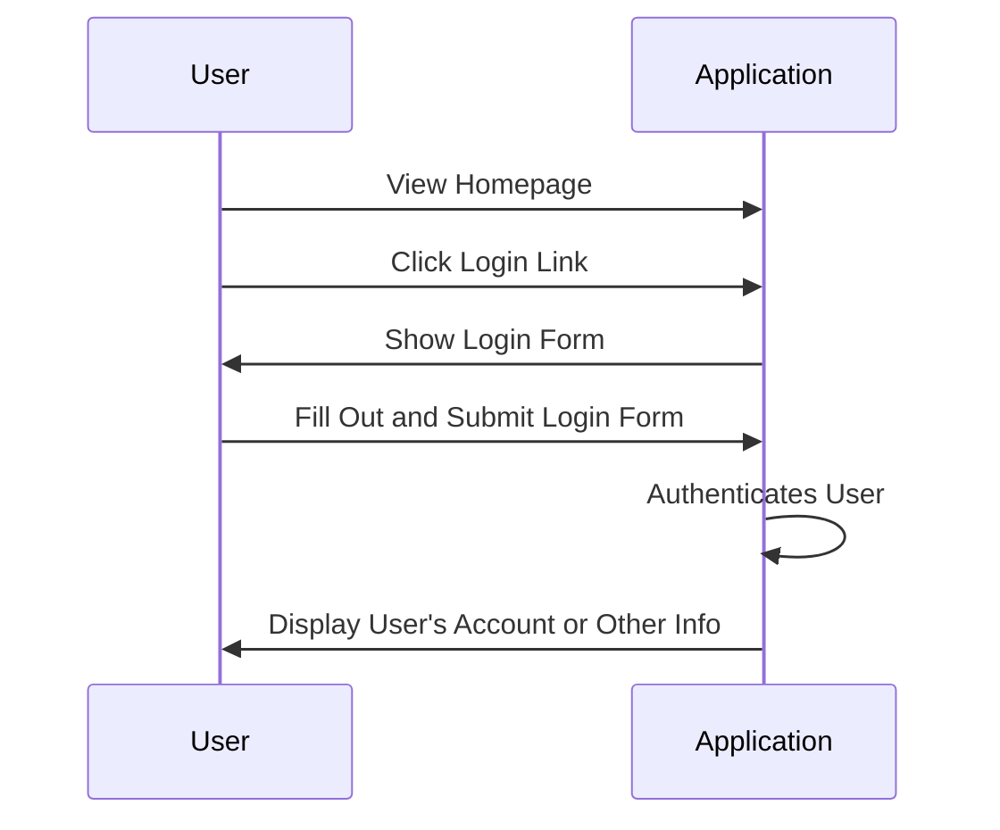
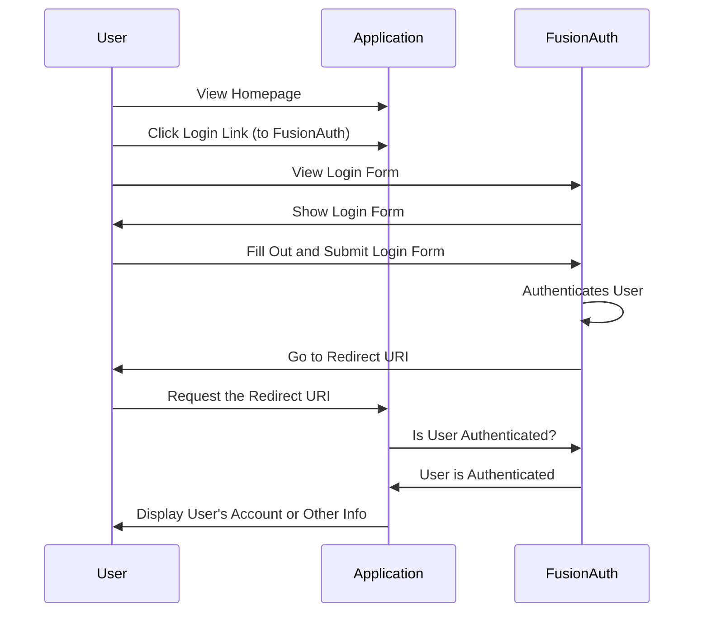

import Aside from 'src/components/Aside.astro';
import LocalCode from 'src/components/LocalCode.astro';
import QuickstartTshirtCTA from 'src/components/quickstarts/QuickstartTshirtCTA.astro'

This quickstart adds login to a Django web app using a preconfigured, local version of FusionAuth in the following steps:

1. Run FusionAuth with Docker.
1. Create a new Django project with a single app.
1. Configure `mozilla-django-oidc` and add authentication URLs, views, and templates.

You'll be building the app for [ChangeBank](https://www.youtube.com/watch?v=CXDxNCzUspM), a global leader in converting dollars into coins. It'll have areas reserved for users who have logged in as well as public facing sections.

The Docker Compose file and source code for a complete application are available at [https://github.com/FusionAuth/fusionauth-quickstart-python-django-web](https://github.com/FusionAuth/fusionauth-quickstart-python-django-web).

## Prerequisites

For this QuickStart, you'll need:

* [Python](https://www.python.org/downloads/) 3.8.x — this QuickStart's `requirements.txt` pins Django 3.2.15, which fails to start a project on Python 3.13 or later (Django 3.2 imports the standard library `cgi` module, removed in Python 3.13). Install Python 3.8 with a version manager such as [pyenv](https://github.com/pyenv/pyenv) if it isn't available through your OS package manager.
* [Docker](https://www.docker.com), which is the quickest way to start FusionAuth. (There are [other ways](/docs/get-started/download-and-install)).

## General Architecture

Here's a typical application login flow before FusionAuth:


And here's the same application login flow after introducing FusionAuth:



In general, you are introducing FusionAuth in order to normalize and consolidate user data. This helps make sure it is consistent and up-to-date as well as offloading your login security and functionality to FusionAuth.

## Getting Started

Start with getting FusionAuth up and running and creating a new Django application.

### Clone the Code

First, grab the code from the repository and change into that directory.

```shell
git clone https://github.com/FusionAuth/fusionauth-quickstart-python-django-web.git
cd fusionauth-quickstart-python-django-web
```

All shell commands in this guide can be entered in a terminal in this folder. On Windows, you need to replace forward slashes with backslashes in paths.

All the files you'll create in this guide already exist in the `complete-application` folder, if you prefer to copy them.

### Run FusionAuth via Docker

You'll find a Docker Compose file (`docker-compose.yml`) and an environment variables configuration file (`.env`) in the root directory of the repo.

Assuming you have Docker installed, you can stand up FusionAuth on your machine with the following.

```shell
docker compose up -d
```

Here you are using a bootstrapping feature of FusionAuth called [Kickstart](/docs/get-started/download-and-install/development/kickstart). When FusionAuth comes up for the first time, it will look at the `kickstart/kickstart.json` file and configure FusionAuth to your specified state.

<Aside type="note">
If you ever want to reset the FusionAuth application, you need to delete the volumes created by Docker Compose by executing `docker compose down -v`, then re-run `docker compose up -d`.
</Aside>

FusionAuth will be initially configured with these settings:

* Your client Id is `e9fdb985-9173-4e01-9d73-ac2d60d1dc8e`.
* Your client secret is `super-secret-secret-that-should-be-regenerated-for-production`.
* Your example username is `richard@example.com` and the password is `password`.
* Your admin username is `admin@example.com` and the password is `password`.
* The base URL of FusionAuth is `http://localhost:9011/`.

You can log in to the [FusionAuth admin UI](http://localhost:9011/admin) and look around if you want to, but with Docker and Kickstart, everything will already be configured correctly.

<Aside type="caution">
The `.env` file contains passwords. In a real application, always add this file to your `.gitignore` file and never commit secrets to version control.
</Aside>

### Create a Basic Django Application

Next, you'll set up a basic Django project with a single app. While this guide builds a new Django project, you can use the same method to integrate your existing project with FusionAuth.

1. Work in a virtual environment for this.

   ```shell
   python3 -m venv venv && source venv/bin/activate
   ```

   Using `venv` isolates Python dependencies for this project locally so that any dependencies used by other projects on your machine are not affected.

1. Create a `requirements.txt` file to list the project dependencies with the following content.

   <LocalCode src="fusionauth-quickstart-python-django-web-main/complete-application/requirements.txt" lang="shell" />

1. Install the dependencies into your virtual environment.

   ```shell
   pip install -r requirements.txt
   ```

1. Create the default Django starter project.

   ```shell
   django-admin startproject mysite
   ```

1. Create a `.env` file in your `mysite` folder and add the following to it (note that this is a different environment file to the one in the root folder used by Docker for FusionAuth).

   <LocalCode src="fusionauth-quickstart-python-django-web-main/complete-application/mysite/.env" lang="shell" />

## Authentication

Create an app within your `mysite` project.

```shell
cd mysite
python manage.py startapp app
cd ..
```

Now you will work from the top down to set up authentication URLs in the project `settings.py`, then in the application `urls.py`, then the `views.py`, and finally, the HTML templates for the views.

1. Overwrite your `mysite/mysite/settings.py` contents with the following code.

   <LocalCode src="fusionauth-quickstart-python-django-web-main/complete-application/mysite/mysite/settings.py" lang="python" />

   Here, your `app` and `mozilla_django_oidc` are added to the list of `INSTALLED_APPS`. The authentication library from Mozilla is set up by `mozilla_django_oidc` and the `OIDC_OP_` constants imported from the `.env` file. This automatically handles the interaction with FusionAuth on the endpoints configured in this file and the matching ones configured in the `kickstart.json` file that you used to initialize FusionAuth.

1. Overwrite the `mysite/mysite/urls.py` file with the following code:

   <LocalCode src="fusionauth-quickstart-python-django-web-main/complete-application/mysite/mysite/urls.py" lang="python" />

   * The `admin` site is the default Django admin.
   * The `app` URLs are for the app you created in your project.
   * The `oidc` URLs are automatically generated from the settings you configured in the previous step.

1. From this point, you'll create files in the `mysite/app` application folder, not in the main `mysite/mysite` project. Create a `mysite/app/urls.py` file and set its content to match the project URLs.

   <LocalCode src="fusionauth-quickstart-python-django-web-main/complete-application/mysite/app/urls.py" lang="python" />

1. Overwrite the `mysite/app/views.py` file. The code below creates three pages: the home page, the account page, and the make change page.

   <LocalCode src="fusionauth-quickstart-python-django-web-main/complete-application/mysite/app/views.py" lang="python" />

   Here's what these views do:

   * The `app` view, or home page, redirects the user to the `account` view if they are already logged in.
   * The `account` view checks whether the user is logged in. If the user is logged in, it returns the account page template, passing in the user's email address returned from FusionAuth. If the user isn't logged in, they are redirected to the login page. This also happens in the change page.
   * The `logout` view is necessary because you need to clear the session for the user in Django after the user logs out of FusionAuth. FusionAuth sends the user to this view after logging them out, which then returns them to the home page.
   * The `change` view looks longer only because it demonstrates how to do some calculations if the request is a POST instead of a GET. These calculations are then passed to the template in the `change` variable to display onscreen.

## Customization

Now that authentication is done, the last task is to create the HTML pages and style them with CSS.

1. Copy the `static` and `templates` folders into your app. Use the appropriate command for your operating system.

   ```batch
   # linux, mac
   cp -r complete-application/mysite/app/static mysite/app
   cp -r complete-application/mysite/app/templates mysite/app

   # windows
   xcopy /e complete-application\mysite\app\static mysite\app
   xcopy /e complete-application\mysite\app\templates mysite\app
   ```

   There are only two lines in these templates related to authentication. In the `home.html` template, there is a login button.

```html
<a class="button-lg" href="">Login</a>
```
This URL is made available by the Mozilla plugin in the settings file. It directs the user to FusionAuth to log in, which then redirects back to your app account page.

In the account and change pages, there is a logout form.

```html
<form id="logoutForm" class="button-lg"  action="" method="post">
  
  <a class="button-lg" href="#" onclick="document.getElementById('logoutForm').submit();">Log out</a>
</form>
```

Log out has to be a form that submits a `POST` request to FusionAuth. Here you use an anchor element that is easy to style, but if your users might disable JavaScript, you could use a traditional form `input` element.

## Run the Application

1. Update the default SQLite database and start your server.

   ```bash
   python mysite/manage.py migrate
   python mysite/manage.py runserver
   ```

1. Browse to [the Django app](http://localhost:8000/app).

1. Log in using `richard@example.com` and `password`. The change page will allow you to enter a number and see the result of the POST. Log out and verify that you can't browse to the [account page](http://localhost:8000/app/account).

<QuickstartTshirtCTA/>

## Next Steps

This is a quick introduction to using FusionAuth for user authentication. To learn more about integrating FusionAuth with your product, see [Get Started](/docs/get-started).

For a production application, consider:

* [Customizing the hosted login pages](/docs/customize/look-and-feel/) so FusionAuth's login, registration, and other pages match your brand.
* Choosing [password rules](/docs/get-started/core-concepts/tenants#password) and a [hashing algorithm](/docs/reference/password-hashes) that meet your security needs.
* Customizing [token expiration times and policies](/docs/lifecycle/authenticate-users/oauth/#configure-application-oauth-settings) in FusionAuth.
* Learning more about configuring the [open source OIDC library](https://github.com/mozilla/mozilla-django-oidc) this guide uses.

FusionAuth has many other features (including [Social Login](/docs/lifecycle/authenticate-users/identity-providers/#social-identity-providers), [Single Sign-On](/docs/lifecycle/authenticate-users/single-sign-on), [Passwordless](/docs/lifecycle/authenticate-users/passwordless/webauthn-passkeys), [Multi-factor Authentication](/docs/lifecycle/authenticate-users/multi-factor-authentication)), most of which are free. Some require additional licensing. For details, see the [pricing page](/pricing).

You can ask general questions in [the FusionAuth forum](/community/forum).

## Troubleshooting

* I get "This site can't be reached localhost refused to connect" when I click the login button.

  Ensure FusionAuth is running in the Docker container. You should be able to log in as the admin user `admin@example.com` with a password of `password` at [http://localhost:9011/admin](http://localhost:9011/admin).

* It still doesn't work.

  You can always pull down a complete running application and compare what's different.

  ```
  git clone https://github.com/FusionAuth/fusionauth-quickstart-python-django-web.git
  cd fusionauth-quickstart-python-django-web
  docker compose up -d
  cd complete-application
  python3 -m venv venv && source venv/bin/activate
  pip install -r requirements.txt
  python mysite/manage.py migrate
  python mysite/manage.py runserver
  ```
