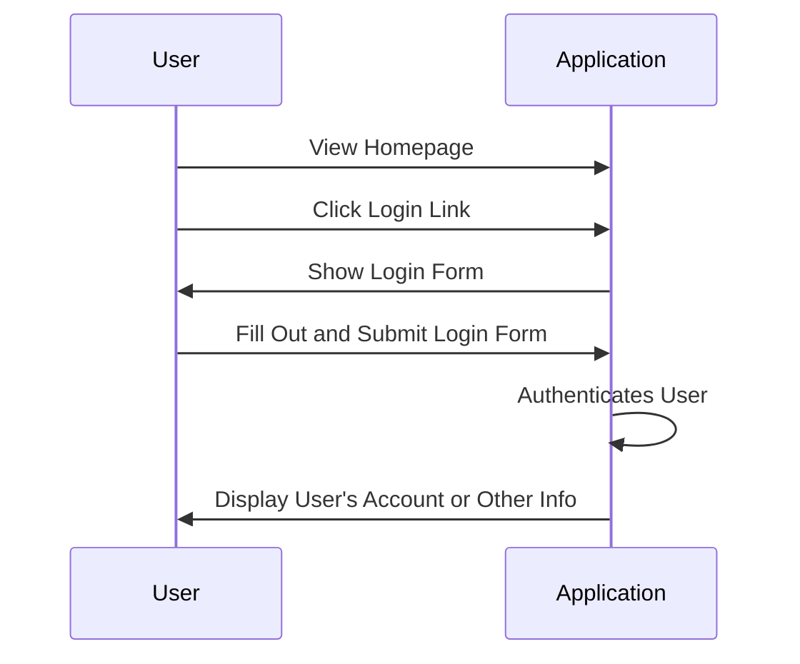
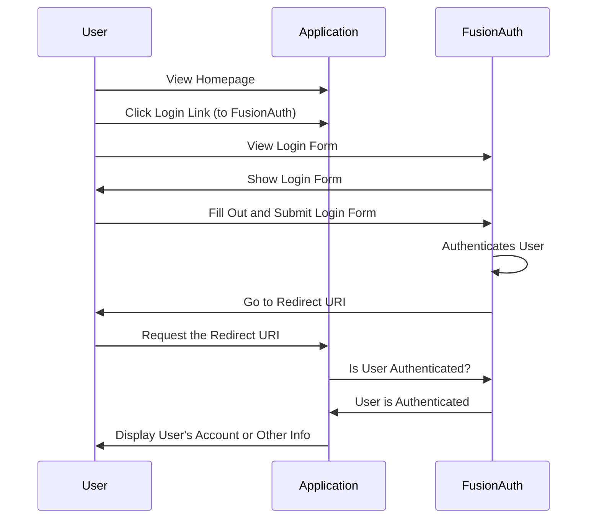

import Aside from 'src/components/Aside.astro';
import LocalCode from 'src/components/LocalCode.astro';
import LocalValue from 'src/components/LocalValue/LocalValue.astro';
import QuickstartTshirtCTA from 'src/components/quickstarts/QuickstartTshirtCTA.astro'

This quickstart adds login to a Rust Actix web app using a preconfigured, local version of FusionAuth in the following steps:

1. Run FusionAuth with Docker.
1. Create a new Actix web project.
1. Configure OAuth2 and add authentication routes, templates, and styling.

You'll be building the app for [ChangeBank](https://www.youtube.com/watch?v=CXDxNCzUspM), a global leader in converting dollars into coins. It'll have areas reserved for users who have logged in as well as public facing sections.

While this guide uses Actix, the Rust OAuth2 library it relies on can also be used in your preferred framework, such as Rocket or Axum.

The Docker Compose file and source code for a complete application are available at [https://github.com/FusionAuth/fusionauth-quickstart-rust-actix-web](https://github.com/FusionAuth/fusionauth-quickstart-rust-actix-web).

## Prerequisites

For this quickstart, you'll need:

* [Docker](https://www.docker.com) version 20 or later, which is the quickest way to start FusionAuth. (There are [other ways](/docs/get-started/download-and-install/).)
* [Rust](https://rustup.rs/#) and Cargo, with rustc version 1.88 or later — this quickstart's unpinned `actix-web = "4"` dependency resolves to a version needing rustc 1.88 or later.
* You may also need to install `pkg-config` and `libssl-dev` if they are not already installed on your system.

## General Architecture

Here's a typical application login flow before FusionAuth:


And here's the same application login flow after introducing FusionAuth:



In general, you are introducing FusionAuth in order to normalize and consolidate user data. This helps make sure it is consistent and up-to-date as well as offloading your login security and functionality to FusionAuth.

## Getting Started

Start with getting FusionAuth up and running and creating a new Actix application.

### Clone the Code

First, grab the code from the repository and change to that folder.

```shell
git clone https://github.com/FusionAuth/fusionauth-quickstart-rust-actix-web.git
cd fusionauth-quickstart-rust-actix-web
mkdir your-application
```

All shell commands in this guide can be entered in a terminal in this folder. On Windows, you need to replace forward slashes with backslashes in paths.

All the files you'll create in this guide already exist in the `complete-application` subfolder, if you prefer to copy them to `your-application`.

### Run FusionAuth via Docker

You'll find a Docker Compose file (`docker-compose.yml`) and an environment variables configuration file (`.env`) in the root directory of the repo.

Assuming you have Docker installed, you can stand up FusionAuth on your machine with the following.

```shell
docker compose up -d
```

Here you are using a bootstrapping feature of FusionAuth called [Kickstart](/docs/get-started/download-and-install/development/kickstart). When FusionAuth comes up for the first time, it will look at the `kickstart/kickstart.json` file and configure FusionAuth to your specified state.

<Aside type="note">
If you ever want to reset the FusionAuth application, you need to delete the volumes created by Docker Compose by executing `docker compose down -v`, then re-run `docker compose up -d`.
</Aside>

FusionAuth will be initially configured with these settings:

* Your client Id is <LocalValue path="fusionauth-quickstart-rust-actix-web-main/kickstart/kickstart.json" selector="$.variables.applicationId" />.
* Your client secret is `super-secret-secret-that-should-be-regenerated-for-production`.
* Your example username is <LocalValue path="fusionauth-quickstart-rust-actix-web-main/kickstart/kickstart.json" selector="$.variables.userEmail" /> and the password is <LocalValue path="fusionauth-quickstart-rust-actix-web-main/kickstart/kickstart.json" selector="$.variables.userPassword" />.
* Your admin username is <LocalValue path="fusionauth-quickstart-rust-actix-web-main/kickstart/kickstart.json" selector="$.variables.adminEmail" /> and the password is <LocalValue path="fusionauth-quickstart-rust-actix-web-main/kickstart/kickstart.json" selector="$.variables.adminPassword" />.
* The base URL of FusionAuth is `http://localhost:9011/`.

You can log in to the [FusionAuth admin UI](http://localhost:9011/admin) and look around if you want to, but with Docker and Kickstart, everything will already be configured correctly.

<Aside type="caution">
The `.env` file contains passwords. In a real application, always add this file to your `.gitignore` file and never commit secrets to version control.
</Aside>

### The Basic Actix Application

While this guide builds a new Actix project, you can use the same method to integrate your existing project with FusionAuth.

<Aside type="note">
  If you only want to run the application and not create your own, there is a completed version in the `complete-application` directory. You can use the following commands to get it up and running.

  ```shell
  cd complete-application
  cargo run
  ```

  View the application at http://localhost:9012.
</Aside>

From here on, you'll work in the `your-application` directory.

1. Install the dependencies for the web server with the code below.

   ```bash
   cd your-application
   cargo init
   cargo add actix-web@4
   cargo add actix-files@0.6.2
   cargo add actix-session@0.8.0 --features cookie-session
   cargo add dotenv@0.15.0
   cargo add handlebars@4.5 --features dir_source
   cargo add oauth2@4.4.2
   cargo add reqwest@0.11 --features json
   cargo add serde@1.0 --features derive
   ```

   Add the following code to your `src/main.rs` file.

   <LocalCode src="fusionauth-quickstart-rust-actix-web-main/complete-application/src/main.rs" lang="rust" />

   The `main` function configures the web server, adds routes to it, and starts it. The function also:

   * Uses `dotenv` to allow you to call any values from the `.env` file later in the application.
   * Uses private same-site cookies to store the user's email when logged in. Actix does not provide an anti-CSRF token as they [believe same-site cookies render it unnecessary](https://github.com/actix/actix-web/issues/147).
   * Adds routes from the main file to the server, and some authentication routes, which you'll add in the next section.
   * Enables the Handlebars library to provide HTML templates.

   The remainder of this main file is three routes: index, account, and change. They each check if the user's email is in the HTTP request cookie (meaning the user is logged in), and display an HTML template. The account and change routes send the user's email to the template.

   The change route is more complicated. It has two versions: one for GET and one for POST. The POST version checks the request's form to extract a dollar amount, then calls `calculate_change` to convert the dollars to nickels and pennies, and returns them in the state to the Handlebars template.

## Authentication

Authentication in Rust is managed by [OAuth2](https://docs.rs/oauth2/latest/oauth2/).

1. Create the file `.env` in the `your-application` directory and insert the following lines.

   <LocalCode src="fusionauth-quickstart-rust-actix-web-main/complete-application/.env" />

   This tells Actix where to find and connect to FusionAuth.

1. Authentication is handled by `src/auth.rs`. Create that file now and insert the following code.

   <LocalCode src="fusionauth-quickstart-rust-actix-web-main/complete-application/src/auth.rs" lang="rust" />

   This code has three routes: `login`, `logout`, and `callback`.

   * `logout` clears the user's session and returns them to the home page.
   * `login` uses `get_oauth_client` to read your variables from the `.env` file and get a new client that constructs a URL to call FusionAuth, then redirects the user to that URL.
   * `callback` does most of the work. The user is returned to `callback` after logging in with FusionAuth. The function checks that the PKCE challenge is correct, retrieves the access token, and makes a final call to FusionAuth to get the user's email, which it stores in the session. Now the application considers the user logged in.

   Actix automatically links the user's session to their browser by returning a cookie for the site, which is then included in every subsequent request.

   Now that `callback` has set a cookie, you can see how authentication on the other pages is tested. The application:

   * Sends the user to the account page if they already have a login cookie on the home page.
   * Sends the user to the home page if they are not logged in on the account page.

## Customization

Now that authentication is done, the last task is to create example pages that a user can browse.

1. Create a `static` directory within `your-application` directory.

   ```shell
   mkdir static
   ```

1. Copy images from the example app.

   ```shell
   cp ../complete-application/static/money.jpg static/money.jpg
   ```

1. Create a stylesheet file `static/changebank.css` and add the following code to it.

   <LocalCode src="fusionauth-quickstart-rust-actix-web-main/complete-application/static/changebank.css" lang="css" />

1. Create a `templates` directory within `your-application`. Create three pages inside the `templates` directory. First create the home page, `index.html`, and paste the following code into it.

   <LocalCode src="fusionauth-quickstart-rust-actix-web-main/complete-application/templates/index.html" lang="html" />

   The index page contains nothing to note except a link to the login page `<a href="/login">`.

1. Create an `account.html` page and paste the following code into it.

   <LocalCode src="fusionauth-quickstart-rust-actix-web-main/complete-application/templates/account.html" lang="html" />

   The account page displays the user's email from FusionAuth with `<p class="header-email">{{email}}</p>`.

   The account page is only visible to logged in users. If a session email is not found, the user is redirected to login.

1. Create a `change.html` page and paste the following code into it.

   <LocalCode src="fusionauth-quickstart-rust-actix-web-main/complete-application/templates/change.html" lang="html" />

   The HTML at the bottom of the file displays a blank form when the page first loads (GET) or the result of the calculation when returning (POST).

## Run the Application

1. Run your application.

   ```bash
   cargo run
   ```

1. Browse to the app at http://localhost:9012.

1. Log in using <LocalValue path="fusionauth-quickstart-rust-actix-web-main/kickstart/kickstart.json" selector="$.variables.userEmail" /> and <LocalValue path="fusionauth-quickstart-rust-actix-web-main/kickstart/kickstart.json" selector="$.variables.userPassword" />. The change page allows you to enter a number and see the result of the calculation. Log out and verify that you can't browse to the account or change pages.

<QuickstartTshirtCTA/>

## Next Steps

This is a quick introduction to using FusionAuth for user authentication. To learn more about integrating FusionAuth with your product, see [Get Started](/docs/get-started).

For a production application, consider:

* [Customizing the hosted login pages](/docs/customize/look-and-feel/) so FusionAuth's login, registration, and other pages match your brand.
* Choosing [password rules](/docs/get-started/core-concepts/tenants#password) and a [hashing algorithm](/docs/reference/password-hashes) that meet your security needs.
* Customizing [token expiration times and policies](/docs/lifecycle/authenticate-users/oauth/#configure-application-oauth-settings) in FusionAuth.
* Learning more about configuring the [Rust OAuth2 library](https://docs.rs/oauth2/latest/oauth2/) or the [Actix](https://actix.rs/) framework this guide uses.

FusionAuth has many other features (including [Social Login](/docs/lifecycle/authenticate-users/identity-providers/#social-identity-providers), [Single Sign-On](/docs/lifecycle/authenticate-users/single-sign-on), [Passwordless](/docs/lifecycle/authenticate-users/passwordless/webauthn-passkeys), [Multi-factor Authentication](/docs/lifecycle/authenticate-users/multi-factor-authentication)), most of which are free. Some require additional licensing. For details, see the [pricing page](/pricing).

You can ask general questions in [the FusionAuth forum](/community/forum).

## Troubleshooting

* I get "This site can't be reached localhost refused to connect" when I click the login button.

  Ensure FusionAuth is running in the Docker container. You should be able to log in as the admin user <LocalValue path="fusionauth-quickstart-rust-actix-web-main/kickstart/kickstart.json" selector="$.variables.adminEmail" /> with the password <LocalValue path="fusionauth-quickstart-rust-actix-web-main/kickstart/kickstart.json" selector="$.variables.adminPassword" /> at [http://localhost:9011/admin](http://localhost:9011/admin).

* It still doesn't work.

  You can always pull down a complete running application and compare what's different.

  ```shell
  git clone https://github.com/FusionAuth/fusionauth-quickstart-rust-actix-web.git
  cd fusionauth-quickstart-rust-actix-web
  docker compose up -d
  cd complete-application
  cargo run
  ```
