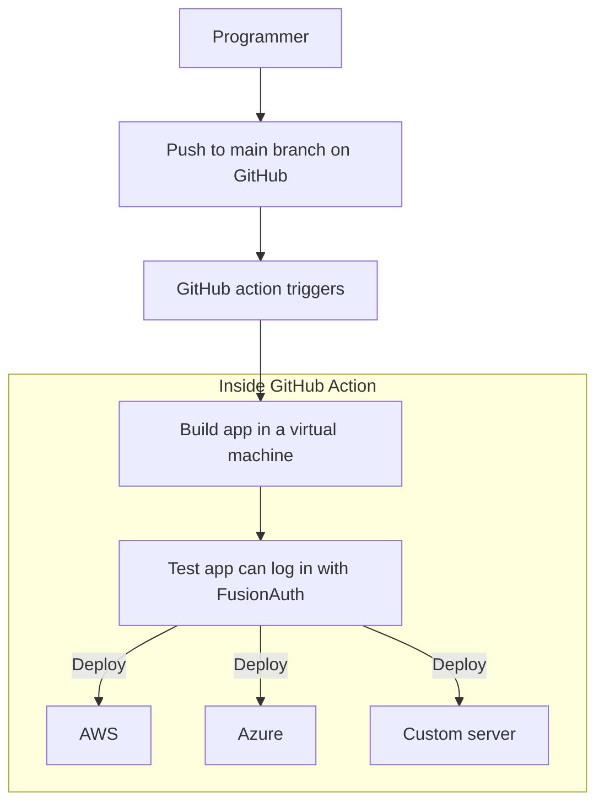

- [Notes](#notes)
  - [Brief](#brief)
- [Introduction](#introduction)

## Notes

Brief - https://docs.google.com/document/d/16ql1wY7kPI4MxESMzMaK2pLCa3ZdSxQcsqbT9tY5qq8/edit

### Brief

- Document how to set up Fusionauth in a CI environment (GitHub actions)
- Use kickstart to set the system up to a known state (example here: https://github.com/FusionAuth/fusionauth-python-client/blob/master/.github/workflows/test.yaml)
- Use Selenium or some other tool (e.g. Playwright) to create an end-to-end  functionality test (e.g. can a user log in?)
- Bonus points if we can figure out how to get Fusionauth available in the GitHub marketplace so users can install it from there instead of manually on the CI runner.
- Resources
  - https://fusionauth.io/community/forum/topic/898/how-do-i-use-fusionauth-in-my-ci-cd-system
  - https://github.com/fusionauth/fusionauth-site/issues/1663
  - https://fusionauth.io/docs/get-started/run-in-the-cloud/

## Introduction

Things users want to automate deployment of:
- When pushing to main branch, deploy their app and FusionAuth to AWS, Azure, Digital Ocean, or a custom server.
- Test that login works through terminal.
- Test login works from their app. A web page GUI tester.
- Upgrade FusionAuth to a new version.
- Leave FusionAuth untouched on server if no changes have been made to kickstart files or FusionAuth version.
- Set up CD functionality through a GitHub marketplace action.

- Testing login works should be done in the action. The final test of logging to the deployed app can be done by hand when checking the site is actually up.

