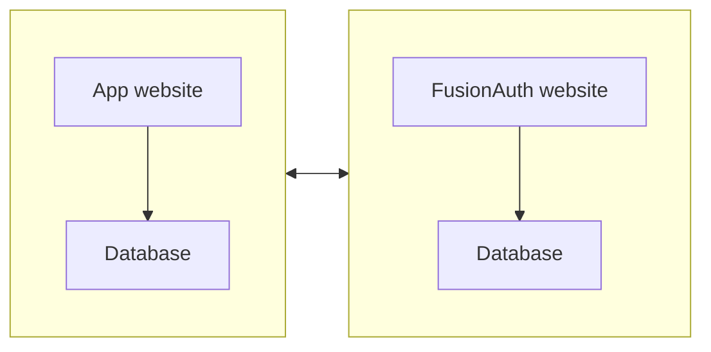

import Aside from '/src/components/Aside.astro';
import {RemoteCode} from '@fusionauth/astro-components';

## Notes

Brief - https://docs.google.com/document/d/16ql1wY7kPI4MxESMzMaK2pLCa3ZdSxQcsqbT9tY5qq8/edit

### Brief

- Document how to set up Fusionauth in a CI environment (GitHub actions)
- Use kickstart to set the system up to a known state (example here: https://github.com/FusionAuth/fusionauth-python-client/blob/master/.github/workflows/test.yaml)
- Use Selenium or some other tool (e.g. Playwright) to create an end-to-end  functionality test (e.g. can a user log in?)
- Bonus points if we can figure out how to get Fusionauth available in the GitHub marketplace so users can install it from there instead of manually on the CI runner.
- Resources
  - https://fusionauth.io/community/forum/topic/898/how-do-i-use-fusionauth-in-my-ci-cd-system
  - https://github.com/fusionauth/fusionauth-site/issues/1663
  - https://fusionauth.io/docs/get-started/run-in-the-cloud/

### Todo

- [x] plan project
- [x] read cloud docs on fa docs site
- [x] how does one upgrade fa without losing database? show example with different docker versions on dockerhub
- [x] choose tester:
  - selenium is java based
  - puppeteer is chrome only
  - cypress is complex and has a gui
  - playwright looks good - js. cross browser. headless.
- [x] make article outline
- [x] make test repo - https://github.com/ritza-co/fusionauth_github_actions
- [x] do the same thing in a github action
- [x] how to upgrade FA and backup
- [ ] how to deploy to prod
- [ ] learn about github actions marketplace
- [ ] decide what the marketplace action should do (all 3 os?)
- [ ] write and deploy the action to marketplace
- [ ] write the article
  - [ ] target audience - newbies to fa and actions
  - [ ] mention fa cloud paid service
  - [ ] secrets and .env
  - [ ] how to test live site
  - [ ] add images

## Introduction

This article explains:
- How to upgrade FusionAuth
- How to write automated tests of your application login with FusionAuth
- How to run these tests in a GitHub Action when pushing to the main branch
- How to automate deployment and testing on your live application

To understand this article, you need to know how to create a project in GitHub, but don't need to know anything about FusionAuth, GitHub actions, or automated testing. The basics are explained here.

- [Notes](#notes)
  - [Brief](#brief)
  - [Todo](#todo)
- [Introduction](#introduction)
- [Some Definitions And Goals](#some-definitions-and-goals)
- [A Simple Example](#a-simple-example)
- [How To Upgrade FusionAuth](#how-to-upgrade-fusionauth)
- [Dev, Test, QA, Preprod, And Prod Environments](#dev-test-qa-preprod-and-prod-environments)
- [Test Your App Login To FusionAuth With Playwright](#test-your-app-login-to-fusionauth-with-playwright)
- [Build Your App In A GitHub Action](#build-your-app-in-a-github-action)
- [Test Your App In A GitHub Action](#test-your-app-in-a-github-action)
- [Use The Action For FusionAuth In The GitHub Action Marketplace](#use-the-action-for-fusionauth-in-the-github-action-marketplace)
- [Further Reading](#further-reading)


## Some Definitions And Goals

FusionAuth provides all login functionality for your web application. It stores users in its own database, separate to the database your app uses to keep its data. Assuming you have built a login page that redirects a user to FusionAuth for login, your system will have the components shown below.



You might have the following questions:
- How do I deploy all this to production?
- What happens when FusionAuth releases a new version? How do I upgrade it without losing data?
- How can I test that login still works after upgrading my app or FusionAuth?
- How do I separate and manage my development and production environments?
- Where do I keep database passwords safely and include them when deploying?

Automating these tasks above is called continuous integration / continuous deployment (CI/CD).
- CI refers to testing that changes to code you push to the main branch fits in with the existing system and everything still works.
- CD refers to deploying every push to the main branch to your production (live) site.

GitHub provides a tool for automating workflows called GitHub actions. It provides a virtual machine in which you can run scripts to check out your code, compile it, deploy alongside FusionAuth and other services, run tests, and deploy everything.

The flow looks like the diagram below.


## A Simple Example

## How To Upgrade FusionAuth


https://fusionauth.io/docs/get-started/download-and-install/docker#upgrading
https://hub.docker.com/r/fusionauth/fusionauth-app/tags

  fusionauth:
    image: fusionauth/fusionauth-app:1.48.3 # 1.42.1 - 1.48.3 - latest

```bash
fusionauth_github_actions-fusionauth-1  | ---------------------------------------------------------------------------------------------------------
fusionauth_github_actions-fusionauth-1  | ---------------------------------- Entering Silent Configuration Mode -----------------------------------
fusionauth_github_actions-fusionauth-1  | ---------------------------------------------------------------------------------------------------------
fusionauth_github_actions-fusionauth-1  |
fusionauth_github_actions-fusionauth-1  | 2024-01-05 12:49:04.337 PM INFO  com.inversoft.maintenance.db.JDBCMaintenanceModeDatabaseService - [TW2QyQ] Attempting to lock database to support multi-node configurations
fusionauth_github_actions-fusionauth-1  | 2024-01-05 12:49:04.348 PM INFO  com.inversoft.maintenance.db.JDBCMaintenanceModeDatabaseService - [TW2QyQ] Obtained a database lock
fusionauth_github_actions-fusionauth-1  | 2024-01-05 12:49:04.386 PM INFO  com.inversoft.maintenance.db.JDBCMaintenanceModeDatabaseService - [TW2QyQ] Database Version [1.42.1]
fusionauth_github_actions-fusionauth-1  | 2024-01-05 12:49:04.393 PM INFO  com.inversoft.maintenance.db.JDBCMaintenanceModeDatabaseService - [TW2QyQ] Latest Migration Version [1.48.1]
fusionauth_github_actions-fusionauth-1  | 2024-01-05 12:49:04.401 PM INFO  com.inversoft.maintenance.db.JDBCMaintenanceModeDatabaseService - [TW2QyQ] Execute migration script [1.43.0]
fusionauth_github_actions-fusionauth-1  | 2024-01-05 12:49:04.415 PM INFO  com.inversoft.maintenance.db.JDBCMaintenanceModeDatabaseService - [TW2QyQ] Execute migration script [1.44.0]
fusionauth_github_actions-fusionauth-1  | 2024-01-05 12:49:04.425 PM INFO  com.inversoft.maintenance.db.JDBCMaintenanceModeDatabaseService - [TW2QyQ] Execute migration script [1.45.2]
fusionauth_github_actions-fusionauth-1  | 2024-01-05 12:49:04.432 PM INFO  com.inversoft.maintenance.db.JDBCMaintenanceModeDatabaseService - [TW2QyQ] Execute migration script [1.46.0]
fusionauth_github_actions-fusionauth-1  | 2024-01-05 12:49:04.444 PM INFO  com.inversoft.maintenance.db.JDBCMaintenanceModeDatabaseService - [TW2QyQ] Execute migration script [1.47.0]
fusionauth_github_actions-fusionauth-1  | 2024-01-05 12:49:04.459 PM INFO  com.inversoft.maintenance.db.JDBCMaintenanceModeDatabaseService - [TW2QyQ] Execute migration script [1.48.0]
fusionauth_github_actions-fusionauth-1  | 2024-01-05 12:49:04.472 PM INFO  com.inversoft.maintenance.db.JDBCMaintenanceModeDatabaseService - [TW2QyQ] Execute migration script [1.48.1]
fusionauth_github_actions-fusionauth-1  | 2024-01-05 12:49:04.500 PM INFO  com.inversoft.maintenance.db.JDBCMaintenanceModeDatabaseService - [TW2QyQ] Database Version [1.48.1]
fusionauth_github_actions-fusionauth-1  | 2024-01-05 12:49:04.500 PM INFO  com.inversoft.maintenance.db.JDBCMaintenanceModeDatabaseService - [TW2QyQ] Latest Migration Version [1.48.1]
fusionauth_github_actions-fusionauth-1  | 2024-01-05 12:49:04.500 PM INFO  com.inversoft.maintenance.db.JDBCMaintenanceModeDatabaseService - [TW2QyQ] Attempting to unlock database to support multi-node configurations
fusionauth_github_actions-fusionauth-1  | 2024-01-05 12:49:04.501 PM INFO  com.inversoft.maintenance.db.JDBCMaintenanceModeDatabaseService - [TW2QyQ] Unlock completed

```

## Dev, Test, QA, Preprod, And Prod Environments


- Testing login works should be done in the action. The final test of logging to the deployed app can be done by hand when checking the site is actually up.

## Test Your App Login To FusionAuth With Playwright

## Build Your App In A GitHub Action

## Test Your App In A GitHub Action

## Use The Action For FusionAuth In The GitHub Action Marketplace

## Further Reading