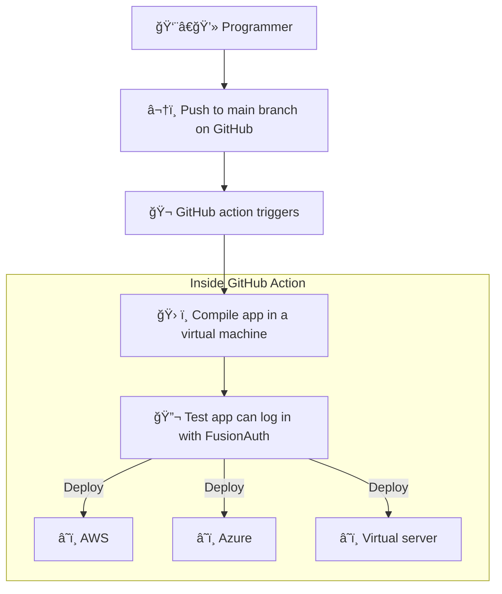

import InlineUIElement from 'src/components/InlineUIElement.astro';
import InlineField from 'src/components/InlineField.astro';
import Aside from '/src/components/Aside.astro';
import {RemoteCode} from '@fusionauth/astro-components';

## Introduction

This article explains:
- How to upgrade FusionAuth
- How to write automated tests of your application login with FusionAuth
- How to run these tests in a [GitHub Action](https://docs.github.com/en/actions) when pushing to the main branch
- How to automate deployment and testing on your live application

To understand this article, you need to know how to create a project in GitHub, but don't need to know anything about FusionAuth, GitHub actions, or automated testing. The basics are explained here.

You will need Docker and Node.js installed if you want to run the example application accompanying this guide.

- [Introduction](#introduction)
- [Some Definitions And Goals](#some-definitions-and-goals)
- [A Simple Example Using GitHub Actions](#a-simple-example-using-github-actions)
- [How To Upgrade FusionAuth](#how-to-upgrade-fusionauth)
- [Test Your App Login With Playwright](#test-your-app-login-with-playwright)
- [Write a test for Playwright](#write-a-test-for-playwright)
- [Test Your App In A GitHub Action](#test-your-app-in-a-github-action)
- [Understand GitHub Actions](#understand-github-actions)
- [Compile Your App In A GitHub Action](#compile-your-app-in-a-github-action)
- [Deploy Your App In A GitHub Action](#deploy-your-app-in-a-github-action)
- [Test Your Production Release](#test-your-production-release)
- [Secrets And Deployment Environments](#secrets-and-deployment-environments)
- [Summary Of Testing And Deployment](#summary-of-testing-and-deployment)
- [Further Reading](#further-reading)


## Some Definitions And Goals

FusionAuth provides all login functionality for your web application. It stores users in its own database, separate to the database your app uses to keep its data. Assuming you have built a login page that redirects a user to FusionAuth, your system will have the components shown below.


You might have the following questions:
- How do I deploy all this to production?
- What happens when FusionAuth releases a new version? How do I upgrade it without losing data?
- How can I test that login still works after upgrading my app or FusionAuth?
- How do I separate and manage my development and production environments?
- Where do I keep database passwords safely and include them when deploying?

Automating these tasks above is called continuous integration / continuous deployment (CI/CD).
- CI refers to testing that changes to code you push to the main branch fits in with the existing system and everything still works.
- CD refers to deploying every push to the main branch to your production (live) site.

GitHub provides a tool for automating workflows called GitHub actions. It provides a virtual machine in which you can run scripts to check out your code, compile it, deploy alongside FusionAuth and other services, run tests, and deploy everything.

The flow looks like the diagram below.



## A Simple Example Using GitHub Actions

There is a minimal but complete CI/CD example in this [repository]({frontmatter.url}).

In GitHub, click <InlineUIElement>fork</InlineUIElement> and add the repository to your own account. Then run `git clone ...` in a terminal to download it.

Below are the repository contents.

```bash
├── app
│   ├── app.js
│   ├── .env
│   ├── .github
│   │   └── workflows
│   │       └── playwright.yml
│   ├── package.json
│   ├── playwright.config.js
│   ├── public # css and images
│   ├── routes
│   │   └── index.js
│   ├── services
│   │   └── authentication.js
│   ├── tests
│   │   └── test.spec.js
│   └── views # html templates
├── docker-compose.yml
├── .env
├── .github
│   └── workflows
│       └── test.yaml
└── kickstart
    ├── css
    │   └── styles.css
    └── kickstart.json
```

FusionAuth is managed by the `docker-compose.yml` and `.env` files and `kickstart` directory. FusionAuth runs in a Docker container. Upon starting, it uses the `.env` file to get the database password. The database is stored in files in a Docker volume. If starting for the first time, FusionAuth uses the `kickstart` details to configure its visual style and various settings. If it has run before, FusionAuth attaches to the existing volume and uses that database.

The `app` folder contains a Node.js JavaScript application. The server runs with Express.js and provides a login page that sends the user to FusionAuth, then directs them to the acount page after login. The `tests` folder contains a login test written in [Playwright](https://playwright.dev/docs/intro). Playwright runs tests in an actual web browser to see if all elements and interactions behave as they would with a real user. The tests can all be run from the terminal however, allowing you to test your application on a computer without a graphical environment.

The `.github/workflows/test.yaml` file is the GitHub Action script. There is another script in `app/.github/workflows/playwright.yml` provided by Playwright when creating the app, but it uses more GitHub resources, with a long timeout and saving the test results in a file. GitHub provides 2000 minutes of time for actions per month for free, so the `test.yaml` uses as little as possible.

<Aside type="note">To learn how FusionAuth runs in Docker, please read the [five minute guide](/docs/quickstarts/5-minute-docker). To learn how Express.js connects to FusionAuth, please read this [quickstart](/docs/quickstarts/quickstart-javascript-express-web).</Aside>

## How To Upgrade FusionAuth

Before running the app, let's demonstrate how to upgrade FusionAuth. It should usually be as trivial as changing the version number and restarting FusionAuth.

In this section you will:
- Start an older version of FusionAuth.
- Create a new user.
- Upgrade FusionAuth.
- Check that user is still there.

Open the `docker-compose.yml` file and on line 42 set the FusionAuth image to
```yaml
image: fusionauth/fusionauth-app:1.42.1
```

In a terminal run
```bash
docker compose up
```
FusionAuth will start, and you will be able to log in at http://localhost:9011 with username `admin@example.com` and password `password`. In the Users section of the site, create a new user.

Stop Docker in the terminal. Change the `docker-compose.yml` line to use a new FusionAuth version, `1.48.3`. Again run
```bash
docker compose up
```

The output of the Docker command below shows that FusionAuth silently (without user approval) and successfully runs database migration (upgrade) scripts on the existing database when starting.

```bash
fa | ---------------------------------- Entering Silent Configuration Mode ---
fa | ----------------------------
fa | 12:49:04.337 PM INFO JDBCMaintenanceModeDatabaseService - Attempting to lock database to support multi-node configurations
fa | 12:49:04.348 PM INFO JDBCMaintenanceModeDatabaseService - Obtained a database lock
fa | 12:49:04.386 PM INFO JDBCMaintenanceModeDatabaseService - Database Version [1.42.1]
fa | 12:49:04.393 PM INFO JDBCMaintenanceModeDatabaseService - Latest Migration Version [1.48.1]
fa | 12:49:04.401 PM INFO JDBCMaintenanceModeDatabaseService - Execute migration script [1.43.0]
fa | 12:49:04.415 PM INFO JDBCMaintenanceModeDatabaseService - Execute migration script [1.44.0]
fa | 12:49:04.425 PM INFO JDBCMaintenanceModeDatabaseService - Execute migration script [1.45.2]
fa | 12:49:04.432 PM INFO JDBCMaintenanceModeDatabaseService - Execute migration script [1.46.0]
fa | 12:49:04.444 PM INFO JDBCMaintenanceModeDatabaseService - Execute migration script [1.47.0]
fa | 12:49:04.459 PM INFO JDBCMaintenanceModeDatabaseService - Execute migration script [1.48.0]
fa | 12:49:04.472 PM INFO JDBCMaintenanceModeDatabaseService - Execute migration script [1.48.1]
fa | 12:49:04.500 PM INFO JDBCMaintenanceModeDatabaseService - Database Version [1.48.1]
fa | 12:49:04.500 PM INFO JDBCMaintenanceModeDatabaseService - Latest Migration Version [1.48.1]
fa | 12:49:04.500 PM INFO JDBCMaintenanceModeDatabaseService - Attempting to unlock database to support multi-node configurations
fa | 12:49:04.501 PM INFO JDBCMaintenanceModeDatabaseService - Unlock completed

```

If you browse to FusionAuth again you'll see that the user you created is still there.

The FusionAuth application is separate to the FusionAuth database. In this case, the database is stored in a Docker volume. When the upgrade scripts run, the data should not be broken and upgrading FusionAuth should be unnoticeable. However, mistakes can happen, as well as database crashes, and you should backup both the FusionAuth database and your application database daily. The rest of this article will show you how to automate login tests to check that your system still works after upgrading FusionAuth or your app. If something breaks, you can restore the old version of the database and begin debugging.

For more details on upgrading FusionAuth, including non-silent upgrade, please read this [article](/docs/get-started/download-and-install/docker#upgrading).

<Aside type="note">
FusionAuth also has a paid version that [runs in the cloud](/docs/get-started/run-in-the-cloud/cloud). If you want to avoid the hassle of managing, backing up, and upgrading FusionAuth yourself, this might be the solution for you.
</Aside>

## Test Your App Login With Playwright

FusionAuth is already running. To start the app that uses it, run the code below.

```bash
cd app
npm install
npm run start
```

Browse to http://localhost:3000 and log in with the same user as before.

When changing your application, it would be faster to test that login works automatically, rather than by hand. This is called an integration, or end-to-end test, as opposed to a unit test, which tests only a single function. For integration tests in the browser, you can use Playwright.

<Aside type="note">
Playwright was created by Microsoft, runs in JavaScript, and allows you to run tests in multiple browsers. It is a popular successor to Selenium, which used Java, and Puppeteer, which was written by Google and focussed on Chrome.
</Aside>

To start the Playwright tests for this app, open a new terminal and run the code below.

```bash
npx playwright install
npx playwright install-deps # install necessary browsers
npx playwright test --project=chromium;
```

The output should be as below.

```bash
Running 1 test using 1 worker

  ✓  1 [chromium] › test.spec.js:3:1 › Test login (5.1s)

  1 passed (5.8s)
```

The command returns `0` to the terminal if all tests passed, and another number if any tests failed. This allows you (and GitHub Actions) to write shell scripts that perform different tasks if the tests succeed or not.

To see what is happening visually, run the code below.

```bash
npx playwright test --project=chromium --ui
```

You can see that Playwright runs a browser, clicks buttons, and fills in forms.


## Write a test for Playwright

The code for the test Playwright runs is in the file `test.spec.js`.

<RemoteCode url={frontmatter.codeRoot + "/app/tests/test.spec.js"}
  lang="js" />

The code should mostly be self-explanatory, but there are a few things to note:
- `await` is used frequently as most operations on the page are asynchronous.
- `waitForLoadState('networkidle')` is used to wait for pages to load. `.waitForNavigation()` and `.waitForURL()` failed when this article was written.
- Tests start with `expect()`, such as `expect(emailText).toBe('richard@example.com')`. Without these, your tests won't actually test anything.
- To add a new test of your own, write a new function like `test('Test login', async ({ page }) => {`.

To add Playwright to your own project, follow [their guide](https://playwright.dev/docs/intro). Running `npm init playwright` will create a configuration file and sample test you can use as a starting point.

The configuration file `playwright.config.js` allows you set which browsers to use (which we used in `--project=chromium` earlier), whether to start your app before running the tests, and in which directory to look for test files.

## Test Your App In A GitHub Action

Now that you know how to test your app after a change to it or FusionAuth, let's automate the process in GitHub. Your goal is to have a test run whenever committing to your main branch. GitHub will email you if the test fails.

Open the file `.github/workflows/test.yaml` and change the branch name on line five from

```yaml
      - main_RENAME_THIS_TO_ENABLE_TEST
```

to

```yaml
      - main
```

You've renamed the trigger that causes this Action to execute, from a nonsense name to the main branch of your application.

Save, commit in Git, and push to GitHub. This will cause the test to execute.

You can browse to the Actions tab in your GitHub repository to see the test run, or view the results in the [original repository]({frontmatter.url + '/actions'}).


To test that the test works, change the email in `test.spec.js` to `wrong@example.com` and push to GitHub again. You can now verify that the test does detect a broken login.


If your test runs successfully, you can be certain that your app and FusionAuth are both running, can speak to each other, and that the user is still present in the database after any migrations have run.

## Understand GitHub Actions

GitHub Actions are a service provided by GitHub that allow you to run workflows that can do anything you can write in a script, triggered by different types of events in your repository. GitHub runs your script in a virtual machine. You are allowed a certain amount of free CPU minutes per month, and set amount of storage. For more details, see the [pricing page](https://docs.github.com/en/billing/managing-billing-for-github-actions/about-billing-for-github-actions).

Let's review the action script to see how it works. All scripts are stored in the `.github/workflows` directory, and the files can be called whatever you want. Here the file is called `test.yaml`.

<RemoteCode url={frontmatter.codeRoot + "/.github/workflows/test.yaml"}
  lang="yaml" />

Each action has a name, which is a human-readable label.

```yaml
name: Test FusionAuth login
```

This is followed by an event, which is all the conditions that trigger the action to execute. Events are stored in the `on` object. The most common ones to use are when pushing a commit, or receiving a pull request. For a full list, see the [documentation](https://docs.github.com/en/actions/using-workflows/events-that-trigger-workflows).

Your action uses the push to main event.

```yaml
  push:
    branches:
      - main
```

Finally, comes the action itself, which is stored in the `jobs` object. This is what will run when the event occurs. Your action has just one job, `run-tests`.

You need to specify the type of operating system the machine will run to execute the job steps. Here you use `ubuntu-latest`. It is the cheapest runner on GitHub. Windows runners use minutes at twice the rate of Linux, and Mac runners use ten times the rate of Linux.

The service sections says that you need to use Docker (where FusionAuth runs).

```yaml
    services:
      docker:
        image: docker:19.03.12
        options: --privileged # container has full access to host
        ports:
          - 3000:3000
          - 9011:9011
```

The steps consist of two types of code:
- actions, which are existing tasks in GitHub, such as checking out a repository or installing Node.
- custom commands, which run code directly in the machine's terminal.

This script starts by checking out your repository and installing node in actions.

```yaml
    steps:
      - name: Checkout repository
        uses: actions/checkout@v2

      - name: Set up Node.js
        uses: actions/setup-node@v2
        with:
          node-version: '18'
```

Custom code then starts Docker, installs Node modules, runs the app, and runs the tests. Note that steps usually run in serial. To run steps simultaneously, you use `-d` in Docker, and `npm run start &` to start the next step without waiting for the first step to exit. If a step fails, the next step will not run.

```yaml
      - name: Start FusionAuth in Docker
        run: docker-compose up -d # -d in background

      - name: Install npm dependencies
        run: |
          npm install
          npx playwright install-deps
          npx playwright install
        working-directory: ./app

      - name: Start app
        run: npm run start & # & in background
        working-directory: ./app

      - name: Run Playwright tests
        run: npx playwright test --project=chromium
        working-directory: ./app
```

## Compile Your App In A GitHub Action

You might have noticed that GitHub did not build your app at any point in this workflow. This is because JavaScript is a dynamic language and does not need to be compiled. If you are using FusionAuth with C#, Go, Rust, or TypeScript, you can easily add another step to your action to compile the code before running the tests. This might look like the code below.

```yaml
      - name: Compile app
        run: cargo build
        working-directory: ./app
```

## Deploy Your App In A GitHub Action

While building your app is simple, deploying it is more complex. Your production environment might be a physical server, a virtual server such as DigitalOcean, or a large service provider such as AWS or Azure. You might also want to deploy a new version of FusionAuth, which might use Docker.

You can deploy using an existing action, such as those for [AWS](https://github.com/aws-actions), [Azure](https://github.com/Azure/actions), or [DigitalOcean](https://github.com/digitalocean/action-doctl), or write your own script.

Let's assume your production environment is a virtual server that runs your application in a Go binary and FusionAuth in Docker.

After the tests in your action have run successfully, you can deploy your app and FusionAuth to the server.

To run a command on your server from within an action, use the [SSH-Action](https://github.com/appleboy/ssh-action). This action allows you to open a terminal on your server and run commands. Here's how you would change the version number of FusionAuth, and restart it in Docker.

```yaml
- name: Update FusionAuth and Restart Docker
  uses: appleboy/ssh-action@master
  with:
    host: ${{ secrets.SERVER_HOST }}
    username: ${{ secrets.SERVER_USERNAME }}
    key: ${{ secrets.SERVER_SSH_KEY }}
    script: |
      cd /fa_config # assume this is where docker compose file is

      # change docker version number
      sed -i 's|fusionauth/fusionauth-app:.*|fusionauth/fusionauth-app:1.48.3|' docker-compose.yml

      # pull the latest image from DockerHub before we try to use it
      docker-compose pull fusionauth-app

      # restart docker and leave it running
      docker-compose up -d fusionauth-app
```

We'll discuss the secrets in a later section.

To deploy your Go application you have alternatives:
1. Download the repository of source code to the server and compile it there.
2. Compile the executable in the action and download it on the server.
3. Build your app into a Docker image, upload that to DockerHub, and download and run it on the server.

Using Docker is the least work for the server and least likely to disrupt your operations. It requires compiling the executable on the server, just like option two. Downloading the code on the server and compiling it there is the easiest to do, but might disrupt the server.

To make your Go binary (and all the HTML templates it serves) available for other steps in the workflow, use the [upload-artifact action](https://github.com/actions/upload-artifact). To build and push a DockerHub image, use the [Docker action.](https://github.com/marketplace/actions/build-and-push-docker-images).

Once you have your application files ready, you can again SSH into your server using the SSH action, download the Docker image or binary files, run any database migrations scripts, and restart your web application.

## Test Your Production Release

Unfortunately your work still isn't done. Even though your tests ran successfully in the GitHub virtual machine, your production release might not allow users to log in. You need to test again.

Add a final step to your script, after the deployment step, that runs the Playwright login test. But this time, run a test file that uses the production server URL, instead of your localhost, in the line `await page.goto('http://localhost:3000');`.

If this test passes, you can be certain your live website and FusionAuth can still communicate. If it fails, you need to revert your release to the previous version immediately.

## Secrets And Deployment Environments

Your organization will probably have a number of environments (server and database) where your application runs:
Environment | Purpose
--- | ---
Development | Where programmers are free to test new features without fear of breaking anything. Database users are anonymized.
Test | Where quality assurance testers test the latest release that is scheduled to go live soon.
Preproduction | An exact duplicate of the Production environment, with real sensitive user information. This is used for debugging errors in Production. Access is restricted.
Production | The live site that must always be online. Access is restricted to a system administrator and automated deployment programs.

The production environment might also be two mirrored applications and databases (called blue and green). You could deploy to one color, and then immediately transfer the live URL from the other color once it's complete. This way your application will never suffer a moment's downtime.

Each environment should correspond to a single branch in GitHub, and has its own set of secrets: passwords, URLs, and database values.

In this guide's sample application action, you've set the action event to be pushing to the main branch (which corresponds to the production environment). You would need to add other events and scripts to run tests, but not deploy, for all other environments, and for pull request events too. For example, you would probably want a push to the test branch, to run tests, and deploy the new release to the test environment.

This application also used two `.env` files to store secrets that your app and FusionAuth use. In reality, you should never do this, as it allows anyone to access your private database with your password kept publicly on GitHub.

Instead, each environment should store its secrets in environment variables or a configuration file that is not overwritten on deployment. These values should be readable only by the system administrator and the application's user account.

But you also need some secrets in the GitHub action, such as the SSH key of the server you are deploying to. This was seen in the script above.
```yaml
key: ${{ secrets.SERVER_SSH_KEY }}
```

These secrets are kept in the [GitHub Secrets](https://docs.github.com/en/actions/security-guides/using-secrets-in-github-actions) page, where they are automatically available to your scripts.


## Summary Of Testing And Deployment

This has been a long guide, so let's summarize what you need to do to test and deploy your application:

- Configure your server to run Docker and the programming framework that your app uses.
- Keep secrets safe and private in environment variables on each server, even from your developers.
- Backup your FusionAuth and app database frequently, and test that you can restore them successfully.
- Write Playwright tests that check your app can log in with FusionAuth, and any other essential functionality, including new features that you are releasing.
- Write a GitHub action that runs these tests when receiving a pull request, or pushing code to a branch.
- Add secrets in GitHub that allow it to access your deployment environment.
- Add a deployment step to your GitHub action that sends your new release to the server and starts it.
- Add a final step in the action to test that your Playwright tests work on the deployed server.
- If your tests are all successful, switch your public URL over to the latest release.

<!-- ## Use The Action For FusionAuth In The GitHub Action Marketplace -->

## Further Reading

- [Repository accompanying this guide]({frontmatter.url})
- [Playwright test framework](https://playwright.dev/docs/intro)
- [FusionAuth five minute guide](/docs/quickstarts/5-minute-docker)
- [FusionAuth Express.js quickstart](/docs/quickstarts/quickstart-javascript-express-web)
- [FusionAuth upgrade guide](/docs/get-started/download-and-install/docker#upgrading)
- [FusionAuth cloud version](/docs/get-started/run-in-the-cloud/cloud)
- [GitHub Actions](https://docs.github.com/en/actions)
- [GitHub Actions pricing](https://docs.github.com/en/billing/managing-billing-for-github-actions/about-billing-for-github-actions)
- [GitHub Action events](https://docs.github.com/en/actions/using-workflows/events-that-trigger-workflows)
- [GitHub Secrets](https://docs.github.com/en/actions/security-guides/using-secrets-in-github-actions)
- [AWS Action](https://github.com/aws-actions)
- [Azure Actions](https://github.com/Azure/actions)
- [DigitalOcean Action](https://github.com/digitalocean/action-doctl)
- [SSH Action](https://github.com/appleboy/ssh-action)
- [Upload artifact action](https://github.com/actions/upload-artifact)
- [DockerHub action](https://github.com/marketplace/actions/build-and-push-docker-images)