- [Notes](#notes)
  - [Brief](#brief)
  - [Todo](#todo)
- [Introduction](#introduction)
- [How to upgrade FusionAuth](#how-to-upgrade-fusionauth)
- [Test your app's login to FusionAuth with Playwright](#test-your-apps-login-to-fusionauth-with-playwright)
- [Build your app in a GitHub action](#build-your-app-in-a-github-action)
- [Test your app in a GitHub action](#test-your-app-in-a-github-action)
- [Use the Action for FusionAuth in the GitHub Action Marketplace](#use-the-action-for-fusionauth-in-the-github-action-marketplace)
- [Further reading](#further-reading)

## Notes

Brief - https://docs.google.com/document/d/16ql1wY7kPI4MxESMzMaK2pLCa3ZdSxQcsqbT9tY5qq8/edit

### Brief

- Document how to set up Fusionauth in a CI environment (GitHub actions)
- Use kickstart to set the system up to a known state (example here: https://github.com/FusionAuth/fusionauth-python-client/blob/master/.github/workflows/test.yaml)
- Use Selenium or some other tool (e.g. Playwright) to create an end-to-end  functionality test (e.g. can a user log in?)
- Bonus points if we can figure out how to get Fusionauth available in the GitHub marketplace so users can install it from there instead of manually on the CI runner.
- Resources
  - https://fusionauth.io/community/forum/topic/898/how-do-i-use-fusionauth-in-my-ci-cd-system
  - https://github.com/fusionauth/fusionauth-site/issues/1663
  - https://fusionauth.io/docs/get-started/run-in-the-cloud/

### Todo

- [x] plan project
- [x] read cloud docs on fa docs site
- [x] how does one upgrade fa without losing database? show example with different docker versions on dockerhub
- [x] choose tester:
  - selenium is java based
  - puppeteer is chrome only
  - cypress is complex and has a gui
  - playwright looks good - js. cross browser. headless.
- [x] make article outline
- [x] make test repo - https://github.com/ritza-co/fusionauth_github_actions
- [x] do the same thing in a github action
- [ ] how to upgrade FA
- [ ] how to deploy to prod
- [ ] learn about github actions marketplace
- [ ] decide what the marketplace action should do (all 3 os?)
- [ ] write and deploy the action to marketplace
- [ ] write the article
  - [ ] target audience - newbies to fa and actions
  - [ ] mention fa cloud paid service
  - [ ] secrets and .env
  - [ ] how to test live site
  - [ ] add images

## Introduction

Things users want to automate deployment of:
- When pushing to main branch, deploy their app and FusionAuth to AWS, Azure, Digital Ocean, or a custom server.
- Test that login works through terminal.
- Test login works from their app. A web page GUI tester.
- Upgrade FusionAuth to a new version.
- Leave FusionAuth untouched on server if no changes have been made to kickstart files or FusionAuth version.
- Set up CD functionality through a GitHub marketplace action.

- Testing login works should be done in the action. The final test of logging to the deployed app can be done by hand when checking the site is actually up.

```mermaid
graph TD
    1[👨‍💻 Programmer] --> 2[⬆️ Push to main branch on GitHub]
    2 --> 3[🎬 GitHub action triggers]
    3 --> 4[🛠️ Build app in a virtual machine]
    subgraph Inside GitHub Action
        4 --> 5[🔬 Test app can log in with FusionAuth]
        5 -- Deploy --> 6[☁️ AWS]
        5 -- Deploy --> 7[☁️ Azure]
        5 -- Deploy --> 8[☁️ Virtual server]
    end
```



## How to upgrade FusionAuth

https://fusionauth.io/docs/get-started/download-and-install/docker#upgrading
https://hub.docker.com/r/fusionauth/fusionauth-app/tags

  fusionauth:
    image: fusionauth/fusionauth-app:1.48.3 # 1.42.1 - 1.48.3 - latest

```bash
fusionauth_github_actions-fusionauth-1  | ---------------------------------------------------------------------------------------------------------
fusionauth_github_actions-fusionauth-1  | ---------------------------------- Entering Silent Configuration Mode -----------------------------------
fusionauth_github_actions-fusionauth-1  | ---------------------------------------------------------------------------------------------------------
fusionauth_github_actions-fusionauth-1  |
fusionauth_github_actions-fusionauth-1  | 2024-01-05 12:49:04.337 PM INFO  com.inversoft.maintenance.db.JDBCMaintenanceModeDatabaseService - [TW2QyQ] Attempting to lock database to support multi-node configurations
fusionauth_github_actions-fusionauth-1  | 2024-01-05 12:49:04.348 PM INFO  com.inversoft.maintenance.db.JDBCMaintenanceModeDatabaseService - [TW2QyQ] Obtained a database lock
fusionauth_github_actions-fusionauth-1  | 2024-01-05 12:49:04.386 PM INFO  com.inversoft.maintenance.db.JDBCMaintenanceModeDatabaseService - [TW2QyQ] Database Version [1.42.1]
fusionauth_github_actions-fusionauth-1  | 2024-01-05 12:49:04.393 PM INFO  com.inversoft.maintenance.db.JDBCMaintenanceModeDatabaseService - [TW2QyQ] Latest Migration Version [1.48.1]
fusionauth_github_actions-fusionauth-1  | 2024-01-05 12:49:04.401 PM INFO  com.inversoft.maintenance.db.JDBCMaintenanceModeDatabaseService - [TW2QyQ] Execute migration script [1.43.0]
fusionauth_github_actions-fusionauth-1  | 2024-01-05 12:49:04.415 PM INFO  com.inversoft.maintenance.db.JDBCMaintenanceModeDatabaseService - [TW2QyQ] Execute migration script [1.44.0]
fusionauth_github_actions-fusionauth-1  | 2024-01-05 12:49:04.425 PM INFO  com.inversoft.maintenance.db.JDBCMaintenanceModeDatabaseService - [TW2QyQ] Execute migration script [1.45.2]
fusionauth_github_actions-fusionauth-1  | 2024-01-05 12:49:04.432 PM INFO  com.inversoft.maintenance.db.JDBCMaintenanceModeDatabaseService - [TW2QyQ] Execute migration script [1.46.0]
fusionauth_github_actions-fusionauth-1  | 2024-01-05 12:49:04.444 PM INFO  com.inversoft.maintenance.db.JDBCMaintenanceModeDatabaseService - [TW2QyQ] Execute migration script [1.47.0]
fusionauth_github_actions-fusionauth-1  | 2024-01-05 12:49:04.459 PM INFO  com.inversoft.maintenance.db.JDBCMaintenanceModeDatabaseService - [TW2QyQ] Execute migration script [1.48.0]
fusionauth_github_actions-fusionauth-1  | 2024-01-05 12:49:04.472 PM INFO  com.inversoft.maintenance.db.JDBCMaintenanceModeDatabaseService - [TW2QyQ] Execute migration script [1.48.1]
fusionauth_github_actions-fusionauth-1  | 2024-01-05 12:49:04.500 PM INFO  com.inversoft.maintenance.db.JDBCMaintenanceModeDatabaseService - [TW2QyQ] Database Version [1.48.1]
fusionauth_github_actions-fusionauth-1  | 2024-01-05 12:49:04.500 PM INFO  com.inversoft.maintenance.db.JDBCMaintenanceModeDatabaseService - [TW2QyQ] Latest Migration Version [1.48.1]
fusionauth_github_actions-fusionauth-1  | 2024-01-05 12:49:04.500 PM INFO  com.inversoft.maintenance.db.JDBCMaintenanceModeDatabaseService - [TW2QyQ] Attempting to unlock database to support multi-node configurations
fusionauth_github_actions-fusionauth-1  | 2024-01-05 12:49:04.501 PM INFO  com.inversoft.maintenance.db.JDBCMaintenanceModeDatabaseService - [TW2QyQ] Unlock completed

```

## Test your app's login to FusionAuth with Playwright

## Build your app in a GitHub action

## Test your app in a GitHub action

## Use the Action for FusionAuth in the GitHub Action Marketplace

## Further reading