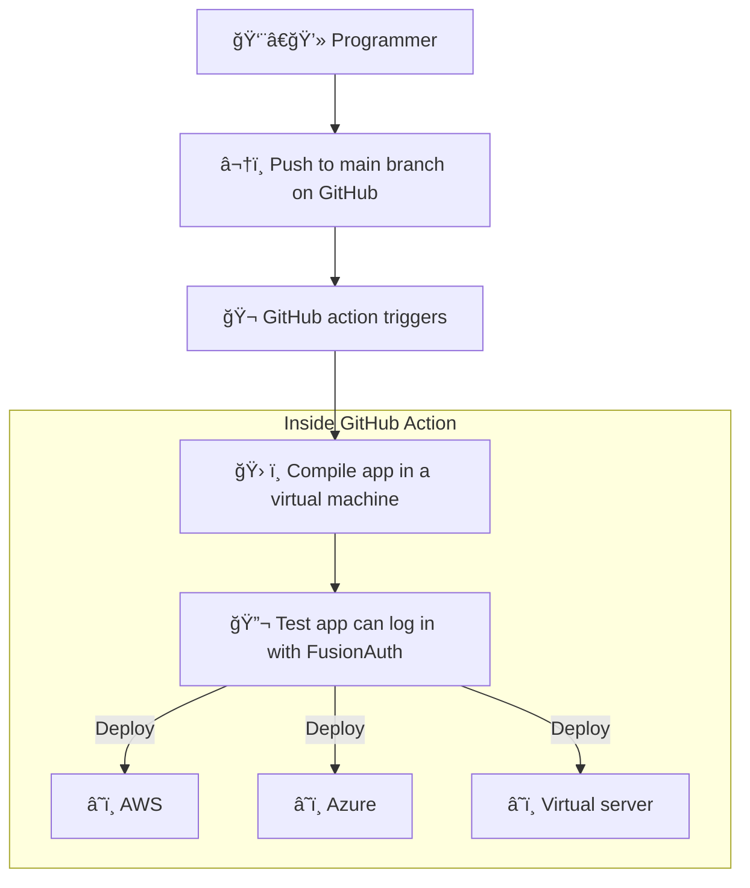

import Aside from '/src/components/Aside.astro';
import {RemoteCode} from '@fusionauth/astro-components';

## Notes

Brief - https://docs.google.com/document/d/16ql1wY7kPI4MxESMzMaK2pLCa3ZdSxQcsqbT9tY5qq8/edit

### Brief

- Document how to set up Fusionauth in a CI environment (GitHub actions)
- Use kickstart to set the system up to a known state (example here: https://github.com/FusionAuth/fusionauth-python-client/blob/master/.github/workflows/test.yaml)
- Use Selenium or some other tool (e.g. Playwright) to create an end-to-end  functionality test (e.g. can a user log in?)
- Bonus points if we can figure out how to get Fusionauth available in the GitHub marketplace so users can install it from there instead of manually on the CI runner.
- Resources
  - https://fusionauth.io/community/forum/topic/898/how-do-i-use-fusionauth-in-my-ci-cd-system
  - https://github.com/fusionauth/fusionauth-site/issues/1663
  - https://fusionauth.io/docs/get-started/run-in-the-cloud/

### Todo

- [x] plan project
- [x] read cloud docs on fa docs site
- [x] how does one upgrade fa without losing database? show example with different docker versions on dockerhub
- [x] choose tester:
  - selenium is java based
  - puppeteer is chrome only
  - cypress is complex and has a gui
  - playwright looks good - js. cross browser. headless.
- [x] make article outline
- [x] make test repo - https://github.com/ritza-co/fusionauth_github_actions
- [x] do the same thing in a github action
- [x] how to upgrade FA and backup
- [ ] how to deploy to prod
- [ ] learn about github actions marketplace
- [ ] decide what the marketplace action should do (all 3 os?)
- [ ] write and deploy the action to marketplace
- [ ] write the article
  - [ ] target audience - newbies to fa and actions
  - [ ] mention fa cloud paid service
  - [ ] secrets and .env
  - [ ] how to test live site
  - [ ] add images

## Introduction

This article explains:
- How to upgrade FusionAuth
- How to write automated tests of your application login with FusionAuth
- How to run these tests in a [GitHub Action](https://docs.github.com/en/actions) when pushing to the main branch
- How to automate deployment and testing on your live application

To understand this article, you need to know how to create a project in GitHub, but don't need to know anything about FusionAuth, GitHub actions, or automated testing. The basics are explained here.

You will need Docker and Node.js installed if you want to run the example application accompanying this tutorial.

- [Notes](#notes)
  - [Brief](#brief)
  - [Todo](#todo)
- [Introduction](#introduction)
- [Some Definitions And Goals](#some-definitions-and-goals)
- [A Simple Example Using GitHub Actions](#a-simple-example-using-github-actions)
- [How To Upgrade FusionAuth](#how-to-upgrade-fusionauth)
- [Dev, Test, QA, Preprod, And Prod Environments](#dev-test-qa-preprod-and-prod-environments)
- [Test Your App Login To FusionAuth With Playwright](#test-your-app-login-to-fusionauth-with-playwright)
- [Build Your App In A GitHub Action](#build-your-app-in-a-github-action)
- [Test Your App In A GitHub Action](#test-your-app-in-a-github-action)
- [Use The Action For FusionAuth In The GitHub Action Marketplace](#use-the-action-for-fusionauth-in-the-github-action-marketplace)
- [Further Reading](#further-reading)


## Some Definitions And Goals

FusionAuth provides all login functionality for your web application. It stores users in its own database, separate to the database your app uses to keep its data. Assuming you have built a login page that redirects a user to FusionAuth for login, your system will have the components shown below.


You might have the following questions:
- How do I deploy all this to production?
- What happens when FusionAuth releases a new version? How do I upgrade it without losing data?
- How can I test that login still works after upgrading my app or FusionAuth?
- How do I separate and manage my development and production environments?
- Where do I keep database passwords safely and include them when deploying?

Automating these tasks above is called continuous integration / continuous deployment (CI/CD).
- CI refers to testing that changes to code you push to the main branch fits in with the existing system and everything still works.
- CD refers to deploying every push to the main branch to your production (live) site.

GitHub provides a tool for automating workflows called GitHub actions. It provides a virtual machine in which you can run scripts to check out your code, compile it, deploy alongside FusionAuth and other services, run tests, and deploy everything.

The flow looks like the diagram below.



## A Simple Example Using GitHub Actions

There is a minimal but complete CI/CD example in this [repository](https://github.com/ritza-co/fusionauth_github_actions).

In GitHub, click [uielement]#fork# and add the repository to your own account. Then use `git clone ...` to download it.

Below are the contents.

```bash
├── app
│   ├── app.js
│   ├── .env
│   ├── .github
│   │   └── workflows
│   │       └── playwright.yml
│   ├── package.json
│   ├── playwright.config.js
│   ├── public # css and images
│   ├── routes
│   │   └── index.js
│   ├── services
│   │   └── authentication.js
│   ├── tests
│   │   └── test.spec.js
│   └── views # html templates
├── docker-compose.yml
├── .env
├── .github
│   └── workflows
│       └── test.yaml
└── kickstart
    ├── css
    │   └── styles.css
    └── kickstart.json
```

FusionAuth is managed by the `docker-compose.yml` and `.env` files and `kickstart` directory. FusionAuth runs in a Docker container. Upon starting, it uses the `.env` file to get the database password. The database is stored in files in a Docker volume. If starting for the first time, FusionAuth uses the `kickstart` details to configure its visual style and various settings. If it has run before, FusionAuth attaches to the existing volume and uses that database.

The `app` folder contains a Node.js JavaScript application. The server runs with Express.js and provides a login page that sends the user to FusionAuth, then directs them to the acount page after login. The `tests` folder contains a login test written in [Playwright](https://playwright.dev/docs/intro). Playwright runs tests in an actual web browser to see if all elements and interactions behave as they would with a real user. The tests can all be run from the terminal however, allowing you to test your application on a computer without a graphical environment.

The `.github/workflows/test.yaml` file is the GitHub Action script. There is another script in `app/.github/workflows/playwright.yml` provided by Playwright when creating the app, but it uses more GitHub resources, with a long timeout and saving the test results in a file. GitHub provides 2000 minutes of time for actions per month for free, so the `test.yaml` uses as little as possible.

<Aside type="caution">To learn how FusionAuth runs in Docker, please read the [five minute guide](/docs/quickstarts/5-minute-docker). To learn how Express.js connects to FusionAuth, please read this [quickstart](/docs/quickstarts/quickstart-javascript-express-web).</Aside>

## How To Upgrade FusionAuth

Before running the app, let's demonstrate how to upgrade FusionAuth. It should almost always be as trivial as changing the version number and restarting FusionAuth.

In this section you will:
- Start an older version of FusionAuth.
- Create a new user.
- Upgrade FusionAuth.
- Check that user is still there.

Open the `docker-compose.yml` file and on line 42 set the FusionAuth image to
```yaml
image: fusionauth/fusionauth-app:1.42.1
```

In a terminal run
```bash
docker compose up
```
FusionAuth will start, and you will be able to log in at http://localhost:9011 with username `admin@example.com` and password `password`. In the Users section of the site, create a new user.

Stop Docker in the terminal. Change the `docker-compose.yml` line to use a new FusionAuth version, `1.48.3`. Again run
```bash
docker compose up
```

The output of the Docker command below shows that FusionAuth silently (without user approval) and successfully runs database migration (upgrade) scripts on the existing database when starting.

```bash
fusionauth_github_actions-fusionauth-1  | ---------------------------------------------------------------------------------------------------------
fusionauth_github_actions-fusionauth-1  | ---------------------------------- Entering Silent Configuration Mode -----------------------------------
fusionauth_github_actions-fusionauth-1  | ---------------------------------------------------------------------------------------------------------
fusionauth_github_actions-fusionauth-1  |
fusionauth_github_actions-fusionauth-1  | 2024-01-05 12:49:04.337 PM INFO  com.inversoft.maintenance.db.JDBCMaintenanceModeDatabaseService - [TW2QyQ] Attempting to lock database to support multi-node configurations
fusionauth_github_actions-fusionauth-1  | 2024-01-05 12:49:04.348 PM INFO  com.inversoft.maintenance.db.JDBCMaintenanceModeDatabaseService - [TW2QyQ] Obtained a database lock
fusionauth_github_actions-fusionauth-1  | 2024-01-05 12:49:04.386 PM INFO  com.inversoft.maintenance.db.JDBCMaintenanceModeDatabaseService - [TW2QyQ] Database Version [1.42.1]
fusionauth_github_actions-fusionauth-1  | 2024-01-05 12:49:04.393 PM INFO  com.inversoft.maintenance.db.JDBCMaintenanceModeDatabaseService - [TW2QyQ] Latest Migration Version [1.48.1]
fusionauth_github_actions-fusionauth-1  | 2024-01-05 12:49:04.401 PM INFO  com.inversoft.maintenance.db.JDBCMaintenanceModeDatabaseService - [TW2QyQ] Execute migration script [1.43.0]
fusionauth_github_actions-fusionauth-1  | 2024-01-05 12:49:04.415 PM INFO  com.inversoft.maintenance.db.JDBCMaintenanceModeDatabaseService - [TW2QyQ] Execute migration script [1.44.0]
fusionauth_github_actions-fusionauth-1  | 2024-01-05 12:49:04.425 PM INFO  com.inversoft.maintenance.db.JDBCMaintenanceModeDatabaseService - [TW2QyQ] Execute migration script [1.45.2]
fusionauth_github_actions-fusionauth-1  | 2024-01-05 12:49:04.432 PM INFO  com.inversoft.maintenance.db.JDBCMaintenanceModeDatabaseService - [TW2QyQ] Execute migration script [1.46.0]
fusionauth_github_actions-fusionauth-1  | 2024-01-05 12:49:04.444 PM INFO  com.inversoft.maintenance.db.JDBCMaintenanceModeDatabaseService - [TW2QyQ] Execute migration script [1.47.0]
fusionauth_github_actions-fusionauth-1  | 2024-01-05 12:49:04.459 PM INFO  com.inversoft.maintenance.db.JDBCMaintenanceModeDatabaseService - [TW2QyQ] Execute migration script [1.48.0]
fusionauth_github_actions-fusionauth-1  | 2024-01-05 12:49:04.472 PM INFO  com.inversoft.maintenance.db.JDBCMaintenanceModeDatabaseService - [TW2QyQ] Execute migration script [1.48.1]
fusionauth_github_actions-fusionauth-1  | 2024-01-05 12:49:04.500 PM INFO  com.inversoft.maintenance.db.JDBCMaintenanceModeDatabaseService - [TW2QyQ] Database Version [1.48.1]
fusionauth_github_actions-fusionauth-1  | 2024-01-05 12:49:04.500 PM INFO  com.inversoft.maintenance.db.JDBCMaintenanceModeDatabaseService - [TW2QyQ] Latest Migration Version [1.48.1]
fusionauth_github_actions-fusionauth-1  | 2024-01-05 12:49:04.500 PM INFO  com.inversoft.maintenance.db.JDBCMaintenanceModeDatabaseService - [TW2QyQ] Attempting to unlock database to support multi-node configurations
fusionauth_github_actions-fusionauth-1  | 2024-01-05 12:49:04.501 PM INFO  com.inversoft.maintenance.db.JDBCMaintenanceModeDatabaseService - [TW2QyQ] Unlock completed

```

If you browse to FusionAuth again you'll see that the user you created is still there.

The FusionAuth application is separate to the FusionAuth database. In this case, the database is stored in a Docker volume. When the upgrade scripts run, the data should not be broken and upgrading FusionAuth should be unnoticeable. However, mistakes can happen, as well as database crashes, and you should backup both the FusionAuth database and your application database daily. The rest of this article will show you how to automate login tests to check that your system still works after upgrading FusionAuth or your app. If something breaks, you can restore the old version of the database and begin debugging.

For more details on upgrading FusionAuth, including non-silent upgrade, please read this [article](/docs/get-started/download-and-install/docker#upgrading).

## Dev, Test, QA, Preprod, And Prod Environments


- Testing login works should be done in the action. The final test of logging to the deployed app can be done by hand when checking the site is actually up.

## Test Your App Login To FusionAuth With Playwright

## Build Your App In A GitHub Action

## Test Your App In A GitHub Action

## Use The Action For FusionAuth In The GitHub Action Marketplace

## Further Reading