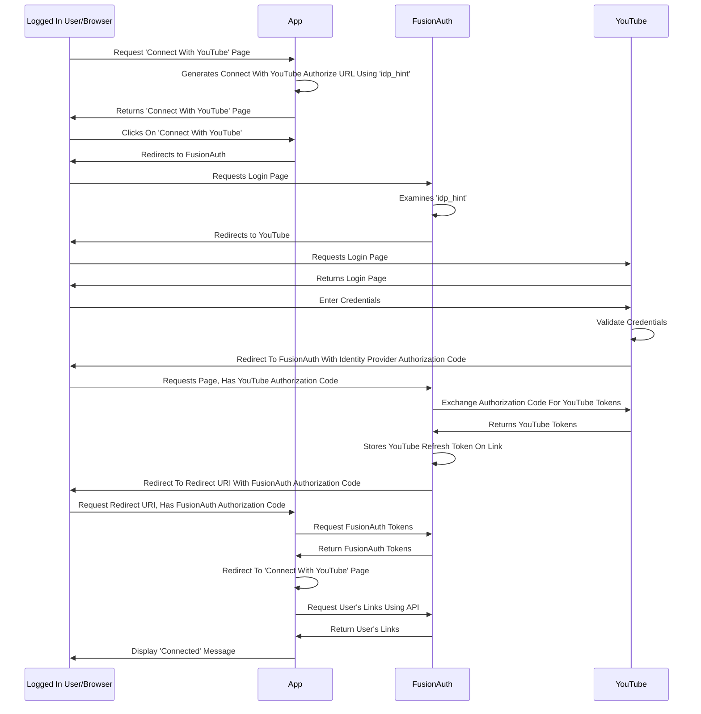
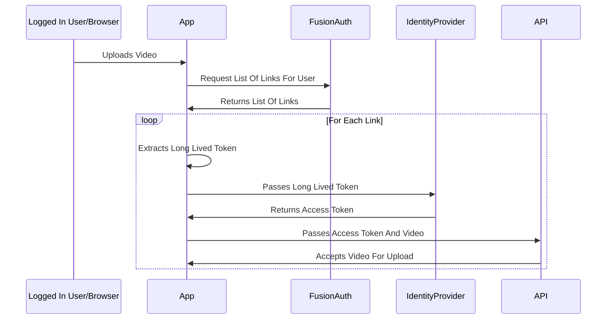

import Aside from 'src/components/Aside.astro';
import AuthorizationHubDescription from 'src/content/docs/get-started/use-cases/_authorization-hub-description.mdx';

## Overview

<AuthorizationHubDescription />

## Problem

You have an application that leverages social or other platform providers, using their APIs to provide functionality to your users.

You need to manage your users' tokens in one place, as well as easily add new integrations.

With the authorization hub implementation, you can manage tokens for social providers and third party platforms such as:

* Google
* YouTube
* Facebook
* Instagram
* LinkedIn
* Microsoft Entra Id
* Any provider supporting OIDC

This is the inverse of the API consents use case](/docs/get-started/use-cases/api-consents-platform).

## Solution

Use FusionAuth as your hub for this functionality. FusionAuth can be a centralized repository for long lived tokens and make it easier to integrate with third party platforms.

You can use FusionAuth as:

* an adapter for social provider integrations, making it easy to add new ones and stay up to date as the providers change
* a storage location, safely holding long-lived tokens for each user, making them available to your application via a secure API or SDK

This is an example of [the Third-Party Service Authorization Mode](/docs/lifecycle/authenticate-users/oauth/modes#third-party-service-authorization).

## Prerequisites

You have configured your application or applications to [delegate authentication to FusionAuth](/docs/get-started/use-cases/auth-service) via the Authorization Code grant and the hosted login pages.

You can also implement this use case without using the hosted login pages, using the FusionAuth APIs. The API you'd use is the `Complete the Login` [Identity Provider APIs](/docs/apis/identity-providers/), but that implementation is beyond the scope of this document.

## Example Scenario

Suppose you have a video posting site, where people can post videos of their favorite pet antics. You want to:

* let a user upload a video to your site
* allow the user to tag the video with metadata
* enhance the video using an algorithm to make the antics extra fun
* then upload the video to the YouTube, Facebook and Instagram accounts of this user

FusionAuth can help with parts of this, including storing the tokens needed to upload the video.

## Actors/Components

* your user and their client application (mobile app or browser)
* your application
* the social provider platforms
  * their identity services
  * APIs you want to access, for video upload functionality
* FusionAuth

## Implementation Steps

This is a two phase implementation.

<Aside type="note">
This document refers to various APIs, but you can also use the [client libraries](/docs/sdks) to interact with FusionAuth.
</Aside>

### Connecting Accounts

First, you need to let users connect their accounts with the platforms.

* Select the social providers whose APIs you need to call. To let a user connect to YouTube, configure a connection to Google using an OIDC Identity Provider (see [Edge Cases](#edge-cases) for a note about the Google Identity Provider). Other platforms might use different providers.
  * Make sure you configure the Identity Providers with the proper scopes. You'll want the scopes for any APIs you'll be calling at the social provider, as well as a refresh token scope. For example, to upload to YouTube, you'll want the `https://www.googleapis.com/auth/youtube.upload` scope and make sure you include the `access_type=offline` parameter. Consult the platform provider documentation for specifics on the correct values.
* Set up the social providers in FusionAuth and enable them in the Application configuration.
* Create a 'Connect Your Account' page that you'll display to users who are logged in.
* Add the 'Connect To YouTube' or other appropriate buttons to this page.
  * The for these buttons is similar to what you'd add to let someone authenticate using a social provider, but you want to use the `idp_hint` parameter. The link look likes this: `https://yourinstance.fusionauth.io/oauth2/authorize?client_id=85a03867-dccf-4882-adde-1a79aeec50df&response_type=code&redirect_uri=https%3A%2F%2Fexample.com%2F/connectaccount&idp_hint=82339786-3dff-42a6-aac6-1f1ceecb6c46` 
* The user will connect their YouTube account by clicking on this link. Other platforms will have a different `idp_hint` value corresponding the correct identity provider.
* You should display all accounts the user has connected by using the [Links API](/docs/apis/identity-providers/links#retrieve-a-link). You can also offer the ability to disconnect a user from a provider. You can do this after user action by unlinking the user from the identity provider.

Here's a sequence diagram for requesting and storing the refresh token.

### Accessing Social Provider APIs

Next, when your application needs to interact with the platform, take these general steps.

* Retrieve the [Identity Provider link](/docs/apis/identity-providers/links#retrieve-a-link) using the user's Id and the appropriate Identity Provider Id.
* Retrieve the long lived token stored in the `token` field.
* Offer this token to the provider's token or refresh endpoint to retrieve a new access token.
* Use the access token to make authenticated requests to the social provider's APIs to, for example, upload a video to YouTube.

 There may be slightly different steps to retrieve the access token, or they may use a different term, for certain platforms, but the general flow will be as above. Here's a sequence diagram for requesting the new access token.

## Expected Outcome

You now have a central, secure repository of long-lived or refresh tokens for your users.

Using the APIs, you can display connections for each user, allowing them to review and revoke them as needed.

Your application can take the long-lived tokens and exchange them for access tokens, which can be used to access platform services.

## Edge Cases

When the long lived token stored in FusionAuth expires or is revoked by the user or platform, any request you make of the social provider's token endpoint will fail. At that point, the user will need to re-authorize and refresh the link. Make sure you build out this functionality.

For Google, prefer the OIDC Identity Provider, which allows you to request a refresh token, rather than the Google Identity Provider, which only offers you the Id token. The OIDC Identity Provider offers more flexibility for this use case. [Learn more](/docs/lifecycle/authenticate-users/identity-providers/social/google#custom-parameters).

Currently you cannot query user link attributes using the [User Search API](/docs/lifecycle/manage-users/search/user-search-with-elasticsearch). This means that you can't query FusionAuth to, for example, find out how many users have connected to a certain social provider. Please [follow this GitHub issue for more, including workarounds](https://github.com/FusionAuth/fusionauth-issues/issues/2335).

## Other Example Scenarios

These include:

* A social media posting site, which integrates with various social media platforms to post content.
* An application which ingests Google or Microsoft Outlook calendars to provide syncing or reminder services.
* A photo sharing site that accesses users photos stored in Google and Facebook and lets users comment on them.

In each of these cases there's a third party platform API which is used to provide app functionality.

## Additional Documentation

* [Multi-Platform Video Uploads blog post](/blog/using-identity-provider-links)
* [The third-party service authorization mode](/docs/lifecycle/authenticate-users/oauth/modes#third-party-service-authorization)
* [The API consents use case](/docs/get-started/use-cases/api-consents-platform)
* [List of supported social identity providers](/docs/lifecycle/authenticate-users/identity-providers/#social-identity-providers)
* [List of SDKs](/docs/sdks)
* [Identity link APIs](/docs/apis/identity-providers/links)
* [Google API documentation](https://developers.google.com/identity/protocols/oauth2)
* [Facebook API documentation](https://developers.facebook.com/docs/graph-api/overview)
