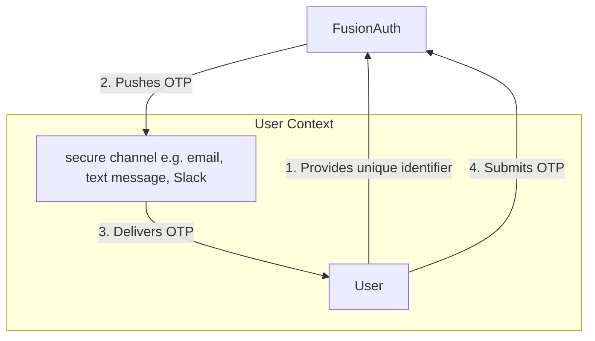

<AvailableSince since="1.41.0" />

Magic link and code authentication provides the ability to prove a user identity without a password. To do so, FusionAuth sends a single-use, time-bound code (also known as one-time password (OTP)) to the user using a secure communication method.

The following diagram shows the general flow of magic link authentication:

<Aside type="tip">
Prior to version `1.41.0`, magic links and codes were the only form of passwordless authentication supported by FusionAuth.

Therefore the user interface and API use the term **Passwordless**, even though versions `1.41.0` and beyond support multiple kinds of authentication without passwords, including [Passkeys](/docs/authenticate-users/lifecycle/passkeys/).
</Aside>

<ChildCards />

## When Should I Use Magic Links?

Magic link authentication eases a user's sign-in experience. Rather than having to remember which password they used, a user gives their email address or phone number and is sent a link or one time code. When they click through, they are authenticated.

In addition to being easier for users, a magic link login experience prevents them from reusing the same password across different sites or applications. No longer will you worry about another website's data breach causing illicit access to your system. In addition, password brute forcing is no longer a threat since the codes are one-time use.

## Security

With magic link authentication, if the user's email account or phone number is hijacked, their account on your system is compromised. However, many organizations have security policies and protections around email accounts. It is often easier to protect and regularly change one email account password than to change all of a user's passwords. Email accounts are also more likely to have two-factor authentication enabled.

One way to increase the security of your magic link/OTP authentications is to decrease the lifetime of the code. This will help if the email or SMS message is compromised or accidentally forwarded.

There are no limits on how many passwordless requests can be made for a user, but only the most recent code is valid. Using any of the others, even if they have not yet expired, will display an `Invalid login credentials` message to the user.

If someone tries to log in with an email or phone number that is not present in the FusionAuth user database, they'll see the same notification as they would if the email or phone number existed. No email or SMS message will be sent.

If you use the passwordless API, follow the principle of least privilege, and limit calls to which the API key has access. If you are using the API key only for magic link passwordless login, don't give this key any other permissions.

### Disable Passwords

You can choose to disable passwords to enforce passwordless login. See the [Password enabled](/docs/get-started/core-concepts/types/tenants#password-settings) tenant setting for more information.

## Troubleshooting

### Magic Link Button Does Not Appear on Login Page

If the <Breadcrumb>Login with a magic link</Breadcrumb> button does not appear on your login page, check the following:

* Ensure that the application has **Passwordless Login** enabled under the <Breadcrumb>Security</Breadcrumb> tab.
* Ensure that the application and tenant have a valid email or phone template configured for Passwordless Login.
* Ensure that SMS or email is configured in the tenant settings.

### Email

If you are experiencing troubles with email delivery, review [the email troubleshooting documentation](/docs/operate/troubleshooting#troubleshooting-email).

### Invalid Links

In some cases, email clients will visit links in an email before the user does. In particular, this is known to happen with Outlook "safe links". If the client does this when the email contains a passwordless one time code, that code may be invalid when the user clicks on it, as it has already been visited.

One option is to consult with your email client administrator. It may be possible to add the application's URL to an allow list.

In version `1.27.0`, FusionAuth changed the link processing behavior to remedy this for some situations. Given the wide variety of email client behavior, it may still be present in other scenarios.

If your users' passwordless codes are being expired by an email client, please [file a GitHub issue](https://github.com/FusionAuth/fusionauth-issues/issues).

