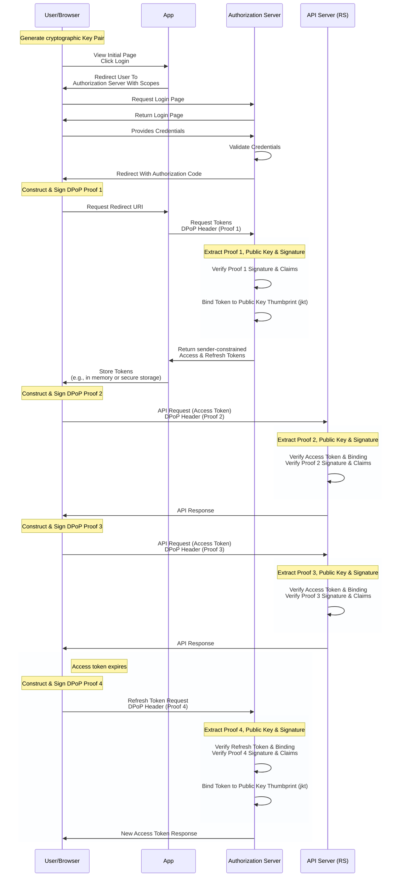

import Aside from 'src/components/Aside.astro';
import Breadcrumb from 'src/components/Breadcrumb.astro';
import InlineField from 'src/components/InlineField.astro';
import InlineUIElement from 'src/components/InlineUIElement.astro';
import TokenStorageOptionsTable from 'src/content/docs/_shared/_token-storage-options.mdx';

## Overview

Demonstrating Proof-of-Possession (DPoP) is an application-level mechanism for sender-constraining OAuth 2.0 access and refresh tokens. It ensures that a token can only be used by the client that requested it, by binding the token to a cryptographic key pair held by that client.

Unlike standard bearer tokens, which can be used by any party in possession of the token, DPoP-bound tokens require the client to prove possession of a private key for every request. This provides strong defense-in-depth against token theft and replay attacks.

DPoP is defined in [RFC 9449](https://datatracker.ietf.org/doc/html/rfc9449).

### When To Use DPoP

You should consider using DPoP in the following scenarios:

* **Securing APIs**: APIs that require strict assurance that the sender of the token is the same entity to which the token was issued.
* **Multi Domain**: DPoP is compatible with CORS, and allows you to securely use tokens between multiple domains.
* **[FAPI 2.0](https://openid.net/specs/fapi-security-profile-2_0-final.html#name-dpop-proof-replay)**: It defines DPoP as one of the methods for sender-constrained access tokens.
* **Alternative to mTLS**: In environments where Mutual TLS (mTLS) is difficult to implement or not supported by the infrastructure, DPoP provides similar sender-constraining benefits at the application layer.

<Aside type="note">
DPoP is not a substitute for TLS. It MUST always be used in conjunction with HTTPS to ensure the integrity and confidentiality of the requests.
</Aside>

## FusionAuth Support And Scope

FusionAuth acts as the **Authorization Server (AS)** in the DPoP flow. When a client includes a DPoP proof in a token request, FusionAuth:

1. Extracts the DPoP proof, public key, and signature from the `DPoP` request header.
2. Verifies the signature using the provided public key and validates the proof according to [RFC 9449 § 5](https://datatracker.ietf.org/doc/html/rfc9449#section-5).
3. Calculates the JWK SHA-256 thumbprint (`jkt`) of the public key provided in the proof.
4. Binds the issued access token (and refresh token) to this thumbprint by adding a `cnf` claim.
5. Returns a `token_type` of `DPoP` in the token response.

### Token Binding Semantics

When DPoP is used, the issued Access Token contains a **Confirmation (`cnf`)** claim as defined in [RFC 9449 § 6.1](https://datatracker.ietf.org/doc/html/rfc9449#section-6.1):

```json
{
  "cnf": {
    "jkt": "0ZcOCORZNYy-DWpqq30jZyJGHTN0d2HglBV3uiguA4I"
  }
}
```

This thumbprint is the immutable anchor that your **Resource Server (RS)** will use to verify that the client presenting the token is the legitimate owner.

<Aside type="caution">
FusionAuth handles the binding of tokens during issuance. However, the validation of DPoP proofs when accessing your protected resources occurs in your own APIs (the Resource Server).
</Aside>

## High-Level Flow

The following diagram illustrates the DPoP flow using the Authorization Code grant with PKCE.



1. **Key Generation**: The client generates a cryptographic public and private key pair (e.g., ES256) on the browser.
2. **Authorization Request**: The client initiates the OAuth flow by redirecting the user to FusionAuth's authorization endpoint.
3. **Token Request**: After the user authenticates and authorizes the client, the client requests tokens from the `/token` endpoint, including a DPoP proof signed with the private key in the `DPoP` header.
4. **Verification (AS)**: FusionAuth extracts the DPoP proof and public key, verifies the signature
5. **Binding (AS)** FusionAuth then generates an access token bound to the SHA-256 thumbprint (`jkt`) of the public key.
6. **Sender-Constrained Issuance (AS)**: FusionAuth issues the tokens with a `token_type` of `DPoP`, ensuring they are constrained to the client's key.
7. **API Request (Client)**: For every API call, the client generates a *new* DPoP proof specific to the request (matching HTTP method `htm` and URI `htu`) and includes the access token hash (`ath`).
8. **Verification (RS)**: Your API (Resource Server) verifies the access token, validates the DPoP proof signature, and ensures the proof's key matches the `cnf.jkt` binding in the token.
9. **Response (RS)**: Your API responds with the requested resource.

## Client Responsibilities

Implementing DPoP on the client side requires careful management of the cryptographic key pair and the generation of per-request proofs.

### Key Pair Lifecycle

* **Generation**: The client MUST generate an asymmetric key pair. [RFC 9449 § 4.2](https://datatracker.ietf.org/doc/html/rfc9449#section-4.2) recommends using algorithms like `ES256`.
* **Storage**: In browser environments, store the private key in a way that it is non-extractable (e.g., using the Web Crypto API with `extractable: false`). This prevents exfiltration even if the application context is compromised by XSS. [RFC 9449 § 11.4](https://datatracker.ietf.org/doc/html/rfc9449#section-11.4).
* **Rotation**: Periodically rotate the key pair to minimize the impact of a potential key compromise.

### DPoP Proof Composition

A DPoP proof is a JWT sent in the `DPoP` HTTP header. According to [RFC 9449 § 4.2](https://datatracker.ietf.org/doc/html/rfc9449#section-4.2), it must contain:

**JOSE Header:**
* `typ`: MUST be `dpop+jwt`.
* `alg`: An asymmetric signature algorithm (e.g., `ES256`).
* `jwk`: The public key corresponding to the private key used to sign the proof.

**Payload Claims:**
* `jti`: A unique identifier for the proof (UUID v4 is recommended) to prevent replay.
* `htm`: The HTTP method of the request (e.g., `GET`, `POST`).
* `htu`: The HTTP target URI of the request, without query or fragment parameters.
* `iat`: The time the proof was created.
* `ath`: The base64url-encoded SHA-256 hash of the access token (required when presenting an access token to an RS).

### Nonce Handling

If FusionAuth or your Resource Server requires a nonce for temporal replay protection, they will respond with a `401` or `400` error and a `WWW-Authenticate: DPoP error="use_dpop_nonce"` header containing a `DPoP-Nonce`.

The client MUST then:
1. Extract the nonce from the `DPoP-Nonce` header.
2. Include this nonce in the `nonce` claim of a new DPoP proof.
3. Retry the request.

## Resource Server Validation Checklist

Your API (Resource Server) MUST perform the following steps to validate a DPoP-protected request as outlined in [RFC 9449 § 4.3](https://datatracker.ietf.org/doc/html/rfc9449#section-4.3):

1. **Verify Headers**: Ensure the `Authorization` header uses the `DPoP` scheme and the `DPoP` header is present and is a valid JWT.
2. **Strict Type Check**: Verify that the DPoP proof's JOSE header has `"typ": "dpop+jwt"`.
3. **Signature Verification**: Verify the proof's signature using the public key provided in the `jwk` header of the proof itself.
4. **Claims Validation**:
    * `htm`: Matches the request's HTTP method.
    * `htu`: Matches the request's absolute URI (normalization is recommended).
    * `iat`: Within an acceptable window (e.g., +/- 60 seconds) to account for clock skew.
    * `jti`: Has not been seen before (replay protection).
5. **Access Token Hash (`ath`)**: Verify that the `ath` claim in the proof matches the SHA-256 hash of the access token provided in the `Authorization` header.
6. **Token Binding Check**:
    * Extract the `cnf.jkt` claim from the access token.
    * Calculate the SHA-256 thumbprint of the `jwk` from the DPoP proof.
    * **MUST** ensure they are identical.

## FusionAuth Configuration

There is no configuration required to enable DPoP in FusionAuth. Just make sure the version of FusionAuth you are using is 1.63.0 or later.

<Aside type="note">
FusionAuth responds to token requests with a `DPoP` header containing a DPoP proof as long the requesting client initializes the DPoP flow.
</Aside>

## Troubleshooting

| Error | Cause | Resolution |
| :--- | :--- | :--- |
| `invalid_dpop_proof` | The DPoP proof is malformed, has an invalid signature, or missing claims. | Verify the client is correctly signing the JWT and including all required claims (§4.2). |
| `use_dpop_nonce` | The server requires a fresh nonce. | Extract the `DPoP-Nonce` from the response and retry the request with the `nonce` claim. |
| Thumbprint Mismatch | The `jkt` in the access token does not match the key in the DPoP proof. | Ensure the client is using the same key pair for the API request as it did for the token request. |
| `ath` Mismatch | The hash of the access token in the proof is incorrect. | Verify the `ath` calculation: `base64url(sha256(access_token))`. |

### Storage Options

Here is a complete list of storage options for access and refresh tokens in comparison.

<TokenStorageOptionsTable />

## References

* **RFC 9449**: [OAuth 2.0 Demonstrating Proof-of-Possession (DPoP)](https://datatracker.ietf.org/doc/html/rfc9449)
* **RFC 7638**: [JSON Web Key (JWK) Thumbprint](https://datatracker.ietf.org/doc/html/rfc7638)
