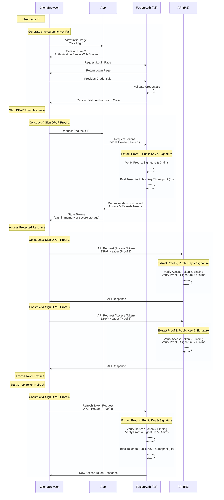

import Aside from 'src/components/Aside.astro';
import Breadcrumb from 'src/components/Breadcrumb.astro';
import EnterprisePlanBlurb from 'src/content/docs/_shared/_enterprise-plan-blurb.astro';
import InlineField from 'src/components/InlineField.astro';
import TokenStorageOptionsTable from 'src/content/docs/_shared/_token-storage-options.mdx';

<EnterprisePlanBlurb />

Demonstrating Proof-of-Possession (DPoP) is an application-level mechanism for sender-constraining OAuth 2.0 Access and Refresh Tokens. It ensures that a token can only be used by the client that requested it, by binding the token to a cryptographic key pair held by that client.

Unlike standard bearer tokens, which can be used by any party in possession of the token, DPoP-bound tokens require the client to prove possession of a private key for every request. This provides strong defense-in-depth against token theft and replay attacks.

DPoP is defined in [RFC 9449](https://datatracker.ietf.org/doc/html/rfc9449).

### When To Use DPoP

Consider using DPoP in the following scenarios:

* **Securing APIs**: APIs that require strict assurance that the sender of the token is the same entity to which the token was issued.
* **Multi Domain**: DPoP is compatible with CORS, and allows you to securely use tokens between multiple domains.
* **[FAPI 2.0](https://openid.net/specs/fapi-security-profile-2_0-final.html#name-dpop-proof-replay)**: This specification defines DPoP as one of the methods for sender-constrained access tokens.
* **Alternative to mTLS**: In environments where Mutual TLS (mTLS) is difficult to implement or not supported by the infrastructure, DPoP provides similar sender-constraining benefits at the application layer.

When you use DPoP, the APIs receiving the access token will need to take additional steps to validate that the access token was sent by the correct client. FusionAuth doesn't yet have SDK support for this, but it's coming. For now, you can implement the checks [outlined in the RFC](https://datatracker.ietf.org/doc/html/rfc9449#name-the-dpop-authentication-sch):

> For such an access token, a resource server MUST check that a DPoP proof was also received in the DPoP header field of the HTTP request, check the DPoP proof according to the rules in [Section 4.3](https://datatracker.ietf.org/doc/html/rfc9449#checking), and check that the public key of the DPoP proof matches the public key to which the access token is bound per [Section 6](https://datatracker.ietf.org/doc/html/rfc9449#Confirmation).

<Aside type="note">
DPoP is not a substitute for TLS; always use DPoP with HTTPS to ensure request confidentiality.
</Aside>

## FusionAuth Support And Scope

FusionAuth acts as the **Authorization Server (AS)** in the DPoP flow. When a client includes a DPoP proof in a token request, FusionAuth:

1. Extracts the DPoP proof, public key, and signature from the `DPoP` request header.
1. Verifies the signature using the provided public key and validates the proof according to [RFC 9449 § 5](https://datatracker.ietf.org/doc/html/rfc9449#section-5).
1. Calculates the JWK SHA-256 thumbprint (`jkt`) of the public key provided in the proof.
1. Binds the issued access token (and refresh token) to this thumbprint by adding a `cnf` claim.
1. Returns a `token_type` of `DPoP` in the token response.

### Token Binding Semantics

When DPoP is used, the issued access token contains a **Confirmation (`cnf`)** claim as defined in [RFC 9449 § 6.1](https://datatracker.ietf.org/doc/html/rfc9449#section-6.1).

```json
{
  "cnf": {
    "jkt": "0ZcOCORZNYy-DWpqq30jZyJGHTN0d2HglBV3uiguA4I"
  }
}
```

This thumbprint is the immutable anchor that your **Resource Server (RS)** will use to verify that the client presenting the Token is the legitimate owner.

<Aside type="caution">
FusionAuth handles the binding of Tokens during issuance. However, the validation of DPoP proofs when accessing your protected resources occurs in your own APIs (the Resource Server).
</Aside>

## The DPoP Flow

The following diagram illustrates the DPoP flow using the Authorization Code grant with PKCE.



### Key Generation And Authorization

1. **Key Generation**: The client generates a cryptographic public and private key pair (e.g., ES256) on the browser. Generating the key pair at the start of the flow ensures the client is ready to sign proofs later.
2. **Authorization Request**: The client initiates the OAuth flow by redirecting the user to FusionAuth's authorization endpoint.

### DPoP Token Issuance (Authorization Server)

3. **Token Request**: After the user authenticates and authorizes the client, the client requests Tokens from the `/oauth2/token` endpoint, including a DPoP proof (Proof 1) signed with the private key in the `DPoP` header.
4. **Verification (AS)**: FusionAuth extracts the DPoP proof and public key, verifies the signature, and ensures the claims (like <InlineField>htm</InlineField> and <InlineField>htu</InlineField>) are valid.
5. **Binding (AS)**: FusionAuth then generates an Access Token bound to the SHA-256 thumbprint (<InlineField>jkt</InlineField>) of the public key.
6. **Sender-Constrained Issuance (AS)**: FusionAuth issues the Tokens with a <InlineField>token_type</InlineField> of `DPoP`, ensuring they are constrained to the client's key.

### Access Protected Resource (Resource Server)

7. **API Request (Client)**: For every API call, the client generates a *new* DPoP proof (Proof 2) specific to the request (matching HTTP method <InlineField>htm</InlineField> and URI <InlineField>htu</InlineField>) and includes the Access Token hash (<InlineField>ath</InlineField>).
8. **Verification (RS)**: Your API (Resource Server) verifies the Access Token, validates the DPoP proof signature, and ensures the proof's key matches the <InlineField>cnf.jkt</InlineField> binding in the Token.
9. **Response (RS)**: Your API responds with the requested resource. Subsequent requests (e.g., Proof 3) follow the same pattern.

### DPoP Token Refresh (Authorization Server)

10. **Refresh Request (Client)**: When the Access Token expires, the client sends a Refresh Token request to the `/oauth2/token` endpoint, including a new DPoP proof (Proof 4).
11. **Verification & Re-binding (AS)**: FusionAuth verifies the Refresh Token and its binding to the original key, validates the new DPoP proof, and issues a new Access Token bound to the same public key thumbprint.

## Client Responsibilities

<Aside type="note">
When DPoP is used with CORS, `DPoP` must be added to `systemConfiguration.corsConfiguration.allowedHeaders`.
</Aside>

Implementing DPoP on the client side requires careful management of the cryptographic key pair and the generation of per-request proofs.

### Key Pair Lifecycle

* **Generation**: The client MUST generate an asymmetric key pair. [RFC 9449 § 4.2](https://datatracker.ietf.org/doc/html/rfc9449#section-4.2) recommends using algorithms like `ES256`. Generating the key early ensures the client is ready for the token request and can fail fast if the browser does not support the required cryptographic algorithms.
* **Storage**: In browser environments, store the private key in a way that it is non-extractable (e.g., using the Web Crypto API with `extractable: false`). This prevents exfiltration even if the application context is compromised by XSS. [RFC 9449 § 11.4](https://datatracker.ietf.org/doc/html/rfc9449#section-11.4).
* **Rotation**: Periodically rotate the key pair to minimize the impact of a potential key compromise.

### DPoP Proof Composition

A DPoP proof is a JWT sent in the <InlineField>DPoP</InlineField> HTTP header. According to [RFC 9449 § 4.2](https://datatracker.ietf.org/doc/html/rfc9449#section-4.2), it must contain:

**JOSE Header:**
* <InlineField>typ</InlineField>: MUST be `dpop+jwt`.
* <InlineField>alg</InlineField>: An asymmetric signature algorithm (e.g., `ES256`). FusionAuth accepts the following algorithms: Ed448, Ed25519, RS256, RS384, RS512, ES256, ES384, ES512, PS256, PS384, and PS512.
* <InlineField>jwk</InlineField>: The public key corresponding to the private key used to sign the proof.

**Payload Claims:**
* <InlineField>jti</InlineField>: A unique identifier for the proof (UUID v4 is recommended) to prevent replay.
* <InlineField>htm</InlineField>: The HTTP method of the request (e.g., `GET`, `POST`).
* <InlineField>htu</InlineField>: The HTTP target URI of the request, without query or fragment parameters.
* <InlineField>iat</InlineField>: The time the proof was created. FusionAuth allows a lifetime of 10 seconds and a window of +/- 15 seconds to account for clock skew.
* <InlineField>ath</InlineField>: The base64url-encoded SHA-256 hash of the Access Token (required when presenting an Access Token to an RS).

### Nonce Handling

If your Resource Server requires a nonce for temporal replay protection, they will respond with a `401` or `400` error and a <InlineField>WWW-Authenticate</InlineField> header containing a <InlineField>DPoP-Nonce</InlineField>.

The client MUST then:
1. Extract the nonce from the <InlineField>DPoP-Nonce</InlineField> header.
2. Include this in the <InlineField>nonce</InlineField> claim of a new DPoP proof.
3. Retry the request.

<Aside type="note">
FusionAuth currently does not require nonce handling, but your APIs may require one for resource access.
</Aside>

## Resource Server Validation Checklist

Your API (Resource Server) MUST perform the following steps to validate a DPoP-protected request as outlined in [RFC 9449 § 4.3](https://datatracker.ietf.org/doc/html/rfc9449#section-4.3):

1. **Verify Headers**: Ensure the <InlineField>Authorization</InlineField> header uses the `DPoP` scheme and the <InlineField>DPoP</InlineField> header is present and is a valid JWT.
2. **Strict Type Check**: Verify that the DPoP proof's JOSE header has `<InlineField>typ</InlineField>: "dpop+jwt"`.
3. **Signature Verification**: Verify the proof's signature using the public key provided in the <InlineField>jwk</InlineField> header of the proof itself.
4. **Claims Validation**:
    * <InlineField>htm</InlineField>: Matches the request's HTTP method.
    * <InlineField>htu</InlineField>: Matches the request's absolute URI (normalization is recommended).
    * <InlineField>iat</InlineField>: Within an acceptable window (e.g., +/- 15 seconds) to account for clock skew.
    * <InlineField>jti</InlineField>: Has not been seen before (replay protection).
5. **Access Token Hash (`ath`)**: Verify that the <InlineField>ath</InlineField> claim in the proof matches the SHA-256 hash of the Access Token provided in the <InlineField>Authorization</InlineField> header.
6. **Token Binding Check**:
    * Extract the <InlineField>cnf.jkt</InlineField> claim from the Access Token.
    * Calculate the SHA-256 thumbprint of the <InlineField>jwk</InlineField> from the DPoP proof.
    * **MUST** ensure they are identical.

## FusionAuth Configuration

There is no configuration required to enable DPoP in FusionAuth. FusionAuth responds to Token requests with a <InlineField>DPoP</InlineField> header containing a DPoP proof as long as the requesting client initializes the DPoP flow.

## Troubleshooting

| Error | Cause | Resolution |
| :--- | :--- | :--- |
| `invalid_dpop_proof` | The DPoP proof is malformed, has an invalid signature, or missing claims. | Verify the client is correctly signing the JWT and including all required claims (§4.2). |
| `use_dpop_nonce` | The server requires a fresh nonce. | Extract the <InlineField>DPoP-Nonce</InlineField> from the response and retry the request with the <InlineField>nonce</InlineField> claim. |
| Thumbprint Mismatch | The <InlineField>jkt</InlineField> in the Access Token does not match the key in the DPoP proof. | Ensure the client is using the same key pair for the API request as it did for the Token request. |
| <InlineField>ath</InlineField> Mismatch | The hash of the Access Token in the proof is incorrect. | Verify the <InlineField>ath</InlineField> calculation: `base64url(sha256(Access Token))`. |

### Storage Options

Here is a complete list of storage options for Access and Refresh Tokens in comparison.

<TokenStorageOptionsTable />

## References

* **RFC 9449**: [OAuth 2.0 Demonstrating Proof-of-Possession (DPoP)](https://datatracker.ietf.org/doc/html/rfc9449)
* **RFC 7638**: [JSON Web Key (JWK) Thumbprint](https://datatracker.ietf.org/doc/html/rfc7638)
