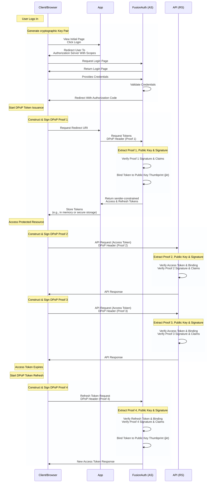

import Aside from 'src/components/Aside.astro';
import EnterprisePlanBlurb from 'src/content/docs/_shared/_enterprise-plan-blurb.mdx';
import TokenStorageOptionsTable from 'src/content/docs/_shared/_token-storage-options.mdx';

<EnterprisePlanBlurb />

Demonstrating Proof-of-Possession (DPoP) is an application-level mechanism for sender-constraining OAuth 2.0 Access and Refresh Tokens. It ensures that a token can only be used by the client that requested it, by binding the token to a cryptographic key pair held by that client.

Unlike standard bearer tokens, which can be used by any party in possession of the token, DPoP-bound tokens require the client to prove possession of a private key for every request. This provides strong defense-in-depth against token theft and replay attacks.

DPoP is defined in [RFC 9449](https://datatracker.ietf.org/doc/html/rfc9449).

## Enable DPoP

The FusionAuth [React](/docs/sdks/react-sdk), [Vue](/docs/sdks/vue-sdk), and [Angular](/docs/sdks/angular-sdk) SDKs all support DPoP. To enable DPoP, set `useDpop` to `true` in your `FusionAuthProviderConfig`:

```javascript [8]
const fusionAuthProviderConfig: FusionAuthProviderConfig = { 
  redirectUri: 'http://localhost:3000', 
  postLogoutRedirectUri: 'http://localhost:3000',
  shouldAutoRefresh: true,
  scope: 'openid email profile offline_access',
  clientId: 'e9fdb985-9173-4e01-9d73-ac2d60d1dc8e',
  serverUrl: 'http://localhost:9011',
  useDpop: true, // Opt-in to enable DPoP, defaults to fault

  onRedirect: () => { console.log('Login successful'); }
};
```

Once enabled in your application, you must enable the appropriate filters for DPoP in your FusionAuth CORS configuration. In the [Admin UI](http://localhost:9011/admin), navigate to the <Breadcrumb>Settings -> System</Breadcrumb>. Add the following settings in the CORS configuration:

* **Allowed headers**: Add `dpop`, `Authorization`, and `Accept`, hitting **Enter** after each header to add each one separately
* **Allowed origins**: Enter the base URL of your instance

Alternatively, you can add `dpop` to `systemConfiguration.corsConfiguration.allowedHeaders` using the API.

## FusionAuth Support And Scope

FusionAuth acts as the **Authorization Server (AS)** in the DPoP flow. When a client includes a DPoP proof in a token request, FusionAuth:

1. Extracts the DPoP proof, public key, and signature from the `DPoP` request header.
1. Verifies the signature using the provided public key and validates the proof according to [RFC 9449 § 5](https://datatracker.ietf.org/doc/html/rfc9449#section-5).
1. Calculates the JWK SHA-256 thumbprint (`jkt`) of the public key provided in the proof.
1. Binds the issued access token (and refresh token) to this thumbprint by adding a `cnf` claim.
1. Returns a `token_type` of `DPoP` in the token response.

### Token Binding Semantics

When DPoP is used, the issued access token contains a **Confirmation (`cnf`)** claim as defined in [RFC 9449 § 6.1](https://datatracker.ietf.org/doc/html/rfc9449#section-6.1).

```json
{
  "cnf": {
    "jkt": "0ZcOCORZNYy-DWpqq30jZyJGHTN0d2HglBV3uiguA4I"
  }
}
```

This thumbprint is the immutable anchor that your **Resource Server (RS)** will use to verify that the client presenting the Token is the legitimate owner.

## The DPoP Flow

The following diagram illustrates the DPoP flow using the Authorization Code grant with PKCE.


```mermaid
sequenceDiagram
  participant User as Client/Browser
  participant App
  participant FusionAuth as FusionAuth (AS)
  participant API as API (RS)

  Note left of User: User Logs In
  rect rgb(230, 245, 255, .1)
    Note over User: Generate cryptographic Key Pair
    User ->> App : View Initial Page<br/>Click Login
    App ->> User : Redirect User To <br/>Authorization Server With Scopes
    User ->> FusionAuth : Request Login Page
    FusionAuth ->> User : Return Login Page
    User ->> FusionAuth : Provides Credentials
    FusionAuth ->> FusionAuth : Validate Credentials
    FusionAuth ->> User : Redirect With Authorization Code
  end

  Note left of User: Start DPoP Token Issuance

  rect rgb(230, 245, 255, .1)
    Note over User: Construct & Sign DPoP Proof 1
    User ->> App : Request Redirect URI
    App ->> FusionAuth : Request Tokens<br/>DPoP Header (Proof 1)
    rect rgb(230, 245, 255, .1)
      Note over FusionAuth: Extract Proof 1, Public Key & Signature
      FusionAuth->>FusionAuth: Verify Proof 1 Signature & Claims<br/>
      FusionAuth->>FusionAuth: Bind Token to Public Key Thumbprint (jkt)<br/>
    end
    FusionAuth ->> App : Return sender-constrained<br/>Access & Refresh Tokens
    App ->> User : Store Tokens<br/>(e.g., in memory or secure storage)
  end

  Note left of User: Access Protected Resource

  rect rgb(230, 245, 255, .1)
    Note over User: Construct & Sign DPoP Proof 2

    User->>API: API Request (Access Token)<br/>DPoP Header (Proof 2)
    rect rgb(230, 245, 255, .1)
      Note over API: Extract Proof 2, Public Key & Signature
      API->>API: Verify Access Token & Binding<br/>Verify Proof 2 Signature & Claims<br/>
    end
    API->>User: API Response

    Note over User: Construct & Sign DPoP Proof 3

    User->>API: API Request (Access Token)<br/>DPoP Header (Proof 3)
    rect rgb(230, 245, 255, .1)
      Note over API: Extract Proof 3, Public Key & Signature
      API->>API: Verify Access Token & Binding<br/>Verify Proof 3 Signature & Claims<br/>
    end
    API->>User: API Response
  end

  Note left of User: Access Token Expires
  Note left of User: Start DPoP Token Refresh

  rect rgb(230, 245, 255, .1)
    Note over User: Construct & Sign DPoP Proof 4
    User->>FusionAuth: Refresh Token Request<br/>DPoP Header (Proof 4)
    rect rgb(230, 245, 255, .1)
      Note over FusionAuth: Extract Proof 4, Public Key & Signature
      FusionAuth->>FusionAuth: Verify Refresh Token & Binding<br/>Verify Proof 4 Signature & Claims<br/>
      FusionAuth->>FusionAuth: Bind Token to Public Key Thumbprint (jkt)<br/>
    end
    FusionAuth->>User: New Access Token Response
  end
```

### Key Generation And Authorization

1. **Key Generation**: The client generates a cryptographic public and private key pair (e.g., ES256) on the browser. Generating the key pair at the start of the flow ensures the client is ready to sign proofs later.
2. **Authorization Request**: The client initiates the OAuth flow by redirecting the user to FusionAuth's authorization endpoint.

### DPoP Token Issuance (Authorization Server)

3. **Token Request**: After the user authenticates and authorizes the client, the client requests Tokens from the `/oauth2/token` endpoint, including a DPoP proof (Proof 1) signed with the private key in the `DPoP` header.
4. **Verification (AS)**: FusionAuth extracts the DPoP proof and public key, verifies the signature, and ensures the claims (like **htm** and **htu**) are valid.
5. **Binding (AS)**: FusionAuth then generates an Access Token bound to the SHA-256 thumbprint (**jkt**) of the public key.
6. **Sender-Constrained Issuance (AS)**: FusionAuth issues the Tokens with a **token_type** of `DPoP`, ensuring they are constrained to the client's key.

### Access Protected Resource (Resource Server)

7. **API Request (Client)**: For every API call, the client generates a *new* DPoP proof (Proof 2) specific to the request (matching HTTP method **htm** and URI **htu**) and includes the Access Token hash (**ath**).
8. **Verification (RS)**: Your API (Resource Server) verifies the Access Token, validates the DPoP proof signature, and ensures the proof's key matches the **cnf.jkt** binding in the Token.
9. **Response (RS)**: Your API responds with the requested resource. Subsequent requests (e.g., Proof 3) follow the same pattern.

### DPoP Token Refresh (Authorization Server)

10. **Refresh Request (Client)**: When the Access Token expires, the client sends a Refresh Token request to the `/oauth2/token` endpoint, including a new DPoP proof (Proof 4).
11. **Verification & Re-binding (AS)**: FusionAuth verifies the Refresh Token and its binding to the original key, validates the new DPoP proof, and issues a new Access Token bound to the same public key thumbprint.

## Client Responsibilities

### Key Pair Lifecycle

* **Generation**: The client must generate an asymmetric key pair. [RFC 9449 § 4.2](https://datatracker.ietf.org/doc/html/rfc9449#section-4.2) recommends using algorithms like `ES256`. Generating the key early ensures the client is ready for the token request and can fail fast if the browser does not support the required cryptographic algorithms.
* **Storage**: In browser environments, store the private key in a way that it is non-extractable (e.g., using the Web Crypto API with `extractable: false`). This prevents exfiltration even if the application context is compromised by XSS. [RFC 9449 § 11.4](https://datatracker.ietf.org/doc/html/rfc9449#section-11.4).
* **Rotation**: Periodically rotate the key pair to minimize the impact of a potential key compromise.

### DPoP Proof Composition

A DPoP proof is a JWT sent in the **DPoP** HTTP header. According to [RFC 9449 § 4.2](https://datatracker.ietf.org/doc/html/rfc9449#section-4.2), it must contain:

**JOSE Header:**
* **`typ`**: MUST be `dpop+jwt`.
* **`alg`**: An asymmetric signature algorithm (e.g., `ES256`). FusionAuth accepts the following algorithms: Ed448, Ed25519, RS256, RS384, RS512, ES256, ES384, ES512, PS256, PS384, and PS512.
* **`jwk`**: The public key corresponding to the private key used to sign the proof.

**Payload Claims:**
* **`jti`**: A unique identifier for the proof (UUID v4 is recommended) to prevent replay.
* **`htm`**: The HTTP method of the request (e.g., `GET`, `POST`).
* **`htu`**: The HTTP target URI of the request, without query or fragment parameters.
* **`iat`**: The time the proof was created. FusionAuth allows a lifetime of 10 seconds and a window of +/- 15 seconds to account for clock skew.
* **`ath`**: The base64url-encoded SHA-256 hash of the Access Token (required when presenting an Access Token to an RS).

## Resource Server Validation Checklist

Your API (Resource Server) must perform the following steps to validate a DPoP-protected request as outlined in [RFC 9449 § 4.3](https://datatracker.ietf.org/doc/html/rfc9449#section-4.3):

1. **Verify Headers**: Ensure the **Authorization** header uses the `DPoP` scheme and the **DPoP** header is present and is a valid JWT.
1. **Strict Type Check**: Verify that the DPoP proof's JOSE header has `typ: "dpop+jwt"`.
1. **Signature Verification**: Verify the proof's signature using the public key provided in the **jwk** header of the proof itself.
1. **Claims Validation**:
    * **htm**: Matches the request's HTTP method.
    * **htu**: Matches the request's absolute URI (normalization is recommended).
    * **iat**: Within an acceptable window (e.g., +/- 15 seconds) to account for clock skew.
    * **jti**: Has not been seen before (replay protection).
1. **Access Token Hash (`ath`)**: Verify that the **ath** claim in the proof matches the SHA-256 hash of the Access Token provided in the **Authorization** header.
1. **Token Binding Check**:
    * Extract the **cnf.jkt** claim from the Access Token.
    * Calculate the SHA-256 thumbprint of the **jwk** from the DPoP proof.
    * **MUST** ensure they are identical.

## FusionAuth Configuration

There is no configuration required to enable DPoP in FusionAuth. FusionAuth responds to Token requests with a **DPoP** header containing a DPoP proof as long as the requesting client initializes the DPoP flow.

## Troubleshooting

| Error | Cause | Resolution |
| :--- | :--- | :--- |
| `invalid_dpop_proof` | The DPoP proof is malformed, has an invalid signature, or missing claims. | Verify the client is correctly signing the JWT and including all required claims (§4.2). |
| `use_dpop_nonce` | The server requires a fresh nonce. | Extract the **DPoP-Nonce** from the response and retry the request with the **nonce** claim. |
| Thumbprint Mismatch | The **jkt** in the Access Token does not match the key in the DPoP proof. | Ensure the client is using the same key pair for the API request as it did for the Token request. |
| **`ath`** Mismatch | The hash of the Access Token in the proof is incorrect. | Verify the **`ath`** calculation: `base64url(sha256(Access Token))`. |

### Storage Options

Here is a complete list of storage options for Access and Refresh Tokens in comparison.

<TokenStorageOptionsTable />

