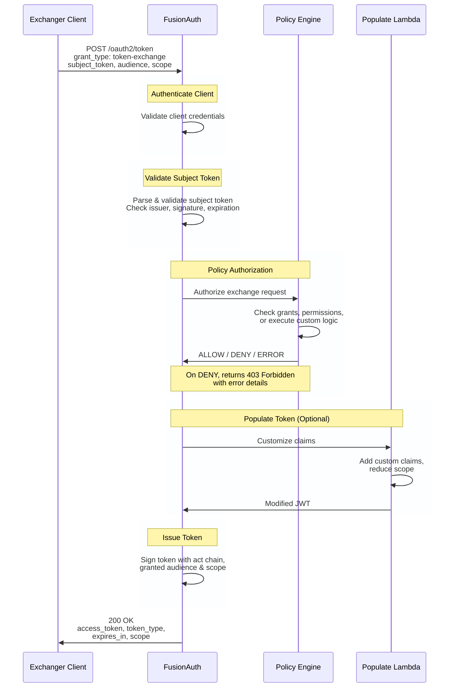

<PlanBlurb plan="enterprise" />

OAuth 2.0 Token Exchange is a protocol for exchanging one type of security token for another. It enables clients to obtain tokens on behalf of users or other services, supporting delegation and cross-domain authentication scenarios.

Token Exchange is defined in [RFC 8693](https://datatracker.ietf.org/doc/html/rfc8693).

**Note**: FusionAuth 1.70.0 implements delegation semantics as defined in RFC 8693. Impersonation semantics are not currently supported.

## Use Cases

Token Exchange enables several important security patterns:

### Delegation

A service acts on behalf of a user while maintaining a clear audit trail. The issued token contains an `act` (actor) claim chain showing who is acting on whose behalf.

**Example**: A todo application needs to send email reminders on behalf of users. It exchanges a user's access token for a token that allows it to call the email service as that user.

### Administrative Access (Using Delegation)

An administrator or support system needs to access user resources while maintaining an audit trail.

**Example**: A support dashboard service exchanges its credentials for a token scoped to a specific user's resources. The resulting token's `act` claim shows the support service identity, maintaining accountability while accessing the user's data.

### Token Type Conversion

Convert between different token formats or upgrade/downgrade token scopes for specific use cases.

**Example**: Converting a user's refresh token into a short-lived access token for a specific microservice, or exchanging an external IdP token for a FusionAuth-issued token.

### Cross-Domain Authentication

Enable secure token exchange across different security domains or trust boundaries.

**Example**: A user authenticated in one security domain (e.g., a partner IdP) needs to access resources in your system. Their external token is exchanged for a FusionAuth-issued token valid within your security domain.

## How Token Exchange Works

Token Exchange follows a simple flow:

1. **Client Authentication**: The client (exchanger) authenticates to FusionAuth using client credentials
2. **Subject Token Validation**: FusionAuth validates the subject token (the token being exchanged)
3. **Policy Authorization**: A policy engine determines if the exchange is permitted
4. **Token Population**: Optional lambda customizes claims in the issued token
5. **Token Issuance**: FusionAuth issues a new access token with appropriate claims



## Policy Engines

FusionAuth supports two policy engines for authorizing token exchange requests. Choose the engine that best fits your authorization requirements:

| Feature | Entity Engine | Lambda Engine |
|---------|---------------|---------------|
| **Authorization Model** | Grant-based (entity grants) | Custom JavaScript logic |
| **Complexity** | Simple, declarative | Flexible, programmable |
| **Grant Checking** | Existence only (permissions ignored) | Custom logic in lambda |
| **Audience Parameter** | Required | Optional (lambda decides) |
| **Scope Handling** | Passes through subject token scopes (ignores request) | Custom logic (can reduce scopes) |
| **Resource Parameter** | Not supported | Supported (available in lambda) |
| **Dynamic Authorization** | No | Yes (time, context, external APIs) |
| **Best For** | M2M with static rules | Complex, contextual authorization |

### Entity Policy Engine

Uses FusionAuth's entity grants system for authorization. The exchanger entity must have explicit grants on the target entity (audience).

**When to use**:
- Simple, declarative permission models
- Machine-to-machine scenarios
- Static authorization rules

**Configuration**:
1. Create entities for your services
2. Grant permissions from exchanger entities to target entities
3. Enable the `actAsTokenExchangeClient` flag on exchanger entities
4. Set tenant policy engine to `ENTITY`

**Important behaviors**:
- The engine checks only for grant **existence** between exchanger and audience entities; specific permission names are not evaluated
- The `audience` parameter is **required** (requests without audience will be denied)
- The `scope` request parameter is **ignored**; the subject token's scopes are passed through unchanged
- The `resource` parameter is **not supported** (requests with resource will be denied)
- For scope reduction or resource-based authorization, use the Lambda policy engine instead

### Lambda Policy Engine

Uses a custom JavaScript lambda for authorization logic. Provides complete flexibility for complex authorization scenarios.

**When to use**:
- Dynamic authorization based on request context
- External API calls for authorization decisions
- Time-based or location-based restrictions
- Complex business logic

**Configuration**:
1. Create a Token Exchange Policy lambda
2. Implement authorization logic (return ALLOW, DENY, or ERROR)
3. Assign lambda to tenant OAuth configuration
4. Set tenant policy engine to `LAMBDA`

See [Token Exchange Policy Lambda](/docs/extend/code/lambdas/token-exchange-policy) for implementation details.

## Actor Chain and the `act` Claim

Token Exchange introduces the `act` (actor) claim defined in [RFC 8693 § 4.1](https://datatracker.ietf.org/doc/html/rfc8693#section-4.1). This claim creates an auditable chain showing who is acting on whose behalf.

### Actor Chain Structure

```json
{
  "sub": "user123",
  "act": {
    "sub": "service-todo-app",
    "sub_profile": "API Service",
    "act": {
      "sub": "service-email-api",
      "sub_profile": "Email Service"
    }
  }
}
```

This token shows:
- The token represents `user123` (the original subject)
- The `service-todo-app` is acting on behalf of the user
- The `service-email-api` is acting on behalf of the todo app

### Actor Chain Depth

FusionAuth limits actor chain depth to prevent abuse:
- **Default maximum**: 2 levels
- **Configurable maximum**: 10 levels
- Configured in tenant Token Exchange settings

When a client performs token exchange with a token that already has an `act` claim, the new actor is added to the chain.

## Delegation Semantics

FusionAuth implements delegation semantics for token exchange, where the actor is authorized to act on behalf of the subject but retains its own identity. The `act` claim shows the delegation chain.

**Use case**: A service calling another service on a user's behalf, where both the user's identity and the service's identity matter for authorization and auditing.

The token's `sub` (subject) claim represents the original user or entity, while the `act` (actor) claim shows who is performing actions on their behalf. This preserves accountability and enables fine-grained authorization at resource servers.

## Configuration

To enable Token Exchange in your tenant:

1. Navigate to <Breadcrumb>Tenants -> [Your Tenant] -> OAuth</Breadcrumb>
2. Scroll to the **Token Exchange** section
3. Enable **Token Exchange**
4. Configure policy engine (ENTITY or LAMBDA)
5. Set maximum actor chain depth (default: 2)
6. Add allowed token issuers (optional, for external tokens)
7. Optionally assign lambdas:
   - **Policy Lambda**: Custom authorization logic
   - **Populate Lambda**: Customize issued token claims

See [Tenant Configuration](/docs/get-started/core-concepts/types/tenants) for detailed field descriptions.

## Quick Start

### 1. Configure Entities (Entity Policy Engine)

Create two entities representing your services:

```bash
# Create email service entity (target)
curl -X POST 'http://localhost:9011/api/entity' \
  -H 'Authorization: YOUR_API_KEY' \
  -H 'Content-Type: application/json' \
  -d '{
    "entity": {
      "name": "Email Service",
      "type": "API",
      "clientId": "email-service-client-id",
      "clientSecret": "email-service-secret"
    }
  }'

# Create todo app entity (exchanger)
# Note: actAsTokenExchangeClient must be true to allow this entity to perform token exchange
curl -X POST 'http://localhost:9011/api/entity' \
  -H 'Authorization: YOUR_API_KEY' \
  -H 'Content-Type: application/json' \
  -d '{
    "entity": {
      "name": "Todo App",
      "type": "API",
      "clientId": "todo-app-client-id",
      "clientSecret": "todo-app-secret",
      "actAsTokenExchangeClient": true
    }
  }'

# Grant todo app permission to call email service
# Note: The Entity policy engine checks for grant existence only; specific permissions are not evaluated
curl -X POST 'http://localhost:9011/api/entity/grant' \
  -H 'Authorization: YOUR_API_KEY' \
  -H 'Content-Type: application/json' \
  -d '{
    "grant": {
      "recipientEntityId": "todo-app-entity-id",
      "targetEntityId": "email-service-entity-id",
      "permissions": ["execute"]
    }
  }'
```

### 2. Perform Token Exchange

Exchange a user's access token for a token to call the email service:

```bash
curl -X POST 'http://localhost:9011/oauth2/token' \
  -H 'Content-Type: application/x-www-form-urlencoded' \
  -d 'grant_type=urn:ietf:params:oauth:grant-type:token-exchange' \
  -d 'client_id=todo-app-client-id' \
  -d 'client_secret=todo-app-secret' \
  -d 'subject_token=USER_ACCESS_TOKEN' \
  -d 'subject_token_type=urn:ietf:params:oauth:token-type:access_token' \
  -d 'audience=email-service-client-id' \
  -d 'scope=email:send'
```

Response:

```json
{
  "access_token": "eyJhbGc...",
  "issued_token_type": "urn:ietf:params:oauth:token-type:access_token",
  "token_type": "Bearer",
  "expires_in": 3600,
  "scope": "email:send"
}
```

### 3. Decode the Issued Token

The issued token contains the actor chain:

```json
{
  "aud": "email-service-client-id",
  "sub": "user123",
  "scope": "email:send",
  "act": {
    "sub": "todo-app-client-id",
    "sub_profile": "Todo App"
  },
  "iat": 1672531200,
  "exp": 1672534800,
  "iss": "https://your-fusionauth.example.com"
}
```

The email service can now:
- Verify the token is intended for them (`aud`)
- Know the original user (`sub`)
- Know who is acting on behalf of the user (`act.sub`)
- Enforce scope-based authorization (`scope`)

## Security Considerations

### Token Validation

Always validate tokens thoroughly:
- Verify signature using FusionAuth's public keys
- Check `aud` claim matches your service's client ID
- Validate `exp` (expiration) claim
- Verify `iss` (issuer) matches your FusionAuth instance

### Actor Chain Verification

When processing tokens with `act` claims, resource servers should:
- Use the **immediate actor** (top-level `act.sub`) for authorization decisions
- The rest of the actor chain is for **audit trail purposes** only
- Log the complete actor chain for compliance and debugging
- Validate the chain depth doesn't exceed your policy

### Scope Reduction

Token Exchange can only reduce scopes, never expand them. The issued token's scope is the intersection of:
- Requested scope
- Subject token's scope
- Policy engine's granted scope

### Audit Logging

FusionAuth logs all token exchange attempts with:
- Exchanger client ID
- Subject token information
- Requested and granted audience/scope
- Policy decision and outcome
- Complete actor chain

See [Token Exchange Audit Logs](/docs/apis/system/token-exchange-audit-log-search) for querying exchange logs.

## Customization

### Token Exchange Policy Lambda

Control authorization with custom logic:

```javascript
function policy(tokenExchangeRequest, context) {
  // Deny exchanges after business hours
  const hour = new Date().getUTCHours();
  if (hour < 8 || hour > 17) {
    return {
      decision: 'DENY',
      denial: {
        error: 'invalid_request',
        error_description: 'Token exchange only permitted during business hours'
      }
    };
  }

  // Allow with reduced scope
  return {
    decision: 'ALLOW',
    granted: {
      audience: tokenExchangeRequest.requestedAudience,
      scope: 'read:limited',
      expires_in: 900  // 15 minutes
    }
  };
}
```

See [Token Exchange Policy Lambda](/docs/extend/code/lambdas/token-exchange-policy) for full documentation.

### Token Exchange Populate Lambda

Customize claims in the issued token:

```javascript
function populate(jwt, subjectToken, actorToken, tokenExchangeRequest, context) {
  // Add custom claims from entity data
  jwt['https://myapp.com/dept'] = 'engineering';
  jwt['https://myapp.com/cost_center'] = 'CC-1234';

  // Add delegation context
  jwt['https://myapp.com/delegation_reason'] = 'automated_email';
}
```

See [Token Exchange Populate Lambda](/docs/extend/code/lambdas/token-exchange-populate) for full documentation.

## Related Documentation

- [Token Exchange API](/docs/apis/oauth/token#token-exchange-grant-request) - API reference for the token exchange grant
- [Token Exchange Policy Lambda](/docs/extend/code/lambdas/token-exchange-policy) - Authorization logic
- [Token Exchange Populate Lambda](/docs/extend/code/lambdas/token-exchange-populate) - Token customization
- [Token Exchange Audit Logs](/docs/apis/system/token-exchange-audit-log-search) - Query exchange logs
- [Entity Management](/docs/get-started/core-concepts/types/entity-management) - Entity-based authorization
- [Tenant Configuration](/docs/get-started/core-concepts/types/tenants) - Tenant OAuth settings
- [RFC 8693](https://datatracker.ietf.org/doc/html/rfc8693) - OAuth 2.0 Token Exchange specification
