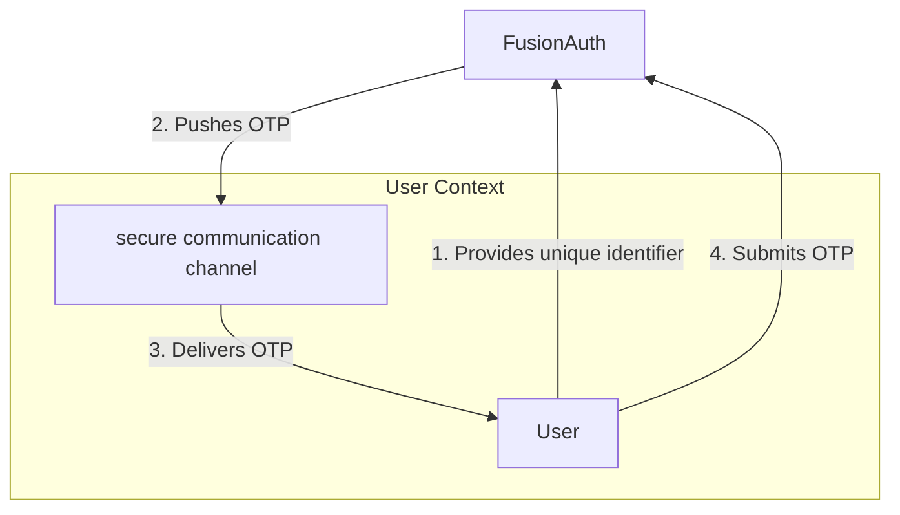

<AvailableSince since="1.41.0" />

One-Time Password (OTP) authentication provides the ability to prove a user identity without a password. To do so, the user enters a unique identifier, and FusionAuth sends a single-use, time-bound code to the user associated with that identifier over a secure communication channel of your choice:

The **unique identifier** could be an email address, username, or phone number.

The **secure communication channel** could be an email, text message, or any other service you connect using a [Messenger](/docs/customize/email-and-messages/messengers), like Slack or Whatsapp.

## Work with Magic Links and Codes

<ChildCards />

## Disambiguation

One-Time Passwords are sometimes referred to as **Passwordless** or **Magic Link (and Code)** authentication. This commonly creates confusion with other authentication concepts, including:

* [Passkeys](/docs/lifecycle/authenticate-users/passkeys/): frequently called **Passwordless** authentication, distinct from one-time passwords because passkeys are built upon the WebAuthn standard for public/private key exchange in lieu of a password (whereas one-time passwords are, ultimately, still passwords).
* [Multi-Factor Authentication (MFA, sometimes referred to as 2FA)](/docs/lifecycle/authenticate-users/multi-factor-authentication): often uses the term **TOTP** (Time-based One-Time Password), easily confused with OTP (One-Time Password). While TOTP and OTP are quite similar (in fact, OTP is also time-constrained), MFA TOTPs are a *secondary* form of authentication, not a primary form like one-time passwords. You _can_ authenticate with _only_ a one-time password, but you _cannot_ authenticate with _only_ a MFA TOTP.

## Strategies

When you use One-Time Passwords for authentication, you must choose a **strategy**:

<Table headerRows={1}>
* * Strategy name
  * Form
  * Usage
* * Clickable link
  * a **magic link** that the user clicks to visit and authenticate with your application
  * popular for email authentication, when users access their email account and your application on the same device.
* * Form field
  * a **magic code** that the user copies and pastes (or memorizes and types)
  * preferred for phone-based authentication, where the user might use your application on a device other than their phone.
</Table>

## When Should I Use Magic Links?

Magic link authentication eases a user's sign-in experience. Instead of remembering a password, the user provides their email address or phone number, then FusionAuth sends a one-time password. The user authenticate by clicking the link or submitting the code on the login page.

In addition to being easier for users, a one-time password login experience prevents them from reusing the same password across different sites or applications. No longer will you worry about another website's data breach causing illicit access to your system. In addition, password brute forcing is no longer a threat since one-time passwords are only created upon request and only valid for a short, configurable time.

## Security

With one-time password authentication, if the user's email account or phone number is hijacked, their account on your system is compromised. However, many organizations have security policies and protections around email accounts. It is often easier to protect and regularly change one email account password than to change all of a user's passwords. Email accounts are also more likely to have two-factor authentication enabled.

One way to increase the security of your one-time passwords is to decrease the lifetime of the code. This will help if the secure message is compromised or accidentally forwarded.

There are no limits on how many passwordless requests can be made for a user, but only the most recent code is valid. Using any of the others, even if they have not yet expired, will display an `Invalid login credentials` message to the user.

If someone tries to log in with a unique identifier that is not present in the FusionAuth user database, they'll see the same notification as they would if the email or phone number existed. No email or SMS message will be sent.

If you use the passwordless API, follow the principle of least privilege, and limit calls to which the API key has access. If you are using the API key only for one-time password login, don't give this key any other permissions.

### Disable Passwords

You can choose to disable passwords to enforce passwordless login. See the [Password enabled](/docs/get-started/core-concepts/types/tenants#password-settings) tenant setting for more information.

## Troubleshooting

### Magic Link Button Does Not Appear on Login Page

If the <Breadcrumb>Login with a magic link</Breadcrumb> button does not appear on your login page, check the following:

* Ensure that the application has **Passwordless Login** enabled under the <Breadcrumb>Security</Breadcrumb> tab.
* Ensure that the application and tenant have a valid email or phone template configured for Passwordless Login.
* Ensure that SMS or email is configured in the tenant settings.

### Email

If you are experiencing troubles with email delivery, review [the email troubleshooting documentation](/docs/operate/troubleshooting#troubleshooting-email).

### Invalid Links

In some cases, email clients will visit links in an email before the user does. In particular, this is known to happen with Outlook "safe links". If the client does this when the email contains a passwordless one time code, that code may be invalid when the user clicks on it, as it has already been visited.

One option is to consult with your email client administrator. It may be possible to add the application's URL to an allow list.

In version `1.27.0`, FusionAuth changed the link processing behavior to remedy this for some situations. Given the wide variety of email client behavior, it may still be present in other scenarios.

If your users' passwordless codes are being expired by an email client, please [file a GitHub issue](https://github.com/FusionAuth/fusionauth-issues/issues).

